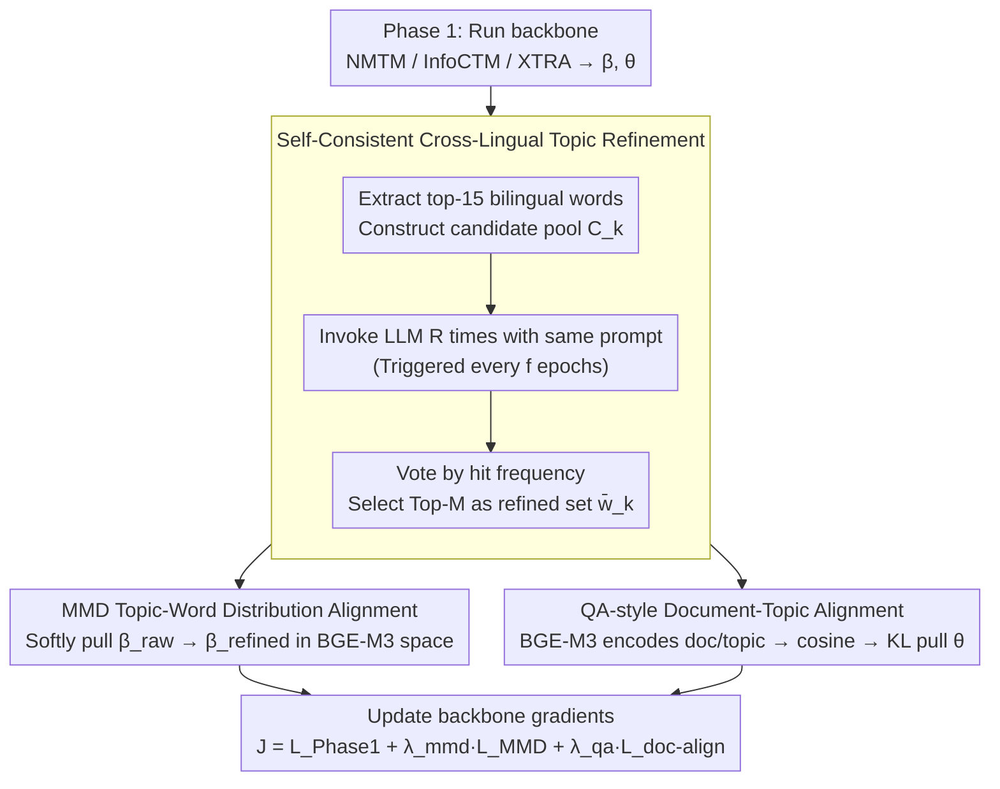

# LLM-XTM: Enhancing Cross-Lingual Topic Models with Large Language Models

**Conference**: ACL 2026  
**arXiv**: [2605.03299](https://arxiv.org/abs/2605.03299)  
**Code**: https://github.com/tienphat140205/LLM-XTM (Available)  
**Area**: Multilingual / Topic Models  
**Keywords**: Cross-lingual Topic Models, LLM Refinement, Self-consistency, MMD Alignment, QA-style Document Alignment

## TL;DR
This work proposes a two-stage enhancement module consisting of "LLM Refinement + Self-consistency Voting + MMD Word Distribution Alignment + QA-style Document Semantic Alignment". Functioning as a plug-in for various backbones like NMTM, InfoCTM, and XTRA, it improves CNPMI by 9%–51% and TQ by 6%–44% across three bilingual corpora (EC News, Amazon Review, Rakuten Amazon), while reducing LLM calls to once every $f$ epochs.

## Background & Motivation

**Background**: The goal of Cross-Lingual Topic Modeling (CLTM) is to extract "semantically corresponding" topic pairs from multilingual corpora—where the same topic corresponds to a set of semantically consistent high-frequency words in English, Chinese, Japanese, etc. Mainstream approaches (MCTA, MTAnchor, NMTM, InfoCTM, XTRA) rely almost entirely on external bilingual resources: parallel corpora, seed dictionaries, bilingual embeddings, or anchor words.

**Limitations of Prior Work**: Low coverage of bilingual dictionaries and noisy parallel corpora (mistranslations, domain shift, word ambiguity) lead to "nominally aligned" topics drifting semantically. Table 1 of the paper shows a striking example where InfoCTM aligns English words `rating/gauge/height/mile/shoe` with Chinese words `investor/finance/fund/stock market/index`, which are completely unrelated.

**Key Challenge**: Shallow signals driven purely by corpora cannot capture deep cross-lingual semantic consistency, whereas LLMs possess deep semantic priors from massive multilingual pre-training. Existing LLM-based works suffer from three issues: (1) treating LLM outputs as ground-truth and calling them per document, ignoring global structure and being cost-prohibitive; (2) LLM hallucinations and unstable outputs; (3) white-box solutions like LLM-in-the-loop requiring token probabilities, which are unavailable for closed-source models (Gemini/Claude).

**Goal**: Inject LLM semantic knowledge into both the **topic-word distribution $\beta$** and **document-topic distribution $\theta$** with minimal LLM calls, ensuring the method is (a) black-box compatible, (b) robust to hallucinations, and (c) non-disruptive to the backbone's corpus-driven signals.

**Key Insight**: Inspired by the "self-consistency as uncertainty measurement" idea from SelfCheckGPT, the authors sample LLM outputs multiple times, retaining highly consistent words and discarding low-consistency ones to filter hallucinations via voting. Simultaneously, the document-topic assignment task is reinterpreted as a QA-style matching where the "document is the question and the refined topic word set is the answer candidate," using a multilingual encoder (BGE-M3) to calculate cosine similarity.

**Core Idea**: LLM refinement is packaged as a "periodic, self-consistent voting" black-box process. The output is aligned with the original $\beta$ via MMD and the $\theta$ is pulled toward a semantic target $\hat{\theta}$ calculated by BGE-M3 using KL divergence. This "softly guides" the backbone toward more coherent and cross-lingually aligned solutions without altering its original loss functions.

## Method

### Overall Architecture
LLM-XTM is a **two-stage post-processing enhancement**:
- **Phase 1**: Run an existing VAE-based CLTM backbone (NMTM / InfoCTM / XTRA) using its original loss $\mathcal{L}_{\text{Phase1}}$ until convergence to obtain $\beta^{(\ell)}$ and $\theta_d$.
- **Phase 2**: Train the converged model for an additional 30 epochs, triggering LLM refinement every $f$ epochs. The refined results are injected into the backbone via two external losses:

The total objective is $\mathcal{J}(\phi, \psi) = \mathcal{L}_{\text{Phase 1}} + \lambda_{\text{mmd}} \mathcal{L}_{\text{MMD}} + \lambda_{\text{qa}} \mathcal{L}_{\text{doc-align}}$. The workflow within an epoch involves: extracting top-15 bilingual words → invoking LLM voting to get $\bar{w}_k$ → calculating $\mathcal{L}_{\text{MMD}}$ → encoding documents/topics with BGE-M3 → calculating $\mathcal{L}_{\text{doc-align}}$ via KL divergence → updating backbone gradients. The LLM module is entirely a black box to the backbone and does not require token probabilities, making Gemini API directly usable.

### Key Designs

**1. Self-Consistent Cross-Lingual Topic Refinement: Filtering Hallucinations via Multiple Voting**

Using a single LLM call to "clean" topic words has a fatal flaw—output instability. Words kept in one call might be replaced in the next; using such unstable results as supervision signals injects hallucinations into the backbone. The authors construct a candidate pool $C_k = w_k^{(\text{en})} \cup w_k^{(\text{zh})}$ from the top-15 English and Chinese words provided by the backbone. The LLM is tasked with removing noise, filling gaps, and retaining common topic words. Crucially, the same prompt is run $R$ times to obtain $\tilde{w}_k^{(1)}, \dots, \tilde{w}_k^{(R)}$. The hit frequency for each word is calculated as $f_k(v) = \frac{1}{R}\sum_{r=1}^R \mathbf{1}\{v \in \tilde{w}_k^{(r)}\}$, and the Top-$M$ frequent words are selected as the final refined set $\bar{w}_k$. This follows the SelfCheckGPT principle: consistency across multiple samples is a strong signal for reliability. Thus, in a black-box setting, voting consistency effectively replaces token-probability uncertainty estimation. To control costs, a "refinement frequency" hyperparameter $f$ is introduced, triggering LLM calls every $f$ epochs instead of every step, reducing the volume by an order of magnitude.

**2. MMD Topic-Word Distribution Alignment: Softly Pulling Backbone towards LLM**

The challenge in injecting $\bar{w}_k$ back into the backbone's $\beta$ is to bring the original distribution $\beta_k^{(\text{raw})}$ close to the LLM target $\beta_k^{(\text{refined})}$ without losing corpus-driven reconstruction signals. The authors construct two distributions for each topic $k$: "raw" from the decoder's top-$N$ probabilities and "refined" from the $R$-round voting counts. Both are language-balanced and normalized. Square MMD is then calculated in the BGE-M3 word embedding space using a Gaussian kernel (width determined by the median heuristic):

$$\mathcal{L}_{\text{MMD}} = \frac{1}{K}\sum_{k=1}^{K} \text{MMD}^2(\beta_k^{\text{(raw)}}, \beta_k^{\text{(refined)}}).$$

Since the kernel operates on cosine distances, it pulls the two distributions together in the RKHS rather than forcing a one-hot hard match. This makes it superior to Optimal Transport (OT): kernel methods naturally treat synonymous substitutions (e.g., "song" ↔ "album") as matches, whereas OT's transport plan is more sensitive to exact word identities. In experiments, MMD's CNPMI of 0.016 outperformed OT's 0.013. MMD provides "soft distribution alignment," which is gentler and prevents overriding the backbone's learned corpus signals.

**3. QA-style Document-Topic Alignment: Doc-Topic Assignment as QA Retrieval**

Even if topic words are aligned, the document-topic distribution $\theta_d$ might still drift. English and Chinese documents with the same semantics should have similar $\theta_d$, but BoW is incomparable across languages. The authors solve this by comparing in a different space: treating the document as a "question" and the refined topics as "candidate answers." Using the multilingual sentence encoder BGE-M3, the document is encoded as $h_d$ and the refined topic set $\bar{w}_k$ as a topic vector $t_k = \text{Enc}(\bar{w}_k)$. Cosine similarity is calculated as $s_{d,k} = \frac{h_d^\top t_k}{\|h_d\|_2 \|t_k\|_2}$, followed by a softmax with temperature $\tau$ to obtain the target distribution $\hat{\theta}_{d,k} = \frac{\exp(s_{d,k}/\tau)}{\sum_j \exp(s_{d,j}/\tau)}$. The backbone's $\theta_d$ is then pulled toward this target using KL divergence: $\mathcal{L}_{\text{doc-align}} = \sum_{d=1}^D \text{KL}(\theta_d \| \hat{\theta}_d)$. The beauty of this is that BGE-M3 maps semantically similar terms across languages to nearby points in the embedding space, acting as a cross-lingual bridge. This transforms "semantic similarity" into external supervision for $\theta$, forcing the backbone to learn cross-lingually consistent document representations. This is the most original aspect of the paper—applying the IR paradigm of QA retrieval to topic model alignment.

### Loss & Training
The total objective in Phase 2 is $\mathcal{J} = \mathcal{L}_{\text{Phase 1}} + \lambda_{\text{mmd}} \mathcal{L}_{\text{MMD}} + \lambda_{\text{qa}} \mathcal{L}_{\text{doc-align}}$. In experiments, $\lambda_{\text{mmd}} = 20,000$, $\lambda_{\text{qa}} \in \{100, 200, 300\}$, $f \in \{8, 10\}$, and $R = 5$. The LLM uses the Gemini API (replaceable with Llama-3.3-70B, etc.), and Phase 2 completes in 30 epochs on a single NVIDIA P100.

## Key Experimental Results

### Main Results
On three CLTM benchmarks—EC News (EN-ZH), Amazon Review (EN-ZH), and Rakuten Amazon (JA-EN)—using CNPMI (cross-lingual coherence), TU (topic uniqueness), and TQ (combined metric), LLM-XTM was tested as a plug-in:

| Backbone | Dataset | CNPMI (base→+LLM-XTM) | TQ Gain | Notes |
|----------|---------|-----------------------|---------|-------|
| XTRA | EC News | 0.078 → 0.088 | +10.5% | TU slightly decreased 2.5% |
| XTRA | Amazon Review | 0.053 → 0.072 | +32.7% | CNPMI +35.8% |
| InfoCTM | EC News | 0.041 → 0.062 | +43.6% | CNPMI +51.2% |
| InfoCTM | Amazon Review | 0.037 → 0.050 | +38.2% | TU increased +0.3% |
| NMTM | Amazon Review | 0.043 → 0.056 | +34.6% | CNPMI +30.2% |
| NMTM | Rakuten Amazon | 0.012 → 0.016 | +37.5% | CNPMI +33.3% |

Across 9 combinations (3 backbones × 3 datasets), CNPMI improved consistently while TU fluctuated within ±5%, proving LLM-XTM is a **universal enhancement layer**. On the long-document Airiti Thesis benchmark, XTRA+LLM-XTM saw a +121.3% TQ gain. In downstream classification, cross-lingual accuracy (-C) on Rakuten Amazon improved significantly without sacrificing intra-lingual performance.

### Ablation Study
Tested on NMTM + Rakuten Amazon (50 topics):

| Configuration | CNPMI | TU | EN-C | JA-C | Description |
|---------------|-------|----|------|------|-------------|
| NMTM (base) | 0.012 | 0.633 | 0.610 | 0.681 | Backbone |
| Full LLM-XTM | 0.016 | 0.666 | 0.621 | 0.728 | All components |
| w/o $\mathcal{L}_{\text{doc-align}}$ | 0.012 | 0.679 | 0.611 | 0.723 | CNPMI drops to base level |
| w/o $\mathcal{L}_{\text{MMD}}$ | 0.012 | 0.641 | 0.621 | 0.723 | Coherence suffers |
| w/o self-consistency | 0.011 | 0.654 | 0.619 | 0.720 | CNPMI drops below base (hallucination) |
| MMD → OT | 0.013 | 0.664 | 0.620 | 0.720 | OT is 18.7% worse in CNPMI than MMD |

### Key Findings
- **$\mathcal{L}_{\text{doc-align}}$ is central to cross-lingual alignment**: Removing it causes CNPMI to drop to base levels, suggesting topic word alignment alone cannot constrain document-level consistency.
- **Self-consistency is indispensable**: Without voting, CNPMI drops below the base model (0.011 < 0.012), showing that single LLM hallucinations can "poison" the backbone.
- **MMD > OT**: Kernel methods are more tolerant of synonymous substitutions in multilingual embedding space.
- **Hyperparameter Sensitivity**: $R \in [5, 7]$ is the "sweet spot" for cost-efficiency. Refinement frequency $f$ presents a coherence/diversity trade-off.
- **Qualitative Analysis**: As shown in Table 4, LLM-XTM corrects the "Music" topic in NMTM by removing romantic words like `marriage/vow/dearest` and replacing them with `music/album/singer`.

## Highlights & Insights
- **Dual control of cost and hallucinations**: Periodic calls ($f$) and self-consistent voting ($R$) transform the LLM from a "per-document oracle" to a "periodic expert consultant," enabling use with closed-source APIs.
- **MMD as "Soft Guidance"**: Using MMD in embedding space allows for synonym tolerance, preventing the LLM signal from forcibly overwriting the backbone’s reconstruction capability.
- **QA Paradigm for Alignment**: Reframing doc-topic assignment as a retrieval task allows multilingual encoders (BGE-M3) to bridge language gaps that BoW cannot manage.
- **True Plug-in**: Consistent improvement across different backbones and datasets suggests that post-processing refinement is more economical than redesigning backbones from scratch.

## Limitations & Future Work
- **Performance Ceiling**: LLM-XTM refines existing topics but cannot create reasonable topics from a completely failed initialization; it is a "refinement," not a "replacement."
- **API Latency and Cost**: Even with reduced frequency, multiple voting rounds ($R=5$) across many topics remain expensive for very large corpora.
- **Language Coverage**: Primarily validated on EN-ZH and JA-EN; effectiveness on typologically distant low-resource languages is unknown.
- **Encoder Dependency**: The methodology is heavily dependent on the quality of BGE-M3. Future work could involve distilling these models into smaller encoders.
- **Redundant Calls**: It does not yet include dynamic caching for refined outputs between similar epochs.

## Related Work & Insights
- **vs LLM-ITL**: LLM-ITL requires white-box token probabilities for uncertainty estimation; LLM-XTM uses black-box voting, making it more universal.
- **vs TopicGPT**: TopicGPT calls LLMs per document, which is not scalable; LLM-XTM calls LLMs per topic, decoupling cost from corpus size.
- **vs XTRA**: XTRA uses contrastive learning for alignment; LLM-XTM complements this with LLM semantic priors, yielding further gains.
- **vs SelfCheckGPT**: Adapts the "consistency as a signal for hallucination" concept from evaluation to a training supervision signal.

## Rating
- Novelty: ⭐⭐⭐⭐ The combination of voting, MMD, and QA into a plug-in paradigm is innovative, especially the QA-style $\theta$ alignment.
- Experimental Thoroughness: ⭐⭐⭐⭐ Wide range of backbones, datasets, and ablation studies, though limited to a few language pairs.
- Writing Quality: ⭐⭐⭐⭐ Clear methodology and compelling qualitative examples.
- Value: ⭐⭐⭐⭐ Provides a practical tool for the CLTM community that delivers immediate performance gains.

<!-- RELATED:START -->

## Related Papers

- [\[ACL 2026\] Efficient Training for Cross-lingual Speech Language Models](efficient_training_for_cross-lingual_speech_language_models.md)
- [\[ACL 2026\] LaoBench: A Large-Scale Multidimensional Lao Benchmark for Large Language Models](laobench_a_large-scale_multidimensional_lao_benchmark_for_large_language_models.md)
- [\[ACL 2026\] Evaluating Robustness of Large Language Models Against Multilingual Typographical Errors](evaluating_robustness_of_large_language_models_against_multilingual_typographica.md)
- [\[ACL 2025\] Cross-Lingual Optimization for Language Transfer in Large Language Models](../../ACL2025/multilingual_mt/cross-lingual_optimization_for_language_transfer_in_large_language_models.md)
- [\[ACL 2026\] Language Models Entangle Language and Culture](language_models_entangle_language_and_culture.md)

<!-- RELATED:END -->
