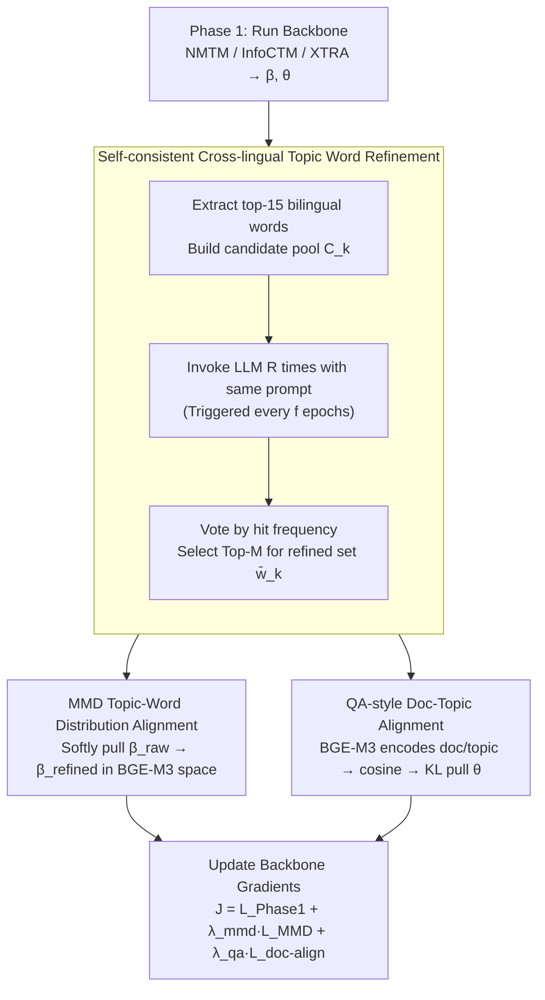

# LLM-XTM: Enhancing Cross-Lingual Topic Models with Large Language Models

**Conference**: ACL 2026  
**arXiv**: [2605.03299](https://arxiv.org/abs/2605.03299)  
**Code**: https://github.com/tienphat140205/LLM-XTM (Yes)  
**Area**: Multilingual / Topic Modeling  
**Keywords**: Cross-Lingual Topic Modeling, LLM Refinement, Self-consistency, MMD Alignment, QA-style Document Alignment

## TL;DR
A two-stage enhancement module consisting of "LLM Refinement + Self-consistency Voting + MMD Word Distribution Alignment + QA-style Document Semantic Alignment" is wrapped around pre-trained cross-lingual topic models. Acting as a plug-in for various backbones like NMTM, InfoCTM, and XTRA, it improves CNPMI by 9%–51% and TQ by 6%–44% across three bilingual corpora (EC News, Amazon Review, Rakuten Amazon), while reducing LLM calls to "once every $f$ epochs."

## Background & Motivation

**Background**: The goal of Cross-Lingual Topic Modeling (CLTM) is to extract "semantically corresponding" topic pairs from multilingual corpora—where the same topic corresponds to a set of semantically consistent high-frequency words in English, Chinese, Japanese, etc. Mainstream approaches (MCTA, MTAnchor, NMTM, InfoCTM, XTRA) almost exclusively rely on external bilingual resources: parallel corpora, seed dictionaries, bilingual embeddings, or anchor words.

**Limitations of Prior Work**: Low coverage of bilingual dictionaries and noisy parallel corpora (mistranslations, domain drift, word ambiguity) cause "nominally aligned" topics to diverge semantically. Table 1 in the paper provides a striking example where InfoCTM pairs English words `rating/gauge/height/mile/shoe` with Chinese financial terms `investor/finance/fund/stock market/index`, which are completely unrelated.

**Key Challenge**: Shallow signals driven purely by corpus data cannot characterize deep cross-lingual semantic consistency. While LLMs possess deep semantic priors from massive multilingual pre-training, existing LLM-based works suffer from: (1) treating LLM outputs as ground-truth and calling them independently per document (ignoring global structure and incurring high costs); (2) LLM hallucinations and unstable outputs; (3) requiring token probabilities as in white-box solutions like LLM-in-the-Loop, which is incompatible with closed-source models (Gemini/Claude).

**Goal**: Inject LLM semantic knowledge into both the **topic-word distribution $\beta$** and the **document-topic distribution $\theta$** while minimizing LLM calls. The method must be (a) black-box compatible, (b) robust to hallucinations, and (c) non-disruptive to the pre-existing signals from the backbone model.

**Key Insight**: Inspired by the "self-consistency as uncertainty measurement" idea from SelfCheckGPT, the authors sample LLM outputs multiple times, retaining highly consistent words and discarding inconsistent ones to filter hallucinations via voting. Simultaneously, the assignment of "which topic a document belongs to" is re-interpreted as a QA-style matching where the "document is the question and the refined topic word set is the answer candidate," using a multilingual encoder (BGE-M3) to calculate cosine similarity.

**Core Idea**: Wrap LLM refinement as a "periodic, self-consistent voting" black-box process. The output is aligned with the original $\beta$ via MMD, and $\theta$ is pulled toward a semantic target $\hat{\theta}$ calculated by BGE-M3 using KL divergence. This allows the backbone to be "softly guided" toward more coherent and cross-lingually aligned solutions without altering its original loss functions.

## Method

### Overall Architecture
LLM-XTM is a **two-stage post-processing enhancement**:
- **Phase 1**: Run an existing VAE-based CLTM backbone (NMTM / InfoCTM / XTRA) using its original loss $\mathcal{L}_{\text{Phase1}}$ until convergence to obtain $\beta^{(\ell)}$ and $\theta_d$.
- **Phase 2**: Train the converged model for an additional 30 epochs, triggering LLM refinement every $f$ epochs. The refinement results are injected into the backbone via two external losses:

The total objective is $\mathcal{J}(\phi, \psi) = \mathcal{L}_{\text{Phase 1}} + \lambda_{\text{mmd}} \mathcal{L}_{\text{MMD}} + \lambda_{\text{qa}} \mathcal{L}_{\text{doc-align}}$. The workflow within one epoch involves: extracting top-15 bilingual words → invoking LLM for voting to obtain $\bar{w}_k$ → calculating $\mathcal{L}_{\text{MMD}}$ → encoding documents/topics with BGE-M3 → calculating $\mathcal{L}_{\text{doc-align}}$ via KL divergence → updating backbone gradients. The entire LLM module is a black-box to the backbone and does not require token probabilities, making Gemini APIs directly applicable.

### Key Designs

**1. Self-consistent Cross-lingual Topic Word Refinement: Filtering Hallucinations via Voting**

A single LLM call to "clean" topic words has a fatal flaw: output jitter, where a word kept in one run might be replaced in the next. Using such unstable results directly as supervision signals injects hallucinations into the backbone. The authors construct a candidate pool $C_k = w_k^{(\text{en})} \cup w_k^{(\text{zh})}$ from the backbone's top-15 English and Chinese words. The LLM is tasked with removing noise, filling gaps, and retaining common topic words. Crucially, the same prompt is run $R$ times to obtain $\tilde{w}_k^{(1)}, \dots, \tilde{w}_k^{(R)}$. Hit frequency $f_k(v) = \frac{1}{R}\sum_{r=1}^R \mathbf{1}\{v \in \tilde{w}_k^{(r)}\}$ is calculated, and the Top-$M$ frequent words are selected as the final refined set $\bar{w}_k$. This follows the SelfCheckGPT principle: consistency across multiple samples for the same question is a strong signal for truth; low consistency indicates hallucination. Thus, in a black-box setting, voting consistency serves as a proxy for token-probability-based uncertainty estimation. To control costs, refinement frequency $f$ is introduced, reducing LLM calls by an order of magnitude.

**2. MMD Topic-Word Distribution Alignment: Soft Guidance Toward LLM Knowledge**

The challenge in injecting $\bar{w}_k$ back into the backbone's $\beta$ is balancing the original $\beta_k^{(\text{raw})}$ distribution with the LLM target $\beta_k^{(\text{refined})}$ without collapsing the model and losing corpus-driven reconstruction signals. For each topic $k$, two distributions are constructed: "raw" from decoder top-$N$ probabilities and "refined" from $R$-round voting counts. Both are language-balanced and normalized. Squared MMD is calculated in the BGE-M3 embedding space using a Gaussian kernel (width determined by median heuristic):

$$\mathcal{L}_{\text{MMD}} = \frac{1}{K}\sum_{k=1}^{K} \text{MMD}^2(\beta_k^{\text{(raw)}}, \beta_k^{\text{(refined)}}).$$

Because the kernel operates on cosine distances, it pulls the two distributions together in the RKHS rather than forcing a one-hot hard match. This is superior to Optimal Transport (OT) because the kernel method naturally interprets "synonym replacement" (e.g., song ↔ album) as a match, whereas OT's transport plan is more sensitive to exact word identities. Experiments show MMD achieves a CNPMI of 0.016, outperforming OT's 0.013. MMD provides "soft distribution alignment," which is gentler and does not overwrite existing corpus signals.

**3. QA-style Document-Topic Alignment: Document Classification as Question Retrieval**

Even with aligned topic words, the document-topic distribution $\theta_d$ can still be misaligned. Ideally, semantically identical English and Chinese documents should have similar $\theta_d$, but Bag-of-Words (BoW) is incomparable across languages (e.g., "investment" and "touzhi" are separate dimensions). The authors shift the comparison to a different space: treating documents as "questions" and refined topics as "candidate answers." Multilingual sentence encoder BGE-M3 encodes documents into $h_d$ and $\bar{w}_k$ into topic vectors $t_k = \text{Enc}(\bar{w}_k)$. Cosine similarity $s_{d,k} = \frac{h_d^\top t_k}{\|h_d\|_2 \|t_k\|_2}$ is calculated, and a target distribution $\hat{\theta}_{d,k} = \frac{\exp(s_{d,k}/\tau)}{\sum_j \exp(s_{d,j}/\tau)}$ is generated via softmax with temperature $\tau$. Finally, KL divergence pulls the backbone's $\theta_d$ toward this target: $\mathcal{L}_{\text{doc-align}} = \sum_{d=1}^D \text{KL}(\theta_d \| \hat{\theta}_d)$. BGE-M3 acts as a cross-lingual bridge by placing "investment" and its Chinese equivalent close in embedding space, turning semantic similarity into external supervision for $\theta$. This is the most original contribution—applying the QA retrieval paradigm from IR to distribution alignment in topic models.

### Loss & Training
The Phase 2 total objective is $\mathcal{J} = \mathcal{L}_{\text{Phase 1}} + \lambda_{\text{mmd}} \mathcal{L}_{\text{MMD}} + \lambda_{\text{qa}} \mathcal{L}_{\text{doc-align}}$. In experiments, $\lambda_{\text{mmd}} = 20{,}000$, $\lambda_{\text{qa}} \in \{100, 200, 300\}$, $f \in \{8, 10\}$, and $R = 5$. The LLM side uses the Gemini API (swappable with Llama-3.3-70B, etc.). Phase 2 is completed in 30 epochs on a single NVIDIA P100.

## Key Experimental Results

### Main Results
Evaluated on EC News (EN-ZH news), Amazon Review (EN-ZH reviews), and Rakuten Amazon (JA-EN reviews) benchmarks using CNPMI (cross-lingual topic coherence), TU (topic uniqueness), and TQ = max(0, CNPMI) × TU:

| Backbone | Dataset | CNPMI (base→+LLM-XTM) | TQ Gain | Notes |
|----------|--------|----------------------|---------|------|
| XTRA | EC News | 0.078 → 0.088 | +10.5% | TU decreased slightly (2.5%) |
| XTRA | Amazon Review | 0.053 → 0.072 | +32.7% | CNPMI +35.8% |
| InfoCTM | EC News | 0.041 → 0.062 | +43.6% | CNPMI +51.2% |
| InfoCTM | Amazon Review | 0.037 → 0.050 | +38.2% | TU increased by 0.3% |
| NMTM | Amazon Review | 0.043 → 0.056 | +34.6% | CNPMI +30.2% |
| NMTM | Rakuten Amazon | 0.012 → 0.016 | +37.5% | CNPMI +33.3% |

Across 9 combinations of backbones and datasets, CNPMI is consistently improved while TU fluctuations remain within ±5%, proving that LLM-XTM is a **universal enhancement layer**. On the long-document benchmark Airiti Thesis, TQ improved by +121.3% for XTRA and +61.3% for InfoCTM. In downstream document classification, cross-lingual accuracy (-C) on Rakuten Amazon rose from 0.734 to 0.788 (InfoCTM) and 0.682 to 0.728 (NMTM).

### Ablation Study
Analysis using NMTM backbone on Rakuten Amazon (50 topics):

| Configuration | CNPMI | TU | EN-C | JA-C | Description |
|------|-------|-----|------|------|------|
| NMTM (base) | 0.012 | 0.633 | 0.610 | 0.681 | Original backbone |
| Full LLM-XTM | 0.016 | 0.666 | 0.621 | 0.728 | All components |
| w/o $\mathcal{L}_{\text{doc-align}}$ | 0.012 | 0.679 | 0.611 | 0.723 | CNPMI drops to base; alignment fails |
| w/o $\mathcal{L}_{\text{MMD}}$ | 0.012 | 0.641 | 0.621 | 0.723 | TU drops by 0.025; word coherence suffers |
| w/o self-consistency | 0.011 | 0.654 | 0.619 | 0.720 | CNPMI lower than base; hallucination pollution |
| MMD → OT | 0.013 | 0.664 | 0.620 | 0.720 | OT is 18.7% worse in CNPMI than MMD |

### Key Findings
- **$\mathcal{L}_{\text{doc-align}}$ is the core of cross-lingual alignment**: Removing it causes CNPMI to drop to base levels, suggesting topic-word alignment alone cannot constrain document-level semantic consistency.
- **Self-consistency is indispensable**: Without voting, CNPMI drops below the base model (0.011 < 0.012). Hallucinations from a single LLM run **backfire** on the backbone.
- **MMD > OT**: Kernel methods are more tolerant of synonym replacements in embedding space, whereas OT's strict transport plan reduces performance.
- **Hyperparameter Sensitivity (Sec 4.6)**: $R \in [5, 7]$ is the sweet spot for refinement rounds. Refinement frequency $f$ presents a trade-off between coherence and diversity; $R=5, f=8$ is recommended.

## Highlights & Insights
- **Controlling Cost and Hallucination**: By combining periodic consultation (every $f$ epochs) with multi-round voting ($R$ rounds), the LLM is transformed from an "independent per-document oracle" to a "periodic expert consultant." This allows closed-source APIs like Gemini to be used without requiring token probabilities.
- **MMD Over KL/OT for $\beta$ Alignment**: Gaussian kernel MMD in embedding space recognizes synonym replacements as acceptable perturbations, providing "soft guidance" without overriding the backbone's reconstruction signals.
- **QA Paradigm for $\theta$ Alignment**: Reformulating document classification as answer retrieval avoids the "uncomparable BoW" problem across languages. This trick is transferable to any scenario requiring latent variable alignment to external semantic spaces.
- **True Plug-in**: Consistent gains across multiple backbones and datasets prove this post-processing paradigm is more economical than redesigning backbones from scratch.

## Limitations & Future Work
- **Performance Ceiling Defined by Backbone**: LLM-XTM can refine but cannot create reasonable topics from a completely failed initialization. It is a "refinement" rather than a "replacement."
- **Latency and Cost of LLM APIs**: Although $f$ reduces frequency, $R=5$ still requires multiple calls per refinement epoch, which scales with the number of topics $K$. It is less suitable for real-time or resource-constrained scenarios.
- **Limited Language Pairs**: Evaluated only on EN-ZH and JA-EN. The effectiveness depends heavily on the multilingual alignment quality of BGE-M3 for other language pairs.
- **Dependency on BGE-M3**: The QA alignment is sensitive to encoder quality; future work could explore distilling BGE-M3 into smaller encoders for cost reduction.

## Related Work & Insights
- **vs LLM-ITL (Yang et al. 2025b)**: Both integrate LLMs into training, but LLM-ITL requires token probabilities for uncertainty estimation (white-box), whereas LLM-XTM uses voting consensus (black-box), making it more universal.
- **vs TopicGPT (Pham et al. 2024a)**: These methods call LLMs independently per document, which is not cost-scalable and lacks global structure. LLM-XTM calls are decoupled from corpus size.
- **vs XTRA (Nguyen et al. 2025b)**: XTRA uses contrastive learning for alignment. LLM-XTM complements XTRA, adding another 10.5% TQ, showing that corpus-driven contrastive alignment and LLM semantic priors are **complementary**.
- **Self-consistency as Supervision**: While SelfCheckGPT uses self-consistency for evaluation, LLM-XTM upgrades it to a training signal, using voting frequency to construct a supervision distribution.

## Rating
- Novelty: ⭐⭐⭐⭐ Combining voting, MMD, and QA into a black-box plug-in is highly effective; the QA-style $\theta$ alignment is a genuine innovation.
- Experimental Thoroughness: ⭐⭐⭐⭐ Multiple backbones/datasets, long-doc generalization, downstream tasks, and comprehensive ablation studies provide high density.
- Writing Quality: ⭐⭐⭐⭐ Clear method description with illustrative examples (Table 4) that make the logic easy to follow.
- Value: ⭐⭐⭐⭐ Provides a "plug-and-play" module that yields consistent 10–50% CNPMI improvements for the CLTM community.

<!-- RELATED:START -->

## Related Papers

- [\[ACL 2026\] Efficient Training for Cross-lingual Speech Language Models](efficient_training_for_cross-lingual_speech_language_models.md)
- [\[ACL 2026\] LaoBench: A Large-Scale Multidimensional Lao Benchmark for Large Language Models](laobench_a_large-scale_multidimensional_lao_benchmark_for_large_language_models.md)
- [\[ACL 2026\] Evaluating Robustness of Large Language Models Against Multilingual Typographical Errors](evaluating_robustness_of_large_language_models_against_multilingual_typographica.md)
- [\[ACL 2026\] Multilingual Refusal Alignment for Safer Large Language Models](multilingual_refusal_alignment_for_safer_large_language_models.md)
- [\[ACL 2025\] Cross-Lingual Optimization for Language Transfer in Large Language Models](../../ACL2025/multilingual_mt/cross-lingual_optimization_for_language_transfer_in_large_language_models.md)

<!-- RELATED:END -->
