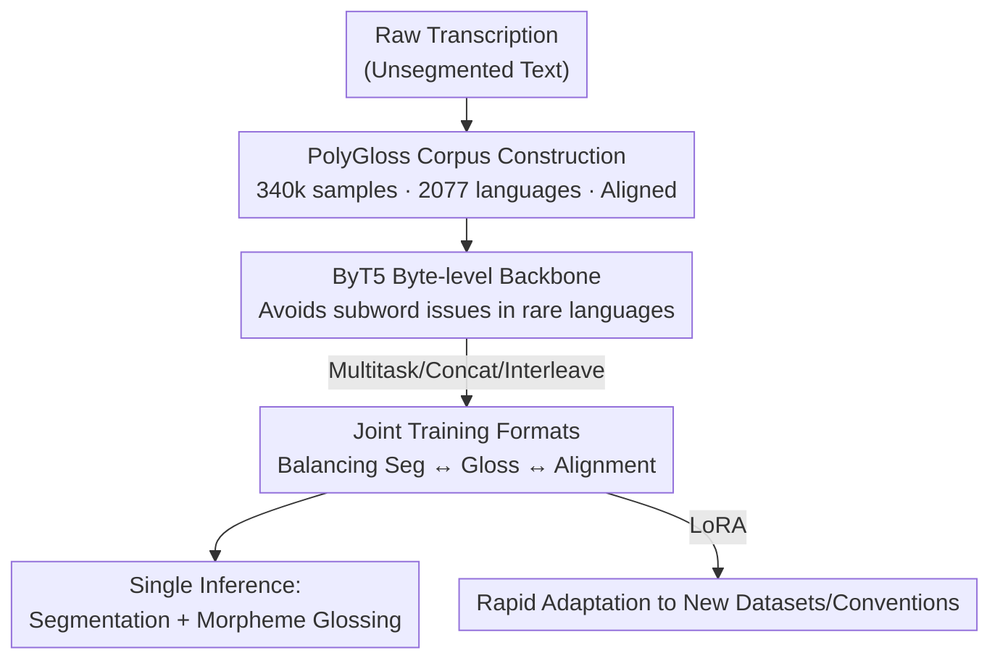

# Massively Multilingual Joint Segmentation and Glossing

**Conference**: ACL2026  
**arXiv**: [2601.10925](https://arxiv.org/abs/2601.10925)  
**Code**: https://github.com/lecs-lab/polygloss  
**Area**: Multilingual NLP / Low-resource Language Documentation  
**Keywords**: Interlinear Glossed Text (IGT), Morphological Segmentation, Glossing, Multilingual, Language Documentation

## TL;DR
This work addresses the "morphological segmentation + morpheme-by-morpheme glossing" joint prediction task for endangered language documentation. The authors expanded the GlossLM corpus to 340,000 examples covering 2,077 languages to train PolyGloss, a family of ByT5-based multilingual seq2seq models. PolyGloss simultaneously predicts morpheme boundaries and gloss tags from raw transcriptions, outperforming GlossLM in glossing and multiple open-source LLMs across segmentation, glossing, and alignment, while supporting rapid adaptation to new languages via LoRA.

## Background & Motivation
**Background**: Nearly half of the world's approximately 7,000 languages are endangered. Linguistic documentation relies heavily on **Interlinear Glossed Text (IGT)**—a dense annotation format stacking morphological segmentation, morpheme-level tagging (glossing), and translation. Automating IGT production is a powerful way to accelerate documentation. Recent work (including the SIGMORPHON 2023 Shared Task) has primarily defined the task as "predicting glosses from transcription/segmentation lines," where predicting glosses directly from unsegmented transcriptions is the most challenging and useful.

**Limitations of Prior Work**: While the SOTA glossing model, GlossLM, achieves high scores on many languages, a user study by Rice et al. (2025) revealed three critical deployment obstacles: (1) Documentation linguists **explicitly segment morphology** before glossing, whereas GlossLM attaches glosses to whole words without exposing boundaries, making it confusing and untrustworthy; (2) Glossing performance was extremely poor for two out of three tested languages, with participants finding it harder to correct model output than to annotate from scratch; (3) The model often predicts gloss tags that do not match the participant's preferred conventions and lacks adaptability.

**Key Challenge**: Glossing inherently depends on morphological segmentation, but existing models decouple them—producing glosses without segments. Consequently, glosses are neither interpretable nor alignable to specific morphemes. A gap has emerged between "high benchmark scores" and "actual utility for human annotators."

**Goal**: To conduct the first study on neural models that **jointly predict glossing and morphological segmentation**, simultaneously optimizing (a) glossing accuracy, (b) segmentation accuracy, and (c) the **alignment** between the two to address the three aforementioned obstacles.

**Key Insight & Core Idea**: Building on GlossLM, the authors expanded and cleaned the corpus to investigate three task formats for combining segmentation and glossing. They trained PolyGloss, a single multilingual model based on the byte-level ByT5, to output both segmentation and glossing in a single inference pass while ensuring structural alignment.

## Method

### Overall Architecture
The core of PolyGloss is **continual pre-training** on a pre-trained multilingual LLM, enabling it to learn morphological segmentation and morpheme glossing simultaneously from transcriptions (segmented or unsegmented). Evaluation is conducted on the more realistic "unsegmented input" task. The workflow consists of three parts: constructing a larger, cleaner PolyGloss corpus with guaranteed alignment; selecting the byte-level ByT5 as the backbone to accommodate rare languages; and comparing three joint training formats (Multitask, Concatenated, and Interleaved), supplemented by LoRA for rapid adaptation.

### Key Designs

**1. PolyGloss Corpus: Expansion, Cleaning, and Forced Alignment**

The existing GlossLM corpus had inconsistent formatting and many samples where segments and glosses were misaligned. The authors reconstructed the corpus by unifying punctuation handling (e.g., adding spaces around sentence-final punctuation) and fixing source-specific errors (e.g., 4,882 misuses of ",." in Arapaho data). They integrated Fieldwork (80,461 samples, 37 languages) and an updated version of IMTVault (+39,741 samples). After deduplication, the corpus reached ~350,000 samples (340,251 training, 6,148 validation, 6,867 testing) across 2,077 languages. A critical step was handling **misalignment**: if segments and glosses mismatched in count, the sample remained in training but was **strictly excluded from the evaluation set** to prevent pollution.

| Statistics | Count |
|------|------|
| Total Samples | 353,266 |
| Languages Covered | 2,077 |
| Train / Val / Test | 340,251 / 6,148 / 6,867 |
| No Segmentation Labels | 93,648 |
| Misaligned Samples | 34,894 |

**2. Three Joint Training Formats: Balancing Simplicity and Alignment**

Segmentation and glossing are interdependent. The authors compared three formats to determine which best preserves alignment:

- **Multitask**: Segmentation and glossing are treated as independent training samples. Simple and allows parallel inference, but carries the highest risk of misalignment.
- **Concatenated**: The model predicts segmentation first, then glossing. Casual training allows the model to attend to segments while generating glosses (soft dependency), but poor segmentation can degrade glossing.
- **Interleaved**: Each gloss tag is followed by its corresponding morpheme in brackets, e.g., `INTERJ(o) you.know(wōlē)-ZERO(0)=ART(n) garden(’ēqē)-1SG(k)`. This uses the format itself as a **hard constraint** for alignment—if the output is well-formed, alignment is perfect by definition. Experiments showed this to be the best overall format.

**3. Byte-level ByT5 Backbone + Novel Alignment Metric**

The authors chose ByT5 (byt5-base, 580M) over subword models because subword tokenizers frequently produce `UNK` or low-frequency fragments for rare languages. For evaluation, they adopted **Morpheme Error Rate (MER)**—calculating edit distance between glosses separated by `[SEP]` normalized by gold length—as a more robust metric than "morpheme-level accuracy." They also proposed a **Reference-Free Alignment metric**: both outputs are abstracted into structural sequences (morphemes as "x", preserving `-`/`=` boundaries), and the character edit distance between these sequences is calculated. Ranging from $[0, 1]$, a score of 1 indicates perfect internal alignment.

### Loss & Training
Continual pre-training was performed on byt5-base using bf16 precision and AdamW. The strategy included a linear warmup for the first 3% of steps followed by a cosine decay, a max gradient norm of 1, learning rate of 5E-5, batch size of 64, for 15 epochs on 4× GH200 GPUs. Beam search (beam=2) was used for inference. LoRA was employed for low-rank fine-tuning to adapt to new languages or specific conventions.

## Key Experimental Results

### Main Results
Evaluations were performed on held-out test sets for 9 languages. PolyGloss was compared against GlossLM and ICL baselines from open-source LLMs (Average values):

| Model | Gloss MER ↓ (Avg) | Seg F1 ↑ (Avg) |
|------|------|------|
| Qwen 3 0.6B (ICL) | 0.839 | 0.167 |
| Gemma 3 4B (ICL) | 0.559 | 0.421 |
| Aya Expanse 8B (ICL) | 0.641 | 0.371 |
| GlossLM | 0.639* | — |
| PolyGloss (ByT5, multitask) | 0.265 | 0.860 |
| **PolyGloss (ByT5, interleaved)** | **0.234** | **0.862** |

\* GlossLM's performance on languages not explicitly in its pre-training set (unlike arp/ddo/git) was poor.

### Ablation Study (Format Comparison)

| Format | Gloss MER ↓ | Seg F1 ↑ | Characteristics |
|------|------|------|------|
| Multitask | 0.265 | 0.860 | Simple, parallelizable, weak alignment |
| Interleaved | 0.234 | 0.862 | Hard alignment constraint, best overall |

### Key Findings
- Joint training reduced MER from 0.56–0.84 (LLM baselines) to 0.23, while achieving a Segmentation F1 of 0.86 (compared to 0.17–0.42 for LLMs).
- The **Interleaved format** achieved the lowest MER and highest F1, validating the use of output structure as a hard alignment constraint.
- **Per-language perplexity** was found to predict glossing accuracy, allowing the system to avoid poor predictions or fallback to simpler models. LoRA adaptation successfully addressed user preference issues (Obstacle 3).

## Highlights & Insights
- **Prioritizing utility for human annotators**: By jointly producing segments, the model makes glosses interpretable and trustworthy, directly addressing linguists' concerns.
- **Interleaved output as a hard constraint**: This elegant approach ensures alignment through format rather than additional loss functions or decoding constraints. It is highly transferable to other tasks requiring alignment between structured sequences.
- **ByT5 for long-tail multilinguality**: Byte-level processing is a pragmatic choice for the thousands of languages where subword tokenization fails.
- **Reference-free alignment metric**: This metric allows for the evaluation of alignment quality even in the absence of gold segmentation, providing high reusable value.

## Limitations & Future Work
- The authors noted a lack of exhaustive hyperparameter tuning across all formats due to resource costs.
- Absolute quality remains limited for extremely low-resource languages (high MER in some cases).
- Instruction-tuned LLMs (like Qwen3 0.6B) failed as backbones for reasons not fully explored.
- The interleaved format increases output length, potentially leading to more formatting errors during decoding.
- Generalization to completely unseen languages requires further validation beyond the 9 test languages.

## Related Work & Insights
- **vs. GlossLM**: PolyGloss expands the corpus and adds joint segmentation. While GlossLM hides boundaries, PolyGloss ensures alignment and interpretability without sacrificing glossing performance.
- **vs. Open-source LLM ICL**: Even larger LLMs fail at segmentation (F1 < 0.42). PolyGloss (580M) demonstrates that this task benefits more from specialized continual pre-training than from general-purpose few-shot capabilities.
- **vs. Monolingual Pipelines**: Traditional pipelines suffer from error propagation; PolyGloss offers a robust, multilingual, out-of-the-box alternative with LoRA adaptability.

## Rating
- Novelty: ⭐⭐⭐⭐ 
- Experimental Thoroughness: ⭐⭐⭐⭐ 
- Writing Quality: ⭐⭐⭐⭐ 
- Value: ⭐⭐⭐⭐ 

<!-- RELATED:START -->

## Related Papers

- [\[ACL 2026\] Just Use XML: Revisiting Joint Translation and Label Projection](just_use_xml_revisiting_joint_translation_and_label_projection.md)
- [\[ACL 2025\] M2rc-Eval: Massively Multilingual Repository-level Code Completion Evaluation](../../ACL2025/multilingual_mt/m2rc-eval_massively_multilingual_repository-level_code_completion_evaluation.md)
- [\[ACL 2025\] CC-Tuning: A Cross-Lingual Connection Mechanism for Improving Joint Multilingual Supervised Fine-Tuning](../../ACL2025/multilingual_mt/cc-tuning_a_cross-lingual_connection_mechanism_for_improving_joint_multilingual_.md)
- [\[ACL 2026\] Multilingual Steering by Design: Multilingual Sparse Autoencoders and Principled Layer Selection](multilingual_steering_by_design_multilingual_sparse_autoencoders_and_principled_.md)
- [\[ACL 2026\] DFKI-MLT at SemEval-2026 TASK 7: Steering Multilingual Models Towards Cultural Knowledge](dfki-mlt_at_semeval-2026_task_7_steering_multilingual_models_towards_cultural_kn.md)

<!-- RELATED:END -->
