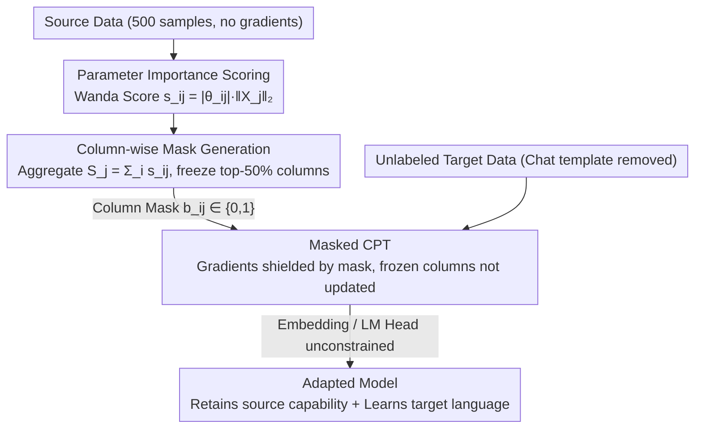

# Mitigating Catastrophic Forgetting in Target Language Adaptation of LLMs via Source-Shielded Updates

**Conference**: ACL 2026  
**arXiv**: [2512.04844](https://arxiv.org/abs/2512.04844)  
**Code**: [GitHub](https://github.com/gucci-j/ssu)  
**Area**: LLM Evaluation  
**Keywords**: Catastrophic forgetting, language adaptation, selective parameter updates, column-wise freezing, source knowledge protection

## TL;DR
Proposes Source-Shielded Updates (SSU), a column-wise freezing strategy driven by source data parameter importance scoring. When performing continued pre-training using only unlabeled target language data, it reduces source language performance degradation from 20.3% in full fine-tuning to 3.4%, while maintaining target language performance comparable to or better than full fine-tuning.

## Background & Motivation

**Background**: Expanding the language coverage of LLMs is critical for global accessibility. The standard practice is continued pre-training (CPT) on target language data, but this often leads to catastrophic forgetting, particularly damaging the core chat and safety capabilities of instruction-following models.

**Limitations of Prior Work**: (1) Low-resource languages lack instruction-tuning data, and machine-translated data is often inconsistent, necessitating the use of unlabeled text for adaptation; (2) Full fine-tuning (FFT) leads to an average performance drop of 20.3% in the source language for 7B models and 22.3% for 13B models; (3) Post-processing methods (e.g., model merging, task vectors) mostly fail to effectively alleviate the forgetting problem.

**Key Challenge**: Unlabeled raw text lacks chat templates and is incompatible with the training format of instruction-following models. Existing selective update methods based on target data signals optimize according to this incompatible format, which may instead destroy the model's fundamental capabilities.

**Goal**: Actively protect source knowledge during the CPT phase, allowing the model to learn the target language while retaining original instruction-following, chat, and safety capabilities.

**Key Insight**: Start from source data rather than target data—first identify parameters critical to source knowledge and freeze them before CPT to prevent forgetting at the source.

**Core Idea**: Use a small amount of source data (500 samples) to calculate parameter importance scores, aggregate them by column, and freeze the most important 50% of columns to ensure the complete feature transformation path is not destroyed.

## Method

### Overall Architecture
SSU consists of three stages: (1) Use source data and the Wanda scoring method to calculate the importance score for each parameter; (2) Aggregate scores by column and generate a column-wise freezing mask; (3) Perform CPT on unlabeled target language data, applying the mask to freeze critical columns during gradient updates.

### Key Designs

**1. Parameter Importance Scoring: Identifying "untouchable" weights from source data**

Existing selective update methods mostly focus on target data signals. However, since unlabeled raw text lacks chat templates, optimizing based on such incompatible formats can damage the model's base capabilities. SSU takes the opposite approach, directly identifying which parameters are most critical for maintaining source language capabilities. It adapts the Wanda pruning importance score $s_{ij} = |\theta_{ij}| \cdot \|X_j\|_2$, where the absolute weight value is multiplied by the L2 norm of the corresponding input activation. This can be calculated using only 500 source data samples without gradient computation. By combining weight magnitude and activation frequency, it is more reliable than looking at weight magnitude alone—ablations show that SSU-Mag, using only weight size, suffers a significant performance drop, indicating that activation information is indispensable.

**2. Column-wise Masking: Freezing entire columns to preserve feature transformation paths**

Element-wise freezing of critical parameters may seem more precise, but in practice, it scatters the feature transformation pathways, triggering catastrophic forgetting. SSU aggregates element-wise scores along columns: for a weight matrix $\theta \in \mathbb{R}^{d_{out} \times d_{in}}$, it sums each column $j$ to get $S_j = \sum_i s_{ij}$. After sorting by $S_j$, the top-$k$% (default 50%) of columns are frozen (mask set to 0, others to 1). Freezing an entire column means the corresponding output dimension is completely preserved, similar to keeping load-bearing columns during a building renovation—by maintaining structural integrity, the source knowledge does not collapse. Experiments confirm a massive gap between structured freezing and element-wise freezing.

**3. Masked Continual Pre-training: Applying a static mask in standard CPT**

With the mask in place, training itself follows standard causal language modeling, except that gradients are shielded according to the mask during backpropagation:

$$\theta_{ij} \leftarrow \theta_{ij} - \eta \cdot b_{ij} \cdot \nabla_{\theta_{ij}} L$$

where $b_{ij} \in \{0, 1\}$ is the mask value. Gradients for frozen columns are zeroed out. The embedding layer and LM head are not constrained by the mask and are updated fully to ensure new vocabulary representations in the target language are learned correctly. This mask is static and does not need to be recalculated during training, incurring almost zero overhead and allowing it to be orthogonally combined with other mitigation techniques like regularization or replay.

### Loss & Training
Trained using standard causal language modeling loss on 200M tokens of target language data. Chat templates are removed prior to training to support unlabeled data.

## Key Experimental Results

### Main Results (7B Model, Average Source Language Metrics)

| Method | IFEval | AlpacaEval2 | MT-Bench | GSM8K | Safety | Source Degradation (%) |
|------|--------|-------------|----------|-------|--------|-----------|
| Source | 0.675 | 32.6 | 3.98 | 0.796 | 0.851 | 0.0 |
| FFT | 0.456 | 10.4 | 3.48 | 0.608 | 0.797 | -20.3 |
| HFT | 0.621 | 17.6 | 3.83 | 0.677 | 0.826 | -8.0 |
| **SSU** | **0.669** | **27.0** | **3.96** | **0.752** | **0.850** | **-3.4** |

### Ablation Study

| Configuration | IFEval | Description |
|------|--------|------|
| SSU-Wanda | 0.669 | Full method (Source data + Wanda score + Column-wise freezing) |
| SSU-Rand | 0.608 | Random column freezing, no source data guidance |
| SSU-Mag | 0.570 | Scoring via weight magnitude only, missing activation signal |
| Element-wise | ~0.45 | Destroyed feature transformation, performance collapse |

### Key Findings
- SSU consistently outperforms all baselines across all core instruction-following and safety tasks; it is the only method that excels in both source language preservation and target language improvement.
- Regarding target language performance, SSU outperforms FFT across all benchmarks at 7B and most benchmarks at 13B.
- The difference between column-wise and element-wise freezing is substantial, validating the importance of structured protection.
- SSU avoids code-mixing issues that appear in other methods like HFT.

## Highlights & Insights
- The "source-focused" rather than "target-focused" parameter selection paradigm is the core insight—protecting existing knowledge is more important than choosing what to update.
- The analogy for column-wise freezing is very intuitive: "Preserve load-bearing columns during building renovation"—protecting complete feature pathways rather than isolated parameter points.
- Importance scoring requires only 500 source samples, resulting in minimal overhead and high practicality.

## Limitations & Future Work
- Currently only validated on the OLMo 2 series; further validation on more architectures is needed.
- A fixed 50% freezing ratio may not be optimal for all languages; adaptive freezing ratios are worth exploring.
- Combinations with parameter-efficient methods like LoRA have not been explored.

## Related Work & Insights
- **vs HFT**: HFT randomly freezes sub-layer components, lacking principled protection; SSU uses source data-driven scoring to precisely locate critical parameters.
- **vs GMT**: GMT selects based on target data gradients, which are unreliable for unlabeled text; the SSU source-focus strategy is more robust.
- **vs AdaLoRA**: AdaLoRA maintains well but has limited target improvement; SSU balances both sides.

## Rating
- Novelty: ⭐⭐⭐⭐ The source-focused column-wise freezing strategy is novel and theoretically grounded.
- Experimental Thoroughness: ⭐⭐⭐⭐⭐ Evaluated across 5 languages, 2 model scales, and multiple dimensions.
- Writing Quality: ⭐⭐⭐⭐⭐ Clear logic and rigorous motivational derivation.
- Value: ⭐⭐⭐⭐⭐ Directly addresses a core pain point in low-resource language adaptation.

## Related Papers

- [\[ACL 2026\] Efficient Low-Resource Language Adaptation via Multi-Source Dynamic Logit Fusion](efficient_low-resource_language_adaptation_via_multi-source_dynamic_logit_fusion.md)
- [\[ACL 2025\] Registering Source Tokens to Target Language Spaces in Multilingual Neural Machine Translation](../../ACL2025/multilingual_mt/registering_source_tokens_to_target_language_spaces_in_multilingual_neural_machi.md)
- [\[ACL 2026\] Exploring Two-Phase Continual Instruction Fine-tuning for Multilingual Adaptation in Large Language Models](exploring_continual_fine-tuning_for_enhancing_language_ability_in_large_language.md)
- [\[ICML 2026\] Toward Robust Multilingual Adaptation of LLMs for Low-Resource Languages](../../ICML2026/multilingual_mt/toward_robust_multilingual_adaptation_of_llms_for_low-resource_languages.md)
- [\[ACL 2026\] TLPO: Token-Level Policy Optimization for Mitigating Language Confusion in Large Language Models](tlpo_token-level_policy_optimization_for_mitigating_language_confusion_in_large_.md)

<!-- RELATED:END -->

<!-- RELATED:START -->

## Related Papers

- [\[ACL 2026\] Exploring Two-Phase Continual Instruction Fine-tuning for Multilingual Adaptation in Large Language Models](exploring_continual_fine-tuning_for_enhancing_language_ability_in_large_language.md)
- [\[ACL 2026\] Mitigating Extrinsic Gender Bias for Bangla Classification Tasks](mitigating_extrinsic_gender_bias_for_bangla_classification_tasks.md)
- [\[ACL 2026\] Language on Demand, Knowledge at Core: Composing LLMs with Encoder-Decoder Translation Models for Extensible Multilinguality](language_on_demand_knowledge_at_core_composing_llms_with_encoder-decoder_transla.md)
- [\[ACL 2026\] Language Models Entangle Language and Culture](language_models_entangle_language_and_culture.md)
- [\[ACL 2026\] Vocab Diet: Reshaping the Vocabulary of LLMs via Vector Arithmetic](vocab_diet_reshaping_the_vocabulary_of_llms_via_vector_arithmetic.md)

<!-- RELATED:END -->
