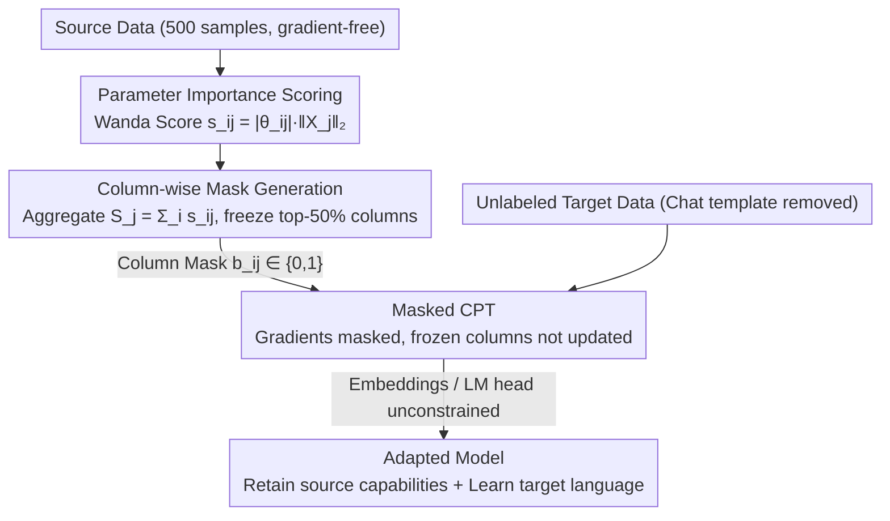

# Mitigating Catastrophic Forgetting in Target Language Adaptation of LLMs via Source-Shielded Updates

**Conference**: ACL 2026  
**arXiv**: [2512.04844](https://arxiv.org/abs/2512.04844)  
**Code**: [GitHub](https://github.com/gucci-j/ssu)  
**Area**: LLM Evaluation  
**Keywords**: Catastrophic Forgetting, Language Adaptation, Selective Parameter Updates, Column-wise Freezing, Source Knowledge Protection

## TL;DR
Proposes Source-Shielded Updates (SSU), a column-wise freezing strategy driven by source data importance scores. In continual pre-training (CPT) using only unlabeled target language data, it reduces source language performance degradation from 20.3% (Full Fine-Tuning) to 3.4% while maintaining comparable or superior target language performance.

## Background & Motivation

**Background**: Extending the language coverage of LLMs is crucial for global accessibility. The standard practice involves continual pre-training (CPT) on target language data, but this often leads to catastrophic forgetting, particularly harming the core chat and safety capabilities of instruction-following models.

**Limitations of Prior Work**: (1) Low-resource languages lack instruction-tuning data, and machine translation data yields unstable results, necessitating adaptation via unlabeled text; (2) Full fine-tuning (FFT) leads to an average source performance drop of 20.3% in 7B models and 22.3% in 13B models; (3) Post-processing methods (e.g., model merging, task vectors) largely fail to effectively mitigate forgetting.

**Key Challenge**: Unlabeled raw text lacks chat templates and is incompatible with the training format of instruction-following models. Existing selective update methods based on target data signals optimize for this incompatible format, which may instead damage the model's fundamental capabilities.

**Goal**: To proactively protect source knowledge during the CPT stage, enabling the model to learn the target language while retaining its original instruction-following, chat, and safety capabilities.

**Key Insight**: Approach the problem from source data rather than target data—identify parameters critical to source knowledge and freeze them before CPT to prevent forgetting at the root.

**Core Idea**: Use a small amount of source data (500 samples) to calculate parameter importance scores, aggregate these scores by column, and then freeze the most important 50% of columns to ensure that complete feature transformation pathways remain intact.

## Method

### Overall Architecture
SSU consists of three stages: (1) Compute importance scores for each parameter using source data and the Wanda scoring method; (2) Aggregate scores by column and generate column-wise freezing masks; (3) Perform CPT on unlabeled target language data while applying masks to freeze critical columns during gradient updates.

### Key Designs

**1. Parameter Importance Scoring: Identifying critical weights from source data**

Existing selective update methods mostly focus on signals from the target data. However, since unlabeled raw text lacks chat templates, optimizing for this incompatible format can destroy basic model capabilities. SSU reverses this by using source data to determine which parameters are most critical for maintaining source language performance. It adopts the importance score from Wanda pruning, $s_{ij} = |\theta_{ij}| \cdot \|X_j\|_2$, which combines weight magnitude with the L2 norm of the corresponding input activation. This can be computed using only 500 source data samples without gradient calculation. Combining both weight and activation signals is more reliable than using weight magnitude alone, as SSU-Mag shows significant degradation in ablations when activation information is omitted.

**2. Column-wise Masking: Freezing entire columns to preserve feature transformation paths**

While element-wise freezing of critical parameters sounds precise, it can disrupt feature transformation pathways, leading to catastrophic forgetting. SSU aggregates element-wise scores along columns: for a weight matrix $\theta \in \mathbb{R}^{d_{out} \times d_{in}}$, it sums scores for each column $j$ to get $S_j = \sum_i s_{ij}$. After sorting by $S_j$, the top-$k$% (default 50%) of columns are frozen (mask set to 0, others to 1). Freezing entire columns means corresponding output dimensions are not overwritten, similar to preserving load-bearing columns during building renovation—by keeping the structure intact, source knowledge does not collapse. Experiments confirm a substantial performance gap between structured and element-wise freezing.

**3. Masked Continual Pre-training: Applying a static mask to standard CPT**

With the mask generated, training follows standard causal language modeling, except that gradients are masked during backpropagation:

$$\theta_{ij} \leftarrow \theta_{ij} - \eta \cdot b_{ij} \cdot \nabla_{\theta_{ij}} L$$

where $b_{ij} \in \{0, 1\}$ is the mask value. Gradients for frozen columns are zeroed out, while embeddings and the LM head remain unconstrained to allow learning of target language token representations. This static mask introduces negligible overhead as it is not recalculated during training and is orthogonal to other mitigation techniques like regularization or replay.

### Loss & Training
The model is trained on 200M tokens of target language data using standard causal language modeling loss. Chat templates are removed prior to training to support unlabeled data.

## Key Experimental Results

### Main Results (7B Model, Average Source Language Metrics)

| Method | IFEval | AlpacaEval2 | MT-Bench | GSM8K | Safety | Source Degradation (%) |
|------|--------|-------------|----------|-------|--------|-----------|
| Source | 0.675 | 32.6 | 3.98 | 0.796 | 0.851 | 0.0 |
| FFT | 0.456 | 10.4 | 3.48 | 0.608 | 0.797 | -20.3 |
| HFT | 0.621 | 17.6 | 3.83 | 0.677 | 0.826 | -8.0 |
| **SSU** | **0.669** | **27.0** | **3.96** | **0.752** | **0.850** | **-3.4** |

### Ablation Study

| Configuration | IFEval | Description |
|------|--------|------|
| SSU-Wanda | 0.669 | Full Method (Source data + Wanda scoring + Column-wise freezing) |
| SSU-Rand | 0.608 | Random column freezing, no source data guidance |
| SSU-Mag | 0.570 | Weight magnitude scoring only, lacks activation signals |
| Element-wise | ~0.45 | Disrupts feature transformation, performance collapse |

### Key Findings
- SSU consistently outperforms all baselines across core instruction-following and safety tasks, being the only method to excel in both source language retention and target language improvement.
- Regarding target language performance, SSU outperforms FFT on all benchmarks at the 7B scale and most benchmarks at the 13B scale.
- The significant gap between column-wise and element-wise freezing validates the importance of structured protection.
- SSU avoids the code-mixing issues observed in methods like HFT.

## Highlights & Insights
- The core insight is a "source-focused" rather than "target-focused" parameter selection paradigm—protecting existing knowledge is more important than selecting what to update.
- The analogy for column-wise freezing is intuitive: "preserving load-bearing columns during building renovation"—protecting complete feature pathways rather than isolated parameter points.
- High practicality with minimal overhead, requiring only 500 source samples for importance scoring.

## Limitations & Future Work
- Validated primarily on the OLMo 2 series; further verification on more architectures is needed.
- A fixed 50% freezing ratio may not be optimal for all languages; adaptive freezing ratios warrant exploration.
- The combination with parameter-efficient methods like LoRA has yet to be explored.

## Related Work & Insights
- **vs HFT**: HFT randomly freezes sub-layer components without principled protection; SSU uses source-driven scoring to precisely locate critical parameters.
- **vs GMT**: GMT relies on unreliable target data gradients for dynamic selection; SSU's source-focused strategy is more robust for unlabeled text.
- **vs AdaLoRA**: AdaLoRA maintains knowledge well but offers limited target improvement; SSU balances both effectively.

## Rating
- Novelty: ⭐⭐⭐⭐ The source-focused column-wise freezing strategy is novel and theoretically grounded.
- Experimental Thoroughness: ⭐⭐⭐⭐⭐ Evaluated across 5 languages, 2 model scales, and multiple dimensions.
- Writing Quality: ⭐⭐⭐⭐⭐ Clear logic and rigorous motivational derivation.
- Value: ⭐⭐⭐⭐⭐ Directly addresses a core pain point in low-resource language adaptation.

<!-- RELATED:START -->

## Related Papers

- [\[ACL 2026\] Efficient Low-Resource Language Adaptation via Multi-Source Dynamic Logit Fusion](efficient_low-resource_language_adaptation_via_multi-source_dynamic_logit_fusion.md)
- [\[ACL 2025\] Registering Source Tokens to Target Language Spaces in Multilingual Neural Machine Translation](../../ACL2025/multilingual_mt/registering_source_tokens_to_target_language_spaces_in_multilingual_neural_machi.md)
- [\[ACL 2026\] Exploring Two-Phase Continual Instruction Fine-tuning for Multilingual Adaptation in Large Language Models](exploring_continual_fine-tuning_for_enhancing_language_ability_in_large_language.md)
- [\[ACL 2026\] TLPO: Token-Level Policy Optimization for Mitigating Language Confusion in Large Language Models](tlpo_token-level_policy_optimization_for_mitigating_language_confusion_in_large_.md)
- [\[ICML 2026\] Toward Robust Multilingual Adaptation of LLMs for Low-Resource Languages](../../ICML2026/multilingual_mt/toward_robust_multilingual_adaptation_of_llms_for_low-resource_languages.md)

<!-- RELATED:END -->
