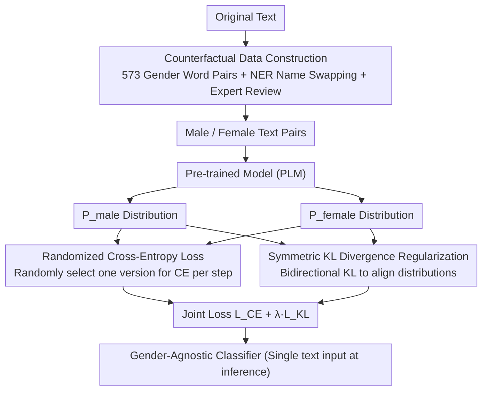

# Mitigating Extrinsic Gender Bias for Bangla Classification Tasks

**Conference**: ACL 2026 Findings  
**arXiv**: [2411.10636](https://arxiv.org/abs/2411.10636)  
**Code**: [GitHub](https://github.com/sajib-kumar/Mitigating-Bangla-Extrinsic-Gender-Bias)  
**Area**: Multilingual / Fairness  
**Keywords**: Gender bias mitigation, Bangla NLP, KL divergence regularization, Counterfactual data augmentation, Classification fairness

## TL;DR
Addressing extrinsic gender bias in Bangla pre-trained models for downstream classification tasks, the authors propose RandSymKL. This method employs joint optimization of randomized cross-entropy loss and symmetric KL divergence to effectively reduce predictive disparities between genders while maintaining classification accuracy.

## Background & Motivation

**Background**: Although large-scale models are powerful, their deployment costs in low-resource languages like Bangla are prohibitive. Consequently, task-specific pre-trained language models (PLMs) such as BERT and ELECTRA are more commonly used for classification tasks like sentiment analysis and hate speech detection.

**Limitations of Prior Work**: These PLMs often exhibit inconsistent predictions for male-centric and female-centric texts—a phenomenon known as "extrinsic gender bias." For example, a hate speech detection model might correctly classify a female-centered sentence as "abusive" while misclassifying a semantically equivalent male-centered sentence as "normal."

**Key Challenge**: Existing bias research focuses primarily on English and intrinsic bias (at the embedding level); there is little systematic study of extrinsic bias (at the downstream prediction level) in Bangla. Furthermore, gender encoding in Bangla is more implicit (reflected through social roles, kinship terms, and names), making it harder for models to maintain semantic consistency after counterfactual substitution.

**Goal**: (1) Construct a benchmark for evaluating gender bias in Bangla; (2) Propose a universal de-biasing training strategy that reduces gender prediction disparities without sacrificing classification performance.

**Key Insight**: The authors observed that randomized selection between male or female versions to calculate cross-entropy loss during training, combined with symmetric KL divergence to pull their output distributions closer, allows the model to learn gender-agnostic representations.

**Core Idea**: Jointly optimize using randomized cross-entropy and symmetric KL divergence (RandSymKL) to align predictions across gender variants at the output distribution level, without relying on token-level gender markers.

## Method

### Overall Architecture
During training, the model takes both male-centric and corresponding female-centric texts as input to obtain output probability distributions $P_{\text{male}}$ and $P_{\text{female}}$. A joint loss function is then used to optimize both classification accuracy and distribution alignment. At inference, only a single text is required; no gender-pair generation is necessary.

### Key Designs

**1. Counterfactual Data Construction: Creating semantically equivalent, gender-opposite text pairs using a linguistic dictionary**

Bangla lacks grammatical gender; instead, gender information is embedded in social roles, kinship terms, and names. Simple word-for-word replacement is insufficient and can be hindered by polysemy and spelling variations—for instance, *dada* can mean both "elder brother" and "paternal grandfather." To address this, the authors constructed a Bangla dictionary of 573 gendered word pairs (e.g., "son/daughter," "brother/sister"), combined it with NER for personal name swapping, and performed expert linguistic reviews to ensure semantic consistency. These pairs serve as the foundation for both bias evaluation and paired training.

**2. Randomized Cross-Entropy Loss: Randomly choosing one gender version per step for CE calculation to prevent bias toward specific gender expressions**

If the model consistently uses male versions of logits for cross-entropy calculation during training, it implicitly treats the male distribution as the "default," leading to systematic bias against female text. This method randomly selects between the male version $\mathbf{z}_1$ and female version $\mathbf{z}_2$ at each training step for standard cross-entropy, rather than fixing one version. This randomization ensures that the gender used for supervision is an unbiased event, preventing the model from learning a preference for a single gender.

**3. Symmetric KL Divergence Regularization: Explicitly pulling the predictive distributions of both gender versions together**

Randomization alone ensures unbiased supervision but does not guarantee consistent predictions for male and female versions of the same sentence. Thus, the authors added a symmetric KL term to the loss to penalize distributional asymmetry:

$$\mathcal{L}_{\text{KL}} = \text{KL}(P_{\text{male}} \| P_{\text{female}}) + \text{KL}(P_{\text{female}} \| P_{\text{male}})$$

A bidirectional sum is used instead of a unidirectional KL because the latter is asymmetric and favors the side treated as the reference. The symmetric form ensures the model does not lean toward any specific gender, truly aligning gender variants at the probability level.

### Loss & Training
The total loss is defined as $\mathcal{L}_{\text{total}} = \mathcal{L}_{\text{CE}} + \lambda \cdot \mathcal{L}_{\text{KL}}$, where $\lambda$ controls the strength of de-biasing. Training utilizes a batch size of 4, a learning rate of $1 \times 10^{-4}$, and the Adam optimizer. After 15 epochs, dropout is adjusted based on the validation set, followed by fine-tuning for 3-5 epochs.

## Key Experimental Results

### Main Results

| Task | Method | Avg Accuracy | Accuracy Gap (AG) | FairScore |
|------|------|-----------|---------------|-----------|
| All 4 Tasks | OSI (No fine-tuning) | 56.17% | 3.39% | 22.06% |
| All 4 Tasks | FOD (Fine-tune only) | 91.10% | 2.50% | 5.97% |
| All 4 Tasks | Token Masking | 87.46% | 0.00% | 0.00% |
| All 4 Tasks | FOA (Data Augmentation) | 90.46% | 0.32% | 3.16% |
| All 4 Tasks | CSD (Cosine Sim) | 90.58% | 1.10% | 3.31% |
| All 4 Tasks | RandSymKL (Ours) | 90.66% | **0.29%** | **1.69%** |

### Ablation Study

| Configuration | Avg FairScore | Avg AG | Description |
|------|-------------|--------|------|
| RandSymKL (Full) | 1.69% | 0.29% | Full model |
| NonRandSymKL_M (No Random) | 2.31% | 0.52% | No randomization; CE uses male version only |
| AvgSymKL_MF (Avg logits) | 2.30% | 0.33% | Uses average logits instead of random choice |
| Token Masking | 0.00% | 0.00% | Complete de-biasing but 3% accuracy drop |

### Key Findings
- Excluding Token Masking, RandSymKL achieves the lowest FairScore (1.69%), which is 0.61 percentage points lower than the strongest baseline, AvgSymKL_MF, with statistical significance ($p = 0.012$).
- While Token Masking eliminates bias (FairScore = 0), the cost to accuracy is too high (87.46% vs. 90.66%).
- Randomization is critical—removing it (NonRandSymKL_M) increases FairScore from 1.69% to 2.31%.
- RandSymKL also performs best on group fairness metrics such as EOD and SPD.

## Highlights & Insights
- **Simplicity and Effectiveness**: The combination of randomization and symmetric KL requires no architectural changes or auxiliary models; de-biasing is achieved solely through the training strategy, making it easily transferable to other languages and tasks.
- **573-Word Gender Dictionary**: This is a significant resource for Bangla gender bias research, accounting for polysemy and culturally specific gender roles.
- **Output Distribution Alignment vs. Embedding Alignment**: Compared to CSD, which applies cosine similarity constraints in the embedding space, RandSymKL's alignment at the output probability level is more direct and effective.

## Limitations & Future Work
- The method was verified only on four binary classification tasks; more complex scenarios like multi-class classification or sequence labeling were not addressed.
- Gender encoding in Bangla relies heavily on context (e.g., kinship chains), and the current dictionary method may miss some implicit gender information.
- Experiments were conducted using BERT and ELECTRA scale models; performance on larger models remains unverified.
- Future work could extend to other low-resource languages (e.g., Hindi, Tamil) to verify cross-lingual generalizability.

## Related Work & Insights
- **vs. CSD (Igbaria & Belinkov 2024)**: CSD aligns in the embedding space via cosine similarity; the proposed method aligns in the probability space using symmetric KL, which is more direct and yields better results (FairScore 3.31% vs. 1.69%).
- **vs. FOA (Data Augmentation)**: FOA simply doubles training data with limited impact (FairScore 3.16%); this work leverages counterfactual data more effectively through loss function design.
- **vs. Patel & Kisku 2024**: While they used KL divergence to pull predictions toward a uniform distribution, this work applies symmetric KL specifically between gender pairs, offering a more targeted approach.

## Rating
- Novelty: ⭐⭐⭐ The components are not entirely new, but the combination and application scenario (Bangla de-biasing) are valuable.
- Experimental Thoroughness: ⭐⭐⭐⭐ Four tasks, multiple baselines, statistical significance tests, and ablation studies.
- Writing Quality: ⭐⭐⭐⭐ Clear motivation and detailed methodology.
- Value: ⭐⭐⭐ Significant reference value for fairness research in low-resource languages; transferable methodology.

<!-- RELATED:START -->

## Related Papers

- [\[ACL 2026\] FairQE: Multi-Agent Framework for Mitigating Gender Bias in Translation Quality Estimation](fairqe_multi-agent_framework_for_mitigating_gender_bias_in_translation_quality_e.md)
- [\[ACL 2026\] Enhancing BiGRU with a KAN Block for Legal Document Classification and Summarization](enhancing_bigru_with_a_kan_block_for_legal_document_classification_and_summariza.md)
- [\[ACL 2026\] MORPHOGEN: A Multilingual Benchmark for Evaluating Gender-Aware Morphological Generation](morphogen_a_multilingual_benchmark_for_evaluating_gender-aware_morphological_gen.md)
- [\[ACL 2026\] Mitigating Catastrophic Forgetting in Target Language Adaptation of LLMs via Source-Shielded Updates](mitigating_catastrophic_forgetting_in_target_language_adaptation_of_llms_via_sou.md)
- [\[ACL 2026\] TLPO: Token-Level Policy Optimization for Mitigating Language Confusion in Large Language Models](tlpo_token-level_policy_optimization_for_mitigating_language_confusion_in_large_.md)

<!-- RELATED:END -->
