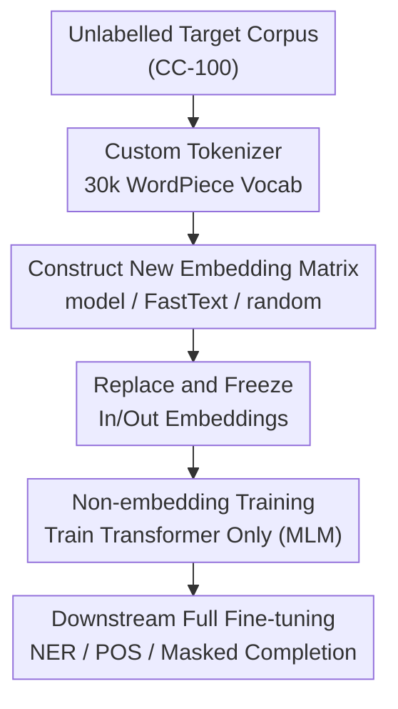

# Modular Monolingual Adaptation using Pretrained Language Models

**Conference**: ACL 2026  
**arXiv**: [2606.06738](https://arxiv.org/abs/2606.06738)  
**Code**: https://github.com/knalin55/MMA-PLM  
**Area**: Multilingual / Low-resource language modeling  
**Keywords**: Low-resource languages, monolingual adaptation, custom tokenizer, frozen embeddings, masked language modeling

## TL;DR
For adapting multilingual pretrained language models (PMLMs) to low-resource languages, the authors advocate a modular approach: "adopting a language-specific tokenizer + freezing input/output embeddings while training only the Transformer body." This method consistently outperforms full fine-tuning on Masked Language Modeling (MLM), NER, and POS tasks for Scottish Gaelic, Irish, and Quechua, while reducing trainable parameters by approximately 25% and nearly halving GPU memory and training time.

## Background & Motivation
**Background**: To create monolingual models for low-resource languages, the mainstream approach is not training from scratch but performing Language Adaptive Fine-Tuning (LAFT) on a PMLM (e.g., mBERT) using target language corpora with the same MLM objective. Many studies also find that equipping the model with a language-specific tokenizer further improves adaptation performance.

**Limitations of Prior Work**: "Full fine-tuning of the entire model" has two specific drawbacks in low-resource scenarios. First, data scarcity (e.g., only 8.5k training samples for Quechua) makes full parameter fine-tuning highly prone to overfitting. Second, it is computationally expensive. The authors provide a key visualization (Figure 2): comparing the Euclidean distance of BERT weights before and after fine-tuning reveals that **weight changes in the embedding layers are much larger than in other layers**. Due to the large volume of the embedding matrix and large gradient updates during backpropagation, it becomes a "disaster zone" for overfitting when driven by limited data.

**Key Challenge**: The embedding layer accounts for nearly 1/4 of the model parameters. In low-resource settings, training it yields low returns and high overfitting risks; however, leaving the model entirely untouched prevents it from learning the target language. The core question is: which parameters should be trained and which should be frozen? The default "train all" approach may not be optimal.

**Goal**: To answer a simple but previously unverified research question (RQ): **Does training the entire model truly yield the best performance during monolingual adaptation?** This study systematically decomposes the roles of tokenizers, embedding initialization methods, and base models.

**Key Insight**: Modularize adaptation by reconstructing the embeddings with a target language custom tokenizer, then **freezing the input/output embedding layers and only training the intermediate Transformer layers**. Freezing embeddings acts as a structural regularizer, forcing the model to adjust high-level representations without distorting the embedding space.

## Method

### Overall Architecture
The method consists of three steps, taking a multilingual pretrained encoder (BERT / mBERT / mmBERT) and unlabelled target language corpora as input, and outputting an adapted monolingual model. First, a WordPiece custom tokenizer with a 30k vocabulary is trained on the target corpora. Second, an embedding matrix for this new vocabulary is constructed (three strategies available) to replace the original input and LM Head embeddings. Third, **these two embedding layers are frozen** (input and output weights are tied in MLM), and only the remaining Transformer layers are trained using the standard MLM objective. Downstream tasks (NER / POS) are then fully fine-tuned on the adapted model.

### Key Designs

**1. Custom Tokenizer: Replacing Multilingual Vocabularies with Language-Specific Ones**
When low-resource languages reuse the multilingual vocabulary of a PMLM, target language words are often split into long sequences of subwords (high token fertility), which wastes computation and hinders modeling. The authors train a 30k WordPiece tokenizer on the target corpora. This results in subword segmentation that better fits the target language, showing higher "continued subword" ratios and lower fertility. This step also "slims" the model—embeddings account for ~25% of parameters; switching to a smaller language-specific vocabulary directly reduces trainable parameters for mBERT by ~25%. This was the **single most impactful factor** in experiments: custom tokenizers consistently outperformed multilingual ones in MLM tasks, aligning with findings by Rust et al. (2021).

**2. Non-embedding Training: Regularization via Parameter Selection**
This is the core proposition of the paper. Since Figure 2 shows that the embedding layer is a "disaster zone" for overfitting and constitutes nearly 25% of parameters, the authors **only update the intermediate Transformer layers while freezing the input/output embeddings** (denoted as non-emb). The control groups are full fine-tuning (full) and embedding-only training (emb). The intuition is that freezing embeddings serves as structural regularization; the model must adapt high-level semantic representations rather than memorizing small samples by rewriting the embedding space. Results on the MLM task show that non-emb consistently outperforms full and emb across three languages and various initializations. For downstream tasks (NER/POS), non-emb performs comparably to full and significantly better than emb-only (indicating that training only embeddings fails to capture task-relevant contextual representations).

**3. Embedding Initialization Strategies: Three Options, Minimal Difference**
The authors compared three ways to create the new embedding matrix: (a) **model**—using the original tokenizer to segment new tokens back into old tokens and taking the mean of their weights; (b) **FastText**—training FastText static embeddings on the same corpus and aligning dimensions; (c) **random**—random initialization as a control. A counter-intuitive finding was that under the frozen setting (non-emb), the gap between the three initializations was minimal. FastText was only slightly better, and **even random initialization was only marginally worse than the other two**. The authors explain that Transformer layers have the capacity to "re-align" to a new embedding space—further proving that freezing embeddings primarily provides regularization rather than relying on language knowledge within the embeddings themselves. In contrast, under full fine-tuning, default embeddings can hinder performance as the model must first "unlearn" irrelevant multilingual knowledge.

### Loss & Training
The adaptation phase uses the standard Masked Language Modeling (MLM) objective, backpropagating gradients only to non-embedding parameters. Training is conducted on CC-100 corpora with sizes: qu 8.5k, gd 250k, ga 500k samples. Models are trained for 50 epochs with early stopping based on MLM accuracy using dynamic batch sizes. Other hyperparameters follow HuggingFace Trainer defaults. Results are averaged over 3 runs (mean ± std). Downstream NER/POS tasks use full fine-tuning (prioritizing task performance over generalization) and are evaluated using accuracy.

## Key Experimental Results

### Main Results
On Scottish Gaelic (gd) across three tasks, the custom tokenizer + non-embedding training (custom/non-emb) significantly outperformed the original multilingual setup, especially in MLM. The table below excerpts the MLM accuracy for gd, comparing three training strategies for the same model (all using custom tokenizer + model initialization):

| Model | full | emb-only | non-emb |
|------|------|----------|---------|
| BERT (custom/model) | 32.9 | 21.8 | **50.5** |
| mBERT (custom/model) | 33.4 | 32.2 | **54.3** |
| mmBERT (custom/model) | 41.0 | 19.8 | **57.3** |
| mBERT original (model/model) | 28.3 | 24.1 | 34.0 |
| mBERT out-of-the-box | — | — | 6.9 |

Non-embedding training significantly boosted MLM accuracy for all three base models (e.g., mBERT improved from 33.4 for full to 54.3). For the ultra-low-resource Quechua (qu), mBERT under custom/model also saw MLM rise from 24.0 (full) to 29.4 (non-emb), and NER reached 82.3, far exceeding the ~60 of the original model/model.

### Ablation Study
Key comparison (gd, mBERT, custom tokenizer):

| Task | Training Strategy | Accuracy | Description |
|------|---------|--------|------|
| MLM | full | 33.4 | Full fine-tuning overfits embeddings |
| MLM | emb-only | 32.2 | Training only embeddings fails to learn deep representations |
| MLM | non-emb | **54.3** | Frozen embeddings act as regularization; optimal |
| NER | full | ≈83.9 | Comparable to non-emb |
| NER | non-emb | ≈82.7 | Tied with full on downstream tasks |
| MLM | non-emb + random emb | 49.5 | Only slightly lower than model/FastText |

Regarding efficiency (gd, Table 7), the proposed setup (custom + model init + non-emb) is much more efficient than full fine-tuning:

| Model / Method | Trainable Params | GPU Memory | Training Time | Inference Latency |
|------------|---------|------|---------|---------|
| mBERT / full | 178M | 1.3G | 32H | 9.7ms |
| mBERT / Ours | 85.6M | 0.9G | 14H | 8.6ms |
| mmBERT / full | 308M | 2.3G | 71H | 19.2ms |
| mmBERT / Ours | 110M | 1.0G | 21H | 13.3ms |

### Key Findings
- **Frozen Embeddings represent a win-win for performance and efficiency**: non-emb wins across the board in MLM, with half the trainable parameters, nearly half the training time, and slightly faster inference; the root cause of overfitting (excessive embedding weight changes) is eliminated.
- **Tokenizer > Embedding Initialization**: Custom tokenizers provide the largest contribution. How embeddings are initialized is almost irrelevant under non-emb; even random initialization is sufficient because Transformer layers can re-align to the new space.
- **Diverging Downstream Task Strategies**: For NER/POS, full and non-emb are comparable, but both are stronger than emb-only—showing that tuning only embeddings fails to learn task-specific contextual representations.
- **Superior to LoRA**: The proposed method consistently outperforms LoRA (rank=64, α=128) across the three tasks. The authors hypothesize that LoRA's low-rank constraint limits the capacity to learn complex tasks.
- **Visibility in Pretraining Matters**: Irish (ga) was included in mBERT pretraining, so full fine-tuning showed only marginal gains over out-of-the-box performance. However, custom/model + non-emb still improved MLM accuracy to over 2.5x the baseline.

## Highlights & Insights
- **Identifying the root cause with a weight difference plot (Figure 2)**: The study empirically proves "embedding layer change is largest ⇒ most prone to overfitting," leading logically to the solution "freeze it." This "diagnosis then prescription" narrative is highly effective.
- **Counter-intuitive "Freezing as Regularization" conclusion**: Training less is better in low-resource settings. The observation that random initialization works well proves that the Transformer layers' "re-alignment" capability is powerful and that embedding knowledge is less critical than expected.
- **Modular decomposition facilitates transfer**: Tokenizers, embeddings, and training strategies are decoupled and analyzed. This provides a clear "cost-effective recipe" for industrial deployment of low-resource languages.

## Limitations & Future Work
- **Scope limited to encoder-only + three languages**: Experiments were confined to BERT-family encoders and gd/ga/qu, without verifying decoder-only LLMs or more language families. The tokenizer vocabulary was fixed at 30k without parameter sweeps.
- **Low overall performance on Quechua**: Metrics for qu remained low across all settings due to the 8.5k data limit, suggesting the method mitigates but cannot overcome the "data ceiling."
- **mmBERT downstream anomalies**: While mmBERT had the best MLM results, its NER/POS performance was weaker than mBERT/BERT in some settings. The authors suspect "catastrophic over-training," but the mechanism was not deeply explored.
- **Future Directions**: Combining frozen embeddings with adapters/LoRA or verifying if non-embedding training provides similar regularization in decoder-only models.

## Related Work & Insights
- **vs. LAFT (Full Language Adaptive Fine-Tuning)**: LAFT trains the whole model on target corpora. This paper trains only non-embedding layers. The proposed method is significantly better and more efficient in low-resource MLM by "freezing the source of overfitting."
- **vs. LoRA**: LoRA reduces parameters via low-rank decomposition; this paper uses "freeze embeddings + train body." The proposed method is consistently better than LoRA, likely due to LoRA’s capacity limitations.
- **vs. de Vries & Nissim (2021)**: They froze the Transformer and retrained embeddings. This paper does the exact opposite—freeze embeddings and train the Transformer—empirically proving the latter is more stable for low-resource settings.
- **vs. Vocabulary Extension (Chau et al. / Yamaguchi et al.)**: Those methods add tokens to the original vocabulary. This paper replaces it with a language-specific one, aligning with Rust et al. (2021)'s conclusion that "monolingual tokenizers outperform multilingual ones."

## Rating
- **Novelty**: ⭐⭐⭐ Combines existing elements (custom tokenizer + frozen embeddings), but the systematic validation of "freezing as regularization" and the counter-intuitive findings are valuable.
- **Experimental Thoroughness**: ⭐⭐⭐⭐ 3 languages × 3 base models × 3 strategies × 3 initializations, plus LoRA and efficiency comparisons.
- **Writing Quality**: ⭐⭐⭐⭐ Logical flow from weight diagnosis to methods to analysis; clear conclusions despite many tables.
- **Value**: ⭐⭐⭐⭐ Provides a practical recipe for improving performance while saving costs in low-resource monolingual model deployment.

<!-- RELATED:START -->

## Related Papers

- [\[ACL 2026\] Exploring Two-Phase Continual Instruction Fine-tuning for Multilingual Adaptation in Large Language Models](exploring_continual_fine-tuning_for_enhancing_language_ability_in_large_language.md)
- [\[ACL 2026\] Efficient Low-Resource Language Adaptation via Multi-Source Dynamic Logit Fusion](efficient_low-resource_language_adaptation_via_multi-source_dynamic_logit_fusion.md)
- [\[ACL 2026\] Mitigating Catastrophic Forgetting in Target Language Adaptation of LLMs via Source-Shielded Updates](mitigating_catastrophic_forgetting_in_target_language_adaptation_of_llms_via_sou.md)
- [\[ACL 2026\] Language Models Entangle Language and Culture](language_models_entangle_language_and_culture.md)
- [\[ACL 2025\] Modular Sentence Encoders: Separating Language Specialization from Cross-Lingual Alignment](../../ACL2025/multilingual_mt/modular_sentence_encoders.md)

<!-- RELATED:END -->
