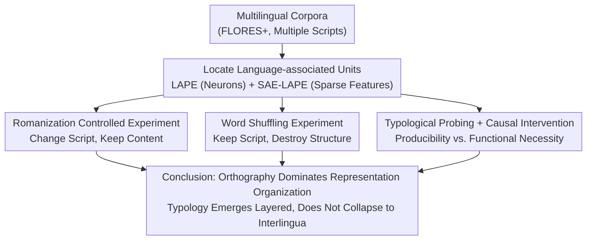

# Multilingual Language Models Encode Script Over Linguistic Structure

**Conference**: ACL 2026  
**arXiv**: [2604.05090](https://arxiv.org/abs/2604.05090)  
**Code**: [GitHub](https://github.com/loadthecode0/multilingual-interpretability)  
**Area**: Human Understanding / Multilingual Interpretability  
**Keywords**: Multilingual Representation, Writing Systems, Orthography, Language-associated Neurons, Sparse Autoencoders

## TL;DR

This paper systematically analyzes language-associated units in multilingual LMs using LAPE metrics and Sparse Autoencoders (SAEs), discovering that these units are primarily driven by orthography (writing systems) rather than abstract linguistic structure: Romanized transliterations activate almost entirely non-overlapping sets of neurons, word shuffling has minimal impact, typological information only becomes accessible in deeper layers, and causal interventions show that functional importance is tied to surface form invariance.

## Background & Motivation

**Background**: Multilingual language models (e.g., Llama, Gemma) compress representations of multiple languages into a shared parameter space, but the nature of this internal organization—whether it is based on abstract linguistic identity or surface form cues—remains unclear.

**Limitations of Prior Work**: (1) Previous work (Tang et al., 2024) located language-associated neurons via LAPE metrics and demonstrated causal steerability, but did not answer what linguistic properties these neurons actually encode; (2) The "interlingua" hypothesis suggests that multilingual models form a unified, language-agnostic representation space, but direct evidence is insufficient; (3) Research in bilingual cognition shows that comprehension and production can share semantic representations while separating surface processing, but it is unknown if a similar phenomenon exists in LMs.

**Key Challenge**: The existence of language-associated units has been confirmed, but do they encode abstract linguistic identity or surface cues such as orthography?

**Goal**: Systematically answer four research questions: (i) Language vs Script—what do language-associated units encode? (ii) Robustness to structural perturbations—how does word shuffling affect them? (iii) Typological alignment—what is their relationship with genealogical, phonological, and syntactic features? (iv) Hierarchical organization—how do these attributes change with depth?

**Key Insight**: Design controlled experiments—Romanized transliterations (changing script while maintaining content) and word shuffling (changing structure while maintaining surface form)—to disentangle the contributions of orthography and linguistic structure.

**Core Idea**: Multilingual LMs organize representations around surface forms (writing systems); linguistic abstraction emerges layer by layer but never collapses into a unified interlingua.

## Method

### Overall Architecture

Analyzed four models: Llama-3.2-1B, Llama-3-8B, Gemma-2-2B, and Gemma-2-9B, focusing on languages across scripts including Latin, Cyrillic, Devanagari, Arabic-Persian, and Ideograms. LAPE (Language Activation Probability Entropy) was used to locate language-associated units at the neuron level, and SAE-LAPE was used to locate language-associated features in the latent space of Sparse Autoencoders. Based on this shared "localization," four types of experiments were conducted: Romanization, word shuffling, typological probing, and causal intervention.

### Key Designs

**1. Romanization Controlled Experiment: Orthogonally decoupling "writing system" and "language identity"**

If language-associated units encode abstract language identity, changing the script of the same language should leave the activated neurons largely unchanged; conversely, if they are anchored to orthography, changing the script would lead to a re-organization of the units. To distinguish these, authors generated Romanized versions of non-Latin languages in FLORES+ using ICU Transliterator (with and without diacritics), identified units for both native and Romanized text via LAPE, and measured the overlap using Jaccard similarity.

Results overwhelmingly supported "orthography dominance": the sets of neurons activated by Hindi in native Devanagari, Romanized with diacritics, and Romanized without diacritics were almost completely disjoint (Jaccard $< 0.1$). Furthermore, Romanized representations did not align with either the native script or English, instead falling into an isolated "third subspace." This suggests the model does not maintain a unified, script-independent representation for "Hindi" but allocates separate capacity for each script variant.

**2. Word Shuffling Experiment: Testing whether units depend on syntactic structure**

While Romanization "changes surface, keeps content," word shuffling does the opposite—"keeps surface, destroys structure"—forming a clean orthogonal control. Authors performed word-level random shuffling on the evaluation corpora and re-ran SAE-LAPE to measure the stability of units via Jaccard similarity.

If these units encoded syntactic language structure, shuffling should cause significant shifts; however, most languages retained a high proportion of units (overlap $> 0.7$), with unique script languages (Chinese, Japanese, Thai) being the most stable. The contrast between heavy perturbation impact (Romanization) and near-zero impact (shuffling) confirms that surface form takes precedence over structure—language-associated units are memorizing lexical and character-level statistical patterns rather than syntax.

**3. Typological Probing + Causal Intervention: Distinguishing "detectability" from "functional necessity"**

Surface form dominance does not mean deeper linguistic structures are absent; the question is at which layer they exist and if the model actually uses them. Authors used linear probes to decode lang2vec typological features (genealogical, phonological, syntactic) and used cross-lingual mean replacement for causal interventions to separate "detectability" from "functional necessity."

Probing revealed that the "overlapping" neurons (invariant across scripts) carry the strongest typological signals, with genealogical features decodable in shallow layers and phonological features emerging in the deepest layers—indicating abstract structure becomes progressively accessible with depth. Causal interventions provided crucial evidence: ablating script-invariant neurons resulted in mild perplexity changes, while ablating script-specific neurons led to catastrophic degradation (PPL increased by $7.74\times$ accompanied by language switching). Together, these indicate that language identity and surface realization are anchored by script-specific units, and "detectable typological information" does not imply "necessary information for generation."

### Loss & Training

This is an analytical work and involves no training. Pre-trained Top-K SAEs (Llama series) and JumpReLU SAEs (Gemma series) were used, focusing on MLP sub-layer activations.

## Key Experimental Results

### Main Results

**Overlap of Language-associated Units after Romanization (Jaccard Similarity, Llama-3.2-1B)**

| Language | Native vs. Romanized (Neurons) | Native vs. Romanized (SAE Features) | Romanized vs. English |
| :--- | :--- | :--- | :--- |
| Hindi | $\sim 0.05$ | $\sim 0.02$ | $\sim 0.00$ |
| Chinese | $\sim 0.05$ | $\sim 0.03$ | $\sim 0.00$ |
| Russian | $\sim 0.08$ | $\sim 0.04$ | $\sim 0.00$ |
| Spanish | $\sim 0.40$ | $\sim 0.30$ | $\sim 0.05$ |

**Causal Intervention: Cross-lingual Mean Replacement (Llama-3.2-1B)**

| Language | Neuron Set | PPL ratio (target) | PPL ratio (random) |
| :--- | :--- | :--- | :--- |
| English | overlap | $0.95$ | $0.99$ |
| English | only-native | $1.50$ | $0.96$ |
| Hindi | overlap | $1.05$ | $0.98$ |
| Hindi | only-native | $0.31$ | $0.97$ |

### Ablation Study

**Unit Stability after Word Shuffling (Jaccard Similarity)**

| Language Type | Neuron Overlap | SAE Feature Overlap |
| :--- | :--- | :--- |
| Unique Scripts (CJK, Thai) | $> 0.70$ | $> 0.70$ |
| Latin Script Languages | $\sim 0.60$ | $\sim 0.40 - 0.60$ |
| Cyrillic Script Languages | $\sim 0.65$ | $\sim 0.65$ |

### Key Findings

- Romanization causes almost complete reorganization of language-associated units (Jaccard $< 0.1$), confirming orthography as the primary driver.
- Romanized representations align neither with the native script nor with English, forming isolated third subspaces.
- Word shuffling leads to only minor changes in units, indicating that language-associated units rely on lexical statistics rather than syntax.
- Script-invariant neurons encode the strongest typological signals; genealogical features are decodable early, phonological features emerge late.
- Causal interventions show script-specific neuron ablation causes catastrophic failure (language switching), while invariant neuron ablation has mild effects.
- These patterns are consistently replicated across Llama and Gemma models in the 1B–9B scale.

## Highlights & Insights

- The experimental design is exceptionally elegant: Romanization changes surface while keeping content, and word shuffling changes structure while keeping surface, cleanly separating orthography from structure.
- The concept of "capacity fragmentation" is profound—models allocate independent internal features for different script variants of the same language, wasting representational capacity. This has direct implications for multilingual model efficiency.
- Distinguishing between "detectability" and "functional necessity" is a significant methodological contribution—many interpretability works stop at probing, but this paper validates findings through causal intervention.

## Limitations & Future Work

- Analysis is focused on MLP sub-layers and does not cover language-associated patterns in attention heads.
- Romanization depends on the ICU Transliterator; quality of transliteration in certain languages might affect results.
- Only four model families were analyzed; applicability to other architectures (e.g., Mistral, Qwen) is unknown.
- Did not explore how to utilize these findings to improve multilingual models—e.g., through explicit alignment to reduce capacity fragmentation.

## Related Work & Insights

- **vs Tang et al. (2024)**: Tang localized language-associated neurons but did not analyze their encoded content; this paper extends from localization to interpretation, revealing the dominant role of orthography.
- **vs Wendler et al. (2024)**: Works supporting the interlingua hypothesis emphasize semantic alignment feasibility; this paper points out that even if semantic alignment is possible, representation space remains deeply fragmented by script.
- **vs Andrylie et al. (2025)**: Extended LAPE analysis to the SAE level but lacked controlled experiments; this paper provides causal-level evidence via Romanization and shuffling experiments.

## Rating

- Novelty: ⭐⭐⭐⭐⭐ First systematic answer to "what language-associated units encode" with elegant design.
- Experimental Thoroughness: ⭐⭐⭐⭐⭐ 4 models $\times$ multiple languages $\times$ probing+intervention+controls, extremely comprehensive.
- Writing Quality: ⭐⭐⭐⭐⭐ Clear research questions, tight logical chain, strong conclusions.
- Value: ⭐⭐⭐⭐ Important implications for multilingual model design and interpretability research.

<!-- RELATED:START -->

## Related Papers

- [\[ACL 2026\] Structure-Guided Entity Resolution: Fine-Tuning LLMs for Robust Name Matching in Complex Linguistic Contexts](structure-guided_entity_resolution_fine-tuning_llms_for_robust_name_matching_in_.md)
- [\[ACL 2025\] LangSAMP: Language-Script Aware Multilingual Pretraining](../../ACL2025/multilingual_mt/langsamp_multilingual_pretraining.md)
- [\[ACL 2026\] Language Models Entangle Language and Culture](language_models_entangle_language_and_culture.md)
- [\[ACL 2026\] Evaluating Robustness of Large Language Models Against Multilingual Typographical Errors](evaluating_robustness_of_large_language_models_against_multilingual_typographica.md)
- [\[ACL 2026\] The GaoYao Benchmark: A Comprehensive Framework for Evaluating Multilingual and Multicultural Abilities of Large Language Models](the_gaoyao_benchmark_a_comprehensive_framework_for_evaluating_multilingual_and_m.md)

<!-- RELATED:END -->
