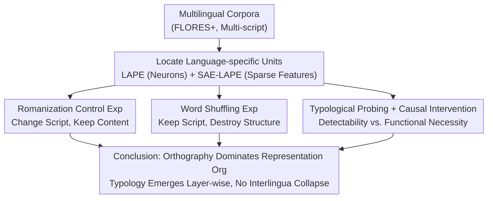

# Multilingual Language Models Encode Script Over Linguistic Structure

**Conference**: ACL 2026  
**arXiv**: [2604.05090](https://arxiv.org/abs/2604.05090)  
**Code**: [GitHub](https://github.com/loadthecode0/multilingual-interpretability)  
**Area**: Human Understanding / Multilingual Interpretability  
**Keywords**: Multilingual representations, writing systems, orthography, language-specific neurons, sparse autoencoders

## TL;DR

This paper systematically analyzes language-specific units in multilingual LMs using LAPE metrics and Sparse Autoencoders (SAEs). The study finds that these units are primarily driven by orthography (writing systems) rather than abstract linguistic structures: Romanized transliterations activate almost entirely non-overlapping sets of neurons, word shuffling has minimal impact, typological information only becomes accessible in deeper layers, and causal interventions show that functional importance is tied to surface-form invariance.

## Background & Motivation

**Background**: Multilingual language models (e.g., Llama, Gemma) compress representations of multiple languages into a shared parameter space. However, the nature of this internal organization—whether it is based on abstract linguistic identity or surface-level formal cues—remains unclear.

**Limitations of Prior Work**: (1) Previous work (Tang et al., 2024) located language-specific neurons via LAPE metrics and demonstrated causal manipulability but failed to identify exactly what linguistic attributes these neurons encode; (2) The "interlingua" hypothesis suggests multilingual models form a unified, language-agnostic representation space, but direct evidence is insufficient; (3) Bilingual cognition research indicates that comprehension and production can share semantic representations while separating surface processing, but whether a similar phenomenon exists in LMs is unknown.

**Key Challenge**: While the existence of language-specific units is confirmed, do they encode abstract linguistic identity or surface cues such as orthography?

**Goal**: Systematically answer four research questions: (i) Language vs. Script—what do language-specific units encode? (ii) Robustness to structural perturbations—how does word shuffling affect them? (iii) Typological alignment—what is the relationship with genealogical, phonological, and syntactic features? (iv) Hierarchical organization—how do these attributes change with depth?

**Key Insight**: Design controlled experiments—Romanization (changing the writing system while keeping content constant) and word shuffling (changing the structure while keeping the surface form constant)—to isolate the contributions of orthography and linguistic structure.

**Core Idea**: Multilingual LMs organize representations around surface forms (writing systems); linguistic abstraction emerges layer by layer but never collapses into a unified interlingua.

## Method

### Overall Architecture

The study analyzes four models: Llama-3.2-1B, Llama-3-8B, Gemma-2-2B, and Gemma-2-9B, spanning languages across Latin, Cyrillic, Devanagari, Arabo-Persian, and ideographic scripts. LAPE (Language Activation Probability Entropy) is used to locate language-specific units at the neuron level, and SAE-LAPE is used to locate language-specific features in the latent space of Sparse Autoencoders. Building on this shared "localization" foundation, the research questions are addressed through four types of experiments: Romanization, word shuffling, typological probing, and causal intervention.

### Key Designs

**1. Romanization Control Experiment: Orthogonally decoupling "Writing System" and "Language Identity"**

If language-specific units encode abstract language identity, writing the same language in a different script should activate essentially the same neurons. Conversely, if they are anchored to orthography, changing the script would result in a reorganization of the units. To distinguish these, the authors generated Romanized versions of non-Latin languages in FLORES+ using the ICU Transliterator (both with and without diacritics). Language-specific units were identified for both original and Romanized text, and their overlap was measured using Jaccard similarity.

The results overwhelmingly support "orthographic dominance": for Hindi, the original Devanagari, Romanized with diacritics, and Romanized without diacritics activated sets of neurons that were almost entirely disjoint ($Jaccard < 0.1$). Furthermore, Romanized representations did not align with the original script or with English, instead falling into an isolated "third subspace." This suggests models do not maintain a unified script-agnostic representation for a language like "Hindi" but instead allocate capacity for each script variant.

**2. Word Shuffling Experiment: Testing dependency on syntactic structure**

While Romanization is "change surface, keep content," word shuffling is the opposite—"keep surface, destroy structure." These form a clean orthogonal control. The authors performed word-level random shuffling on the evaluation corpora and re-ran SAE-LAPE to identify units, measuring stability using Jaccard similarity between shuffled and original versions.

If these units were encoding syntactic-level linguistic structures, shuffling should cause them to shift significantly. However, results showed that most languages retained a high proportion of units after shuffling ($Jaccard > 0.7$), with languages using unique scripts (Chinese, Japanese, Thai) being the most stable. The contrast between high sensitivity to script changes and low sensitivity to word shuffling confirms that surface form takes priority over structure—language-specific units capture lexical and character-level statistical patterns rather than syntax.

**3. Typological Probing + Causal Intervention: Distinguishing "Detectability" from "Functional Necessity"**

Dominance of surface form does not imply an absence of deep linguistic structure; the question is at which layer this structure exists and whether the model actually utilizes it. The authors used linear probes to decode typological features from lang2vec (genealogical, phonological, syntactic) while simultaneously performing causal interventions using cross-lingual mean replacement to separate "detectability" from "functional necessity."

Probing revealed that the "overlapping" neurons (those invariant across scripts) carried the strongest typological signals. Genealogical features were decodable in shallow layers, while phonological features emerged in the deepest layers, indicating that abstract linguistic structure becomes progressively accessible with depth. Causal evidence was more critical: ablating script-invariant neurons resulted in only mild perplexity changes, whereas ablating script-specific neurons caused catastrophic degradation (PPL increased by 7.74x, accompanied by language switching). Together, these findings indicate that language identity and surface implementation are anchored by script-specific units, and "detectability of typological info" does not equate to "necessity for generation."

### Loss & Training

This is an analytical study with no training involved. It utilizes pre-trained Top-K SAEs (Llama series) and JumpReLU SAEs (Gemma series), focusing on MLP sublayer activations.

## Key Experimental Results

### Main Results

**Overlap of Language-Specific Units after Romanization (Jaccard Similarity, Llama-3.2-1B)**

| Language | Original vs. Romanized (Neurons) | Original vs. Romanized (SAE Features) | Romanized vs. English |
|----------|---------------------------------|--------------------------------------|-----------------------|
| Hindi    | ~0.05                           | ~0.02                                | ~0.00                 |
| Chinese  | ~0.05                           | ~0.03                                | ~0.00                 |
| Russian  | ~0.08                           | ~0.04                                | ~0.00                 |
| Spanish  | ~0.40                           | ~0.30                                | ~0.05                 |

**Causal Intervention: Cross-lingual Mean Replacement (Llama-3.2-1B)**

| Language | Neuron Set  | PPL ratio (target) | PPL ratio (random) |
|----------|-------------|--------------------|--------------------|
| English  | overlap     | 0.95               | 0.99               |
| English  | only-native | 1.50               | 0.96               |
| Hindi    | overlap     | 1.05               | 0.98               |
| Hindi    | only-native | 0.31               | 0.97               |

### Ablation Study

**Stability of Units after Word Shuffling (Jaccard Similarity)**

| Language Type               | Neuron Overlap | SAE Feature Overlap |
|-----------------------------|----------------|---------------------|
| Unique Script (ZH/JA/TH/KO) | >0.70          | >0.70               |
| Latin Script Languages      | ~0.60          | ~0.40-0.60          |
| Cyrillic Script Languages   | ~0.65          | ~0.65               |

### Key Findings

- Romanization caused an almost complete reorganization of language-specific units ($Jaccard < 0.1$), confirming orthography as the primary driver.
- Romanized representations aligned neither with the original script nor with English, forming an isolated third subspace.
- Word shuffling resulted in only minor unit changes, suggesting that language-specific units rely on lexical statistics rather than syntactic structure.
- Script-invariant neurons encode the strongest typological signals; genealogical features are decodable in shallow layers, while phonetophonological features emerge in deeper layers.
- In causal interventions, ablation of script-specific neurons led to catastrophic degradation (language switching), while ablation of invariant neurons had a mild impact.
- These patterns were consistently replicated across the 1B-9B scales of Llama and Gemma models.

## Highlights & Insights

- The experimental design is exceptionally elegant: Romanization changes surface while keeping content, and word shuffling changes structure while keeping surface, creating orthogonal controls that cleanly isolate the contributions of orthography and linguistic structure.
- The concept of "capacity fragmentation" is profound—the model allocates independent internal features for different script variants of the same language, wasting representation capacity. This has direct implications for the efficiency optimization of multilingual models.
- Distinguishing "detectability" from "functional necessity" is a significant methodological contribution—many interpretability works stop at probing, whereas this paper provides further verification through causal intervention.

## Limitations & Future Work

- The analysis focuses on MLP sublayers and does not cover language-specific patterns in attention heads.
- Romanization relies on the ICU Transliterator; the quality of transliteration for certain languages might affect the conclusions.
- Only four model families were analyzed; the applicability to other architectures (e.g., Mistral, Qwen) is unknown.
- The paper does not explore how to utilize these findings to improve multilingual models—for example, by reducing capacity fragmentation through explicit alignment.

## Related Work & Insights

- **vs. Tang et al. (2024)**: Tang located language-specific neurons but did not analyze what they encode; this paper extends localization to interpretation, revealing the dominant role of orthography.
- **vs. Wendler et al. (2024)**: Works supporting the interlingua hypothesis emphasize the feasibility of semantic alignment; this paper points out that even if semantic alignment is achievable, the representation space remains deeply fragmented due to writing systems.
- **vs. Andrylie et al. (2025)**: Extended LAPE analysis to the SAE level but lacked controlled experiments; this paper provides causal-level evidence through Romanization and shuffling experiments.

## Rating

- Novelty: ⭐⭐⭐⭐⭐ First to systematically answer "what language-specific units encode" with elegant experimental design.
- Experimental Thoroughness: ⭐⭐⭐⭐⭐ Extremely comprehensive across 4 models, multiple languages, probing, intervention, and controls.
- Writing Quality: ⭐⭐⭐⭐⭐ Clear research questions, tight logical chain, and powerful conclusions.
- Value: ⭐⭐⭐⭐ Provides important insights for multilingual model design and interpretability research.

<!-- RELATED:START -->

## Related Papers

- [\[ACL 2026\] Structure-Guided Entity Resolution: Fine-Tuning LLMs for Robust Name Matching in Complex Linguistic Contexts](structure-guided_entity_resolution_fine-tuning_llms_for_robust_name_matching_in_.md)
- [\[ACL 2025\] LangSAMP: Language-Script Aware Multilingual Pretraining](../../ACL2025/multilingual_mt/langsamp_multilingual_pretraining.md)
- [\[ACL 2026\] Language Models Entangle Language and Culture](language_models_entangle_language_and_culture.md)
- [\[ACL 2026\] Evaluating Robustness of Large Language Models Against Multilingual Typographical Errors](evaluating_robustness_of_large_language_models_against_multilingual_typographica.md)
- [\[ACL 2026\] LLM-XTM: Enhancing Cross-Lingual Topic Models with Large Language Models](llm-xtm_enhancing_cross-lingual_topic_models_with_large_language_models.md)

<!-- RELATED:END -->
