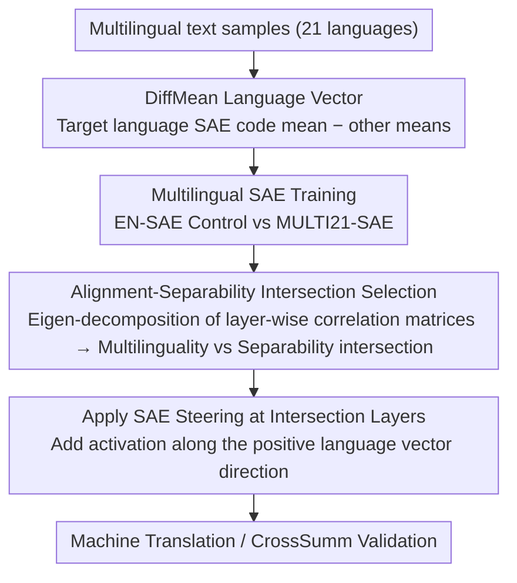

# Multilingual Steering by Design: Multilingual Sparse Autoencoders and Principled Layer Selection

**Conference**: ACL2026  
**arXiv**: [2605.23036](https://arxiv.org/abs/2605.23036)  
**Code**: https://github.com/Yusser96/Multilingual-Steering-by-Design/  
**Area**: Multilingual Control / Mechanistic Interpretability  
**Keywords**: Multilingual SAE, activation steering, layer selection, language vectors, CrossSumm

## TL;DR
This paper demonstrates that multilingual sparse autoencoders combined with layer selection at the intersection of "multilingual alignment and language separability" make SAE language steering more stable. This approach transforms the empirical layer selection problem in multilingual control into a predictable representation diagnostic problem.

## Background & Motivation

**Background**: Sparse autoencoders (SAEs) have become essential tools for interpreting and intervening in internal LLM activations. Existing work shows that activation steering along sparse features or language directions can change the output language, but common practices still rely on English-only SAEs, manual layer sweeps, or empirical rules like "middle-to-late layers are more effective."

**Limitations of Prior Work**: Multilingual language control is not merely about finding and amplifying a "language feature." If intervention occurs too early, the model may only access shared cross-lingual semantics, making language switching imprecise. If too late, while language identity is stronger, generation quality and semantic retention may degrade. Furthermore, optimal layers fluctuate across models and SAE variants, making experiments expensive to replicate and lacking mechanistic explanation.

**Key Challenge**: Reliable language steering requires satisfying two conditions: preserving cross-lingual shared semantic structures to ensure readability, while exposing enough language-specific information to push output toward the target language. Overemphasizing either separability or alignment leads to imbalance.

**Goal**: The authors aim to answer three questions: Are SAEs trained on multilingual corpora superior to English-only SAEs for control? Can effective steering layers be predicted a priori without full downstream sweeps? Does this prediction hold across LLaMA-3.1-8B, Gemma-2-9B, machine translation, and cross-lingual summarization?

**Key Insight**: The paper models language steering as searching for a balance point in representation space. Instead of initial downstream metrics, the authors analyze the correlation matrices of language vectors at each layer. High explained variance of the first principal component represents strong shared cross-lingual alignment, while the complementary components represent language separability. Layers where these two metrics intersect are considered optimal intervention candidates.

**Core Idea**: Train MULTI21-SAE covering 21 languages and use the intersection of multilinguality and separability for layer selection to replace manual layer sweeps.

## Method

The method consists of three parts: constructing language vectors in the dense residual stream or SAE sparse code; comparing English-only and MULTI21-SAEs on language structure preservation; and calculating multilinguality/separability based on correlation matrices to apply steering at intersection layers.

### Overall Architecture

Input consists of multilingual text samples. For each model layer $\ell$, the method collects SAE codes $\mathcal{Z}^+$ for target language samples and $\mathcal{Z}^-$ for others, constructing a language vector $w_{\mathrm{DiffMean}}(\ell)=\bar{z}_{\ell}^{+}-\bar{z}_{\ell}^{-}$. This vector serves as both a diagnostic probe and a steering direction added to the SAE space during inference.

The authors train two sets of JumpReLU SAEs for LLaMA-3.1-8B and Gemma-2-9B: one using English Wikipedia and another using balanced Wikipedia corpora from 21 FLORES-200 languages. Token totals, architectures, and hyperparameters are controlled to isolate the "training corpus coverage" variable.

Layer selection is independent of downstream metrics. An eigenvalue decomposition is performed on the Pearson correlation matrix of language vectors across layers. The explained variance of the first principal component $f_\ell$ denotes multilinguality (shared structure), and $s_\ell=1-f_\ell$ denotes separability. INTERSECTION layers are selected where $f_\ell$ and $s_\ell$ are balanced, then validated on translation and CrossSumm tasks.

### Key Designs

**1. DiffMean Language Vector: Constructing analysis and intervention directions for each target language**
To manipulate language in representation space, a vector representing "language $x$" is required. Across each layer, the authors average the SAE sparse codes for target language tokens and subtract the average for other languages. $w_{\mathrm{DiffMean}}(\ell)=\bar{z}_{\ell}^{+}-\bar{z}_{\ell}^{-}$ defines the language direction. This vector is dual-purpose: as a probe to analyze clustering (e.g., language families) and as an additive steering direction in SAE space. Using sparse codes rather than the dense residual stream ensures features are more interpretable, allowing observation of which specific language features are activated.

**2. Multilingual SAE Training: Preserving shared and language-specific structures in sparse space**
English-only SAEs suffer from training distributions dominated by English, encoding high-frequency English structures while systematically weakening low-frequency or cross-lingual features—which are essential for steering. The MULTI21-SAE is trained on balanced Wikipedia corpora for 21 FLORES-200 languages (2.1B tokens). It is strictly aligned with the EN-SAE in total tokens, JumpReLU architecture, and optimization steps to ensure differences in performance are cleanly attributed to "language coverage."

**3. Alignment-Separability Intersection Selection: Predicting intervention layers a priori**
Reliable steering must balance two tensions: early layers only capture shared cross-lingual semantics, while late layers may be too specialized, leading to semantic collapse. Layer selection is converted into a representation statistics problem: applying eigenvalue decomposition to the Pearson correlation matrix of language vectors, $f_\ell$ represents multilinguality and $s_\ell=1-f_\ell$ represents separability. Candidates are chosen where these cross (e.g., L14/L23 for Gemma-2-9B; L13–L15 for LLaMA-3.1-8B). This criterion acts as a falsifiable prior hypothesis; effective layers are predicted without downstream data and corroborated by translation/CrossSumm benchmarks.

### Loss & Training

SAE training utilizes the JumpReLU architecture acting on the residual stream at `blocks.{layer}.hook_resid_post`. Key hyperparameters include an expansion factor of 8, $L_1$ coefficient of 5.0, JumpReLU bandwidth of $10^{-3}$, 30,000 training steps, batch size of 4,096 tokens, context size of 512, Adam optimizer, learning rate of $5 \times 10^{-5}$, warmup of 1,500 steps, and decay over 3,000 steps. Each SAE is trained on approximately 123M tokens (approx. 3 H100 hours).

Downstream evaluation uses greedy decoding ($T=0$). Machine translation uses FLORES-200 dev to construct vectors and devtest for evaluation. Cross-lingual summarization utilizes 108 EN-Target language pairs from CrossSumm.

## Key Experimental Results

### Main Results

| Model / Task | Layer | SAE | LangID | Quality Metric | Semantic Metric | Note |
|-------------|----|-----|--------|----------|----------|------|
| Gemma-2-9B / FLORES | L14 | MULTI21-SAE | 54.38 | SpBLEU 24.80 | COMET 73.55 | More balanced than Gemma-Scope (45.04 / 15.65 / 61.79) |
| Gemma-2-9B / FLORES | L14 | EN-SAE | 52.19 | SpBLEU 24.90 | COMET 73.17 | Close to MULTI21, but slightly lower LangID / COMET |
| LLaMA-3.1-8B / FLORES | L15 | MULTI21-SAE | 56.97 | SpBLEU 22.53 | COMET 73.25 | Highest semantic quality near intersection layer |
| LLaMA-3.1-8B / FLORES | L15 | EN-SAE | 60.92 | SpBLEU 21.02 | COMET 71.57 | Higher LangID but lower semantic metrics |
| LLaMA-3.1-8B / FLORES | L15 | LLaMA-Scope | 0.10 | SpBLEU 0.00 | COMET 2.72 | Open-source SAE barely supports this steering |

The authors note that no-steering prompt baselines are calculated by prompt language, while steering results use the target language; these are not direct "fair" comparisons. The no-steering baseline caches are: Gemma FLORES 75.51/31.31/85.12, LLaMA FLORES 91.06/31.22/83.58.

### CrossSumm Analysis

| Model / Task | Layer | SAE | LangID | ROUGE-L | LaSE | Observation |
|-------------|----|-----|--------|---------|------|------|
| Gemma-2-9B / CrossSumm | L14 | MULTI21-SAE | 48.33 | 4.17 | 16.55 | Higher than EN-SAE across all three metrics |
| Gemma-2-9B / CrossSumm | L14 | EN-SAE | 42.92 | 4.02 | 15.75 | Weaker control and semantic retention |
| Gemma-2-9B / CrossSumm | L23 | MULTI21-SAE | 11.81 | 1.25 | 12.38 | Late layer results significantly worse |
| LLaMA-3.1-8B / CrossSumm | L13 | MULTI21-SAE | 66.25 | 3.90 | 24.89 | Strong LangID within intersection region |
| LLaMA-3.1-8B / CrossSumm | L15 | MULTI21-SAE | 30.46 | 2.12 | 30.47 | High LaSE but LangID drop shows trade-off |
| LLaMA-3.1-8B / CrossSumm | L13 | LLaMA-Scope | 0.00 | 0.29 | 0.00 | Sparse space lacks effective language separability |

### Key Findings

- MULTI21-SAE does not simply improve all metrics but stabilizes the trade-offs between LangID, SpBLEU/ROUGE-L, and COMET/LaSE, especially compared to open-source SAEs on FLORES.
- Intersection layer selection is falsifiable: Gemma-2-9B predicts L14/L23 and LLaMA-3.1-8B predicts L13-L15; downstream performance is indeed concentrated around these forecasted layers.
- LLaMA-Scope exhibits very weak separability across all layers, translating to near-zero steering effectiveness, suggesting SAE training data/architecture directly impacts multilingual controllability.

## Highlights & Insights

- The approach converts steering layer selection from empirical tuning to representation statistics. Even if the criterion is not uniquely optimal, it is more interpretable than blind sweeps.
- The multilingual SAE control is robust: MULTI21 and EN SAEs share identical token counts and training settings, isolating "corpus language coverage" as the key factor.
- Results suggest language control is not "the stronger the better." Excessively high LangID at the cost of COMET/LaSE means the model is forced toward a surface language identity without preserving task semantics.
- Implications for safety: If a behavior requires both shared semantics and language-specific features, intervention layers should seek this balance rather than defaults like the final layer.

## Limitations & Future Work

- **Limited Model Scope**: Experiments are limited to LLaMA-3.1-8B and Gemma-2-9B. It is unclear if the intersection pattern holds for larger, encoder-decoder, or purely instruction-tuned models.
- **Metric Limitations**: Automated metrics like LangID and COMET cannot fully capture nuances like style fidelity, code-switching, or robustness under ambiguous prompts.
- **Single SAE Site**: The study focuses on JumpReLU SAEs on the residual stream. Attention/MLP activations or alternative sparse architectures remain open questions.
- **Operational Definition of Threshold**: The 0.5 intersection represents an equality between alignment and separability, but this may not be the optimal cutoff for all tasks.
- **Gap with SOTA Multilingual Systems**: This work focuses on mechanistic interpretation and steering rather than replacing specialized translation/summarization systems.

## Related Work & Insights

- **vs Sparse Activation Steering / FGAA / SAE-TS**: These demonstrate SAE features for intervention but rely on manual selection or local features; this work provides a representation-level criterion for layer selection.
- **vs Tang et al. / Deng et al. on Language Neurons**: Prior work identifies language identity encoding; this work adds that separability alone is insufficient; cross-lingual shared structures must also be preserved.
- **vs LLaMA-Scope / Gemma-Scope**: Open-source SAEs are vital baselines, but if training data is English-centric or sparse spaces collapse separability, they fail at multilingual steering.
- **Insight**: For multilingual alignment or low-resource control, a representation-level balance diagnosis can guide intervention and SAE training data design.

## Rating
- Novelty: ⭐⭐⭐⭐☆ Intersection layer selection advances multilingual steering from empirical tuning to mechanistic prediction.
- Experimental Thoroughness: ⭐⭐⭐⭐☆ Covers two models and multiple tasks; lacks human evaluation and broader model families.
- Writing Quality: ⭐⭐⭐⭐☆ Narrative is clear; some raw numbers require checking appendices.
- Value: ⭐⭐⭐⭐☆ Highly relevant for interpretable steering and designing multilingual SAE training data.

<!-- RELATED:START -->

## Related Papers

- [\[ACL 2026\] DFKI-MLT at SemEval-2026 TASK 7: Steering Multilingual Models Towards Cultural Knowledge](dfki-mlt_at_semeval-2026_task_7_steering_multilingual_models_towards_cultural_kn.md)
- [\[ICLR 2026\] SASFT: Sparse Autoencoder-guided Supervised Finetuning to Mitigate Unexpected Code-Switching in LLMs](../../ICLR2026/multilingual_mt/sasft_sparse_autoencoder-guided_supervised_finetuning_to_mitigate_unexpected_cod.md)
- [\[ACL 2025\] Less, but Better: Efficient Multilingual Expansion for LLMs via Layer-wise Mixture-of-Experts](../../ACL2025/multilingual_mt/less_but_better_efficient_multilingual_expansion.md)
- [\[AAAI 2026\] Mitigating Content Effects on Reasoning in Language Models through Fine-Grained Activation Steering](../../AAAI2026/multilingual_mt/mitigating_content_effects_on_reasoning_in_language_models_through_fine-grained_.md)
- [\[ACL 2026\] SteerEval: Inference-time Interventions Strengthen Multilingual Generalization in Neural Summarization Metrics](steereval_inference-time_interventions_strengthen_multilingual_generalization_in.md)

<!-- RELATED:END -->
