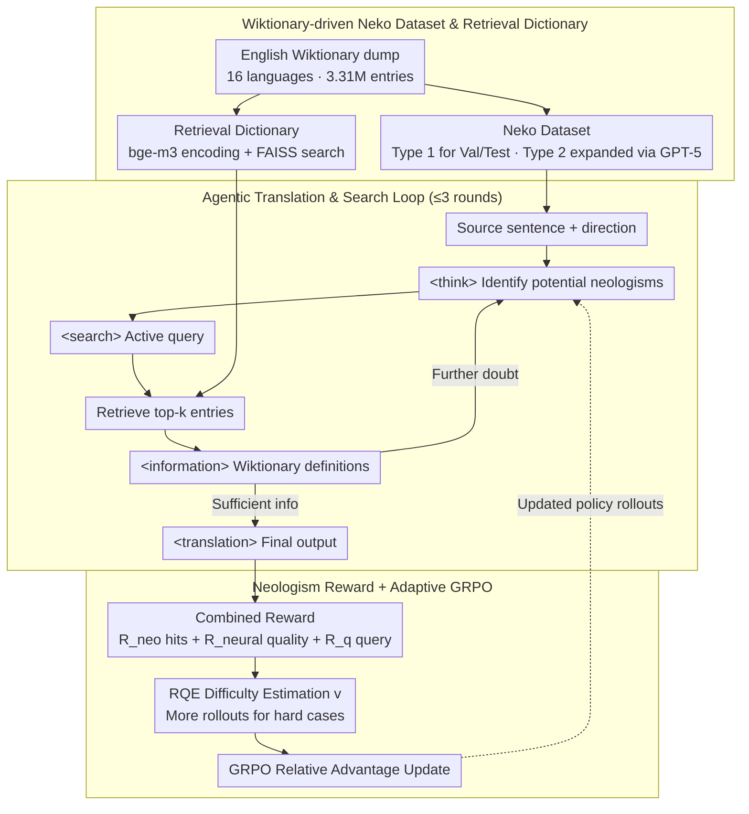

# NeoAMT: Neologism-Aware Agentic Machine Translation with Reinforcement Learning

**Conference**: ACL2026  
**arXiv**: [2601.03790](https://arxiv.org/abs/2601.03790)  
**Code**: https://github.com/gpgg/neoamt  
**Area**: Multilingual Machine Translation / Agent / Reinforcement Learning  
**Keywords**: Neologism Translation, Machine Translation, Retrieval-Augmented Generation, Reinforcement Learning, Wiktionary  

## TL;DR
NeoAMT transforms neologism translation from a problem purely dependent on model parametric knowledge into an agentic MT task characterized by "reasoning, then dictionary lookup, then translation." By using GRPO training sessions targeting neologism hit rates, overall translation quality, and translation difficulty, an 8B model significantly outperforms SFT, retrieval-free RL, and various general/translation-specific LLMs on the Neko neologism translation benchmark.

## Background & Motivation
**Background**: Recently, LLM machine translation has increasingly adopted training paradigms from reasoning models and RL. Works such as MT-R1-Zero, DeepTrans, and SSR-Zero primarily use reward design to encourage models to think before translating or use neural evaluators, format rewards, and self-evaluation rewards to improve overall quality. This trajectory assumes that models already possess sufficient linguistic knowledge and focuses on mobilizing that knowledge.

**Limitations of Prior Work**: Neologism translation challenges this assumption. Internet slang, subculture terms, technical vocabulary, and new political/community expressions emerge constantly, while LLM parametric knowledge is largely frozen after training. When terms like "Grand Theft Auto" (translated via Chinese internet slang counterparts), "growing grass," or "iron glue" appear in source sentences, models may mistranslate based on literal meanings or treat neologisms as ordinary phrases even if they possess reasoning capabilities. The paper notes that although the existing Neo-bench contains neologism tasks, its MT subset is small (240 entries), limited in language pairs, and not public, lacking a data foundation for systematically training and evaluating neologism translation agents.

**Key Challenge**: Neologism translation requires two types of capabilities: understanding the true meaning of a neologism in the current context and naturally integrating that meaning into the target language sentence. Pure SFT is limited by small-scale training data; pure reasoning RL remains constrained by parametric knowledge; and standard RAG often disrupts instruction following and translation fluency when dictionary entries are forced into the prompt.

**Goal**: The authors decompose the task into three sub-problems. First, constructing a neologism translation dataset covering multiple languages and directions with definitions and examples. Second, developing a dictionary retrieval tool invokable by a translation agent rather than treating retrieval as one-off prompt augmentation. Third, designing RL training to enable the model to learn when to search, what to search for, and how to utilize results, while optimizing neologism hits and overall quality.

**Key Insight**: Neologism translation resembles the human translation process of "checking a dictionary when encountering unfamiliar terms" rather than a general QA-style RAG. A translation agent should not passively receive retrieval results but should identify potential neologisms and actively initiate queries, then correct translations after reading dictionary information.

**Core Idea**: Construct a neologism dataset and retrieval tool using Wiktionary, then use GRPO to train a neologism translation agent that interleaves reasoning and retrieval, shifting the model from "knowledge-memorization translation" to "verification-then-translation."

## Method
The NeoAMT method is divided into two layers: the data and tool layer solves "where the neologism knowledge is," and the RL training layer solves "how the model learns to use this knowledge." Instead of naively appending dictionary content to the input, the model outputs an interaction trajectory comprising `<think>`, `<search>`, `<information>`, and `<translation>`. The model analyzes the source sentence, initiates queries for unfamiliar terms; the system returns Wiktionary entries; the model continues reasoning and finally provides the translation in the `<translation>` tag.

### Overall Architecture
The input consists of a source sentence containing a neologism and a target language direction. The system uses a unified prompt requiring the model to reason in `<think>` and use `<search>` for query terms if necessary. The search tool retrieves top-k entries from a dictionary built from cleaned Wiktionary records and writes the results back to `<information>`. The model can repeat reasoning and searching for up to 3 rounds before outputting the final translation in the `<translation>` tag.

The training data comes from the Neko dataset constructed by the authors. Neko cleans approximately 10 million records from the 2025-08-23 English Wiktionary dump, retaining 3,312,877 structured entries across 16 languages, including 3,606 entries with a neologism tag. Entries are categorized into: Type 1 (neologism tag, example sentences, and human translations); Type 2 (neologism tag and examples, but no translation); and Type 3 (others, including common words and incomplete neologism entries).

The validation and test sets are primarily from Type 1 due to high-quality human-checked translations. For English-to-other-language directions, where examples are scarce, authors sampled 270 entries from Type 2 and used reference-free LLM-as-a-judge evaluation. The training set features 700 English examples from Type 2 translated into 15 languages using GPT-5 with neologism definitions, resulting in 10,425 training pairs.

The retrieval tool uses the same cleaned Wiktionary data. Each word definition includes the headword, part of speech, etymology, senses/glosses, and optional cross-lingual translations. The authors used bge-m3 to encode full entries rather than just surface forms, as homographs often require gloss and etymology for disambiguation. The backend uses FAISS for cosine similarity search.

The training phase uses Qwen3-4B and Qwen3-8B as bases, implemented with verl/vLLM using GRPO. The distinction in NeoAMT is that it optimizes a combined reward encompassing neologism hits, neural quality evaluation, format constraints, and optional process rewards; furthermore, rollout counts are dynamically adjusted based on "translation difficulty."

### Key Designs

**1. Wiktionary-driven Neko Dataset & Retrieval Dictionary: Building samples and external knowledge on a reproducible foundation.**

The bottleneck in neologism translation is the lack of up-to-date, fine-grained definitions. Existing benchmarks are insufficient for training. The authors cleaned the 2025-08-23 English Wiktionary dump to build Neko. By aligning the dataset and knowledge base, the authors ensure that external knowledge is highly relevant to the task during agent reasoning.

**2. Neologism-oriented Agentic Translation Prompt & Search Loop: Enabling models to behave like human translators.**

Standard RAG forces all results into a single prompt, which can lead to hallucination. NeoAMT organizes model outputs into an interactive trajectory: preliminary judgment in `<think>`, queries in `<search>`, and translation in `<translation>` after receiving `<information>`. For example, if a term like "Growing grass" (meaning to be influenced to buy something) appears, the model recognizes the literal meaning is illogical, searches for it, and uses the correct slang definition. During training, retrieved text does not contribute to the policy loss; only model-generated tokens are optimized.

**3. Neologism Rewards and Difficulty-Adaptive GRPO: Balancing dictionary hits, quality, and compute budget.**

Rewarding only fluency leads to "smooth but incorrect" neologism translations, while rewarding only terminology hits sacrifices naturalness. The outcome reward consists of: a neologism hit reward $R_{neo}$ checking for lemmatized target spans; a neural quality reward $R_{neural}$ (averaging XCOMET-XL and CometKiwi-DA-XL); and an optional process reward $R_q$ for query accuracy. The total reward is $R=1_{format}(\lambda R_{neo}+\sigma R_q+(1-\lambda-\sigma)R_{neural})$.

To allocate compute efficiently, the authors use Relative Quality Estimation (RQE) to define difficulty $v=\Phi(x,y^{ref})-\Phi(x,\hat{y})$. Harder sentences receive more rollouts for exploration, while easier ones receive fewer, concentrating GRPO exploration on samples that require learning.

### Loss & Training
NeoAMT uses GRPO for policy optimization. Group size $g$ is not static but controlled by translation difficulty: initial rollouts are 4 (min 4, max 8). If the current translation is worse than the reference ($v>0$), the count increases as $g=g_{initial}\exp(\alpha v+\psi)$; if it is already good ($v<0$), it decreases. The authors used $\alpha=10$, $\gamma=-5$, and $\psi=0$.

Training was performed on 8×A100 80GB GPUs for 1 epoch. Retrieval results were cached to reduce overhead.

## Key Experimental Results

### Main Results
The primary experiments focused on other-language-to-English (743 samples). Metrics include neologism-specific hit rates (EXACT, LEM-FUZZY) and overall quality (GEMBA, LJ via GPT-5).

| Model | EXACT | LEM-FUZZY | GEMBA(GPT5) | LJ(GPT5) | Main Conclusion |
|------|------:|----------:|------------:|---------:|----------|
| Qwen3-4B | 13.19 | 18.57 | 65.24 | 51.94 | 4B base has limited neologism knowledge |
| SFT-4B | 13.73 | 18.84 | 66.92 | 54.00 | SFT improves general quality but lacks neologism hits |
| GRPO-4B | 13.73 | 18.98 | 71.29 | 55.34 | Retrieval-free RL improves quality but lacks knowledge |
| NeoAMT-4B | 17.63 | 21.53 | 72.93 | 58.16 | Search loop improves both hits and quality |
| NeoAMT-4B + process reward | 19.25 | 27.19 | 74.06 | 64.43 | Process reward is highly effective for 4B models |
| Qwen3-8B | 17.36 | 21.13 | 71.24 | 58.13 | Larger base is stronger but still flawed |
| GRPO-8B | 17.63 | 22.75 | 72.84 | 61.11 | Pure reasoning RL falls behind dictionary agents |
| NeoAMT-8B | 22.34 | 28.67 | 78.28 | 66.40 | **Ours** leads significantly in all categories |

The data shows SFT does not solve the root problem of missing knowledge. NeoAMT-8B increases EXACT to 22.34 and LJ(GPT5) to 66.40, indicating the retrieval loop successfully bridges the parametric knowledge gap.

### Ablation Study
The agentic search was compared against one-off RAG and training with/without RQE.

| Configuration | Neologism Metrics | Overall Quality | Note |
|------|--------------|--------------|------|
| Qwen3-4B + RAG | EXACT 30.95 / LEM-FUZZY 31.22 | GEMBA 65.30 / LJ 52.88 | High hits, but lower overall quality than NeoAMT |
| NeoAMT-4B | EXACT 17.63 / LEM-FUZZY 21.53 | GEMBA 72.93 / LJ 58.16 | Agent uses retrieval selectively for stability |
| NeoAMT-8B w/o RQE | EXACT 20.19 / LEM-FUZZY 25.17 | GEMBA 77.65 / LJ 64.50 | Insufficient learning on hard samples |
| NeoAMT-8B | EXACT 22.34 / LEM-FUZZY 28.67 | GEMBA 78.28 / LJ 66.40 | RQE provides stable gains |

### Key Findings
- **SFT is not the core answer**: Even with 10k pairs, SFT improves general adaptation but barely moves the needle on neologism hit rates.
- **RAG results in "surface-level" hits**: While prompt augmentation helps term matching, it often degrades translation naturalness.
- **RQE is effective**: Removing RQE decreased EXACT from 22.34 to 20.19, proving the value of focusing compute on difficult sentences.
- **Inference cost is acceptable**: NeoAMT-8B averages 0.77s per sentence compared to 0.33s for direct models; the latency is doubled but manageable.

## Highlights & Insights
- Framing neologism translation as agentic MT is a natural progression that reflects human behavior.
- The alignment of data and tools through Wiktionary provides a consistent environment for training and evaluation.
- The reward design prevents typical failure modes where sentences are fluent but semantically incorrect regarding neologisms.
- Process rewards for the 4B model suggest that smaller models benefit significantly from explicit supervision of search behavior.

## Limitations & Future Work
- **Retriever Bottleneck**: Using general bge-m3 embeddings might not be optimal for dictionary glosses; a specialized retriever could raise the system's ceiling.
- **Format Constraints**: Models do not always follow thinking formats strictly; more granular process rewards may be needed.
- **Linguistic Bias**: English Wiktionary glosses are primarily English, and coverage varies across different non-English communities.
- **Synthetic Dependency**: Reliance on GPT-5 generated translations for some training pairs may introduce subtle quality issues.

## Related Work & Insights
- **Compared to MT-R1-Zero/DeepTrans**: While those improve reasoning, NeoAMT addresses missing knowledge via tools.
- **Compared to TAT-R1**: NeoAMT focuses on neologisms and new meanings rather than just static terminology mapping, emphasizing agentic search.
- **Compared to Standard RAG**: NeoAMT treats retrieval as a learned action within a trajectory, avoiding the loss of instruction-following common in large prompts.

## Rating
- Novelty: ⭐⭐⭐⭐⭐ Well-integrated combination of neologism translation, agentic retrieval, and GRPO.
- Experimental Thoroughness: ⭐⭐⭐⭐☆ Solid ablations and human evaluations, though synthetic data validation could be broader.
- Writing Quality: ⭐⭐⭐⭐☆ Clear structure and detailed formulas.
- Value: ⭐⭐⭐⭐⭐ Addresses a critical real-world MT pain point with a reusable framework.

<!-- RELATED:START -->

## Related Papers

- [\[ACL 2026\] CLewR: Curriculum Learning with Restarts for Machine Translation Preference Learning](clewr_curriculum_learning_with_restarts_for_machine_translation_preference_learn.md)
- [\[ACL 2026\] Reinforcement Learning with Semantic Rewards Enables Low-Resource Language Expansion without Alignment Tax](reinforcement_learning_with_semantic_rewards_enables_low-resource_language_expan.md)
- [\[ACL 2026\] PEAR: Pairwise Evaluation for Automatic Relative Scoring in Machine Translation](pear_pairwise_evaluation_for_automatic_relative_scoring_in_machine_translation.md)
- [\[ACL 2026\] Selective Contrastive Learning For Gloss Free Sign Language Translation](selective_contrastive_learning_for_gloss_free_sign_language_translation.md)
- [\[ACL 2025\] GrammaMT: Improving Machine Translation with Grammar-Informed In-Context Learning](../../ACL2025/multilingual_mt/grammamt_improving_machine_translation_with_grammar-informed_in-context_learning.md)

<!-- RELATED:END -->
