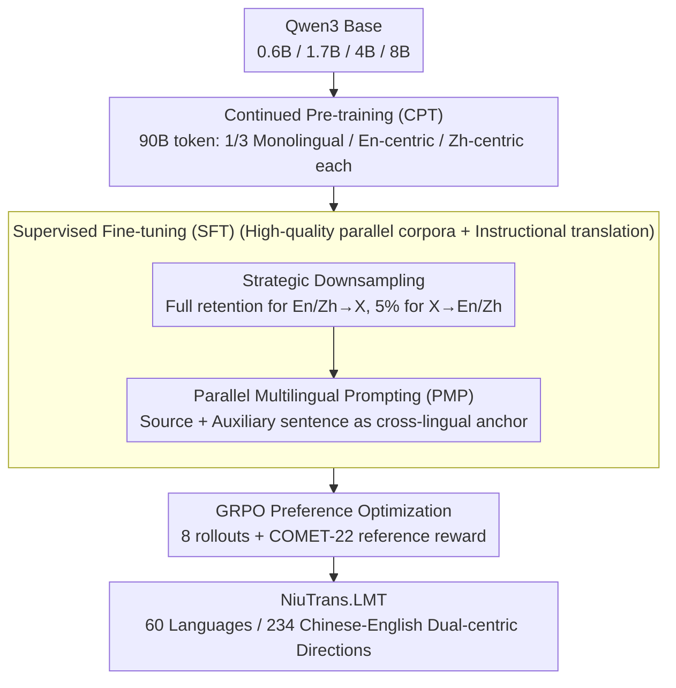

# NiuTrans.LMT: Toward Inclusive and Scalable Multilingual Machine Translation with LLMs

**Conference**: ACL 2026  
**arXiv**: [2511.07003](https://arxiv.org/abs/2511.07003)  
**Code**: <https://github.com/NiuTrans/LMT>  
**Area**: Machine Translation / Multilingual / LLM Adaptation  
**Keywords**: Multilingual Machine Translation, Directional Degeneration, Strategic Downsampling, Parallel Multilingual Prompting, GRPO

## TL;DR
This paper introduces NiuTrans.LMT, an open-source LLM machine translation suite covering 60 languages and 234 Chinese-English dual-centric translation directions across four scales (0.6B/1.7B/4B/8B). It identifies that multi-way parallel data causes X→Zh/En directional degeneration in symmetric SFT and restores quality to the level of strong open-source MMT systems using Strategic Downsampling, Parallel Multilingual Prompting, and GRPO with COMET rewards.

## Background & Motivation

**Background**: LLM machine translation has shifted from "training independent encoder-decoder MT models" to "CPT + SFT + preference optimization on general base LLMs." Systems like ALMA, TowerInstruct, X-ALMA, GemmaX2, Hunyuan-MT, and Seed-X have proven this effective. However, most systems either have limited language coverage, are primarily English-centric, or fail to adequately address bidirectional quality for long-tail languages beyond Chinese and English.

**Limitations of Prior Work**: Multilingual SFT ideally utilizes high-quality human parallel corpora, which are extremely scarce for low-resource languages. Consequently, multi-way corpora like FLORES-200 and NTREX-128 are repeatedly reused. Intuitively, multi-way corpora can construct many directions from a small set of sentences; the problem is that when the same English or Chinese sentence is repeatedly mapped as a target by dozens of source languages, the model may learn a shortcut to "memorize the target sentence" upon seeing certain training patterns, rather than processing the source semantics.

**Key Challenge**: On one hand, multi-way parallel data is the most reliable source of high-quality supervision for long-tail languages. On the other hand, symmetric reuse creates massive many-to-one target duplication. While the model benefits when generating multiple target languages in the pivot→X direction, it exhibits fluent but unfaithful hallucinations in the X→pivot direction, termed "Directional Degeneration" in this paper.

**Goal**: The authors aim to simultaneously address three issues: (i) explain why large-scale multilingual SFT collapses in the reverse direction; (ii) fix this issue without relying on additional SFT data; and (iii) train and release a Chinese-English dual-centric multilingual translation model family covering a wide range of parameters and languages.

**Key Insight**: The paper attributes the problem to data utilization rather than complex architectures: the same pivot target is symmetrically reused too many times, causing source semantics to be overridden by shortcuts. This perspective is practical because if the root cause lies in data distribution, a simple sampling strategy may be more stable and cost-effective than model-level interventions.

**Core Idea**: Strategic Downsampling is used to break many-to-one target repetition by "retaining a small portion of reverse data while keeping forward data intact." Furthermore, Parallel Multilingual Prompting with auxiliary parallel sentences explicitly provides cross-lingual semantic anchors. Both are integrated into a complete LMT training pipeline involving 90B-token CPT, high-quality SFT, and GRPO.

## Method

### Overall Architecture
LMT uses Qwen3 as the base to train four models (0.6B, 1.7B, 4B, 8B), covering English ↔ 59 languages and Chinese ↔ 58 languages, totaling 234 directions. The pipeline consists of three stages: the first is Continued Pre-training (CPT) using a 90B token mix of monolingual, English-centric bilingual, and Chinese-centric bilingual data (one-third each); the second is SFT, involving instruction-style translation supervision on high-quality corpora like FLORES/NTREX/SMol/WMT/IWSLT, incorporating SD and PMP; the third is GRPO, which samples multiple candidate translations using the same SFT prompts and performs preference optimization using COMET-22 as a reference-based reward without additional human preference data.

### Key Designs

**1. Directional Degeneration Diagnosis & Strategic Downsampling: Identifying the collapse in reverse directions caused by symmetric multi-way data reuse and applying sampling to mitigate it.**

The authors initially performed standard bidirectional SFT with Qwen3-4B-Base and encountered a counter-intuitive phenomenon: while En/Zh→X improved significantly, X→En/Zh performance dropped below the base model. The error patterns were grammatically correct but factually unfaithful—this is "Directional Degeneration." The cause is that when multi-way corpora are reused symmetrically, the same pivot target sentence is mapped by dozens of source languages, leading the model to memorize the target sentence rather than reading source semantics. To verify this, the authors conducted controlled experiments: replacing reverse data with non-overlapping bilingual CPT subsets, gradually increasing the retention rate of multi-way reverse samples from 0% to 100%, and reproducing this across Qwen3 scales, Llama-3.1-8B, Gemma-2-9B, and varied language counts. Performance followed an inverted V-shape, peaking at approximately $p=5\%$, with the heaviest collapse occurring at 100% symmetric reuse.

Strategic Downsampling is thus straightforward: all En/Zh→X samples are retained, while X→En/Zh samples in multi-way corpora are independently sampled at $p=5\%$. Compared to model-level modifications like direction-aware training or model merging, SD is a pure data-level fix—it requires no architectural changes, adds no inference overhead, and does not sacrifice pivot→X supervision density, yet it addresses the specific cause of the "curse of multilinguality."

**2. Parallel Multilingual Prompting (PMP): Using an auxiliary parallel sentence to provide an additional linguistic perspective as a semantic anchor.**

Multi-way data carries cross-lingual alignment value beyond many-to-one risks; the key is how to leverage it explicitly. Standard translation prompts learn $P_\theta(T\mid S;\tau_{L_S\to L_T})$; PMP expands input to include source $S$ and an auxiliary language sentence $A$, learning $P_\theta(T\mid S,A;\tau_{L_S\to L_A\to L_T})$. The auxiliary language is not random: for En↔X, a language linguistically close to X that the model handles well is chosen (e.g., Dutch for German, Czech for Polish); for Zh↔X, English is used as a stable semantic anchor since it is usually the model's strongest intermediate language.

PMP's ingenuity lies in transforming "multi-way parallelism" from an implicit data structure into an explicit prompt condition. During SFT, Standard Prompting (STP) and PMP are mixed. Default inference can still use STP, but can switch to PMP if external or self-generated auxiliary translations are available. Consequently, the model learns "when to use another linguistic perspective" rather than blindly expanding all directions symmetrically. It also provides LMT with a test-time enhancement interface—capable of integrating external high-quality MT, retrieved translation memories, or self-generated English anchors.

**3. Scalable Chinese-English Dual-centric Training Pipeline: Integrating two strategies into a deployable, comparable, and comprehensive recipe for long-tail languages.**

Low-resource translation requires more than prompt tricks; the real bottlenecks are data scale, quality, directional balance, and training stage transition. LMT engineering scales the entire pipeline. CPT data is collected from SlimPajama, Skywork, CulturaX, OpenDataLab, Wikimedia, and OPUS, with pseudo-parallel expansion using open-source MT to fill Chinese-centric gaps. The filter chain includes OpusFilter for length/mismatch, FastText LID thresholds, and CometKiwi scoring, resulting in ~2.1B English-centric and ~2.9B Chinese-centric pairs. SFT uses ~567K high-quality pairs across 117 pivot pairs, with 50% STP/PMP for forward directions and a 5% total retention for reverse directions after SD.

The final stage is GRPO: using SFT prompts, 8 rollouts per prompt are sampled with temperature 1.0 and KL coefficient 0.001. COMET-22 serves as a reference-based reward to select better translations without creating manual preference data. Training across four sizes proves the strategy is independent of specific model scales and provides a reusable data/prompt recipe.

### Loss & Training
Both CPT and SFT use standard language modeling objectives. CPT focuses on multilingual text and bilingual formats, while SFT only calculates loss on the target translation. Forward SFT directions use 50% STP + 50% PMP; reverse directions use 5% total retention (2.5% STP, 2.5% PMP) after SD. The GRPO stage uses SFT prompts for candidate sampling, with COMET-22 providing rewards based on references. This effectively converts an automatic MT evaluator into a preference optimization signal, yielding an additional 0.3-0.8 COMET improvement.

## Key Experimental Results

### Main Results
Table 1 shows COMET-22 scores as components are added, highlighting the 4B model's performance. Standard SFT yields huge gains in low-resource En/Zh→X but causes a total collapse in X→Zh. Adding SD immediately restores and surpasses base performance in reverse directions, while CPT provides the largest gains for low-resource directions.

| 4B Config | High-res X→Zh | Med-res X→Zh | Low-res X→Zh | Low-res En→X | Low-res Zh→X |
| :--- | :---: | :---: | :---: | :---: | :---: |
| Qwen3-4B-Base | 85.44 | 84.55 | 75.35 | 56.81 | 53.33 |
| SFT | 73.60 | 72.18 | 67.94 | 77.51 | 73.68 |
| + SD | 86.55 | 85.87 | 79.13 | 78.68 | 75.15 |
| + CPT | 87.39 | 87.06 | 84.74 | 87.14 | 84.17 |
| + PMP | 87.53 | 87.20 | 84.90 | 87.06 | 84.08 |
| + GRPO | **88.19** | **87.97** | **85.81** | **87.85** | **84.92** |

Table 2 compares LMT with existing MMT/LLM systems on overlapping language averages. LMT-60-4B often matches or exceeds 7B-54B systems, and the 8B model offers only marginal gains over 4B, demonstrating high parameter efficiency.

| Comparison System | Overlap Langs | Baseline Avg. | LMT-60-4B Avg. | LMT-60-8B Avg. | Conclusion |
| :--- | :---: | :---: | :---: | :---: | :--- |
| TowerInstruct-13B | 10 | 87.63 | 88.34 | **88.43** | LMT small model beats 13B |
| Aya-expanse-8B | 23 | 87.36 | 88.26 | **88.36** | LMT leads consistently |
| Seed-X-PPO-7B | 27 | **89.07** | 88.86 | 88.94 | LMT close to strong PPO system |
| GemmaX2-28-9B | 28 | 87.57 | 87.73 | **87.83** | LMT leads slightly/broader cover |
| Hunyuan-MT-7B | 35 | 85.71 | 87.50 | **87.63** | LMT significantly ahead |
| X-ALMA-13B | 40 | 88.92 | 88.96 | **89.06** | LMT 4B is roughly equal |
| Aya-101-13B | 54 | 83.85 | 87.42 | **87.55** | Strong long-tail advantage |
| NLLB-54B | 59 | 84.79 | 87.43 | **87.56** | LMT 4B leads 54B model |

### Ablation Study

| Analysis Target | Setup | Key Result | Description |
| :--- | :--- | :--- | :--- |
| Directional Degeneration | Reverse multi-way retention 0% to 100% | Peaks at $p=5\%$; sharp drop at 100% | More reverse samples aren't better; excessive repetition induces shortcuts |
| Symmetry-breaking | Replace X→En/Zh with non-overlapping bilingual CPT | Collapse avoided in dashed setup | Degradation stems from reuse structure, not translation difficulty |
| PMP inference | DT vs PMP-S vs PMP-O | Self-generated anchors match/beat oracle on X→En/Zh | Higher noise tolerance when translating to pivot; anchor quality vital for En→X |
| PMP zero-shot | In-Group directions w/ vs w/o PMP | COMET increases 85.20 to 86.11 | PMP improves cross-lingual transfer, not just explicit pairs |
| GRPO | Reuse SFT pairs, no new preference data | ~0.3-0.8 COMET gain across tiers | Automatic rewards extract extra quality from candidate generation |

### Key Findings
- **Directional Degeneration is a systemic issue**: Similar asymmetric degradation appears across Qwen3 scales, Llama-3.1-8B, and Gemma-2-9B, proving it is not isolated to one base model or language pair.
- **SD provides concentrated yet critical benefits**: It maintains supervision density for En/Zh→X while pulling the most affected X→Zh directions from 67-73 COMET up to 79-87, acting as a "hemostatic valve."
- **CPT is vital for low-resource languages**: Low-resource En→X improves from 78.68 to 87.14 with CPT, indicating base LLMs lack sufficient raw low-resource knowledge; SFT only teaches format, whereas CPT builds linguistic capability.
- **PMP provides transferability rather than direct gain**: PMP's direct improvement in the main table is small; its value lies in X→En/Zh and zero-shot transfer, functioning as a capability switch for auxiliary anchors.
- **Document-level translation remains a weakness**: While LMT is competitive on WMT24++, it lags behind Hunyuan-MT in some subsets. Sentence-level SFT lacks discourse signals, affecting cross-sentence consistency.

## Highlights & Insights
- **Defining the "Curse of Multilinguality" as a data reuse pathology**: The paper's value lies in diagnosing that symmetric multi-way SFT creates many-to-one target repetition. This diagnosis can guide other multilingual tasks like cross-lingual summarization or QA.
- **SD as a high-ROI engineering strategy**: Instead of complex model structures or MoE for reverse direction collapse, this work shows that addressing data directional ratios is more effective. The $5\%$ retention rate provides a strong default for future work.
- **PMP as a controllable inference interface**: By teaching the model to use auxiliary parallel sentences, LMT can integrate external MT or translation memories during inference. This makes LMT a dynamic system with test-time enhancement capabilities.
- **Chinese-English dual-centricity is practical**: While many MMT models handle English directions well, gaps in Chinese-centric directions are common. LMT specifically addresses Zh↔X with targeted pseudo-parallel expansion, meeting the needs of Chinese and Asian language communities.

## Limitations & Future Work
- Evaluation primarily relies on FLORES-200 and COMET-22. While broad, sentence-level benchmarks do not fully capture domain shift, terminology consistency, or document-level coherence.
- Chinese-English-centric is a step beyond English-only but is not a truly multi-centric architecture. Regional hubs like Arabic, Spanish, or Hindi may require tri-centric or general multi-centric designs.
- While 60 languages are significant for LLM-MT, it represents a fraction of global diversity. Extremely low-resource languages suffer from poor LID/QE calibration and evaluation difficulties.
- PMP test-time effectiveness depends on anchor quality; self-generated anchors in Zh→X may be unreliable. Real-world deployment may need confidence gating or external MT.
- GRPO uses COMET-22, which may inherit biases against low-resource or non-English-centric directions. Future work should consider multi-metric rewards or human preference calibration.

## Related Work & Insights
- **vs NLLB / M2M-100**: Conventional encoder-decoder MMT models like NLLB are broad but lack the LLM instruction interface. LMT's 4B/8B models outperform NLLB-54B in average COMET across overlapping languages.
- **vs ALMA / TowerInstruct / X-ALMA**: These show LLM post-training yields high-quality MT but are more English-centric. LMT systematically studies directional degeneration across 60 languages and 234 directions.
- **vs GemmaX2 / Hunyuan-MT / Seed-X**: LMT matches Seed-X-PPO and outperforms most GemmaX2/Hunyuan-MT configurations. Crucially, it provides a reusable recipe (SD/PMP) rather than just reporting results.
- **vs Multi-way / Auxiliary Prompt Research**: Previous work demonstrated benefits in CPT or inference. This work moves it to SFT, warning against symmetric expansion while using PMP to incorporate auxiliary sentences into trainable behavior.

## Rating
- Novelty: ⭐⭐⭐⭐ The data-level attribution of Directional Degeneration and SD are insightful; PMP is simple but effective as an SFT+inference interface.
- Experimental Thoroughness: ⭐⭐⭐⭐⭐ Solid evidence across 4 scales, 60 languages, 234 directions, multiple benchmarks, and detailed ablation of failure modes.
- Writing Quality: ⭐⭐⭐⭐ Clear progression from failure mode to mitigation; however, the high density of tables and appendix cross-referencing requires careful reading.
- Value: ⭐⭐⭐⭐⭐ Highly practical for the open-source MMT community, providing both models and a recipe for Chinese-centric and low-resource directions.

<!-- RELATED:START -->

## Related Papers

- [\[ACL 2026\] Alexandria: A Multi-Domain Dialectal Arabic Machine Translation Dataset for Culturally Inclusive and Linguistically Diverse LLMs](alexandria_a_multi-domain_dialectal_arabic_machine_translation_dataset_for_cultu.md)
- [\[ACL 2026\] Evaluating the Impact of Verbal Multiword Expressions on Machine Translation](evaluating_the_impact_of_verbal_multiword_expressions_on_machine_translation.md)
- [\[ACL 2026\] CLewR: Curriculum Learning with Restarts for Machine Translation Preference Learning](clewr_curriculum_learning_with_restarts_for_machine_translation_preference_learn.md)
- [\[ACL 2026\] LQM: Linguistically Motivated Multidimensional Quality Metrics for Machine Translation](lqm_linguistically_motivated_multidimensional_quality_metrics_for_machine_transl.md)
- [\[ACL 2026\] Language on Demand, Knowledge at Core: Composing LLMs with Encoder-Decoder Translation Models for Extensible Multilinguality](language_on_demand_knowledge_at_core_composing_llms_with_encoder-decoder_transla.md)

<!-- RELATED:END -->
