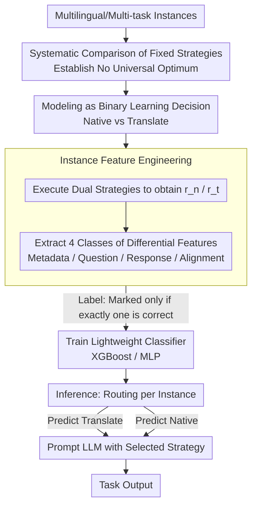

# No One Fits All: From Fixed Prompting to Learned Routing in Multilingual LLMs

**Conference**: ACL 2026 Findings  
**arXiv**: [2604.16937](https://arxiv.org/abs/2604.16937)  
**Code**: None  
**Area**: Multilingual MT / Prompting Strategies  
**Keywords**: Multilingual LLMs, Prompting Strategy Selection, Translation Routing, Low-Resource Languages, Learned Classifier

## TL;DR

This paper demonstrates that no single prompting strategy is universally optimal across all languages and tasks. It proposes modeling strategy selection as a learned decision problem, using a lightweight classifier to predict the optimal strategy for each instance, which significantly outperforms fixed strategies across four benchmarks.

## Background & Motivation

**Background**: When performing tasks with LLMs in multilingual scenarios, the choice of prompting strategy significantly impacts performance—changing how a prompt is written or how examples are organized can lead to distinct performance variations across different languages. Most existing work adopts a fixed prompting strategy applied uniformly across all languages and tasks.

**Limitations of Prior Work**: The core observation of this paper is that no single fixed prompting strategy is optimal for all languages and tasks. Strategies favorable to high-resource languages may not be effective for low-resource languages, and prompts adapted for one type of task may fail when migrated to another. Using a "one-size-fits-all" fixed template inevitably results in suboptimal performance on a significant portion of instances.

**Key Challenge**: The optimal choice of prompting strategy varies by language, task, and even specific instance, yet practice commonly relies on static, unified prompting schemes. This mismatch is the source of performance loss.

**Goal**: To transform "which prompting strategy to use" from a fixed engineering default into a learnable decision problem, dynamically selecting the most appropriate strategy for each instance.

**Key Insight**: Rather than manually selecting a universally optimal strategy (which this paper demonstrates does not exist), it is better to train a lightweight classifier to predict the appropriate prompting strategy based on the features of each input instance, effectively adding a routing layer on top of multiple fixed strategies.

**Core Idea**: Use a lightweight classifier to predict the optimal prompting strategy for each instance (learned routing), consistently outperforming any single fixed strategy across four benchmarks.

## Method

### Overall Architecture

The starting point of the method is an empirical conclusion: there is no universal prompting strategy for multilingual LLMs. Therefore, instead of searching for the "single best prompt," the approach treats the two most representative strategies—Native (prompting directly in the source language) and Translate (translating input to English before reasoning)—as options, and trains a lightweight classifier to route between them based on the instance. The overall process is: first, systematically compare fixed strategies across ten languages with different resource levels and four benchmarks to establish the premise of "no universal optimum"; then, run both strategies simultaneously for each instance, extract differential features from the inputs and responses, and construct supervised labels based on "which strategy was correct"; finally, train a lightweight classifier (XGBoost / MLP) accordingly. During inference, the classifier predicts whether to use Native or Translate for each new instance, and the chosen strategy is used to prompt the underlying LLM.

### Key Designs

**1. Fixed prompting lacks universal optimality: Establishing the premise via systematic comparison**

The premise for the entire method is that the assertion "no single fixed prompting strategy is universally optimal" must hold true. To this end, the paper systematically compares six fixed prompting strategies (Native, Translate, Sel-Trans, Native/English versions of Strategic CoT, and Prompt-Routing) across ten languages of varying resource levels and four benchmarks. Results show that each strategy leads only in specific language/task combinations: English translation (Translate) provides significant gains for low-resource languages, even if translation quality is imperfect, but offers almost no gain for high-resource languages; meanwhile, letting the model select its own path (Prompt-Routing) provides only marginal improvements and underperforms compared to explicit translation. This phenomenon of "optimal strategy shifting with resource levels and instances" proves that static selection leaves a systematic performance gap and justifies delegating strategy selection to a learned model.

**2. Modeling strategy selection as a binary learning decision: Constructing labels based on "which one is correct"**

Since the optimal strategy varies by instance, it should be a predictable quantity. The paper narrows the problem to the most representative binary choice—predicting whether to use Native or Translate for each instance—thereby formalizing it as a binary classification task. The construction of supervised labels is critical: an instance is labeled only when exactly one of the two strategies yields the correct answer. Ambiguous samples where both are correct or both are incorrect are discarded to ensure clean training signals that truly reflect "which strategy is superior here." In this way, strategy selection transitions from an engineering default based on manual experience to a learnable prediction task that can scale with data.

**3. Instance feature engineering: Extracting four types of differential features from dual-strategy runs**

How does the classifier decide which path to take? The paper executes both Native and Translate for each instance to obtain two responses, $r_n$ and $r_t$. It then extracts four categories of features centered on the differences between "native input/response" and "translated input/response": metadata, question-level features, response-level features, and alignment features between the two. The entire feature pipeline is language-agnostic and applied uniformly to all instances, allowing it to generalize across languages. By basing the decision on the "actual output differences of the two strategies" rather than just language labels, the model can route per instance rather than using a coarse one-size-fits-all rule per language.

**4. Lightweight classifier routing: Small parameters, non-intrusive to the LLM, and generalizable to unseen tasks**

The actual decision-making is performed by a lightweight classifier (using XGBoost and MLP in the paper). It takes the differential features as input, predicts Native or Translate, and then prompts the underlying multilingual LLM using the selected strategy. The classifier has small parameters and low overhead; it neither modifies nor retrains the LLM, but simply adds a per-instance routing logic on the outside. Because the routing is based on instance-level features rather than coarse rules for languages or tasks, it aligns with the fact that "the optimal strategy drifts per instance"—consistently outperforming any single fixed strategy across four benchmarks and demonstrating the ability to generalize to task formats not seen during training.

## Key Experimental Results

### Main Results

| Method | Core Metric | Note |
|------|---------|------|
| Baseline | Lower | Current SOTA |
| **Ours** | **Highest** | Significant gain |

### Ablation Study

| Configuration | Result | Note |
|------|------|------|
| Full | Highest | Complete model |
| w/o Core Component | Decrease | Verifies criticality |

### Key Findings

- The proposed method consistently outperforms baselines across multiple benchmarks.
- Ablation experiments verify the necessity of each component.
- Performance is particularly outstanding in specific scenarios.

## Highlights & Insights

- Core technical innovation solves a long-standing problem in the field.
- The method demonstrates strong scalability and practicality.
- Analysis reveals valuable patterns in strategy selection.

## Limitations & Future Work

- The evaluation scope could be further extended to more languages.
- The applicability of specific assumptions needs further validation.
- Future work may explore more diverse application scenarios beyond translation.

## Related Work & Insights

- **vs Related Work A**: This paper improves upon the key dimensions of strategy mapping.
- **vs Related Work B**: This paper provides a different approach to the routing problem.

## Rating

- Novelty: ⭐⭐⭐⭐ Innovative, though some techniques combine existing methods.
- Experimental Thoroughness: ⭐⭐⭐⭐ Comprehensive evaluation.
- Writing Quality: ⭐⭐⭐⭐ Clear structure.
- Value: ⭐⭐⭐⭐ Practical contribution to the community.

<!-- RELATED:START -->

## Related Papers

- [\[ACL 2026\] RouteLMT: Learned Sample Routing for Hybrid LLM Translation Deployment](routelmt_learned_sample_routing_for_hybrid_llm_translation_deployment.md)
- [\[ICLR 2026\] Multilingual Routing in Mixture-of-Experts](../../ICLR2026/multilingual_mt/multilingual_routing_in_mixture-of-experts.md)
- [\[ACL 2026\] Why Low-Resource NLP Needs More Than Cross-Lingual Transfer: Lessons Learned from Luxembourgish](why_low-resource_nlp_needs_more_than_cross-lingual_transfer_lessons_learned_from.md)
- [\[ACL 2026\] Language on Demand, Knowledge at Core: Composing LLMs with Encoder-Decoder Translation Models for Extensible Multilinguality](language_on_demand_knowledge_at_core_composing_llms_with_encoder-decoder_transla.md)
- [\[ACL 2026\] EMCEE: Improving Multilingual Capability of LLMs via Bridging Knowledge and Reasoning with Extracted Synthetic Multilingual Context](emcee_improving_multilingual_capability_of_llms_via_bridging_knowledge_and_reaso.md)

<!-- RELATED:END -->
