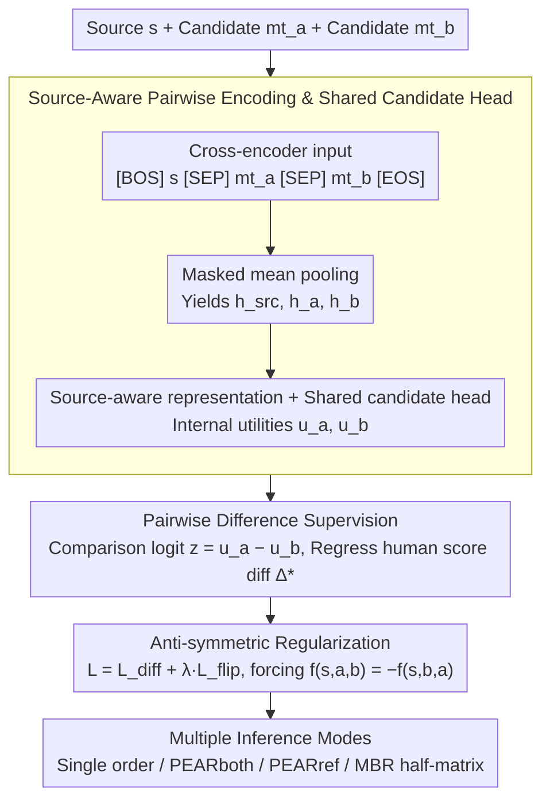

# PEAR: Pairwise Evaluation for Automatic Relative Scoring in Machine Translation

**Conference**: ACL2026  
**arXiv**: [2601.18006](https://arxiv.org/abs/2601.18006)  
**Code**: https://github.com/prosho-97/pear  
**Area**: Machine Translation Evaluation / Quality Estimation  
**Keywords**: Pairwise Evaluation, Machine Translation, Quality Estimation, MQM, MBR Decoding

## TL;DR
PEAR shifts reference-free Machine Translation Quality Estimation (QE) from "assigning absolute scores to individual translations" to "directly comparing the relative differences between two candidate translations." In the WMT24 MQM evaluation, it outperforms matched single-candidate QE baselines and certain large-scale metrics while using a smaller model.

## Background & Motivation
**Background**: Machine translation systems typically rely on automatic metrics for system selection, model tuning, and candidate ranking. Most traditional learned metrics or QE metrics take a source sentence, an optional reference translation, and a single candidate translation as input to output an absolute quality score, then compare two systems by subtracting their respective scores.

**Limitations of Prior Work**: As the quality of modern MT systems has reached high levels, differences between strong systems are often subtle. Single-candidate scoring requires the model to estimate absolute quality in an isolated context, and the errors from two independent predictions are compounded when calculating the difference. Existing binary ranking methods, while directly comparing two translations, usually only provide "which is better" without expressing the strength of the preference, and they often assume no ties exist by default.

**Key Challenge**: The actual use case for MT evaluation is highly comparative, yet mainstream supervision signals and model architectures remain biased toward single-sample regression. Human relative judgments are generally more stable than absolute scores, whereas automatic metrics often force the comparison problem back into the difference between two absolute scores.

**Goal**: The authors aim to construct a reference-free pairwise QE metric that simultaneously predicts both the direction and magnitude of preference, while maintaining efficiency and stability in system-level evaluation, segment-level non-tie comparison, reference-anchored evaluation, and MBR decoding.

**Key Insight**: The paper transforms segment-level scores, such as human MQM, into pairwise difference supervision, allowing the model to directly learn $s_h(s,mt_a)-s_h(s,mt_b)$. Consequently, the output naturally corresponds to comparison tasks without the need to first learn an absolute quality scale.

**Core Idea**: Replace the subtraction of two single-candidate absolute scores with pairwise relative regression within a shared context, and use order-reversal regularization to encourage the model toward anti-symmetric scoring.

## Method
The key to PEAR is not simply switching to a larger backbone, but rather redesigning the supervision target, input format, and inference interface of MT evaluation for relative comparison. It receives a single source sentence and two candidate translations, outputting a signed real number: a positive value indicates the first candidate is better, a negative value indicates the second is better, and the absolute magnitude represents the perceived gap in quality.

### Overall Architecture
The overall process consists of four steps. First, the source sentence and two candidate translations are concatenated as a cross-encoder input, allowing the model to observe both candidates within the same context. Second, masked mean pooling is applied to the source and the two candidates separately to obtain representations for each. Third, a shared candidate scoring head generates internal utilities for both candidates, which are then subtracted to produce the comparison logit. Finally, the model is trained on human score differences with an additional regularization term for candidate order reversal.

The training data is sourced from WMT human evaluations. The first stage uses DA and DA+SQM judgments from WMT16 to WMT23 for broad-coverage pre-training. The second stage utilizes WMT20 to WMT23 MQM data for supervised fine-tuning, including IndicMT Eval MQM. The appendix reports the data scale: approximately 7M translation pairs covering 51 language directions for the first stage, and roughly 6M pairs covering 10 language directions for the second stage; the KD version uses an additional 2M MQM-style labels distilled from GPT-4.1-mini.

### Key Designs
**1. Pairwise Difference Supervision: Modeling relative differences directly between candidates rather than subtracting two absolute scores.**

The real-world applications of MT evaluation—such as system comparison, candidate ranking, and MBR utility—are inherently relative tasks. However, mainstream supervision signals force models to estimate absolute quality in isolation, introducing independent prediction errors into the final difference. PEAR bypasses this by letting the model learn relative differences directly: for source $s$ and candidates $mt_a, mt_b$, it predicts $\hat{\Delta}_{ab}=f_\theta(s,mt_a,mt_b)$, where the supervision target is constructed from human segment-level scores as $\Delta^*_{ab}=s_h(s,mt_a)-s_h(s,mt_b)$. This output naturally aligns with comparison tasks, avoids the need for an absolute scale, and retains fine-grained preference markers near ties.

**2. Source-Aware Pairwise Encoding and Shared Candidate Head: Comparing translations in the same context and using identical parameters to prevent scale drift.**

For relative comparison, both candidates must be evaluated against the same standard; otherwise, independent scoring drifts make differences unreliable. PEAR concatenates the input into a cross-encoder sequence $[BOS]\ s\ [SEP]\ mt_a\ [SEP]\ mt_b\ [EOS]$ to observe both candidates simultaneously. It then performs masked mean pooling for the source, candidate A, and candidate B to obtain $h_{src}, h_a, h_b$. Each candidate forms a source-aware representation such as $[h_k; h_k \odot h_{src}; |h_k - h_{src}|]$, which passes through shared projections and an FFN to obtain internal utilities $u_a, u_b$. The final comparison logit is $z = u_a - u_b$. The shared head ensures both candidates use the same parameters and internal scale, while the explicit subtraction anchors the output to a comparison rather than an absolute score.

**3. Anti-symmetric Regularization and Multiple Inference Modes: Flipping candidate order flips the prediction sign, while reducing pairwise computation by half.**

An ideal comparison function should satisfy $f(s,a,b)=-f(s,b,a)$, but pure regression does not guarantee this. PEAR adds a flip regularization term to the Huber difference loss: $\mathcal{L}=\mathcal{L}_{diff}+\lambda_{flip}\mathcal{L}_{flip}$, where $\mathcal{L}_{flip}=(\hat{\Delta}_{ab}+\hat{\Delta}_{ba})^2$, forcing the model toward anti-symmetric scoring. This constraint improves consistency and enables flexible inference: one can run a single order for speed, use PEARboth $\frac{1}{2}(\hat{\Delta}_{ab}-\hat{\Delta}_{ba})$ for stability, or utilize PEARref with a reference as a fixed anchor. In MBR decoding, anti-symmetry means the $N \times N$ utility matrix only needs half its entries calculated, with the other half filled by sign flipping.

### Loss & Training
PEAR uses Huber loss to regress human quality differences; the appendix shows that Huber provides small but stable gains in SPA, segment-level accuracy, and Avg Corr compared to MSE. Models include the InfoXLM Large-based PEAR version (~560M parameters) and the XLM-RoBERTa-XL-based PEAR-XL version (~3.5.B parameters). The KD version incorporates MQM labels distilled from GPT-4.1-mini in the second stage to test if the pairwise framework remains superior to single-candidate QE under additional supervision.

## Key Experimental Results

### Main Results

| Setting | Model | Parameters | SPA | acc*eq | Avg Corr | Conclusion |
|---------|-------|------------|-----|--------|----------|------------|
| Matched Single-QE | Single-QE | 560M | 80.0 | 57.2 | 68.6 | Baseline with same backbone absolute scoring |
| Pairwise QE | PEAR | 560M | 80.9 | 57.9 | 69.4 | Improvements from relative modeling |
| Matched Single-QE + KD | Single-QE-KD | 560M | 80.6 | 57.4 | 69.0 | Still lower than PEAR-KD after distillation |
| Pairwise QE + KD | PEAR-KD | 560M | 81.8 | 58.2 | 70.0 | Small model achieves higher average correlation |
| Matched Single-QE-XL + KD | Single-QE-XL-KD| 3.5B | 80.9 | 57.9 | 69.4 | Large backbone single-candidate baseline |
| Pairwise QE-XL + KD | PEAR-XL-KD | 3.5B | 82.0 | 58.2 | 70.1 | Pairwise framework remains effective for large models |

### Ablation Study

| Analysis Item | Config A | Config B | Key Metric | Description |
|---------------|----------|----------|------------|-------------|
| Pairwise Accuracy (Non-tie) | MT-RANKER-XXL 5.7B | PEAR-KD 560M | Avg Pair Acc: 65.8 vs 68.9 | PEAR is more accurate on WMT24 MQM pairs (no ties) despite fewer parameters |
| Anti-symmetric Regularization | $\lambda_{flip}=0$ | $\lambda_{flip}=0.1$ | $\rho_{as}$: 0.196→0.014; $\rho_{tr}$: 0.561→0.189 | Regularization significantly reduces anti-symmetric and transitivity bias |
| Regression Loss | MSE | Huber | Avg Corr: 69.1→69.4 | Huber is more robust for heavy-tailed differences |
| MBR utility | COMET-22 / BLEURT-20 | PEAR full / PEAR sym. | En-De XCOMET-XL: 0.844/0.842 vs 0.855/0.854 | PEAR suffers almost no quality loss using anti-symmetric matrix approximation |

### Key Findings
- Under strictly matched training data, backbones, and hyperparameters, PEAR consistently outperforms Single-QE, indicating gains stem from pairwise relative modeling rather than parameter count or data differences.
- PEAR-XLboth achieves an Avg Corr of 70.2 on WMT24, surpassing MetricX-24-Hybrid-QE-XL (69.9) and XCOMET-QE (69.5); PEARboth 560M also reaches 70.1, significantly higher than CometKiwi 560M (64.0).
- The anchor in PEARref does not have to be a human reference. Replacing the anchor with multiple MT outputs maintains stable rankings, suggesting the reference-anchored mode is more of a computational technique than a dependency on reference quality.
- PEAR shows lower segment-level difference correlation with other strong metrics (e.g., ~0.71 with MetricX-24-Hybrid-QE on En-De, ~0.51 on En-Es, ~0.26 on Ja-Zh), suggesting it provides distinct evaluation signals.

## Highlights & Insights
- PEAR aligns "how metrics are used" with "how metrics are trained." A common issue in MT research is comparing two systems rather than assigning an absolute score to one; this paper addresses that misalignment directly.
- Anti-symmetric constraints are a small but highly practical design. They improve the consistency of the comparison function and directly lead to computational savings in MBR decoding.
- The controlled experiments are rigorous. By using the same backbone, training data, and hyperparameters for Single-QE and PEAR, the utility of the "pairwise formulation" is directly verifiable.
- PEAR is not just an evaluation metric; it also serves as a decoding utility. Relative scoring is naturally suited for candidate-to-candidate comparison, offering more consistency than adapting reference-based metrics for MBR.

## Limitations & Future Work
- The authors did not test PEAR checkpoints beyond 3.5B, leaving it unclear whether the pairwise framework continues to increase gains, saturates, or is overshadowed by model capacity at larger scales.
- PEAR currently outputs a scalar relative score and cannot pinpoint specific error spans; the authors mention extending this to MQM sequence tagging for better interpretability in side-by-side evaluations.
- Full pairwise system comparison still incurs $N(N-1)/2$ costs when the number of systems is large. While PEARref and MBR anti-symmetric approximations mitigate this, different scenarios still require balancing accuracy and computation.
- The low correlation between PEAR and other metrics is both a strength and an open question. Further analysis is needed to understand which translation phenomena PEAR captures and whether it is biased toward specific language pairs or error types.

## Related Work & Insights
- **vs COMET / BLEURT / MetricX / XCOMET**: These metrics typically output absolute scores for single candidates and compare via score differences. PEAR predicts relative differences directly, making it more native to comparison tasks, though its output interpretability is still lower than MQM span-level annotations.
- **vs MT-RANKER**: MT-RANKER uses two candidates as input for binary preference classification, failing to represent ties or preference strength. PEAR uses graded relative scoring, making it better suited for MQM differences, system-level averaging, and MBR utility.
- **vs COMET-poly**: COMET-poly leverages other candidate contexts to evaluate a single candidate during inference. PEAR simplifies this by targeting the comparison itself as the output.
- **Insight**: Many evaluation tasks in generative modeling become comparison problems during actual use (e.g., summarization, dialogue, code generation). PEAR's design suggests that rather than mapping all candidates to absolute scores, it may be more effective to learn "how much better candidate A is relative to candidate B."

## Rating
- Novelty: ⭐⭐⭐⭐ Pairwise MT QE is not entirely new, but the systemization of graded differences, anti-symmetric regularization, multiple inference modes, and MBR utility is very thorough.
- Experimental Thoroughness: ⭐⭐⭐⭐⭐ Includes matched baselines, WMT24 main evaluations, MT-RANKER comparisons, Huber/anti-symmetry ablations, correlation analysis, and MBR applications.
- Writing Quality: ⭐⭐⭐⭐ The logic is clear and controlled variables are well-handled; some dense tables require careful cross-referencing.
- Value: ⭐⭐⭐⭐⭐ Highly practical for MT evaluation and candidate selection, providing a direct template for pairwise metric design in other generative tasks.

<!-- RELATED:START -->

## Related Papers

- [\[ACL 2025\] AskQE: Question Answering as Automatic Evaluation for Machine Translation](../../ACL2025/multilingual_mt/askqe_question_answering_as_automatic_evaluation_for_machine_translation.md)
- [\[ACL 2026\] NeoAMT: Neologism-Aware Agentic Machine Translation with Reinforcement Learning](neoamt_neologism-aware_agentic_machine_translation_with_reinforcement_learning.md)
- [\[ACL 2026\] CLewR: Curriculum Learning with Restarts for Machine Translation Preference Learning](clewr_curriculum_learning_with_restarts_for_machine_translation_preference_learn.md)
- [\[ACL 2025\] M-MAD: Multidimensional Multi-Agent Debate for Advanced Machine Translation Evaluation](../../ACL2025/multilingual_mt/m-mad_multidimensional_multi-agent_debate_for_advanced_machine_translation_evalu.md)
- [\[ACL 2026\] Alexandria: A Multi-Domain Dialectal Arabic Machine Translation Dataset for Culturally Inclusive and Linguistically Diverse LLMs](alexandria_a_multi-domain_dialectal_arabic_machine_translation_dataset_for_cultu.md)

<!-- RELATED:END -->
