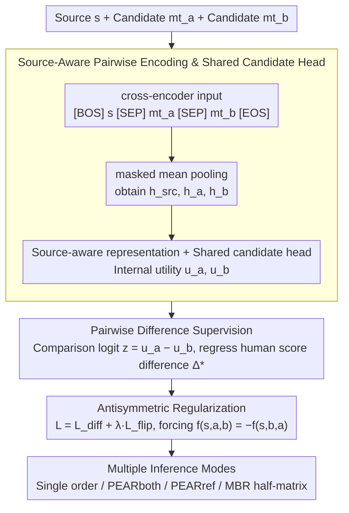

# PEAR: Pairwise Evaluation for Automatic Relative Scoring in Machine Translation

**Conference**: ACL2026  
**arXiv**: [2601.18006](https://arxiv.org/abs/2601.18006)  
**Code**: https://github.com/prosho-97/pear  
**Area**: Machine Translation Evaluation / Quality Estimation  
**Keywords**: Pairwise evaluation, Machine Translation, Quality Estimation, MQM, MBR decoding

## TL;DR
PEAR transforms reference-free MT quality estimation from "assigning absolute scores to single translations" to "directly comparing the relative differences between two candidate translations." It outperforms matched single-candidate QE baselines and some large-scale metrics in the WMT24 MQM evaluation with a smaller model size.

## Background & Motivation
**Background**: Machine translation systems usually rely on automatic metrics for system selection, model tuning, and candidate ranking. Most traditional learned metrics or QE metrics take a source sentence, an optional reference translation, and one candidate translation as input to output an absolute quality score, then compare systems by subtracting two scores.

**Limitations of Prior Work**: As modern MT system quality reaches high levels, differences between strong systems become subtle. Single-candidate scoring requires models to estimate absolute quality in isolated contexts, and the comparison carries errors from two independent predictions into the difference. Existing binary ranking methods provide "who is better" but cannot express preference intensity or handle ties.

**Key Challenge**: The practical use of MT evaluation is highly comparative, but mainstream supervision signals and model structures still favor single-sample regression. Human relative judgments are usually more stable than absolute scores, yet automatic metrics often loop the comparison problem back to the difference of two absolute scores.

**Goal**: The authors aim to construct a reference-free pairwise QE metric that predicts both preference direction and magnitude while maintaining efficiency and stability in system-level evaluation, segment-level comparison (including ties), reference-anchored evaluation, and MBR decoding.

**Key Insight**: The paper converts human segment-level scores (like MQM) into pairwise difference supervision, allowing the model to directly learn $s_h(s,mt_a)-s_h(s,mt_b)$. Thus, the output naturally corresponds to the comparison task without needing to learn an absolute score scale first.

**Core Idea**: Replace the subtraction of two single-candidate absolute scores with pairwise relative regression in a shared context, using order-flipping regularization to enforce antisymmetric scoring.

## Method
Key to PEAR is not a larger backbone, but the realignment of evaluation supervision targets, input formats, and inference interfaces towards relative comparison. It receives the same source sentence and two candidate translations, outputting a signed real number: positive indicates the first candidate is better, negative indicates the second is better, and the absolute value reflects the predicted gap.

### Overall Architecture
The process consists of four steps. First, the source sentence and two candidate translations are concatenated as cross-encoder input, allowing the model to observe both in the same context. Second, masked mean pooling is applied to the source and candidates to obtain representations. Third, a shared candidate scoring head generates internal utilities for both, which are subtracted to produce a comparison logit. Finally, the model is trained on human score differences with an order-flipping regularization term.

Training data comes from WMT human evaluations. Stage 1 uses DA and DA+SQM from WMT16 to WMT23 for broad pre-training. Stage 2 uses WMT20 to WMT23 MQM for fine-tuning, including IndicMT Eval MQM. The KD version utilizes 2M MQM-style labels distilled from GPT-4o-mini.

### Key Designs
**1. Pairwise Difference Supervision: Modeling relative differences directly between candidates rather than subtracting two absolute scores.**

Actual uses of MT evaluation (system comparison, candidate ranking, MBR utility) are relative tasks. Mainstream supervision, however, forces models to estimate absolute quality in isolation, carrying independent prediction errors into the final difference. PEAR lets the model learn relative differences directly: for source $s$ and candidates $mt_a, mt_b$, it predicts $\hat{\Delta}_{ab}=f_\theta(s,mt_a,mt_b)$, supervised by human segment-level score differences $\Delta^*_{ab}=s_h(s,mt_a)-s_h(s,mt_b)$. This output naturally fits comparison tasks and retains fine-grained preference strength near ties.

**2. Source-Aware Pairwise Encoding & Shared Candidate Head: Comparing translations in a unified context using shared parameters.**

To ensure reliable relative comparison, candidates must be measured against the same scale. PEAR concatenates input into a cross-encoder sequence $[BOS]\ s\ [SEP]\ mt_a\ [SEP]\ mt_b\ [EOS]$, observing both candidates simultaneously. Masked mean pooling yields $h_{src}, h_a, h_b$. Each candidate generates a source-aware representation $[h_k; h_k\odot h_{src}; |h_k-h_{src}|]$, followed by a shared projection and FFN to get internal utilities $u_a, u_b$, and a comparison logit $z=u_a-u_b$. This ensures consistent parameters and prevents scale drift.

**3. Antisymmetric Regularization & Multiple Inference Modes: Enforcing sign flips upon reordering to improve consistency and reduce computation.**

An ideal comparison function should satisfy $f(s,a,b)=-f(s,b,a)$. PEAR adds an order-flipping term to the Huber difference loss: $\mathcal{L}=\mathcal{L}_{diff}+\lambda_{flip}\mathcal{L}_{flip}$, where $\mathcal{L}_{flip}=(\hat{\Delta}_{ab}+\hat{\Delta}_{ba})^2$. This improves consistency and allows flexible inference: models can run in a single order for speed, use PEARboth ($\frac{1}{2}(\hat{\Delta}_{ab}-\hat{\Delta}_{ba})$) for stability, or PEARref using a reference as an anchor. In MBR decoding, antisymmetry allows computing only half of the $N\times N$ utility matrix.

### Loss & Training
PEAR utilizes Huber loss to regress human quality differences. The appendix notes that Huber loss provides stable gains in SPA, segment-level accuracy, and Average Correlation over MSE. Models include InfoXLM Large (PEAR, ~560M params) and XLM-RoBERTa-XL (PEAR-XL, ~3.5B params). The KD version incorporates GPT-4o-mini distilled MQM labels to test if the pairwise framework maintains its advantage under additional supervision.

## Key Experimental Results

### Main Results

| Setting | Model | Parameters | SPA | acc*eq | Avg Corr | Conclusion |
|------|------|--------|-----|--------|----------|------|
| Matched Single-QE | Single-QE | 560M | 80.0 | 57.2 | 68.6 | Baseline with absolute scoring on same backbone |
| Pairwise QE | PEAR | 560M | 80.9 | 57.9 | 69.4 | Relative modeling provides improvement |
| Matched Single-QE + KD | Single-QE-KD | 560M | 80.6 | 57.4 | 69.0 | Still lower than PEAR-KD with distillation |
| Pairwise QE + KD | PEAR-KD | 560M | 81.8 | 58.2 | 70.0 | Small model achieves higher avg correlation |
| Matched Single-QE-XL + KD | Single-QE-XL-KD | 3.5B | 80.9 | 57.9 | 69.4 | Single-candidate baseline with large backbone |
| Pairwise QE-XL + KD | PEAR-XL-KD | 3.5B | 82.0 | 58.2 | 70.1 | Pairwise framework remains effective on large models |

### Ablation Study

| Analysis | Config A | Config B | Key Metric | Description |
|--------|--------|--------|----------|------|
| Non-tie Pairwise Acc | MT-RANKER-XXL 5.7B | PEAR-KD 560M | Avg Pair Acc: 65.8 vs 68.9 | PEAR is more accurate on WMT24 MQM pairs (no ties) despite fewer params |
| Antisymmetric Reg. | $\lambda_{flip}=0$ | $\lambda_{flip}=0.1$ | $\rho_{as}$: 0.196→0.014; $\rho_{tr}$: 0.561→0.189 | Regularization significantly reduces bias and Improves transitivity |
| Regression Loss | MSE | Huber | Avg Corr: 69.1→69.4 | Huber is more robust to heavy-tailed differences |
| MBR Utility | COMET-22 / BLEURT-20 | PEAR full / PEAR sym. | En-De XCOMET-XL: 0.844/0.842 vs 0.855/0.854 | PEAR suffers negligible loss using antisymmetric matrix approximation |

### Key Findings
- Under strictly matched training data, backbones, and hyperparameters, PEAR consistently outperforms Single-QE, proving gains stem from relative modeling rather than data or parameter differences.
- PEAR-XLboth achieves an Avg Corr of 70.2 on WMT24, surpassing MetricX-24-Hybrid-QE-XL (69.9) and XCOMET-QE (69.5); PEARboth 560M reaches 70.1, significantly higher than CometKiwi 560M (64.0).
- Anchors in PEARref do not require human references. Replacing anchors with multiple MT outputs maintains stable rankings, suggesting use of a reference is more of a computational trick than a dependency on reference quality.
- PEAR exhibits lower segment-level difference correlation with other strong metrics (e.g., ~0.71 with MetricX-24-Hybrid-QE on En-De), suggesting it captures different evaluative signals.

## Highlights & Insights
- PEAR aligns "how metrics are used" with "how metrics are trained." MT research typically focuses on comparing systems rather than scoring single translations; this paper targets that misalignment.
- Antisymmetric constraint is a simple yet practical design, improving both the consistency of the comparison function and computational efficiency in MBR decoding.
- Controlled experiments are rigorous. By using identical backbones and data for Single-QE and PEAR, the paper directly validates the pairwise formulation.
- PEAR serves not only as an evaluation metric but also as a decoding utility. Relative scoring is natively suited for candidate comparison, providing more consistency than adapting reference-based metrics for MBR.

## Limitations & Future Work
- The authors did not test PEAR checkpoints exceeding 3.5B parameters; it remains unclear if gains saturate or continue to expand at larger scales.
- Currently, PEAR outputs a scalar relative score without identifying specific error spans. Future work could extend this to MQM sequence tagging for interpretable side-by-side error localization.
- Fully pairwise system comparison still incurs $O(N^2)$ costs. While PEARref and antisymmetric approximations mitigate this, tradeoffs between precision and computation persist across scenarios.
- The low correlation with other metrics is an open question. Further phenomenon-level analysis is required to determine which translation errors PEAR specifically captures.

## Related Work & Insights
- **vs COMET / BLEURT / MetricX / XCOMET**: These metrics typically output absolute scores for single candidates and compare by subtraction. PEAR directly predicts relative differences, making the task more native, though it lacks the explainability of span-level MQM.
- **vs MT-RANKER**: MT-RANKER uses binary preference and cannot represent ties or preference intensity. PEAR uses graded relative scoring, making it suitable for MQM differences and MBR utility.
- **vs COMET-poly**: COMET-poly uses other candidates as context to evaluate a single candidate; PEAR simplifies the architecture by making comparison the direct output goal.
- **Insight**: Many evaluation tasks (summarization, dialogue, code generation) are comparative in practice. PEAR suggests that rather than mapping all candidates to an absolute scale, it is more effective to learn "how much better candidate A is relative to candidate B."

## Rating
- Novelty: ⭐⭐⭐⭐ Pairwise MT QE is not entirely new, but systemizing graded difference, antisymmetric regularization, and multiple inference modes is comprehensive.
- Experimental Thoroughness: ⭐⭐⭐⭐⭐ Includes matched baselines, WMT24 benchmarks, MT-RANKER comparisons, Huber/antisymmetry ablations, and MBR applications.
- Writing Quality: ⭐⭐⭐⭐ Logic is clear with strong control-variable awareness; some tables are information-dense.
- Value: ⭐⭐⭐⭐⭐ Highly practical for MT evaluation and candidate selection; provides a template for pairwise metrics in other generative tasks.

<!-- RELATED:START -->

## Related Papers

- [\[ACL 2025\] AskQE: Question Answering as Automatic Evaluation for Machine Translation](../../ACL2025/multilingual_mt/askqe_question_answering_as_automatic_evaluation_for_machine_translation.md)
- [\[ACL 2026\] NeoAMT: Neologism-Aware Agentic Machine Translation with Reinforcement Learning](neoamt_neologism-aware_agentic_machine_translation_with_reinforcement_learning.md)
- [\[ACL 2026\] CLewR: Curriculum Learning with Restarts for Machine Translation Preference Learning](clewr_curriculum_learning_with_restarts_for_machine_translation_preference_learn.md)
- [\[ACL 2025\] M-MAD: Multidimensional Multi-Agent Debate for Advanced Machine Translation Evaluation](../../ACL2025/multilingual_mt/m-mad_multidimensional_multi-agent_debate_for_advanced_machine_translation_evalu.md)
- [\[ACL 2026\] Alexandria: A Multi-Domain Dialectal Arabic Machine Translation Dataset for Culturally Inclusive and Linguistically Diverse LLMs](alexandria_a_multi-domain_dialectal_arabic_machine_translation_dataset_for_cultu.md)

<!-- RELATED:END -->
