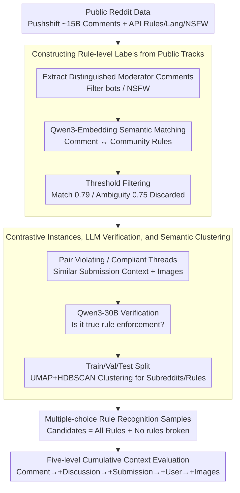

# PluRule: A Benchmark for Moderating Pluralistic Communities on Social Media

**Conference**: ACL2026  
**arXiv**: [2605.17187](https://arxiv.org/abs/2605.17187)  
**Code**: https://github.com/osome-iu/PluRule  
**Area**: Multilingual Content Governance / Social Media Moderation  
**Keywords**: Content Moderation, Community Rules, Multilingual Benchmark, Multimodal VLM, Reddit

## TL;DR
PluRule models Reddit community moderation as a multiple-choice task: "Given a comment and its context, which community rule was violated, or was there no violation?" The authors constructed a benchmark covering 1,989 communities, 2,885 rules, and 9 languages, showing that even GPT-5.2 with high reasoning and full context only achieves approximately 57.6% accuracy.

## Background & Motivation
**Background**: Social platforms have long relied on human moderators and automated detection systems to handle illegal content, hate speech, harassment, and low-quality content. Many automated datasets treat moderation as a globally uniform labeling task, such as toxicity, hate speech, or harassment.

**Limitations of Prior Work**: Community governance rules are not globally uniform. A statement might be an encouraged joke in r/RoastMe but a violation of civility in other communities; self-promotion is spam in most communities but necessary content in showcase-oriented subreddits. Uniform moderation models tend to impose mainstream norms on minority or non-English communities.

**Key Challenge**: Community moderation requires models to understand local rules, discussion context, community purpose, and implicit norms, whereas existing models excel at identifying cross-community generic violation types. A model's ability to detect "general incivility" does not imply it can judge whether "this comment violates Rule 4 of this specific subreddit."

**Goal**: The authors aim to build a pluralistic moderation benchmark that requires models to perform fine-grained rule recognition across thousands of communities and rules within multilingual and multimodal contexts, measuring whether existing VLMs can truly assist community self-governance.

**Key Insight**: The paper leverages public moderator comments on Reddit. Many moderators state which rule was violated when deleting or flagging content. The authors perform semantic matching between these comments and rule texts, pairing them with unmoderated "compliant comments" from the same submission to create contrastive multiple-choice samples.

**Core Idea**: Upgrade content moderation from binary classification ("Is it a violation?") to a multiple-choice task ("Which community rule did it violate?"), requiring the model to simultaneously consider rules, comments, discussion chains, original posts, user anonymity flags, and images.

## Method
PluRule is not a new moderation model but a benchmark that closely mirrors the decision space of real community moderation. Each sample contains one rule-violating comment and one compliant comment, both originating from similar contexts within the same submission. After viewing the community rule list and context, the model must select an answer from all rules plus a "No rules broken" option.

### Overall Architecture
Data construction consists of five stages. In Stage 1, moderator comments are extracted from Pushshift Reddit archives, and subreddit rules, language, and NSFW information are collected via the Reddit API. In Stage 2, multilingual embeddings are used to match moderator comments to current subreddit rules. In Stage 3, violating and compliant threads are constructed, and submission images are downloaded as multimodal context. In Stage 4, an LLM verifies if the matches represent actual rule enforcement. In Stage 5, the data is split into train/val/test by subreddit instances, and semantic clustering is performed on subreddits and rules.

During evaluation, models progressively receive five cumulative context levels: Comment Only, +Discussion, +Submission, +User, and +Images. All levels include the subreddit description and the full rule set. The output is generated freely first, followed by "Final Choice:" to extract the final selection.

### Key Designs

**1. Multiple-choice Community Rule Recognition: Pivoting from "Bad or Not" to "Which local rule was violated?"**

Traditional datasets only ask if a sentence is toxic. However, real-world moderators do not face a binary choice—they must identify which specific rule among dozens was violated to provide deletion reasons, execute actions, and handle appeals. PluRule thus sets the candidates for each comment as the full list of that subreddit's rules plus "No rules broken." The correct answer for a violating comment is a specific rule, while for a compliant comment, it is "No rules broken." To prevent models from exploiting option positions, the order is randomized using a deterministic seed derived from the comment ID, ensuring reproducibility while eliminating positional bias. This forces models to truly understand the relationship between local rule text and comments.

**2. Constructing Rule-level Labels from Public Tracks: Using moderator explanations as supervision.**

Rule-level labels are difficult to annotate, but Reddit moderators often publicly state "Violated Rule X" during deletions, providing natural weak supervision. The authors extracted distinguished moderator comments from approximately 15B comments across 40k subreddits. After filtering bots and NSFW content, they obtained 17,468 subreddits, 131,400 rules, and roughly 9M moderator comments. Since rules are rewritten or renumbered over time, direct regex matching of rule numbers is unreliable. Instead, Qwen3-Embedding-8B is used to encode comments and rules to calculate semantic similarity, matching the highest similarity rule within the community. The match threshold is set at the 99.2nd percentile (0.79), and the ambiguity threshold at the 98th percentile (0.75); samples falling in the ambiguity range (potentially pointing to multiple rules) are discarded. Semantic matching absorbs variations in rule phrasing, while ambiguity filtering suppresses noise.

**3. Contrastive Instances, LLM Verification, and Semantic Clustering: Forcing models to distinguish similar discussions.**

If only violating comments were provided, models might guess correctly based on the submission topic or community tags. To close this shortcut, each violating thread is paired with a compliant thread from the same submission that received no moderator action. Pairing prioritizes branches with shared ancestors, similar depth, and lower scores to ensure the contexts are as close as possible, differing only in their "violation status." These are then verified by Qwen3-30B-A3B-Instruct to ensure the match truly "states a rule enforcement action," with a pass rate of 82.1%. Finally, UMAP + HDBSCAN are used to cluster subreddit and rule embeddings, with candidate labels generated by Qwen3-30B-A3B-Thinking and manually corrected. Clustering allows analysis of which community and rule types are most difficult and supports research into cross-community moderation transfer.

### Loss & Training
PluRule is a benchmark and does not involve training new models. Evaluated models include Instruct and Thinking versions of Qwen3-VL-4B/8B/30B, as well as GPT-5.2 low/high reasoning. Qwen models use a temperature of 0 and a seed of 0. The metric is test accuracy, with 95% confidence intervals calculated via 100k bootstrap resamples; the reported 95% CI for all accuracy scores does not exceed $\pm 1.3\%$, and for recall tables, it does not exceed $\pm 1.9\%$.

## Key Experimental Results

### Main Results

| Split | Instances | Comments | Images | Subreddits / Clusters | Rules / Clusters | Languages |
|-------|-----------|----------|--------|------------------------|------------------|-----------|
| Train | 9,155 | 51,968 | 2,077 | 861 / 25 | 1,336 / 27 | 9 |
| Val | 1,382 | 7,631 | 376 | 537 / 25 | 586 / 27 | 9 |
| Test | 2,834 | 13,076 | 1,190 | 1,989 / 25 | 2,039 / 27 | 9 |
| Total | 13,371 | 72,675 | 3,643 | 1,989 / 25 | 2,885 / 27 | 9 |

### Ablation Study

| Model / Variant | Comment Only | +Discussion | +Submission | +User | +Images | Description |
|-------------|--------------|-------------|-------------|-------|---------|------|
| Qwen3-VL-4B Instruct | 49.6 | 49.2 | 48.3 | 48.9 | 48.4 | Mostly below or near 50% baseline |
| Qwen3-VL-8B Instruct | 51.0 | 50.7 | 49.2 | 50.0 | 49.8 | Scaling to 8B offers no stable gain |
| Qwen3-VL-30B Instruct | 50.2 | 51.0 | 51.1 | 52.4 | 52.3 | Largest Qwen only slightly above baseline |
| GPT-5.2 Low | 54.1 | 55.3 | 56.8 | 57.4 | 57.4 | Strong closed-source models perform better but remain limited |
| GPT-5.2 High | 55.0 | 56.2 | 57.3 | 57.7 | 57.6 | Full context only ~2.6 higher than comment-only |
| Baseline | 50.0 | 50.0 | 50.0 | 50.0 | 50.0 | Always predicts "No rules broken" |

### Key Findings
- GPT-5.2 high reasoning achieves a full-context accuracy of approximately 57.6%, only 7.6 points above the 50% baseline; the improvement from comment-only to full context is only about 2.6 to 2.7 points, suggesting context is underutilized.
- Qwen Thinking variants often perform worse than Instruct variants, and the difference between GPT-5.2 high and low is not significant, suggesting that "more reasoning" does not automatically solve community rule understanding.
- By rule type, models excel at general rules: civility (~69%), language (~66%), self-promotion (~63%). Rules below baseline include low-effort (43%), relevance (44%), and evidence-based (47%).
- Weighted accuracy (setting violating:compliant at 2:1) results in a universal decline. GPT-5.2 high full context drops from 57.6% to 52.6%, as models are better at identifying compliant comments than recalling violating ones.
- Label quality was manually verified: for 100 English samples, the agreement between the pipeline and manual established ground truth was 96%.

## Highlights & Insights
- The task definition of PluRule captures the core difficulty of content moderation: rules are local to the community; violation is not a fixed attribute of the content but a relationship between content, rules, and context.
- The paired violating/compliant thread design is clever. It reduces the space for models to exploit submission topics or community tags, forcing them to distinguish specific comments within similar discussions.
- The results provide a sobering outlook on using strong VLMs for automated community rule moderation. Even if GPT-5.2 can process multimodal context, it struggles to understand a vast array of local norms, especially context-dependent rules like relevance, low-effort, or evidence-based.
- Semantic clustering serves not just analysis but defines a transfer learning problem: Can moderation capability be transferred across similar communities or rules, rather than each subreddit learning from scratch?

## Limitations & Future Work
- Data only covers moderation actions where a public moderator comment was left. Private message moderations, silent deletions, shadow-bans, and rapid removals of severe violations are invisible. Data may be biased toward minor violations or communities more willing to explain publicly.
- Reddit is dominated by English communities; although the benchmark includes 9 languages, conclusions may not generalize to different platforms, governance structures, or non-English-dominant communities.
- Historical moderator comments span 2005 to 2023, while rule text is from November 2025. Semantic matching mitigates rule rewriting but cannot fully handle new rule additions, deletions, or shifts in meaning.
- Some violations require information not present in the dataset, such as ban evasion, repeat violation history, or cross-post behavior. Excluding this history is reasonable for privacy but limits benchmark completeness.

## Related Work & Insights
- **vs toxicity / hate speech datasets**: Traditional datasets focus on globally unacceptable content; PluRule focuses on community rules and context, making it more suitable for pluralistic moderation.
- **vs Park et al. rule type data**: Previous work collapsed community rules into a few coarse categories; PluRule preserves specific subreddit rules, requiring models to select from the local rule set.
- **vs He et al. binary rule judgment**: Binary tasks only judge if a specific rule was violated; PluRule provides the entire rule set and a no-violation option, closer to a moderator's actual workflow.
- **Insights**: To serve autonomous communities, automated moderation systems may need to retrieve historical cases, learn community precedents, and provide evidence for rule interpretations rather than relying solely on generic safety classifiers.

## Rating
- Novelty: ⭐⭐⭐⭐⭐ Formalizing pluralistic moderation as a multiple-choice rule recognition task and constructing a multilingual multimodal Reddit benchmark is highly valuable.
- Experimental Thoroughness: ⭐⭐⭐⭐ Data pipeline, label verification, context levels, model sizes, and reasoning variants are well-covered; lacks a direct comparison with human moderator upper bounds on the full task.
- Writing Quality: ⭐⭐⭐⭐ The data pipeline and results interpretation are clear, and limitations are discussed honestly; some detailed analyses are relegated to the appendix.
- Value: ⭐⭐⭐⭐⭐ Important for content governance, community autonomy, and the evaluation of AI moderation, serving as a reminder that automated moderation cannot simply apply a uniform standard.

<!-- RELATED:START -->

## Related Papers

- [\[ACL 2026\] Cross-Cultural Transfer of Emoji Semantics and Sentiment in Financial Social Media](cross-cultural_transfer_of_emoji_semantics_and_sentiment_in_financial_social_med.md)
- [\[CVPR 2025\] SMTPD: A New Benchmark for Temporal Prediction of Social Media Popularity](../../CVPR2025/multilingual_mt/smtpd_a_new_benchmark_for_temporal_prediction_of_social_media_popularity.md)
- [\[ACL 2026\] MORPHOGEN: A Multilingual Benchmark for Evaluating Gender-Aware Morphological Generation](morphogen_a_multilingual_benchmark_for_evaluating_gender-aware_morphological_gen.md)
- [\[ACL 2026\] The GaoYao Benchmark: A Comprehensive Framework for Evaluating Multilingual and Multicultural Abilities of Large Language Models](the_gaoyao_benchmark_a_comprehensive_framework_for_evaluating_multilingual_and_m.md)
- [\[ACL 2026\] TransLaw: A Large-Scale Dataset and Multi-Agent Benchmark Simulating Professional Translation of Hong Kong Case Law](translaw_a_large-scale_dataset_and_multi-agent_benchmark_simulating_professional.md)

<!-- RELATED:END -->
