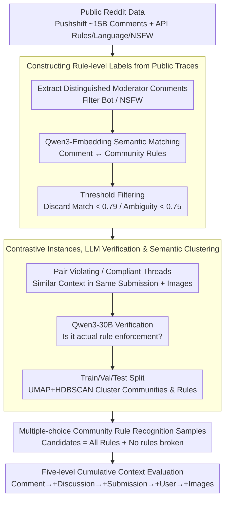

# PluRule: A Benchmark for Moderating Pluralistic Communities on Social Media

**Conference**: ACL2026  
**arXiv**: [2605.17187](https://arxiv.org/abs/2605.17187)  
**Code**: https://github.com/osome-iu/PluRule  
**Area**: Multilingual Content Governance / Social Media Moderation  
**Keywords**: Content Moderation, Community Rules, Multilingual Benchmark, Multimodal VLM, Reddit

## TL;DR
PluRule models Reddit community moderation as a multiple-choice task: "Given a comment and its context, select which community rule was violated or if no violation occurred." The authors construct a benchmark covering 1,989 communities, 2,885 rules, and 9 languages, showing that even GPT-5.2 high reasoning achieves only approximately 57.6% accuracy with full context.

## Background & Motivation
**Background**: Social platforms have long relied on human moderators and automated detection systems to handle illegal content, hate speech, harassment, and low-quality content. Many automated datasets treat moderation as a globally uniform label, such as toxicity, hate speech, or harassment.

**Limitations of Prior Work**: Community governance rules are not globally uniform. A statement might be an encouraged joke in r/RoastMe but a violation of civility in other communities. Self-promotion is considered spam in most communities but might be essential content in portfolios-sharing communities. Uniform moderation models tend to impose mainstream norms on minority or non-English communities.

**Key Challenge**: Community moderation requires models to understand local rules, discussion context, community purpose, and implicit norms, whereas existing models are better at identifying cross-community general violation types. A model's ability to detect "general incivility" does not imply it can judge whether "this comment violates the 4th rule of this specific subreddit."

**Goal**: The authors aim to build a pluralistic moderation benchmark that requires models to perform fine-grained rule recognition across thousands of communities, rules, and multilingual/multimodal contexts, while measuring whether existing VLMs can effectively assist community self-governance.

**Key Insight**: The paper leverages public moderator comments on Reddit. Many moderators specify which rule was violated when deleting or flagging content. The authors use these comments for semantic matching with current rule texts and pair them with unmoderated (compliant) comments from the same submission to form contrastive multiple-choice samples.

**Core Idea**: Upgrade content moderation from binary "violation or not" classification to a multiple-choice task of "which community rule is violated," requiring the model to simultaneously consider rules, comments, discussion threads, the original post, user anonymity indicators, and images.

## Method
PluRule is not a new moderation model but a benchmark closely resembling real-world community moderation decision spaces. Each instance contains a rule-violating comment and a compliant comment from similar contexts within the same submission. After viewing the community rule list and context, the model must select an answer from all rules plus a "No rules broken" option.

### Overall Architecture
Data construction involves five phases. Phase 1: Extract moderator comments from Pushshift Reddit archives and collect subreddit rules, language, and NSFW information via the Reddit API. Phase 2: Match moderator comments to current subreddit rules using multilingual embeddings. Phase 3: Construct violating and compliant threads and download submission images for multimodal context. Phase 4: Use an LLM to verify if the matching represents actual rule enforcement. Phase 5: Split train/val/test by subreddit instances and perform semantic clustering of subreddits and rules.

During evaluation, the model receives five cumulative context levels: Comment Only, +Discussion, +Submission, +User, and +Images. All levels include the subreddit description and the full rule set. The output is generated freely first, followed by "Final Choice:" to extract the final selection.

### Key Designs

**1. Multiple-choice Community Rule Recognition: From "Bad or Not" to "Which Local Rule"**

Traditional datasets ask if a sentence is toxic, but real moderators do not face binary choices—they must identify which of the dozens of local rules was violated to provide a deletion reason and handle appeals. PluRule sets the candidates for each comment as all rules of that subreddit plus "No rules broken." The correct answer for a violating comment is a specific rule, while for a compliant comment, it is no violation. To prevent position bias, option order is randomized using a deterministic seed derived from the comment ID. This forces the model to truly understand the relationship between local rule text and comments rather than applying a universal "incivility" classifier.

**2. Rule-level Labels from Public Moderation Traces: Using Moderator Explanations as Supervision**

Rule-level labels are difficult to annotate, but Reddit moderators often publicly state "violated Rule X" when deleting comments, providing natural weak supervision. The authors extracted distinguished moderator comments from approximately 15B comments across 40k subreddits. After filtering bots and NSFW content, they obtained 17,468 subreddits, 131,400 rules, and approximately 9M moderator comments. Since rules change over time, regex matching rule numbers is unreliable; instead, Qwen3-Embedding-8B is used to find the highest semantic similarity between the comment and rules. The matching threshold is set at the 99.2nd percentile (0.79), with an ambiguity threshold at the 98th percentile (0.75) to discard samples potentially pointing to multiple rules.

**3. Contrastive Instances, LLM Verification & Semantic Clustering: Distinguishing Similar Discussions**

If only violating comments are provided, models might guess based on submission topics. To prevent this, each violating thread is paired with a compliant thread from the same submission that has no moderator action. Pairing prioritizes branches with shared ancestors, similar depth, and lower scores to ensure contexts are as close as possible. Qwen3-30B-A3B-Instruct then verifies if the matching genuinely "states a rule enforcement," with an 82.1% pass rate. Finally, UMAP + HDBSCAN are used to cluster subreddit and rule embeddings, with Qwen3-30B-A3B-Thinking generating candidate category labels followed by manual correction to analyze which types of rules are most challenging.

### Loss & Training
PluRule is a benchmark and does not involve training new models. Evaluated models include Instruct and Thinking versions of Qwen3-VL-4B/8B/30B, as well as GPT-5.2 low/high reasoning. Qwen models use temperature 0 and seed 0. The metric is test accuracy, with 95% confidence intervals (CI) calculated via 100k bootstrap resamples; the 95% CI for all reported accuracy does not exceed $\pm 1.3\%$.

## Key Experimental Results

### Main Results

| Split | Instances | Comments | Images | Subreddits / Clusters | Rules / Clusters | Languages |
|-------|-----------|----------|--------|------------------------|------------------|-----------|
| Train | 9,155 | 51,968 | 2,077 | 861 / 25 | 1,336 / 27 | 9 |
| Val | 1,382 | 7,631 | 376 | 537 / 25 | 586 / 27 | 9 |
| Test | 2,834 | 13,076 | 1,190 | 1,989 / 25 | 2,039 / 27 | 9 |
| Total | 13,371 | 72,675 | 3,643 | 1,989 / 25 | 2,885 / 27 | 9 |

### Ablation Study

| Model / Variant | Comment Only | +Discussion | +Submission | +User | +Images | Note |
|-------------|--------------|-------------|-------------|-------|---------|------|
| Qwen3-VL-4B Instruct | 49.6 | 49.2 | 48.3 | 48.9 | 48.4 | Generally below or near 50% baseline |
| Qwen3-VL-8B Instruct | 51.0 | 50.7 | 49.2 | 50.0 | 49.8 | No stable gain at 8B scale |
| Qwen3-VL-30B Instruct | 50.2 | 51.0 | 51.1 | 52.4 | 52.3 | Largest Qwen only slightly above baseline |
| GPT-5.2 Low | 54.1 | 55.3 | 56.8 | 57.4 | 57.4 | Closed-source models strictly better but limited |
| GPT-5.2 High | 55.0 | 56.2 | 57.3 | 57.7 | 57.6 | Full context only ~2.6 higher than comment-only |
| Baseline | 50.0 | 50.0 | 50.0 | 50.0 | 50.0 | Always predict "No rules broken" |

### Key Findings
- GPT-5.2 high reasoning with full context achieves ~57.6% accuracy, only 7.6 points above the 50% baseline. The improvement from comment-only to full context is only ~2.6 to 2.7 points, suggesting context is underutilized.
- Qwen Thinking variants often perform worse than Instruct variants, and the difference between GPT-5.2 high and low is not significant, indicating "more reasoning" does not automatically solve community rule understanding.
- By rule type, models perform better on universal rules: civility (~69%), language (~66%), self-promotion (~63%). Models fall below baseline on low-effort (43%), relevance (44%), and evidence-based (47%).
- Weighted accuracy (setting violating:compliant to 2:1) sees a universal drop. GPT-5.2 high full context drops from 57.6% to 52.6%, as models are better at identifying compliant comments than recalling violating ones.
- Label quality was manually verified: in 100 English samples, the pipeline showed 96% agreement with established human ground truth.

## Highlights & Insights
- PluRule's task definition captures the core difficulty of moderation: rules are local, and violations are not fixed attributes of content but relationships between content, rules, and context.
- The use of paired violating/compliant threads is clever. It reduces shortcuts based on submission topics or community labels, forcing models to distinguish between similar discussions.
- The results provide a "reality check" for using VLMs for automated community rule moderation. Even if GPT-5.2 can handle multimodal context, it struggles with local norms, particularly context-dependent rules like relevance or low-effort content.
- Semantic clustering provides opportunities for transfer learning: investigating whether moderation capability can be transferred across similar communities or rules.

## Limitations & Future Work
- Data only covers moderation actions where a public comment was left. Private messages, silent deletions, shadow-bans, and rapid removals of severe violations are invisible, potentially biasing data toward minor violations.
- English communities dominate Reddit; while the benchmark includes 9 languages, conclusions may not generalize to different platforms or non-English dominant environments.
- Historical moderator comments span 2005-2023, while rules were fetched in Nov 2025. Semantic matching mitigates rule rewrites but cannot fully account for newly added or deleted rules.
- Certain violations require information absent from the dataset, such as ban evasion, repeat violation history, or cross-post behavior.

## Related Work & Insights
- **vs toxicity / hate speech datasets**: Traditional datasets focus on globally unacceptable content; PluRule focuses on community-specific rules and context.
- **vs Park et al. rule type data**: Prior work collapses community rules into coarse categories; PluRule preserves specific local rules.
- **vs He et al. binary rule judgment**: Binary tasks judge if *one* rule is violated; PluRule requires choosing from *all* rules, reflecting the actual moderator workflow.
- **Insight**: Automated systems serving autonomous communities may need to retrieve historical moderation precedents and provide evidence for rule interpretation rather than relying on generic safety classifiers.

## Rating
- Novelty: ⭐⭐⭐⭐⭐ Formalizing pluralistic moderation as a multi-choice rule recognition task and building a multimodal benchmark is highly valuable.
- Experimental Thoroughness: ⭐⭐⭐⭐ Covers data pipeline, label verification, context levels, model scales, and reasoning variants; lacks a direct upper-bound comparison with human moderators on the full task.
- Writing Quality: ⭐⭐⭐⭐ Clear data pipeline and results; honest discussion of limitations.
- Value: ⭐⭐⭐⭐⭐ Critical for content governance and AI moderation evaluation, highlighting that automated moderation cannot simply apply uniform standards.

<!-- RELATED:START -->

## Related Papers

- [\[CVPR 2025\] SMTPD: A New Benchmark for Temporal Prediction of Social Media Popularity](../../CVPR2025/multilingual_mt/smtpd_a_new_benchmark_for_temporal_prediction_of_social_media_popularity.md)
- [\[ACL 2026\] Cross-Cultural Transfer of Emoji Semantics and Sentiment in Financial Social Media](cross-cultural_transfer_of_emoji_semantics_and_sentiment_in_financial_social_med.md)
- [\[ACL 2026\] MORPHOGEN: A Multilingual Benchmark for Evaluating Gender-Aware Morphological Generation](morphogen_a_multilingual_benchmark_for_evaluating_gender-aware_morphological_gen.md)
- [\[ACL 2026\] The GaoYao Benchmark: A Comprehensive Framework for Evaluating Multilingual and Multicultural Abilities of Large Language Models](the_gaoyao_benchmark_a_comprehensive_framework_for_evaluating_multilingual_and_m.md)
- [\[ACL 2026\] TransLaw: A Large-Scale Dataset and Multi-Agent Benchmark Simulating Professional Translation of Hong Kong Case Law](translaw_a_large-scale_dataset_and_multi-agent_benchmark_simulating_professional.md)

<!-- RELATED:END -->
