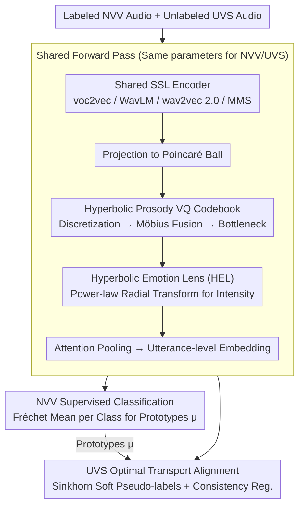

# Prosody as Supervision: Bridging the Non-Verbal–Verbal for Multilingual Speech Emotion Recognition

**Conference**: ACL 2026  
**arXiv**: [2604.17647](https://arxiv.org/abs/2604.17647)  
**Code**: [Project Page](https://helixometry.github.io/NOVA-ARC---ACL26/)  
**Area**: Multilingual Translation  
**Keywords**: Non-verbal speech supervision, hyperbolic representation learning, optimal transport alignment, prosodic codebook, cross-lingual emotion transfer

## TL;DR

This paper proposes NOVA-ARC, which models multilingual Speech Emotion Recognition (SER) for the first time as an unsupervised transfer problem from labeled Non-Verbal Vocalizations (NVV) to unlabeled Verbal Speech (UVS). It achieves cross-modal emotion transfer through a prosodic vector quantization codebook in hyperbolic space, a hyperbolic emotion lens, and optimal transport prototype alignment, validating the feasibility and superiority of NVV $\to$ UVS transfer across 6 datasets.

## Background & Motivation

**Background**: Supervision signals for SER rely almost entirely on labeled verbal speech, but annotations are extremely scarce in low-resource languages. Non-verbal vocalizations (laughter, sighs, cries) contain rich emotional signals and are naturally cross-lingual as they do not contain lexical content.

**Limitations of Prior Work**: (1) Emotion labels in verbal speech are inevitably entangled with lexical/phonological content—correlations that fail when transferring across languages; (2) Existing UDA methods still assume emotional supervision comes from labeled verbal speech; (3) Emotion recognition of non-verbal vocalizations has only recently gained attention and has never been used as a supervision source for cross-lingual SER.

**Key Challenge**: There is a need for language-agnostic emotional supervision signals—emotions in verbal speech are mixed with language-specific expression habits, whereas non-verbal vocalizations provide a purer alternative.

**Goal**: To verify whether non-verbal vocalizations can serve as a stronger and more transferable source of emotional supervision for multilingual SER.

**Key Insight**: Non-verbal vocalizations (laughter/sobs/sighs) originate from shared physiological mechanisms, and their dominant features are prosodic—phonation/spectral tilt/intensity dynamics/temporal modulation—which are naturally cross-lingual.

**Core Idea**: Model the hierarchical structure of emotions in hyperbolic space (coarse-grained emotion families $\to$ fine-grained categories $\to$ intensity), discretize prosodic patterns through a hyperbolic VQ codebook, and align NVV emotional prototypes to UVS representations using optimal transport.

## Method

### Overall Architecture

Input NVV/UVS audio extracts frame-level features through a shared self-supervised encoder (voc2vec/WavLM/wav2vec 2.0/MMS), which are projected onto the Poincaré ball. Following prosodic discretization via a hyperbolic VQ codebook $\to$ continuous+discrete fusion using Möbius addition $\to$ bottleneck compression $\to$ intensity calibration via a hyperbolic emotion lens $\to$ utterance-level embeddings are obtained through attention pooling. Labeled NVV data trains the classifier and calculates class prototypes, while UVS is aligned to prototypes via optimal transport with consistency regularization.

### Key Designs

**1. Hyperbolic Prosody Vector Quantization Codebook: Discretizing continuous prosody into a shared "emotional vocabulary" for NVV and UVS**

For NVV supervision to transfer to UVS, both must speak the same "prosodic language." Using continuous features separately makes distribution alignment difficult. This paper maintains a codebook $\mathcal{C}$ of size $K=256$ in the Poincaré ball, assigning each frame $\mathbf{x}_t$ to the nearest codeword $\mathbf{q}_t$ via Poincaré distance, then fusing continuous frames with discrete tokens through Möbius addition before bottleneck projection. The advantage of discretization is that NVV and UVS are forced to share the same set of prosodic codewords, providing a common vocabulary for cross-modal alignment. Choosing hyperbolic space over Euclidean space allows for the exponential expansion of hierarchical structures (family $\to$ category $\to$ intensity) using fewer dimensions.

**2. Hyperbolic Emotion Lens (HEL) + Optimal Transport Prototype Alignment: Calibrating intensity differences and completing unsupervised transfer**

NVV emotions are often more exaggerated than UVS expressions—laughter is much more intense than a smiling intonation; direct alignment would fail due to intensity mismatch. HEL uses a learnable power-law radial transformation $\alpha$ to adjust the radial position of embeddings in the Poincaré ball (proximity to the boundary represents higher intensity), bringing the intensity scales of both sides to a comparable level. Alignment follows a prototype-based approach: Fréchet means are calculated as class prototypes $\mu^{(c)}$ for labeled NVV, and an entropy-regularized optimal transport plan $\Pi^*$ is solved via Sinkhorn iterations for unlabeled UVS batches, inducing soft pseudo-labels $q_{cj} = n\,\Pi^*_{cj}$ for training. Compared to hard clustering assignments, optimal transport allows an utterance to match multiple emotional prototypes with different weights, fitting emotional ambiguity and producing smoother, less noisy pseudo-labels.

**3. Shared Forward Pass + Consistency Regularization: Forcing both inputs into the same space via identical network paths**

Even with shared codewords and prototype alignment, representation spaces might drift if NVV and UVS follow different encoding paths. This paper shares all parameters—encoder, projection layer, codebook, and classifier—ensuring both inputs are mapped into the same geometric space from the root. Additionally, consistency regularization is applied to unlabeled UVS to ensure stable predictions under perturbation, suppressing noise in early optimal transport pseudo-labels and stabilizing the unsupervised branch.

### Loss & Training

Total objective: $\mathcal{L} = L_S(\mathcal{B}_S) + \lambda_{\text{OPT}} L_{\text{OPT}}(\mathcal{B}_T) + \lambda_{\text{OT}} L_{\text{OT-CE}}(\mathcal{B}_T)$. $L_S$ is the supervised cross-entropy on NVV, $L_{\text{OPT}}$ encourages geometric alignment, and $L_{\text{OT-CE}}$ trains the classifier using transport-induced soft labels. AdamW for 30 epochs, cosine decay with 10% warmup.

## Key Experimental Results

### Main Results

**NVV $\to$ UVS Transfer (NOVA-ARC + voc2vec)**

| Target Dataset | Language | NOVA-ARC Acc | Direct Transfer Baseline |
|----------------|----------|--------------|--------------------------|
| ASVP-ESD (V)   | Multilingual | 62.23        | 32.67                    |
| MESD           | Spanish  | ~55          | 49.02                    |
| AESDD          | Greek    | ~42          | 35.86                    |
| RAVDESS        | English  | ~43          | 36.51                    |
| Emo-DB         | German   | ~50          | 44.69                    |

### Ablation Study

- Hyperbolic vs. Euclidean comparison shows that hyperbolic space consistently outperforms its Euclidean counterpart.
- voc2vec (specifically pre-trained for non-verbal speech) is strongest in the NVV source domain, while WavLM/MMS are stronger in the UVS target domain.
- NOVA-ARC also performs best in V $\to$ V (Verbal $\to$ Verbal) transfer settings.

### Key Findings

- NVV $\to$ UVS transfer is feasible—NOVA-ARC significantly outperforms direct transfer baselines (+15-30pp), proving NVV contains effective cross-lingual emotional signals.
- voc2vec is strongest on NVV but weakest on UVS—indicating that specialized encoders capture patterns unique to NVV.
- The advantages of hyperbolic space are more pronounced in low-resource target domains—hierarchical encoding provides better inductive bias when data is scarce.

## Highlights & Insights

- Redefining SER as NVV $\to$ UVS transfer is a paradigm-level innovation—it completely changes the assumption of where emotional supervision originates.
- Using hyperbolic space for emotion modeling is highly rational—emotions have clear coarse-to-fine hierarchical structures (positive/negative $\to$ specific emotion $\to$ intensity).
- The shared parameter design is simple yet critical—ensuring NVV and UVS reside in the same representation space.

## Limitations & Future Work

- Limited scale of the NVV dataset (ASVP-ESD).
- Only unified into 5 emotion categories; finer-grained classification has not been verified.
- Insufficient sensitivity analysis for hyperparameters such as prosodic codebook size.
- Validation in more languages and larger-scale scenarios is required.

## Related Work & Insights

- **vs. Standard UDA SER**: Still assumes emotional supervision from verbal speech; NOVA-ARC uses NVV as a purer source.
- **vs. Mote et al.**: Uses KNN voice conversion for cross-lingual adaptation; NOVA-ARC uses optimal transport for prototype alignment.
- **vs. Phukan et al.**: Focuses on NVV recognition itself; NOVA-ARC uses NVV as a bridge for transfer learning.

## Rating

- Novelty: ⭐⭐⭐⭐⭐ Proposes the NVV $\to$ UVS transfer paradigm for the first time; hyperbolic prosody codebook design is unique.
- Experimental Thoroughness: ⭐⭐⭐⭐ 6 datasets + 4 encoders + hyperbolic vs. Euclidean ablation.
- Writing Quality: ⭐⭐⭐⭐ Convincing motivation and complete theoretical framework.
- Value: ⭐⭐⭐⭐⭐ Opens a completely new direction for low-resource SER research.

<!-- RELATED:START -->

## Related Papers

- [\[ACL 2026\] Evaluating the Impact of Verbal Multiword Expressions on Machine Translation](evaluating_the_impact_of_verbal_multiword_expressions_on_machine_translation.md)
- [\[ACL 2026\] EMCEE: Improving Multilingual Capability of LLMs via Bridging Knowledge and Reasoning with Extracted Synthetic Multilingual Context](emcee_improving_multilingual_capability_of_llms_via_bridging_knowledge_and_reaso.md)
- [\[ACL 2026\] Beyond Literal Mapping: Benchmarking and Improving Non-Literal Evaluation Evaluation](beyond_literal_mapping_benchmarking_and_improving_non-literal_translation_evalua.md)
- [\[ACL 2026\] Hierarchical Policy Optimization for Simultaneous Translation of Unbounded Speech](hierarchical_policy_optimization_for_simultaneous_translation_of_unbounded_speec.md)
- [\[ACL 2026\] Efficient Training for Cross-lingual Speech Language Models](efficient_training_for_cross-lingual_speech_language_models.md)

<!-- RELATED:END -->
