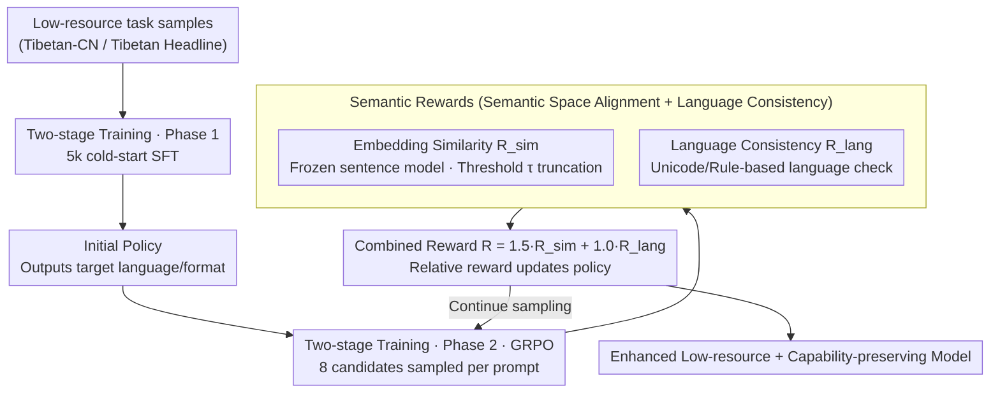

# Reinforcement Learning with Semantic Rewards Enables Low-Resource Language Expansion without Alignment Tax

**Conference**: ACL2026 Findings  
**arXiv**: [2605.14366](https://arxiv.org/abs/2605.14366)  
**Code**: Not released  
**Area**: Multilingual Translation  
**Keywords**: Low-resource language, Semantic reward, GRPO, Alignment tax, Tibetan-Chinese translation

## TL;DR
This paper redefines low-resource language expansion from token-level imitation to semantic space alignment. By employing GRPO and embedding-based semantic rewards to train Qwen3-4B, the authors achieve enhanced capabilities in Tibetan-Chinese translation and Tibetan headline generation. Crucially, this approach preserves dominant language performance (e.g., Chinese CMRC) significantly better than strong SFT.

## Background & Motivation
**Background**: Large Language Models (LLMs) perform exceptionally in high-resource scenarios but lack support for low-resource languages like Tibetan. Common practice involves continued pre-training, instruction fine-tuning, or SFT on low-resource parallel corpora to pull the model toward the target language distribution.

**Limitations of Prior Work**: Low-resource corpora are typically small in scale, narrow in domain, and biased in distribution. Token-level teacher forcing encourages models to strictly imitate the surface form of references. While this may increase BLEU or ROUGE scores, it often leads to over-adaptation to narrow data, causing a decline in high-resource language and general capabilities—referred to in the paper as the "alignment tax."

**Key Challenge**: Low-resource expansion must facilitate learning the target language without destroying existing general representations from pre-training. SFT defines "alignment" as token distribution matching, whereas real language ability is more akin to "multiple semantically equivalent expressions being acceptable." Stronger superficial imitation leads to a higher risk of forgetting.

**Goal**: The authors aim to answer three questions: Can RL with semantic rewards effectively learn low-resource tasks? What is the trade-off between it and strong SFT regarding task performance versus general capability preservation? Can representations from semantic alignment transfer better to downstream few-shot tasks?

**Key Insight**: The paper views language expansion as alignment under sparse supervision rather than simple adaptation. The model is no longer required to reproduce a single reference sentence; instead, it learns to preserve semantics through embedding similarity and reduces parameter drift through constrained policy optimization.

**Core Idea**: Use embedding-level semantic reward instead of token-level likelihood to allow the model to learn "meaning-equivalent" low-resource language abilities. Meanwhile, controlled updates via GRPO minimize catastrophic forgetting.

## Method
The method consists of a two-phase training paradigm and a semantic reward function. The first phase uses a small amount of low-resource data to provide the model with basic output capabilities. The second phase starts from this cold-start model and continues optimization using GRPO based on semantic rewards. Compared to strong SFT, this approach does not seek perfect overlap with reference text but allows for diverse surface expressions as long as the semantics match the reference and the language remains within the target low-resource space.

### Overall Architecture
The input consists of low-resource language task samples, such as Tibetan-Chinese parallel sentences or Tibetan headline generation samples. The model first undergoes a cold-start SFT on 5k samples to obtain an initial policy capable of outputting the target language and format. Subsequently, GRPO is performed on the remaining data: for each prompt, a group of candidate outputs is sampled. A frozen multilingual sentence embedding model calculates semantic similarity between candidates and references, which is then augmented with a language consistency reward. Finally, the policy is updated based on relative rewards within the group. The result is a model enhanced for low-resource languages with minimal damage to original capabilities.

### Key Designs

**1. Semantic Space Alignment Objective: Shifting training signals from "reproducing reference tokens" to "preserving reference semantics"**

Reference texts in low-resource data often have poor coverage and narrow domains. Token-level teacher forcing forces the model to match the reference word-for-word, magnifying data bias—the root of the alignment tax. This paper instead judges whether the generated sentence and the reference are close in the sentence embedding space. As long as the meaning is correct, different word orders or phrasing are considered valid. This explicitly models the "one meaning, many expressions" nature of translation and generation: the model is no longer locked into a narrow reference distribution but can freely explore multiple reasonable expressions while maintaining semantics, thereby reducing the pull of reference noise.

**2. Two-stage Cold-start + GRPO training: Letting the model "speak" first, then using controlled RL to make it "meaningful without drifting"**

Direct RL on low-resource languages is inefficient because early policies struggle to produce correct characters. Conversely, excessive SFT leads to forgetting. Thus, two stages are used: first, a small-scale cold-start SFT with 5k samples ensures the model can output qualified sentences in the target language and format. Then, GRPO is run from this checkpoint, sampling 8 candidates per prompt to update the policy based on group relative rewards. GRPO is chosen because it avoids an explicit value model, saving parameters, while retaining the stability of PPO-like methods in limiting policy drift—perfectly aligning with the goal of preserving general capabilities.

**3. Embedding Reward + Language Consistency Constraint: Rewarding semantic correctness while preventing "code-switching" reward hacking**

The primary reward is the cosine similarity between the output and the reference. However, using raw similarity is risky: positive scores for similarity below a minimum "semantic sufficiency" threshold can encourage low-quality outputs. Thus, a threshold $\tau$ is used for truncated rescaling—rewards below the threshold are zeroed, and only those above are linearly scaled. Another risk is that multilingual embeddings might give high scores to "mixed Chinese-Tibetan" outputs. Therefore, a language consistency reward based on Unicode/rules is added to ensure the output remains purely in the target low-resource language. These are combined as $R=\lambda_{sim}R_{sim}+\lambda_{lang}R_{lang}$ with $\lambda_{sim}=1.5$ and $\lambda_{lang}=1.0$, explicitly constraining both semantic content and language adherence.

### Loss & Training
Experiments use Qwen3-4B with parameter-efficient fine-tuning via LoRA on attention and MLP linear layers (LoRA rank 64, $\alpha=128$, dropout 0.05). SFT utilizes AdamW, a learning rate of $2\times10^{-5}$, batch size 32, and a cosine schedule. GRPO starts from the cold-start checkpoint for 1 epoch with a learning rate of $5\times10^{-7}$, group size 8, temperature 0.8, and top-p 0.9. The semantic reward model is based on CINO/XLM-R, adapted as a SentenceTransformer for Chinese-Tibetan parallel data, and frozen during RL.

## Key Experimental Results

### Main Results
The first set of experiments compares cold-start SFT with semantic reward RL, proving that RL can continue to improve low-resource capabilities, particularly semantic similarity, following minimal supervised initialization.

| Task | Model | Task Metric | Semantic Similarity | Key Conclusion |
|------|------|----------|------------|----------|
| Tibetan-CN Translation | Cold-start SFT | BLEU-4 0.3953 | 0.5593 | 5k samples provide basic capability |
| Tibetan-CN Translation | RL (Ours) | BLEU-4 0.4519 | 0.7164 | Semantic reward brings significant gain |
| Tibetan Headline Gen | Cold-start SFT | ROUGE-L 0.2204 | 0.5774 | Baseline can generate but lacks semantics |
| Tibetan Headline Gen | RL (Ours) | ROUGE-L 0.2530 | 0.6404 | Improvements also seen in generation |

### Ablation Study
The trade-off comparison with strong SFT shows that while SFT is better at seeking reference overlap, it is not necessarily superior for preserving general capabilities or open-generation preferences.

| Task | Method | Task Metric | Similarity | CMRC Avg | CMRC F1 | LLM-Judge Win |
|------|------|----------|------------|----------|---------|---------------|
| Tibetan-CN Translation | Strong SFT | 0.6006 | 0.8282 | 41.82 | 62.99 | 59.2% |
| Tibetan-CN Translation | RL (Ours) | 0.4519 | 0.7164 | 46.97 | 65.79 | 33.5% |
| Tibetan Headline Gen | Strong SFT | 0.3095 | 0.6499 | 44.20 | 65.30 | 35.1% |
| Tibetan Headline Gen | RL (Ours) | 0.2530 | 0.6404 | 45.10 | 65.20 | 51.2% |

Reward ablation further demonstrates that improvements stem from the semantic reward design rather than RL itself.

| Reward Configuration | MT Similarity | Description |
|----------|---------------|------|
| Embedding + LC (Ours) | 0.7164 | Best; balances semantics and consistency |
| BLEU + LC | 0.6375 | Token overlap reward limits exploration |
| BLEU + Embedding + LC | 0.6175 | Mixing BLEU actually degrades performance |
| BLEU + Embedding | 0.2312 | Lack of LC leads to mixed language outputs |

### Key Findings
- Semantic RL continues to improve low-resource tasks from cold-start SFT; Tibetan-CN translation similarity increases from 0.5593 to 0.7164, and headline similarity from 0.5774 to 0.6404.
- Strong SFT achieves higher BLEU and similarity in translation, but its CMRC Avg is 5.15 points lower than RL, indicating that gains in superficial imitation metrics come with a higher alignment tax.
- In open-ended headline generation, RL has lower ROUGE but an LLM-Judge win rate of 51.2% (16.1 percentage points higher than SFT), suggesting n-gram metrics underestimate diverse semantic expressions.
- In Few-shot transfer, MT-RL initialization achieves higher similarity on 1,000 headline generation samples (0.5690 vs. 0.5456 for MT-SFT), supporting the claim that semantically aligned representations are more transferable.
- OOD mechanism analysis shows the CMRC mean NLL increase for RL is +0.24 versus +0.64 for SFT; the P90 NLL increase also drops from +1.43 (SFT) to +0.62 (RL), showing forgetting largely occurs in the difficult sample tail of SFT.

## Highlights & Insights
- The strongest argument is defining low-resource expansion as alignment rather than ordinary fine-tuning. This perspective naturally explains why token-level learning induces an alignment tax and justifies using RL to control update magnitude.
- The combination of embedding rewards and language consistency constraints is elegant. It avoids complex teachers or preference labeling while explicitly modeling the core requirements of "semantic sufficiency" and "target language adherence."
- The reflection on reference-based metrics is valuable: in low-resource tasks, BLEU/ROUGE may reward narrow imitation rather than robust linguistic ability. This has implications for evaluating MT and generation systems.
- This method is transferable to other weakly supported languages, dialects, or domain-specific text expansion: cold-start with small data, expand expressive space with semantic rewards, and use rules/detectors to prevent drift.

## Limitations & Future Work
- Experiments primarily focus on Tibetan, and Tibetan-CN translation data stems from an internal VLM pre-training pipeline with narrow domain distribution; cross-lingual generalization needs verification on more public benchmarks.
- The semantic reward model is itself trained on Tibetan-CN parallel data; if the reward model is insensitive to fine-grained semantic differences, RL might optimize toward incorrect semantic neighbors.
- While LLM-as-a-Judge complements ROUGE/BLEU, it is not a human evaluation and may harbor biases or recognition errors in low-resource contexts.
- The method sacrifices some reference-based metrics for capability preservation; actual deployment requires task-specific decisions regarding this trade-off.

## Related Work & Insights
- **vs. Low-resource SFT / continued pretraining**: These methods rely on token-level likelihood. This paper changes the objective to semantic consistency instead of surface distribution matching, focusing on reducing catastrophic forgetting.
- **vs. LoRA / Parameter-efficient methods**: LoRA limits update locations or parameter counts; this paper limits the optimization objective and policy drift. The two are complementary.
- **vs. RLHF / DPO**: Standard alignment RL optimizes for human preferences or rule-based rewards. This paper treats reward as a cross-semantic task reward, suitable for low-resource scenarios lacking human preference data.

## Rating
- Novelty: ⭐⭐⭐⭐☆ "Semantic space alignment + GRPO" for low-resource expansion is innovative, though components draw on existing RL and embedding methods.
- Experimental Thoroughness: ⭐⭐⭐☆☆ Main results, trade-offs, transfer, and ablations are complete, but limited in language scope, data accessibility, and human evaluation.
- Writing Quality: ⭐⭐⭐⭐☆ The main argument is clear, particularly the coherent explanation of the alignment tax.
- Value: ⭐⭐⭐⭐☆ High practical inspiration for low-resource expansion, mitigating catastrophic forgetting, and rethinking reference metrics.

<!-- RELATED:START -->

## Related Papers

- [\[ACL 2026\] NeoAMT: Neologism-Aware Agentic Machine Translation with Reinforcement Learning](neoamt_neologism-aware_agentic_machine_translation_with_reinforcement_learning.md)
- [\[ACL 2026\] Efficient Low-Resource Language Adaptation via Multi-Source Dynamic Logit Fusion](efficient_low-resource_language_adaptation_via_multi-source_dynamic_logit_fusion.md)
- [\[ICML 2025\] KELPS: A Framework for Verified Multi-Language Autoformalization via Semantic-Syntactic Alignment](../../ICML2025/multilingual_mt/kelps_a_framework_for_verified_multi-language_autoformalization_via_semantic-syn.md)
- [\[AAAI 2026\] ViDia2Std: A Parallel Corpus and Methods for Low-Resource Vietnamese Dialect-to-Standard Translation](../../AAAI2026/multilingual_mt/vidia2std_a_parallel_corpus_and_methods_for_low-resource_vietnamese_dialect-to-s.md)
- [\[ICML 2026\] Toward Robust Multilingual Adaptation of LLMs for Low-Resource Languages](../../ICML2026/multilingual_mt/toward_robust_multilingual_adaptation_of_llms_for_low-resource_languages.md)

<!-- RELATED:END -->
