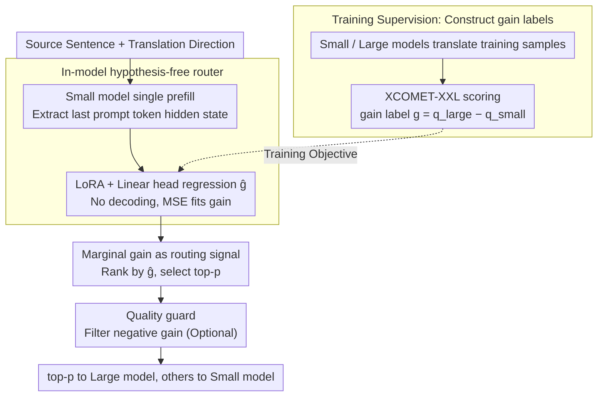

# RouteLMT: Learned Sample Routing for Hybrid LLM Translation Deployment

**Conference**: ACL2026  
**arXiv**: [2604.22520](https://arxiv.org/abs/2604.22520)  
**Code**: No public code provided in the paper  
**Area**: Machine Translation / LLM Deployment / Sample Routing  
**Keywords**: Hybrid Translation Deployment, Marginal Gain Prediction, In-Model Router, Budget Allocation, XCOMET

## TL;DR
RouteLMT formalizes the routing problem in hybrid LLM translation as a marginal gain allocation under a fixed large-model budget. It utilizes the internal representations of the last prompt token from a small translation model to predict "how much improvement the large model can bring relative to the small model." Across four translation directions, it achieves superior quality-budget Pareto frontiers compared to length-based, quality estimation (QE), and external router methods.

## Background & Motivation
**Background**: Large Language Models (LLMs) demonstrate strong performance in machine translation. However, production deployment cannot route all requests to large models due to costs, tail latency, and compute capacity constraints. A common engineering solution is hybrid deployment: the majority of requests are processed by a small model, while only high-value or difficult requests are handled by a large model.

**Limitations of Prior Work**: Routing strategies may seem simple but often misallocate budgets. Heuristic methods based on length, rare words, or entropy may waste large model calls on samples where the improvement is marginal. Routing based on the absolute quality or difficulty of the small model is not necessarily equivalent to "significant improvement by the large model." Furthermore, some post-routing QE methods require the small model to decode before scoring, increasing latency and computation.

**Key Challenge**: The goal of hybrid translation is not to find the "most difficult sentences," but to identify sentences where the "large model's improvement relative to the small model is maximized" under a limited budget. Difficult samples might be handled poorly by both models, while simple samples could be significantly improved by a large model due to idioms, abbreviations, or code-switching.

**Goal**: The authors aim to propose a lightweight, external-model-free router that does not require the small model to generate translations beforehand. The router directly predicts marginal gain and demonstrates that marginal gain is the correct optimization signal for budgeted routing.

**Key Insight**: The paper leverages the hidden state of the last prompt token from the small translation model during the prefill stage. This representation already encodes the source sentence, translation direction, and the model's internal assessment of the input. Thus, a simple regression head can predict the gain from upgrading to a larger model.

**Core Idea**: Rather than predicting small model quality or input difficulty, the router directly predicts $g(x;d)=q_{large}(x;d)-q_{small}(x;d)$ and allocates the fixed budget to samples with the highest predicted gain.

## Method
The core of RouteLMT is viewing routing as a budget allocation problem. The system comprises a small model $M_s$ and a large model $M_l$. For each source sentence and direction, both models have respective translation quality scores. If the large model invocation ratio is at most $p$, the optimal strategy is to select the top-$p$ samples with the largest marginal gain $g=q_l-q_s$. Therefore, the training objective should be marginal gain regression rather than absolute quality.

### Overall Architecture
During the training phase, the authors first let the small and large models translate training samples. Quality scores are calculated using XCOMET-XXL and human references to obtain gain labels. RouteLMT runs a single prefill of the small translation model, extracts features from the hidden state of the last prompt token, and predicts the gain through a lightweight linear head. The model uses LoRA to adapt the small translation model while training the regression head.

During the inference phase, the system does not need to generate small model translations first, nor does it require external QE. For offline batch processing, samples are sorted by predicted gain, and the top-$p$ samples are sent to the large model. For streaming deployment, a threshold $\tau_p$ can be calibrated on held-out traffic to trigger the large model for approximately $p$ proportion of requests.

### Key Designs

**1. Marginal Gain as a Routing Signal: Aligning Routing Objectives with Budget Optimization**
Common routing criteria such as difficulty, length, rare words, or small model absolute quality are mere proxies that may not align with "how much improvement the large model actually brings." A difficult sentence might be poorly translated by both models, making an upgrade a waste of budget. RouteLMT decomposes the total quality of hybrid translation: it equals a constant term (all samples translated by the small model) plus the expected gain of samples routed to the large model. Given a fixed large model invocation ratio $p$, to maximize total quality, one must maximize the sum of gains of the selected samples. The optimal strategy is thus to sort by $g=q_l-q_s$ and select the top-$p$ samples.

**2. In-model hypothesis-free router: Predicting Gain Inside the Small Model Without Decoding**
External routers only observe external representations of the source sentence, ignoring the small translation model's own internal judgment. While post-routing QE methods are accurate, they require the small model to decode the entire translation before scoring, which is costly in terms of latency and compute. RouteLMT takes a third path: it constructs a translation prompt, runs a single prefill of the small model **without decoding any tokens**, and uses the hidden state of the last prompt token to regress $\hat{g}$ via a linear head. This representation encodes the source, direction, and model-specific difficulty during the prefill stage. The signal quality approaches post-route QE but with only the cost of one forward pass.

**3. Quality Guard to Control Negative Gain Risk: Suppressing "Upgrade Degradation"**
While gain ranking increases average improvement, it cannot completely eliminate negative gain samples—large models occasionally fail at entity disambiguation or over-paraphrase, performing worse than small models. RouteLMT introduces an optional quality filter: a lightweight "Quality Predict" version uses in-model quality predictions without additional decoding, while a "Quality Hypo" version decodes the small model translation first and uses a quality scorer to filter out samples where the small model already performs well and upgrading poses a risk. This provides a practical trade-off: use in-model pre-routing for cost control, and post-route verifiers for high-risk scenarios to reduce severe degradation (reducing severe loss from 8.19% to 5.69% in experiments).

### Loss & Training
Training labels are derived from $g(x;d)=\Phi(x,y_l,y^*)-\Phi(x,y_s,y^*)$, where $\Phi$ is the XCOMET-XXL reference-based quality score. RouteLMT uses MSE loss to regress $\hat{g}$ against the true gain. In experiments, the small model is LMT-60-0.6B and the large model is LMT-60-8B. LoRA is applied to all linear layers of the small model with rank 8 and alpha 32. Evaluation directions include En-Zh, En-Ru, Zh-En, and Ru-En.

## Key Experimental Results

### Main Results
With a fixed large model budget $p=0.3$, RouteLMT outperforms all practical routers in Spearman correlation, HitRate@p, and MeanDelta@p.

| Method | Spearman | HitRate@p Avg. | MeanDelta@p Avg. | Description |
|------|----------|----------------|------------------|------|
| Gain Oracle | 1.00 | 100.00 | 19.48 | Ideal upper bound, routing by true gain |
| Quality Oracle | 0.67 | 75.10 | 16.73 | Quality upper bound is not equivalent to gain upper bound |
| Random | 0.00 | 30.00 | 5.83 | Randomly using 30% large model budget |
| Length | 0.24 | 46.39 | 9.35 | One of the strongest heuristics |
| Entropy | 0.09 | 37.25 | 7.45 | Small model uncertainty is unreliable |
| sentinel-src-24 | 0.34 | 55.00 | 11.27 | Strong baseline for external QE/difficulty |
| XLM-R-Delta | 0.32 | 53.59 | 11.02 | External model predicting gain |
| RouteLMT-Q | 0.37 | 56.04 | 11.77 | In-model prediction of small model quality |
| RouteLMT | 0.40 | 57.33 | 12.13 | In-model prediction of marginal gain (Best practical method) |

### Ablation Study

| Configuration | Severe loss | MeanDelta@p | Description |
|------|-------------|-------------|------|
| Random | 7.10% | 5.83 | Low gain via random routing |
| Gain | 8.19% | 12.13 | High average gain, but severe negative gains remain |
| Gain + Quality predict | 8.19% | 12.24 | Quality prediction guard provides limited improvement |
| Gain + Quality hypo | 5.69% | 16.73 | Decoding-based quality guard significantly reduces severe loss |

### Key Findings
- RouteLMT achieves a MeanDelta@p of 12.13, which is 2.78 higher than the strongest heuristic (Length) and more than double that of Random, indicating that marginal gain prediction is more aligned with budget targets.
- RouteLMT outperforms RouteLMT-Q, proving that "predicting how much improvement the large model brings" is more effective than "predicting how well the small model performs."
- In-model methods outperform external routers like XLM-R, suggesting that the small translation model's internal prompt representations contain useful signals regarding translation direction and input difficulty.
- Severe negative gains do not disappear entirely with learned routing, persisting at approximately 8-9%; case studies show entity disambiguation errors and over-paraphrasing are key sources of large model degradation.

## Highlights & Insights
- The paper's greatest strength is clarifying the deployment problem: budgeted hybrid translation optimizes marginal gain, not difficulty. This mathematical reframing explains why many heuristic routers fail.
- Using prefill hidden states for routing is highly practical. It avoids the additional latency of decoding-before-deciding and the need to deploy an extra QE model, fitting production requirements for simplicity.
- The fact that the Quality Oracle is significantly lower than the Gain Oracle is convincing: even with perfect knowledge of small model quality, one does not necessarily know if a large model call is worthwhile.
- Guarded routing provides a realistic compromise: using lightweight pre-routing to control costs daily, and post-route verifiers to reduce severe degradation in high-risk scenarios.

## Limitations & Future Work
- Training supervision relies on XCOMET-XXL, which may inherit automatic metric biases and may not perfectly represent user preferences or specific business utility.
- The experiment only explores hybrid settings with two models and a fixed budget; multi-level cascades, dynamic budgets, latency constraints, and cost fluctuations are not deeply addressed.
- The model combination is fixed at LMT-60-0.6B and LMT-60-8B; whether the same patterns hold for different model families, capacities, or larger scales remains to be verified.
- Language directions are limited to English, Chinese, and Russian; low-resource languages or morphologically rich languages may exhibit different routing behaviors.

## Related Work & Insights
- **vs QE-based deferral**: Post-routing QE requires generating small model translations first, resulting in higher latency. RouteLMT routes before generation, making it more suitable for low-latency deployment.
- **vs external router**: Methods like XLM-R and sentinel only view external source representations. RouteLMT uses internal representations, capturing the model's own perception of translation difficulty.
- **vs difficulty routing**: Difficult sentences are not always worth large model processing if both models fail; RouteLMT directly targets the relative improvement.
- **Insight**: In LLM system deployment, routers should not just ask "is this request difficult?" but rather "how much quality is gained by upgrading the model?" This gain-aware approach is transferable to summarization, customer service, and code generation.

## Rating
- Novelty: ⭐⭐⭐⭐☆ Clear formalization of budgeted gain routing; practical use of in-model representations.
- Experimental Thoroughness: ⭐⭐⭐⭐☆ Extensive analysis across four directions and multiple routers, though broader language coverage and human preference validation are missing.
- Writing Quality: ⭐⭐⭐⭐☆ Strong motivation and logical derivation; tables directly support the conclusions.
- Value: ⭐⭐⭐⭐☆ Highly relevant for production machine translation deployment, especially for systems using small/large model ensembles.

<!-- RELATED:START -->

## Related Papers

- [\[ACL 2026\] No One Fits All: From Fixed Prompting to Learned Routing in Multilingual LLMs](no_one_fits_all_from_fixed_prompting_to_learned_routing_in_multilingual_llms.md)
- [\[ACL 2026\] Unlocking the Edge: Multi-LoRA On-Device Deployment and Acceleration](unlocking_the_edge_deployment_and_ondevice_acceleration_of_multi-lora_enabled_on.md)
- [\[ACL 2026\] Why Low-Resource NLP Needs More Than Cross-Lingual Transfer: Lessons Learned from Luxembourgish](why_low-resource_nlp_needs_more_than_cross-lingual_transfer_lessons_learned_from.md)
- [\[ICLR 2026\] Multilingual Routing in Mixture-of-Experts](../../ICLR2026/multilingual_mt/multilingual_routing_in_mixture-of-experts.md)
- [\[ICLR 2026\] From Utterance to Vividity: Training Expressive Subtitle Translation LLM via Adaptive Local Preference Optimization](../../ICLR2026/multilingual_mt/from_utterance_to_vividity_training_expressive_subtitle_translation_llm_via_adap.md)

<!-- RELATED:END -->
