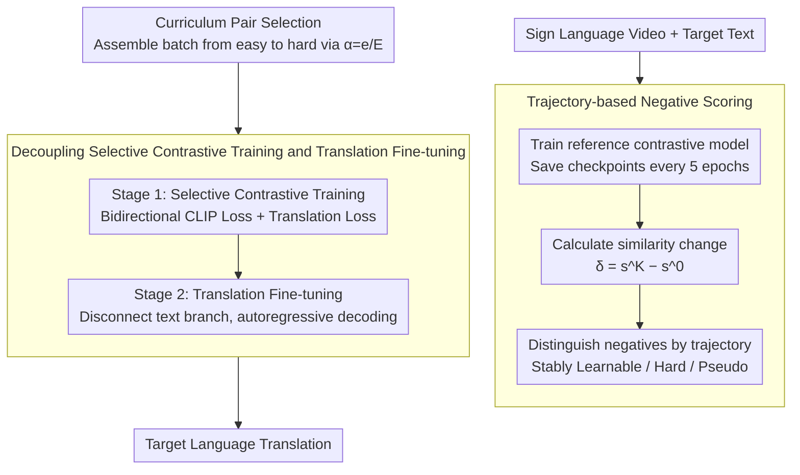

# Selective Contrastive Learning For Gloss Free Sign Language Translation

**Conference**: ACL2026  
**arXiv**: [2604.22374](https://arxiv.org/abs/2604.22374)  
**Code**: Not publicly available  
**Area**: Multimodal VLM / Sign Language Translation  
**Keywords**: Gloss-Free Sign Language Translation, Selective Contrastive Learning, Negative Sample Selection, Curriculum Learning, Cross-modal Alignment

## TL;DR
This paper discovers that random in-batch negative samples in sign language translation often serve as unreliable or semantically conflicting supervision signals. Consequently, it utilizes similarity trajectories from a reference model to filter more informative negative samples and improves gloss-free sign language translation quality through a curriculum-based contrastive learning approach from easy to hard.

## Background & Motivation
**Background**: Gloss-free sign language translation directly maps continuous sign language videos to natural language sentences without relying on word-level intermediate annotations like glosses. Recent high-performing methods typically incorporate CLIP-style vision-language pre-training between video and text encoders to pull matching video-text pairs closer and push non-matching pairs apart, subsequently feeding the aligned visual representation into a translation decoder.

**Limitations of Prior Work**: Standard contrastive learning treats all texts in a mini-batch except the positive example as negative samples. However, modeling sign language videos is computationally expensive, leading to small batch sizes and low coverage of negative samples per update. More critically, in narrow-domain datasets like PHOENIX14T and datasets with duplicate target sentences like CSL-Daily, many "negative samples" are semantically similar or even identical in text, resulting in conflicting supervision when forced apart.

**Key Challenge**: Sign language translation requires stronger video-text alignment, yet random negatives are both insufficient in coverage and contain false negatives. Simply expanding the batch size or adding external annotations increases costs, while continuing to rely on random contrastive learning pushes apart samples that should ideally be close.

**Goal**: The authors aim to answer two questions: First, are in-batch negative samples effectively pushed apart during training? Second, can training dynamics alone be used to select more valuable negative samples to improve alignment without additional annotations or LLM assistance?

**Key Insight**: The paper first trains a standard contrastive model and tracks the similarity trajectories of all video-text negative pairs every 5 epochs. The authors observe that only 35.9% of negatives follow the ideal "high-to-low similarity" trend, while 31.9% maintain high similarity long-term, and 17.8% even become more similar, indicating highly non-uniform negative sample contributions.

**Core Idea**: Use the change in similarity from a reference contrastive model to score negative samples, then employ curriculum learning to transition from stably separable negatives to harder-to-distinguish negatives, replacing purely random in-batch contrast.

## Method

### Overall Architecture
The SCL-SLT workflow consists of three steps. First, a reference contrastive model is trained on sign videos and target texts using standard CLIP-style training, saving multiple checkpoints. Second, these checkpoints are used to calculate the similarity change for any video-text negative pair, using "how the similarity evolves during training" as a proxy for negative sample difficulty and informativeness. Third, during target SLT model training, mini-batches are no longer formed randomly but constructed according to curriculum ratios to include specific negative sample structures, followed by selective contrastive training and translation fine-tuning.

The model itself includes Sign Embedding, Visual Encoder, Text Encoder, and Decoder. Sign Embedding uses an ImageNet-pretrained ResNet-18 for spatial features and two Conv1D/BN/ReLU layers for temporal modeling. The Visual Encoder, Text Encoder, and Decoder are initialized from mBART-large-50, with the text encoder frozen during the contrastive stage and the visual encoder and decoder adapted via LoRA. The alignment phase uses CiCo-style fine-grained video-text similarity to calculate bidirectional contrastive loss while retaining translation loss. The translation fine-tuning phase disconnects the text branch and optimizes only the autoregressive translation objective.

### Key Designs

**1. Trajectory-based Negative Scoring: Using training dynamics rather than static similarity to judge the value of negative samples**

Standard contrastive learning only considers instantaneous similarity within the current batch, failing to distinguish whether a negative pair is "truly hard and worth learning" or "effectively a false negative that should not be pushed apart." This paper takes a different perspective: it trains a reference model, saves checkpoints, and uses the similarity difference $\delta_{i,j}=\hat{s}^{K}(V_i,T_j)-\hat{s}^{0}(V_i,T_j)$ between sign video $V_i$ and non-matching text $T_j$ from early and late checkpoints to characterize the training dynamics. The batch score is the sum of these changes for all non-diagonal pairs. This distinguishes three types of negatives: H→L indicates the model can push them apart (Stably Learnable), L→H indicates they become harder to distinguish (Hard Negatives), and H→H likely indicates semantic neighbors or pseudo-negatives. Incorporating training history into sample selection prevents updates from being dominated by noisy negatives.

**2. Curriculum Pair Selection: Starting from separable negatives and transitioning to harder ones**

Feeding only the hardest negatives immediately can bias training due to pseudo-negatives and semantic neighbors; however, feeding only easy samples keeps alignment superficial. This paper avoids random batching, instead adjusting difficulty via a curriculum ratio $\alpha=e/E$ (where $e$ is the current epoch and $E$ is the total epochs). A positive example is chosen as a seed, and for each candidate sample, the incremental score $\Delta(s_u;\mathcal{C})$ it brings to the current batch is calculated. Candidates are then selected based on their score percentile. Early training focuses on stably separable negatives to establish boundaries, while later stages move towards high-similarity, harder-to-distinguish negatives to refine fine-grained differences. Ablation shows that a Log-shaped curriculum (the smoothest transition) achieves the highest BLEU-4 of 25.30, while Hard-Only collapses to 12.41, proving the necessity of this easy-to-hard transition.

**3. Decoupling Selective Contrastive Training and Translation Fine-tuning: Mastering alignment before focusing on translation**

Video-text alignment and sentence generation are distinct objectives. The appendix shows that directly merging standard contrastive loss into end-to-end translation training leads to significant performance drops. Thus, a two-stage approach is adopted: the selective contrastive stage calculates bidirectional CLIP-style losses (video→text and text→video) while maintaining a translation loss weight of 1.0 to ensure learned representations remain suitable for generation. The subsequent SLT fine-tuning stage removes the auxiliary text encoder and alignment module, allowing the decoder to generate target sentences solely based on video representations. Treating contrastive learning as a pre-training alignment phase before separate translation fine-tuning is more stable than forcing both objectives together.

### Loss & Training
Training is divided into two stages: Stage 1 involves 80 epochs of selective contrastive training, and Stage 2 involves 200 epochs of translation fine-tuning. The optimizer is AdamW with a learning rate of $1\times10^{-4}$, cosine decay, and label smoothing of 0.2. Batch sizes for Stage 1 and Stage 2 are 16 and 8, respectively. Inference uses a beam size of 8. The visual encoder and decoder employ LoRA with rank 16 and scale 32. The text encoder is frozen to provide a stable language prior.

## Key Experimental Results

### Main Results
The paper reports ROUGE and BLEU on two gloss-free SLT benchmarks: PHOENIX14T and CSL-Daily. PHOENIX14T contains 7,096/519/642 samples for training/validation/test, while CSL-Daily contains 18,401/1,077/1,076 samples.

| Setting | Method | PHOENIX14T R | PHOENIX14T B4 | CSL-Daily R | CSL-Daily B4 |
|------|------|--------------|---------------|-------------|--------------|
| w/o VLP | SignLLM | 44.49 | 23.40 | 39.91 | 15.75 |
| w/o VLP | SCL-SLT | 46.33 | 25.30 | 48.53 | 21.41 |
| w/ VLP | LLAVA-SLT | 50.44 | 23.43 | 51.26 | 20.42 |
| w/ VLP | C2RL | 50.96 | 26.75 | 48.21 | 21.61 |
| w/ VLP | MMSLT | 47.97 | 25.73 | 48.92 | 21.11 |
| w/ VLP | SCL-SLT | 47.02 | 26.00 | 51.08 | 23.25 |

The gain of SCL-SLT is most significant on CSL-Daily, where BLEU-4 reaches 23.25 under the w/ VLP setting, outperforming C2RL (21.61) by 1.64 and LLAVA-SLT (20.42) by 2.83. On PHOENIX14T, it does not surpass C2RL's 26.75 but reaches 26.00 without complex auxiliary tasks, indicating that negative sample selection itself provides strong alignment benefits.

### Ablation Study

| Config | PHOENIX14T R | PHOENIX14T B4 | CSL-Daily R | CSL-Daily B4 | Notes |
|------|--------------|---------------|-------------|--------------|------|
| BaseLine End-to-End | 41.81 | 21.97 | 41.04 | 16.31 | Direct translation training |
| w/ CL | 43.55 | 22.03 | 47.77 | 20.59 | Standard random contrastive learning |
| w/ SCL | 46.33 | 25.30 | 48.53 | 21.41 | Inclusion of selective negatives |
| CL-SLT | 46.13 | 25.01 | 48.34 | 20.70 | Standard CL pre-train then fine-tune |
| SCL-SLT | 47.02 | 26.00 | 51.08 | 23.25 | Selective CL pre-train then fine-tune |

| Analysis Item | Setting | PHOENIX14T B4 | Key Conclusion |
|--------|------|---------------|----------|
| Curriculum Schedule | Hard-Only | 12.41 | Hard negatives alone interfere with training |
| Curriculum Schedule | Easy-Only | 24.00 | Stable but lacks late-stage challenges |
| Curriculum Schedule | Linear | 24.59 | Dynamic curriculum outperforms static strategies |
| Curriculum Schedule | Sqrt | 24.54 | Similar to Linear |
| Curriculum Schedule | Log | 25.30 | Optimal; smoother transition is more stable |
| Trajectory Interval | 1 epoch | 24.68 | Dense sampling introduces noise |
| Trajectory Interval | 5 epochs | 25.30 | Best balance between trend and noise |
| Trajectory Interval | 10 epochs | 6.26 | Sparse sampling misjudges dynamics |

### Key Findings
- Standard CL improves CSL-Daily significantly but yields minimal gains on PHOENIX14T, where texts are highly homogeneous and random negatives often include semantic neighbors. SCL's more pronounced improvement on PHOENIX14T suggests it effectively addresses the false negative problem.
- In CSL-Daily, many target sentences correspond to multiple different videos, making false negatives from duplicate text prominent; Pair Selection explicitly avoids some of these conflicts.
- CiCo aggregation far outperforms CLS Pooling and Mean Pooling. PHOENIX14T BLEU-4 is 25.30 for CiCo, compared to only 14.85 and 12.44 for CLS and Mean respectively, indicating that fine-grained cross-modal aggregation is a necessary foundation for selective contrastive learning.

## Highlights & Insights
- The strongest aspect of this paper is reframing the "utility of negative samples" from a static semantic similarity problem to a training dynamics problem. Similarity trajectories naturally contain information about whether a model can learn to distinguish a pair, making them better for curriculum learning than single-point similarity.
- The method does not rely on extra glosses, action descriptions, or LLMs, but instead mines cleaner contrastive signals from within existing training data. This is valuable for sign language data where annotations are scarce.
- Contrastive learning is not always "the more, the better" for generation tasks. The results remind us that cross-modal alignment and translation objectives are best handled in stages; otherwise, alignment loss might suppress generation capabilities.
- The idea of Pair Selection can be transferred to scenarios like image-text retrieval, video captioning, and medical imaging report generation, wherever semantic neighbors or duplicate texts cause issues for random in-batch negatives.

## Limitations & Future Work
- The method requires training a reference contrastive model beforehand to calculate trajectories, adding extra overhead to the data preparation phase. The authors suggest using off-the-shelf pre-trained models to approximate semantic similarity in the future.
- Negative sample selection still relies on internal training dynamics and cannot fundamentally identify all semantically equivalent samples. If the data annotations themselves are noisy, trajectory signals might be affected.
- Experiments focus on PHOENIX14T and CSL-Daily, which are relatively controlled. Real-world sign language scenarios involving dialects, signer variation, occlusion, and non-standard expressions may present more complex cross-domain issues.
- The current curriculum strategy uses hand-crafted percentile scheduling. Future work could explore adaptive scheduling based on validation alignment or translation quality.

## Related Work & Insights
- **vs GFSLT-VLP**: GFSLT-VLP introduced CLIP-style pre-training to gloss-free SLT. This paper identifies the instability of standard in-batch negatives and improves upon negative sample construction within the same paradigm.
- **vs CiCo**: CiCo improves video-text similarity aggregation. SCL-SLT borrows CiCo for its similarity matrix but focuses its core contribution on sample selection for contrast.
- **vs LLAVA-SLT / SignLLM**: These methods emphasize leveraging LLM language priors. SCL-SLT demonstrates that without LLM assistance, optimizing internal contrastive signals alone can yield competitive results.
- **vs C2RL / MMSLT**: These rely on extra auxiliary objectives or descriptive supervision. This paper’s advantage lies in its simplicity and modularity, though it still requires reference model training.

## Rating
- Novelty: ⭐⭐⭐⭐ Pair-level curriculum learning driven by similarity trajectories is highly targeted and the problem is well-defined.
- Experimental Thoroughness: ⭐⭐⭐⭐ Main experiments, curriculum scheduling, aggregation methods, and sampling intervals are covered, though cross-domain and real-world validation is limited.
- Writing Quality: ⭐⭐⭐⭐ The motivation and trajectory analysis are clear, though some tables appear crowded in HTML format.
- Value: ⭐⭐⭐⭐⭐ Directly inspired sign language translation and other cross-modal tasks where false negatives persist.

<!-- RELATED:START -->

## Related Papers

- [\[ACL 2026\] Think in Latent Thoughts: A New Paradigm for Gloss-Free Sign Language Translation](think_in_latent_thoughts_a_new_paradigm_for_gloss-free_sign_language_translation.md)
- [\[ACL 2026\] CLewR: Curriculum Learning with Restarts for Machine Translation Preference Learning](clewr_curriculum_learning_with_restarts_for_machine_translation_preference_learn.md)
- [\[ACL 2026\] NeoAMT: Neologism-Aware Agentic Machine Translation with Reinforcement Learning](neoamt_neologism-aware_agentic_machine_translation_with_reinforcement_learning.md)
- [\[ACL 2026\] Structure-Guided Entity Resolution: Fine-Tuning LLMs for Robust Name Matching in Complex Linguistic Contexts](structure-guided_entity_resolution_fine-tuning_llms_for_robust_name_matching_in_.md)
- [\[ACL 2026\] TLPO: Token-Level Policy Optimization for Mitigating Language Confusion in Large Language Models](tlpo_token-level_policy_optimization_for_mitigating_language_confusion_in_large_.md)

<!-- RELATED:END -->
