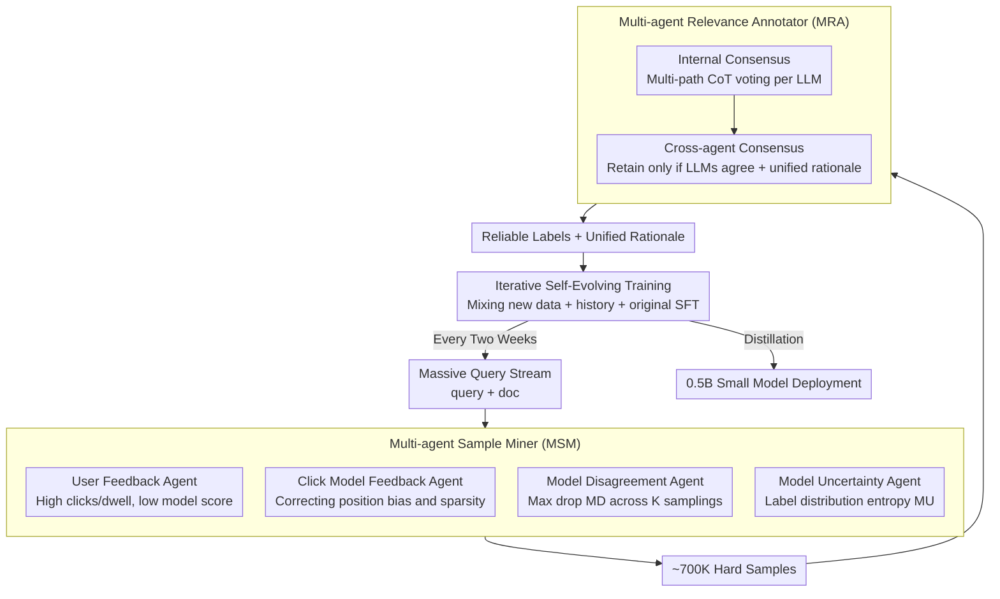

# SERM: Self-Evolving Relevance Model with Agent-Driven Learning from Massive Query Streams

**Conference**: ACL 2026 Findings  
**arXiv**: [2601.09515](https://arxiv.org/abs/2601.09515)  
**Code**: None  
**Area**: Multilingual Translation  
**Keywords**: Search Relevance, Self-Evolving Model, Multi-Agent Annotation, Query Stream Adaptation, Distribution Shift

## TL;DR

The authors propose the SERM framework, which utilizes a Multi-agent Sample Miner and a Multi-agent Relevance Annotator to continuously evolve search relevance models from massive real-world query streams. After three iterations, it achieved a +2.99 increase in NDCG@1 on an industrial search platform and significantly improved user retention in online A/B tests.

## Background & Motivation

**Background**: Search relevance modeling is central to information retrieval, aiming to rank candidate documents for a given query. Traditional methods employ discriminative modeling (encoder + scoring function), while recent research leverages the generative capabilities of LLMs to directly produce relevance judgments and justifications. The standard training pipeline is a two-stage process of "continual pre-training + supervised fine-tuning".

**Limitations of Prior Work**: Real-world query distributions undergo dynamic and continuous evolution—users constantly introduce new expressions, cultural references, and emerging linguistic patterns. Static training data fails to cover these changes, leading to insufficient model generalization. For instance, queries like "remember me pets arriving on 10/27" contain subtle semantics (commemorating deceased pets vs. generic pet arrival) that models find difficult to capture.

**Key Challenge**: Self-evolution is a promising direction but faces two challenges when applied to industrial-scale query streams: (C1) informative samples are extremely sparse within massive query volumes and are difficult to identify; (C2) pseudo-labels generated by the model itself can be unreliable, leading to error accumulation.

**Goal**: Design a search relevance model capable of continuous self-evolution from massive query streams while simultaneously addressing the challenges of sample discovery and label reliability.

**Key Insight**: Utilize a multi-agent framework where multiple roles perform specific duties: an Environmental Feedback Agent uses user click/dwell signals to discover hard samples, an Introspective Feedback Agent uses model inconsistency and uncertainty to identify weaknesses, and a Multi-agent Annotator generates reliable labels through a two-level consensus mechanism.

**Core Idea**: Employ a Multi-agent Sample Miner to efficiently filter hard samples that the model needs to learn most from massive query streams, and then use a Multi-agent Annotator (multi-LLM + internal/external consensus) to generate reliable labels for these samples, achieving iterative self-evolution.

## Method

### Overall Architecture

SERM addresses a practical problem in industrial search: query distributions change daily, but relevance models typically remain static after training. It is built upon an LLM-based generative relevance model—taking a query+doc as input, the model first generates a reasoning rationale and then outputs a relevance score from 0-3. On top of this base, SERM implements a self-evolution cycle that runs every two weeks: first, the "Multi-agent Sample Miner" extracts approximately 700K hard samples that the model needs to learn most from the new query stream. Then, the "Multi-agent Annotator" assigns reliable labels to these samples. Finally, the new data is mixed with historical SFT data for retraining, absorbing new distributions without forgetting old knowledge. The two main difficulties of this closed loop—sparse hard samples and unreliable pseudo-labels—are handled by the miner and annotator respectively.

### Key Designs

**1. Multi-agent Sample Miner (MSM): Extracting "Necessary Lessons" from Massive Queries**

Hard samples are extremely sparse in industrial-scale query streams. Relying on any single signal would miss a large portion—user behavior has position bias and sparsity, while internal model signals cannot see new real-world demands. MSM therefore deploys four types of complementary agents in parallel, using their union to cover different types of "hardness". The first two focus on external signals: the User Feedback Agent identifies human-machine contradictions where user clicks and dwell times are high but the model gives a low score. The Click Model Feedback Agent uses a pre-trained click model to compensate for position bias and sparsity in raw clicks. The latter two focus on the model's own vacillation: the Model Disagreement Agent runs K temperature samplings for the same query-doc pair and calculates the maximum discrepancy:

$$MD(q,d) = \max_{i,j} |f^i(q,d) - f^j(q,d)|$$

A larger discrepancy indicates model indecision. The Model Uncertainty Agent directly calculates the entropy of the label distribution: $MU(q,d) = -\sum_y \Pr(y|q,d) \log \Pr(y|q,d)$, where high entropy also signifies model swaying. External contradictions capture changes in the world unknown to the model, while internal hesitation exposes the model's own cognitive gaps. Together, they form a comprehensive and accurate "learning list".

**2. Multi-agent Relevance Annotator (MRA): Filtering Pseudo-label Noise through Cross-model Consensus**

If the extracted hard samples were labeled by the model itself, it would fall into the trap of self-training—where erroneous labels are repeatedly fed back, leading to drift. MRA instead uses a two-level consensus to produce trustworthy labels. The first level is internal consensus: each LLM (e.g., GPT-4o, Gemini 2.5 Pro) first retrieves external knowledge to supplement context, then generates several independent reasoning chains via multi-path CoT and performs majority voting to suppress the stochasticity of a single output. The second level is cross-agent consensus: only samples where multiple different LLMs assign the same label are retained, and all reasoning paths supporting that label are synthesized into a single unified rationale. In this way, internal voting addresses the issue of "the same model saying different things," and cross-model consistency addresses "systematic bias inherent to a specific model." These two hurdles filter out the lethal noise labels typical of self-training—this is also the fundamental difference between MRA and unidirectional knowledge distillation: it is evolutionary feedback that strengthens with iterations, rather than a one-time transfer from a fixed teacher.

**3. Iterative Self-Evolving Training: Retraining with Mixed Data to Grow with the Distribution**

With reliable labels obtained, the final step is to feed them back to the model without regression. In each iteration, SERM mixes newly generated data, historical iteration data, and original SFT data for retraining. The old data acts as an anchor to prevent catastrophic forgetting, while the new data tracks distribution shift. The iteration cycle is set to two weeks to ensure that enough shift has accumulated in the query distribution to justify retraining. The trained large model can also be distilled into a 0.5B small model for deployment to meet latency constraints in search scenarios—and because the labels are cleaner, the performance after distillation is better than that of self-training distillation.

### Method Mechanism Example: A Sample's Lifecycle

Take the query "remember me pets arriving on 10/27" as an example. This is a difficult sample: the user is searching for "pet memorial" services, but the literal text looks like "pets arriving home on 10/27." During the mining phase, the user feedback agent discovers that users click memorial-related results heavily and stay long, while the model gives these results low scores—a typical human-machine contradiction is flagged. Simultaneously, the model disagreement agent runs K-way sampling and finds the model flips between scores of 1 and 3, resulting in a high $MD$, further confirming it as a hard sample. Moving to the annotation phase, GPT-4o and Gemini 2.5 Pro each retrieve "remember me pets" background info and run multiple CoT paths. After internal voting, both judge the memorial documents as highly relevant. Since the models reach cross-model consensus, the sample is retained, and reasoning paths are synthesized into a unified rationale. Finally, this sample with a reliable label is mixed with historical SFT data for the $N$-th round of retraining, allowing the model to correctly handle such subtle semantic queries in the next round.

### Loss & Training

The generative modeling objective is $\mathcal{L}_g = -\mathbb{E} \log \Pr_\theta(y|q,d)$, where the model generates a rationale followed by a relevance score of 0-3. During iterative training, three types of data are mixed to prevent forgetting. Distillation utilizes KL-divergence loss.

## Key Experimental Results

### Main Results

| Method | Model | Germanic NDCG@1 | Romance NDCG@1 | Minor Lang NDCG@1 |
|--------|------|------|----------|------|
| CT+SFT | 7B | 84.74 | 85.61 | 82.02 |
| Self-Training Iter3 | 7B | 84.78 | 85.58 | 82.20 |
| SERM Iter3 | 7B | 87.56 | 88.14 | 84.99 |
| CT+SFT | 1.5B | 84.59 | 85.99 | 81.75 |
| SERM Iter3 | 1.5B | 87.30 | 87.83 | 84.75 |

### Online A/B Testing

| Metric | Gain | P-value |
|------|---------|------|
| 14-day Retention | +0.0359% | 0.0278 |
| User Negative Feedback | -1.2081% | 0.0001 |
| Reformulation Rate | -0.0839% | 0.0023 |
| Reformulation Rate (Long-tail) | -0.1312% | 0.0015 |

### Key Findings

- After three iterations, SERM improved NDCG@1 by +2.82 (7B) / +2.71 (1.5B), whereas Self-Training only improved by +0.04 / +0.45. Furthermore, Self-Training showed degradation in the third round due to error propagation.
- Distillation Effect: SERM distilled into a 0.5B model outperformed Self-Training distillation, indicating that more reliable labels were transferred to the smaller model.
- Online A/B testing showed significant improvements in user experience—negative feedback decreased by 1.2%, and 14-day retention increased by 0.036%, which is highly significant on a platform with billions of daily requests.
- The instability of self-training was particularly evident in the third round (Germanic NDCG@1 dropped from 84.95 back to 84.78), validating the issue of pseudo-label error accumulation.

## Highlights & Insights

- **Sophisticated Multi-agent Collaboration**: Environmental feedback (user signals) and introspective feedback (model uncertainty) complement each other—the former captures external information unknown to the model, while the latter discovers the model's own cognitive gaps. This design is transferable to any system requiring continuous learning from data streams.
- **Two-level Consensus Annotation Mechanism**: Internal multi-path voting plus cross-model consensus filters noise layer by layer. Compared to simple knowledge distillation or self-training, this mechanism fundamentally addresses the unreliability of pseudo-labels.
- **Industrial-scale Validation**: Online A/B tests on a real search platform with billions of daily requests make the results highly persuasive.

## Limitations & Future Work

- Reliance on GPT-4o and Gemini 2.5 Pro as annotators involves high API costs, and the annotators themselves may harbor biases.
- A bi-weekly iteration frequency might not keep pace with sudden query distribution shifts caused by breaking news or viral events.
- Currently only validated on document search; extending to multi-modal scenarios like video or image search requires additional adaptation.
- Exploration: Reduce reliance on external LLMs (e.g., using the model itself as one of the annotators to form a hybrid consensus) and introduce active learning strategies to select samples for annotation more efficiently.

## Related Work & Insights

- **vs. Self-Training**: Self-training directly uses the model's own predictions as pseudo-labels, leading to degradation after three iterations; SERM provides reliable labels through multi-agent consensus of external LLMs, delivering stable and continuous improvements.
- **vs. Knowledge Distillation**: Distillation is a unidirectional knowledge transfer from a fixed teacher to a student; SERM provides iterative evolutionary feedback—the model in each round is stronger than the last, and the annotation quality improves accordingly.

## Rating

- Novelty: ⭐⭐⭐⭐ The combination of multi-agent sample mining and two-level consensus annotation is novel and appropriately designed for industrial scenarios.
- Experimental Thoroughness: ⭐⭐⭐⭐⭐ Offline multilingual evaluation combined with online A/B testing provides highly persuasive industrial-grade validation.
- Writing Quality: ⭐⭐⭐⭐ Problem motivation and method descriptions are clear, though mathematical notation is somewhat dense.
- Value: ⭐⭐⭐⭐⭐ Directly addresses a core pain point in industrial search and has been validated through deployment on a large-scale platform.

<!-- RELATED:START -->

## Related Papers

- [\[ACL 2026\] Scripts Through Time: A Survey of the Evolving Role of Transliteration in NLP](scripts_through_time_a_survey_of_the_evolving_role_of_transliteration_in_nlp.md)
- [\[ACL 2026\] CLewR: Curriculum Learning with Restarts for Machine Translation Preference Learning](clewr_curriculum_learning_with_restarts_for_machine_translation_preference_learn.md)
- [\[ACL 2026\] From Fragments to Facts: A Curriculum-Driven DPO Approach for Generating Hindi News Veracity Explanations](from_fragments_to_facts_a_curriculum-driven_dpo_approach_for_generating_hindi_ne.md)
- [\[ACL 2026\] FairQE: Multi-Agent Framework for Mitigating Gender Bias in Translation Quality Estimation](fairqe_multi-agent_framework_for_mitigating_gender_bias_in_translation_quality_e.md)
- [\[NeurIPS 2025\] MERIT: Multilingual Semantic Retrieval with Interleaved Multi-Condition Query](../../NeurIPS2025/multilingual_mt/merit_multilingual_semantic_retrieval_with_interleaved_multi-condition_query.md)

<!-- RELATED:END -->
