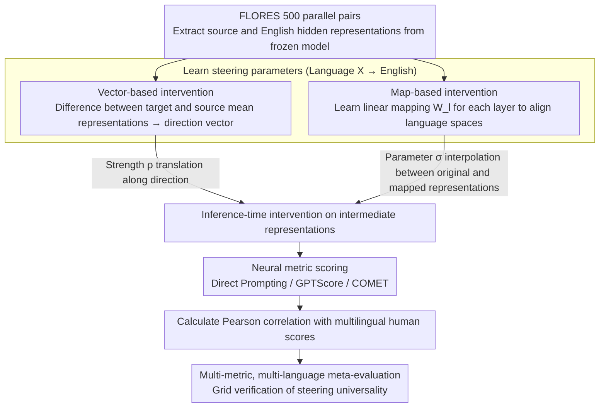

# SteerEval: Inference-time Interventions Strengthen Multilingual Generalization in Neural Summarization Metrics

**Conference**: ACL2026  
**arXiv**: [2601.15809](https://arxiv.org/abs/2601.15809)  
**Code**: The paper does not provide a public repository link  
**Area**: Multilingual Evaluation / Machine Translation and Summarization Evaluation  
**Keywords**: activation steering, multilingual summarization evaluation, LLM-as-a-judge, COMET, English pivot language

## TL;DR
SteerEval investigates aligning the hidden representations of multilingual evaluation models toward high-resource pivot languages during inference. It finds that steering toward English or French generally improves the correlation between automated multilingual summarization metrics and human scores, particularly benefiting low-baseline languages and encoder-based COMET metrics.

## Background & Motivation
**Background**: Summarization and natural language generation (NLG) tasks have long relied on automated metrics to replace expensive human evaluation. From BLEU and ROUGE to COMET and BERTScore, and recently to LLM-as-a-judge, model-based metrics have become increasingly common in English tasks and are gradually being applied to multilingual evaluation.

**Limitations of Prior Work**: In multilingual scenarios, the correlation between model metrics and human judgment is unstable. Specifically, on languages such as Yoruba, Hebrew, and Turkish, some LLM evaluators even exhibit near-zero or negative correlations. This implies that directly transferring English evaluation paradigms to low-resource languages introduces noise into system comparisons and research progress.

**Key Challenge**: Multilingual LLMs are often hypothesized to use English as an internal pivot language. This internal geometric structure aids cross-lingual generalization, but when target language representations are not well-aligned to this pivot space, the quality of downstream generation or evaluation declines. The core question is: does this representation misalignment also affect automated evaluation metrics?

**Goal**: The authors aim to verify a simple hypothesis: whether steering the internal representations of low-resource or non-English inputs toward the English direction during inference can make neural summarization metrics more closely align with human judgment.

**Key Insight**: Instead of retraining metrics, the authors perform test-time intervention within frozen models. The study covers both decoder-based LLM-as-a-judge and encoder-based COMET to observe if steering serves as a more universal corrective tool for multilingual evaluation.

**Core Idea**: Utilize 500 parallel sentence pairs from FLORES to learn "Language X to English" vectors or linear mappings. During evaluation, perform controllable interpolation or offsets on model hidden representations to examine if the Pearson correlation improves.

## Method

### Overall Architecture
SteerEval does not retrain any evaluation metrics. Instead, it validates whether "pushing" the hidden representations of low-resource inputs toward the English pivot space improves the correlation between metrics and human evaluation. The pipeline consists of three steps. First, hidden representations of the source language and English are extracted from a frozen model using 500 FLORES parallel pairs to learn the "Language X → English" steering direction or linear mapping. Second, during evaluation inference, the intermediate representations of the summary are adjusted toward the English direction according to a strength parameter. Third, the adjusted neural metrics are used to score system summaries, followed by calculating the Pearson correlation with multilingual human scores.

The authors test this intervention across three categories of metrics: Direct Prompting (LLM outputs a 1-5 score); GPTScore (scoring via conditional generation probability); and COMET (using wmt22-comet-da adapted for summarization by leaving the source empty, treating the system summary as the hypothesis and the human summary as the reference).

### Key Designs
**1. Vector-based intervention: Translating representations using a language direction vector**

If the "English pivot" truly corresponds to an approximately linear direction in the representation space, the simplest method is direct translation. Specifically, for a set of parallel sentences, the difference between the mean representation of the target language and the source language is calculated to obtain a per-layer language direction vector. During evaluation, this direction multiplied by strength $\rho$ is added to the hidden states. For LLM metrics, this is applied layer-wise, while for COMET, it is applied only to the pooled representation. This method involves minimal parameters but, as directions and distances are not normalized, the numerical meaning of $\rho$ is inconsistent across languages.

**2. Map-based intervention: Learning a linear mapping to project source representations into the target space**

Vector differences only model translation, whereas representation misalignment between languages often involves rotation and scaling. This method learns a matrix $W_l$ for each layer to minimize the distance between the transformed source representation and the target representation. During inference, parameter $\sigma$ is used for interpolation between the original representation and the mapped target representation; a larger $\sigma$ moves the representation closer to the target language. Compared to vector translation, linear mapping accounts for more complex geometric transformations at the cost of requiring parallel sentences for least-squares alignment.

**3. Multi-metric, multi-language meta-evaluation: Systematic verification across a cross-grid**

The difficulty of multilingual evaluation lies in the entanglement of languages, models, prompts, and evaluation dimensions. To ensure robustness, the authors test across multiple LLM backbones (Llama-3-8B Instruct, Bloom-7B, Aya-expanse-8B, and Aya-expanse-32B) and languages (Arabic, Spanish, Hebrew, Japanese, Turkish, Ukrainian, Yoruba, and Chinese). Evaluation dimensions cover coherence and completeness. By comparing performance across this entire grid, the authors demonstrate that steering is a general corrective tool rather than an artifact of a specific backbone.

### Loss & Training
No metrics were retrained in this study. Steering parameters are derived entirely from the hidden representations of frozen models: the vector method uses mean differences, while the map method uses least-squares alignment on parallel sentences. Due to the lack of language-specific development sets, the main results report "oracle" results using the best steering intensity for each language; the analysis section systematically scans $\sigma$ and $\rho$ and discusses the necessity of validation sets for parameter selection in real-world deployment.

## Key Experimental Results

### Main Results
The baseline without steering shows that multilingual neural evaluation metrics are inherently unstable. The highest Pearson correlation is only 0.34, and negative correlations appear across multiple languages, models, and dimensions.

| Metric / Model | Representative Strength | Representative Weakness | Conclusion |
|----------------|-------------------------|-------------------------|------------|
| COMET wmt22-comet-da | Arabic completeness 0.27, Japanese completeness 0.23 | Yoruba coherence -0.05, Yoruba completeness -0.04 | Small encoder metrics are competitive in some languages but unstable in low-resource ones |
| Direct Prompting Bloom-7B | Chinese coherence 0.08 | Negative for multiple languages, e.g., Arabic completeness -0.14 | Direct scoring is highly sensitive to models and languages |
| Direct Prompting Llama3-8B | Japanese coherence 0.24, Japanese completeness 0.29 | Hebrew coherence -0.05, Hebrew completeness -0.08 | Llama3 is a more stable backbone for direct prompting |
| GPTScore Aya-exp 32B | Japanese completeness 0.34 | Yoruba completeness -0.07 | GPTScore is generally more stable than direct prompting |
| GPTScore Llama3-8B | Spanish coherence 0.23, Chinese coherence 0.22 | Yoruba coherence -0.06 | Correlation is better for mid-to-high resource languages |

After steering, the overall trend shows improved correlation in the vast majority of settings, with larger gains in low-baseline settings.

| Phenomenon | Key Figures or Examples | Implication |
|------------|-------------------------|-------------|
| Steering is nearly universally effective | Improvement in most languages, metrics, and dimensions; some relative improvements exceed 100% | Representation alignment improves consistency between metrics and human judgment |
| Larger gains for low-baseline languages | Hebrew, Turkish, and Yoruba often see larger relative improvements | Languages with more severe representation misalignment benefit more from intervention |
| Direct Prompting improves drastically but remains limited | Bloom-7B Japanese coherence improved from near 0 to 0.18 | Percentage gains can be inflated by low denominators; direct prompting is still not the most stable metric |
| Mid-baseline settings also improve | Llama3-8B Spanish coherence improved from 0.15 to 0.20 | Steering does not just "fix" broken settings but provides robust gains |
| COMET is highly sensitive to steering | Multiple languages/dimensions saw relative improvements over +50% | Encoder-based metrics also benefit from hidden representation intervention |

### Ablation Study
The analysis experiments focus on steering methods, strength parameters, and target languages.

| Analysis Item | Finding | Explanation |
|---------------|---------|-------------|
| Vector vs Map | Both generally show improvement; Vector often provides larger gains for COMET and low-baseline settings | Vector method is simpler but more language-specific in intensity; can be more aggressive |
| Map Strength $\sigma$ | Larger $\sigma$ typically yields higher average relative improvement; $\sigma=1$ is best on average | Moving entirely toward the target representation is often beneficial but doesn't guarantee a rise for all languages |
| Vector Strength $\rho$ | $\rho=-5$ yields the highest average relative improvement; ~60% of settings outperform no steering; positive $\rho$ is generally harmful | Direction and distance are not normalized; numerical meaning is inconsistent across languages |
| Language Vector Similarity | Except for Yoruba, most "Language X to English" vectors show high similarity in middle layers | Supports the hypothesis of a shared cross-lingual geometric structure; Yoruba is a clear outlier |
| French as Target | Significant improvements in most settings | High-resource languages well-aligned with the English space can also serve as pivots |

### Key Findings
- The bottleneck in multilingual summarization evaluation is not only data scarcity but also the misalignment of the model's internal representations with its preferred high-resource pivot space.
- Direct Prompting exhibits the highest variance, GPTScore is more stable, and COMET has unexpectedly large room for improvement under steering.
- The choice of steering factors is highly sensitive; oracle results demonstrate potential rather than immediate deployment effectiveness.
- The cross-lingual similarity of language vectors supports the "shared language geometry" hypothesis, but outliers like Yoruba warn against treating all languages as having identical directions.

## Highlights & Insights
- The paper extends activation steering from generation quality control to "evaluation metric calibration," representing a significant shift in application.
- The experiments on COMET are particularly enlightening: even encoder-based metrics can benefit from pooled representation intervention to improve correlation with human judgment.
- The method does not require retraining metrics, making it suitable as a lightweight test-time correction module in existing evaluation pipelines.
- The results serve as a reminder that the reliability of LLM-as-a-judge for multilingual tasks cannot be assumed based on English performance; negative correlations may occur in low-resource settings.

## Limitations & Future Work
- Main results utilize oracle steering strength due to the lack of language-specific development sets; real-world systems require validation sets or unsupervised criteria for selecting $\rho$ / $\sigma$.
- Human evaluation data has limited sample sizes and annotators per language, leading to potentially high variance in correlation estimates.
- The task focuses on coherence and completeness in summarization; it has not yet covered factual consistency, style, Q&A, or open-ended generation.
- The benefits of steering depend on the target language; while English and French are effective, the optimal source-target combinations require further systematic research.
- Absolute correlation for Direct Prompting remains low; steering is not a substitute for better metric design and multilingual annotated data.

## Related Work & Insights
- **vs BLEU / ROUGE**: Traditional overlap metrics are simple and reproducible but lack cross-lingual and semantic depth; SteerEval targets internal representation calibration for model-based metrics.
- **vs COMET**: Originally a machine translation metric, this paper adapts COMET for summarization and proves that encoder metrics can be improved via steering.
- **vs LLM-as-a-judge**: Direct LLM scoring is useful but unstable; SteerEval demonstrates that hidden representation alignment before scoring influences judge behavior.
- **vs Wang et al. multilingual steering**: Prior work used language mapping to improve generation; this paper transfers the idea to automated evaluation, shifting the goal from generation quality to human correlation.
- **Key Insight**: Multilingual evaluation may require a "metric calibration layer," potentially combining activation steering, language-specific prompts, and small human-annotated development sets.

## Rating
- Novelty: ⭐⭐⭐⭐☆ Using inference-time representation intervention for evaluation metric calibration is a fresh and important perspective.
- Experimental Thoroughness: ⭐⭐⭐⭐☆ Covers multiple metrics, models, languages, and parameter analyses, though oracle tuning limits claims regarding immediate deployment.
- Writing Quality: ⭐⭐⭐⭐☆ Motivation is clear, and results are explained meticulously; note the reliance on relative improvements which can amplify low-baseline effects.
- Value: ⭐⭐⭐⭐☆ Provides significant insights into multilingual NLG evaluation and the reliability of LLM-as-a-judge.

<!-- RELATED:START -->

## Related Papers

- [\[ACL 2025\] Beyond N-Grams: Rethinking Evaluation Metrics and Strategies for Multilingual Abstractive Summarization](../../ACL2025/multilingual_mt/beyond_n-grams_rethinking_evaluation_metrics_and_strategies_for_multilingual_abs.md)
- [\[ACL 2026\] Enhancing BiGRU with a KAN Block for Legal Document Classification and Summarization](enhancing_bigru_with_a_kan_block_for_legal_document_classification_and_summariza.md)
- [\[ACL 2025\] Bridging the Language Gaps in Large Language Models with Inference-Time Cross-Lingual Intervention](../../ACL2025/multilingual_mt/bridging_the_language_gaps_in_large_language_models_with_inference-time_cross-li.md)
- [\[ACL 2026\] Scripts Through Time: A Survey of the Evolving Role of Transliteration in NLP](scripts_through_time_a_survey_of_the_evolving_role_of_transliteration_in_nlp.md)
- [\[ACL 2026\] Multilingual Steering by Design: Multilingual Sparse Autoencoders and Principled Layer Selection](multilingual_steering_by_design_multilingual_sparse_autoencoders_and_principled_.md)

<!-- RELATED:END -->
