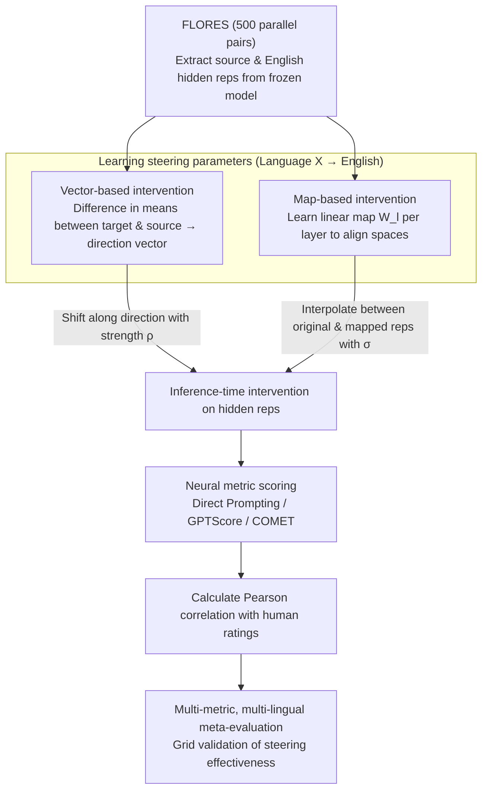

# SteerEval: Inference-time Interventions Strengthen Multilingual Generalization in Neural Summarization Metrics

**Conference**: ACL2026  
**arXiv**: [2601.15809](https://arxiv.org/abs/2601.15809)  
**Code**: No public repository link provided in the paper  
**Area**: Multilingual Evaluation / Machine Translation & Summarization Evaluation  
**Keywords**: activation steering, multilingual summarization evaluation, LLM-as-a-judge, COMET, English pivot language

## TL;DR
SteerEval investigates aligning the hidden representations of multilingual evaluation models toward high-resource pivot languages during inference. It finds that steering toward English or French universally improves the correlation between automatic multilingual summarization metrics and human scores, particularly benefiting low-baseline languages and encoder-based COMET metrics.

## Background & Motivation
**Background**: Summarization and natural language generation tasks have long relied on automatic metrics to replace expensive human evaluation. From BLEU and ROUGE to COMET, BERTScore, and recently LLM-as-a-judge, model-based metrics are increasingly common for English tasks and are gradually being adopted for multilingual evaluation.

**Limitations of Prior Work**: In multilingual scenarios, the correlation between model metrics and human judgment is unstable. For languages such as Yoruba, Hebrew, and Turkish, some LLM scorers even exhibit near-zero or negative correlations. This implies that directly migrating English evaluation paradigms to low-resource languages introduces noise into system comparisons and research progress.

**Key Challenge**: Multilingual LLMs are often thought to use English as an internal pivot language. This internal geometric structure aids cross-lingual generalization, but when target language representations are not well-aligned with this pivot space, downstream generation or evaluation quality degrades. The core question is: does this representation misalignment also affect automatic evaluation metrics?

**Goal**: The authors aim to test a simple hypothesis: whether steering the internal representations of low-resource or non-English inputs toward the English direction during inference can bring neural summarization metrics closer to human judgment.

**Key Insight**: Instead of retraining metrics, the paper performs test-time interventions on frozen models. It covers both decoder-based LLM-as-a-judge and encoder-based COMET to observe if steering is a universal corrective tool for multilingual evaluation.

**Core Idea**: Use parallel sentences from FLORES to learn "Language X to English" vectors or linear mappings. During evaluation, apply controllable interpolation or offsets to the model's hidden representations and measure if the Pearson correlation improves.

## Method

### Overall Architecture
SteerEval does not retrain any evaluation metrics. Instead, it validates whether "pushing" the hidden representations of low-resource inputs toward the English pivot space improves correlation with human judgment. The pipeline consists of three steps. First, hidden representations of source languages and English are extracted from a frozen model using 500 parallel sentence pairs from FLORES to learn steering directions or linear mappings. Second, during inference, intermediate representations of the summaries being evaluated are adjusted toward the English direction based on a strength parameter. Third, system summaries are scored using the adjusted neural metrics, and the Pearson correlation with multilingual human scores is calculated.

The authors test this intervention across three types of metrics: Direct Prompting (LLM outputs 1-5 scores), GPTScore (scoring based on conditional generation probability), and COMET (using wmt22-comet-da adapted for summarization by leaving the source empty and treating the system summary as hypothesis and human summary as reference).

### Key Designs
**1. Vector-based intervention: Translating representations using a language direction vector**

If the "English pivot" corresponds to an approximately linear direction in the representation space, the simplest method is to shift along this direction. Specifically, for parallel sentences, the language direction vector for each layer is the difference between the mean representation of the target language and the source language. During evaluation, this vector is multiplied by strength $\rho$ and added to the source language input's hidden states. For LLMs, this is applied layer-wise; for COMET, it is applied only to the pooled representation. This method is direct with few parameters, though the lack of normalization means the semantic intensity of $\rho$ varies across languages.

**2. Map-based intervention: Learning a linear mapping to project representations**

A vector difference only models translation, but misalignment between languages often involves rotation and scaling. This method learns a matrix $W_l$ for each layer to minimize the distance between the transformed source representation and the target representation. At inference, parameter $\sigma$ interpolates between the original and mapped representations. Linear mapping handles more complex geometric transformations than translation but requires more parameters and uses least squares for alignment.

**3. Multi-metric, multi-lingual meta-evaluation: Cross-grid validation**

Multilingual evaluation is prone to confounding factors like models, prompts, and evaluation dimensions. To ensure robustness, the authors use backbones including Llama-3-8B Instruct, Bloom-7B, Aya-expanse-8B, and Aya-expanse-32B. Testing covers Arabic, Spanish, Hebrew, Japanese, Turkish, Ukrainian, Yoruba, and Chinese across "coherence" and "completeness" dimensions. Steering is considered effective only if improvements are consistent across this grid.

### Loss & Training
Ours does not involve retraining the evaluation models. Steering parameters are derived from frozen model representations: the vector method calculates mean differences, while the map method uses parallel sentences for least-squares alignment. Since no language-specific development sets were used, the main results report "oracle" results using the best steering strength for each setting. The authors scan $\sigma$ and $\rho$ in the analysis section and discuss the need for validation sets in real deployments.

## Key Experimental Results

### Main Results
Baselines without steering show that multilingual neural evaluation metrics are inherently unstable. The highest Pearson correlation is only 0.34, with several negative correlations observed across languages and models.

| Metric / Model | Representative Strength | Representative Weakness | Conclusion |
|----------------|--------------------------|-------------------------|------------|
| COMET wmt22-comet-da | Arabic completeness 0.27, Japanese completeness 0.23 | Yoruba coherence -0.05, Yoruba completeness -0.04 | Small encoder metrics are competitive but unstable for low-resource languages |
| Direct Prompting Bloom-7B | Chinese coherence 0.08 | Negative for multiple languages (e.g., Arabic) | Direct scoring is highly sensitive to model and language |
| Direct Prompting Llama3-8B | Japanese coherence 0.24, Japanese completeness 0.29 | Hebrew coherence -0.05 | Llama3 is a more stable backbone for direct prompting |
| GPTScore Aya-exp 32B | Japanese completeness 0.34 | Yoruba completeness -0.07 | GPTScore is generally more stable than direct prompting |
| GPTScore Llama3-8B | Spanish coherence 0.23 | Yoruba coherence -0.06 | Better correlation for mid-to-high resource languages |

After steering, correlation improves in the vast majority of settings, with low-baseline settings seeing the largest gains.

| Phenomenon | Key Data / Example | Implementation |
|------------|---------------------|----------------|
| Steering is nearly universally effective | Improvement in most languages/metrics; some relative gains >100% | Representation alignment improves consistency with human judgment |
| Low-baseline languages benefit more | Hebrew, Turkish, Yoruba often show larger relative gains | Languages with severe misalignment require more intervention |
| Direct Prompting improves but remains limited | Japanese coherence (Bloom-7B) from ~0 up to 0.18 | Relative gains are high due to low denominators; still less stable than others |
| Mid-baseline settings also improve | Llama3-8B Spanish coherence from 0.15 to 0.20 | Steering provides robust gains beyond just fixing "broken" settings |
| COMET is sensitive to steering | Relative gains > +50% in multiple settings | Encoder-based metrics also benefit from hidden rep intervention |

### Ablation Study
**Vector vs Map**: Both generally yield improvements. Vector-based intervention often sees higher gains in COMET and low-baseline settings due to its more aggressive nature despite fewer parameters.

**Map Strength $\sigma$**: Larger $\sigma$ typically yields higher average relative improvement, with $\sigma=1$ being best on average. Moving entirely toward the target representation is often beneficial, though not for all languages.

**Vector Strength $\rho$**: $\rho=-5$ yielded the highest average relative improvement, with ~60% of settings outperforming the baseline. Positive $\rho$ was generally detrimental, highlighting that direction and distance are not normalized.

**Language Vector Similarity**: Most Language X-to-English vectors are similar in middle layers, except for Yoruba. This supports the concept of a shared cross-lingual geometry, though outliers exist.

**French as Target**: Using French as a pivot also yielded significant improvements in most settings, suggesting other high-resource languages can serve as pivot spaces.

### Key Findings
- The bottleneck in multilingual summarization evaluation is not just data scarcity but the misalignment of internal representations with high-resource pivot spaces preferred by the models.
- Direct Prompting has the highest variance; GPTScore is more stable; COMET shows surprisingly large room for improvement under steering.
- The choice of steering factor is highly sensitive; oracle results indicate potential but require validation sets for actual deployment.
- Cross-lingual similarity of language vectors supports the "shared geometry" hypothesis, but outliers like Yoruba warn against treating all languages as having a single direction.

## Highlights & Insights
- The paper extends activation steering from generation control to "evaluation metric calibration."
- The results for COMET are particularly insightful: even encoder-based metrics can be improved via pooled representation intervention.
- The method is lightweight and requires no retraining, making it suitable as a test-time correction module for existing evaluation pipelines.
- Results emphasize that the reliability of LLM-as-a-judge cannot be assumed based on English performance; low-resource languages may even exhibit negative correlations.

## Limitations & Future Work
- Main results utilize oracle steering strengths; real-world systems would need validation sets or unsupervised criteria for parameter selection.
- The human evaluation dataset has a limited sample size and number of annotators per language, leading to potential variance in correlation estimates.
- The task focuses on coherence and completeness in summarization; it does not yet cover factual consistency, style, or open-ended generation.
- Gains depend on the target language; while English and French work, the optimal source-target combination requires systematic study.

## Related Work & Insights
- **vs BLEU / ROUGE**: Traditional overlap metrics are simple but lack semantic depth; SteerEval focuses on internal calibration of model-based metrics.
- **vs COMET**: Originally a machine translation metric, adapting it to summarization and applying steering proves encoder metrics are also improvable.
- **vs LLM-as-a-judge**: Direct scoring is usable but unstable; SteerEval shows that aligning representations before scoring significantly impacts judge behavior.
- **vs Wang et al. multilingual steering**: Previous work improved generation; this work transfers the idea to automatic evaluation, shifting the goal from generation quality to human correlation.

## Rating
- Novelty: ⭐⭐⭐⭐☆ Applies activation steering to metric calibration, providing a fresh perspective.
- Experimental Thoroughness: ⭐⭐⭐⭐☆ Covers many metrics, models, and languages, though reliance on oracle selection slightly limits deployment proof.
- Writing Quality: ⭐⭐⭐⭐☆ Clear motivation and detailed explanations, though relative gains can be misleading starting from low baselines.
- Value: ⭐⭐⭐⭐☆ Significant implications for the reliability of multilingual NLG evaluation and LLM-as-a-judge.

<!-- RELATED:START -->

## Related Papers

- [\[ACL 2025\] Beyond N-Grams: Rethinking Evaluation Metrics and Strategies for Multilingual Abstractive Summarization](../../ACL2025/multilingual_mt/beyond_n-grams_rethinking_evaluation_metrics_and_strategies_for_multilingual_abs.md)
- [\[ACL 2026\] Enhancing BiGRU with a KAN Block for Legal Document Classification and Summarization](enhancing_bigru_with_a_kan_block_for_legal_document_classification_and_summariza.md)
- [\[ACL 2025\] Bridging the Language Gaps in Large Language Models with Inference-Time Cross-Lingual Intervention](../../ACL2025/multilingual_mt/bridging_the_language_gaps_in_large_language_models_with_inference-time_cross-li.md)
- [\[ACL 2026\] Scripts Through Time: A Survey of the Evolving Role of Transliteration in NLP](scripts_through_time_a_survey_of_the_evolving_role_of_transliteration_in_nlp.md)
- [\[ACL 2026\] LQM: Linguistically Motivated Multidimensional Quality Metrics for Machine Translation](lqm_linguistically_motivated_multidimensional_quality_metrics_for_machine_transl.md)

<!-- RELATED:END -->
