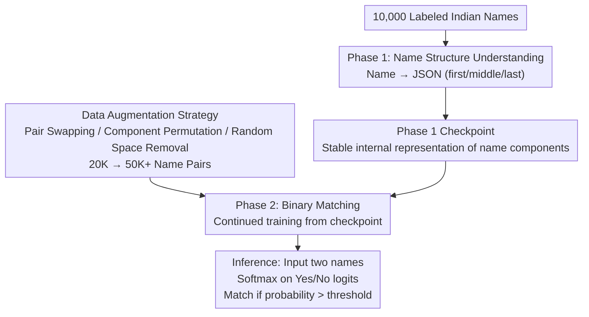

# Structure-Guided Entity Resolution: Fine-Tuning LLMs for Robust Name Matching in Complex Linguistic Contexts

**Conference**: ACL2026
**arXiv**: [2605.23597](https://arxiv.org/abs/2605.23597)
**Code**: To be confirmed
**Area**: Multilingual Translation
**Keywords**: Entity Resolution, Name Matching, Curriculum Learning, KYC, LoRA Fine-tuning, Multilingual

## TL;DR

SGER proposes a two-stage curriculum learning framework to fine-tune Llama 3 8B for person name entity matching: Phase 1 trains the model to parse name structures (outputting JSON), and Phase 2 trains a binary matcher starting from the Phase 1 checkpoint. It achieves 99.02% accuracy and an F1 score of 0.994 on a dataset of 50,000 Indian KYC records and has been deployed in the production environment of Dream11 (250 million users).

## Background & Motivation

Person name matching is a core task of entity resolution, directly impacting operations and regulation in KYC/AML compliance scenarios. In India, one of the world's most linguistically diverse environments, challenges are particularly prominent: naming conventions vary by region and community, multi-script transliteration is inconsistent (Devanagari to Latin), and data entry errors (OCR token fusion, missing spaces) or inconsistent honorific suffixes occur frequently. Traditional methods (Edit Distance, Jaro-Winkler, phonetic encoding) struggle with these structural variations, while directly fine-tuning an LLM for binary classification forces the model to learn both name structures and decision boundaries simultaneously, which limits performance.

## Method

### Overall Architecture

SGER performs two-stage curriculum learning fine-tuning on Llama 3 8B: Phase 1 teaches the model to understand the internal grammatical structure of names, and Phase 2 trains binary entity matching based on the Phase 1 checkpoint. A data augmentation strategy expands 20K name pairs to over 50K for Phase 2 training. During inference, two name strings are input, and "Yes" or "No" is output.

### Key Designs

1.  **Phase 1 - Name Structure Understanding**: Maps a single name string to a JSON object (`first_name`, `middle_name`, `last_name`). It uses approximately 10,000 manually labeled Indian names covering multiple regions, languages, and cultural naming patterns. LoRA SFT fine-tuning is used to establish a stable internal representation of name components.
2.  **Phase 2 - Binary Matching**: Continues from the Phase 1 checkpoint to train a binary classifier using labeled name pairs. During inference, logits for "Yes"/"No" tokens are extracted and processed via softmax to obtain match probabilities; pairs exceeding a threshold are judged as the same person.
3.  **Data Augmentation Strategy** (Inspired by CV augmentation): (a) **Pair Swapping** (analogous to mirror flipping) — ensures order invariance; (b) **Component Permutation** (analogous to geometric transformation) — permutes first/middle/last to generate structural variants; (c) **Random Space Removal** (analogous to noise injection) — simulates data entry errors. This expands 20K pairs to over 50K.

### Loss & Training

Both stages use LoRA (rank=4, alpha=8) + mixed precision (fp16) SFT. Early stopping is based on validation F1. Training is conducted on a single NVIDIA A100 80GB GPU.

## Key Experimental Results

### Main Results

Comparison on an independent test set of 50,000 pairs (strictly ensuring no name-level overlap):

| Method | Accuracy | Precision | Recall | F1 |
|---|---|---|---|---|
| Levenshtein (Th=0.8) | 57.4% | 75.1% | 70.2% | 0.726 |
| BERT (Fine-Tuned) | 69.1% | 81.2% | 80.1% | 0.806 |
| GPT-4o (Few-Shot) | 85.4% | 90.1% | 92.1% | 0.911 |
| LLM SFT (Llama 3 8B) | 91.2% | 93.3% | 95.9% | 0.946 |
| LLM SFT + Aug. | 95.7% | 97.6% | 97.0% | 0.973 |
| **SGER (Ours)** | **99.02%** | **99.95%** | **98.9%** | **0.994** |

### Ablation Study

*   **Effect of Data Augmentation**: Expanding from the original 20K pairs to 50K+ improved F1 from 0.946 to 0.973.
*   **Effect of Curriculum Learning**: Adding Phase 1 structural pre-training on top of augmented data improved F1 from 0.973 to 0.994. The two are complementary.
*   **Error Analysis**: Primary failure modes include (1) ambiguous phonetics ("Saurabh" vs. "Sorab"); (2) compound errors (simultaneous missing spaces, inverted order, and OCR corruption).

### Key Findings

*   Curriculum learning shows the greatest improvement on difficult samples with multiple combined perturbations — Phase 1 stabilizes the internal representation of name components.
*   Production Deployment: 3× NVIDIA L4 GPUs, vLLM inference framework, 10K RPM, P99 latency of 120ms.
*   Business Impact: Eliminated manual review processes, saving over $500K in annual operational costs.

## Highlights & Insights

*   **Decomposing Structure and Decision via Curriculum Learning**: Explicitly transforming implicit "name grammar" into a pre-training task before downstream matching is a simple yet highly effective design idea.
*   **Transferring CV Augmentation Concepts to NLP**: Analogizing mirror/rotation/noise injection from the image domain to order swapping/component permutation/space removal for names.
*   **End-to-End Industrial Implementation**: A complete closed loop from data augmentation and two-stage training to deployment architecture and business impact.

## Limitations & Future Work

*   Only validated on Indian KYC data; transferability to other multilingual environments (Arabic, East Asian names) has not been tested.
*   The JSON schema in Phase 1 only supports three fields: first, middle, and last, which may not cover name structures in all cultures.
*   Relies on LoRA fine-tuning of Llama 3 8B; the performance of smaller or larger models remains to be explored.

## Related Work & Insights

*   **Peeters & Bizer (2023)**: A comprehensive survey of LLMs for entity matching.
*   **Steiner et al. (2024)**: Demonstrated that fine-tuning is efficient for ER; this paper further introduces curriculum learning.
*   **Curriculum Learning** (Feng et al., 2023; Soviany et al., 2022): This paper is the first to validate the effectiveness of two-stage curriculum learning in person name entity resolution.

## Rating

| Dimension | Score (1-10) |
|---|---|
| Novelty | 6 |
| Utility | 10 |
| Clarity | 9 |
| Experimental Thoroughness | 7 |

## Rating
- Novelty: TBD
- Experimental Thoroughness: TBD
- Writing Quality: TBD
- Value: TBD

<!-- RELATED:START -->

## Related Papers

- [\[ACL 2026\] Multilingual Language Models Encode Script Over Linguistic Structure](multilingual_language_models_encode_script_over_linguistic_structure.md)
- [\[ACL 2026\] Exploring Two-Phase Continual Instruction Fine-tuning for Multilingual Adaptation in Large Language Models](exploring_continual_fine-tuning_for_enhancing_language_ability_in_large_language.md)
- [\[ICML 2026\] Toward Robust Multilingual Adaptation of LLMs for Low-Resource Languages](../../ICML2026/multilingual_mt/toward_robust_multilingual_adaptation_of_llms_for_low-resource_languages.md)
- [\[ICLR 2026\] SASFT: Sparse Autoencoder-guided Supervised Finetuning to Mitigate Unexpected Code-Switching in LLMs](../../ICLR2026/multilingual_mt/sasft_sparse_autoencoder-guided_supervised_finetuning_to_mitigate_unexpected_cod.md)
- [\[ACL 2025\] CC-Tuning: A Cross-Lingual Connection Mechanism for Improving Joint Multilingual Supervised Fine-Tuning](../../ACL2025/multilingual_mt/cc-tuning_a_cross-lingual_connection_mechanism_for_improving_joint_multilingual_.md)

<!-- RELATED:END -->
