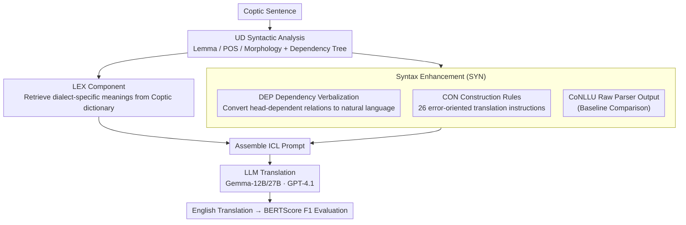

# Syntax as a Rosetta Stone: Universal Dependencies for In-Context Coptic Translation

**Conference**: ACL 2026 Findings  
**arXiv**: [2604.18758](https://arxiv.org/abs/2604.18758)  
**Code**: [GitHub](https://github.com/gucorpling/in-context-coptic-translation)  
**Area**: Low-Resource Machine Translation / Multilingual NLP  
**Keywords**: Low-Resource Machine Translation, Coptic, Universal Dependencies, In-Context Learning, Syntax Enhancement

## TL;DR

This paper represents the first exploration of using Universal Dependencies (UD) syntactic information as an enhancement source for In-Context Learning (ICL) in low-resource Coptic-to-English machine translation. The findings indicate that while syntactic information alone is less effective than a lexicon, combining the lexicon with syntax (LEX+SYN) achieves the best performance across all models, with Gemma-27B reaching a BERTScore F1 of $0.8746$ ($+0.0361$).

## Background & Motivation

**Background**: Large Language Models (LLMs) have reached near-practical levels in high-resource language translation, but low-resource languages (LRLs) have seen little benefit, as models lack basic language modeling capabilities for these languages. Enhancing ICL prompts using bilingual lexicons has proven effective, yet lexicons only provide word-for-word translations and cannot encode grammatical relationships.

**Limitations of Prior Work**: (1) Coptic is an agglutinative language where grammatical constructions (e.g., auxiliary systems, postposed subjects) carry semantic weight that cannot be inferred from content words alone; (2) even powerful models like GPT-4.1 produce fluent but fundamentally incorrect Coptic translations without enhancement; (3) simple vocabularies have an information ceiling—they cannot inform the model about grammatical structure.

**Key Challenge**: Lexical enhancement only covers the vocabulary dimension, leaving a syntactic information gap that limits the upper bound of translation quality. A method is needed to inject grammatical information into in-context prompts.

**Goal**: To verify whether UD syntactic information can provide complementary gains beyond lexicons in an ICL setting for low-resource translation.

**Key Insight**: Utilizing existing UD treebanks for Coptic ($60K$ tokens, $2387$ sentences), several ways to represent syntactic information are designed (raw CoNLL-U, natural language verbalization, and construction rules based on error analysis) to test their combined effectiveness with lexicons.

**Core Idea**: Syntactic and lexical information are orthogonally complementary—lexicons address "what each word means," while syntax addresses "how words relate to one another." Combining both can break through the information ceiling of lexicon-only enhancement.

## Method

### Overall Architecture

The research addresses a focused question: whether UD syntactic information can provide complementary gains beyond lexicons for low-resource Coptic $\rightarrow$ English translation in a pure ICL (training-free) setting. The workflow involves: first performing UD syntactic analysis on the input sentence (obtaining lemmas, POS tags, morphology, and dependency trees), then deriving four information components from the analysis results to be included in the prompt—LEX (bilingual lexicon mapping), DEP (natural language verbalization of UD dependency relations), CON (26 construction rules based on error analysis), and CoNLLU (raw UD parsing output). These components are assembled into ICL prompts and fed to the LLM for translation. Finally, BERTScore F1 serves as the primary metric to systematically compare individual components and combinations to see if "Lexicon + Syntax" can surpass the performance of using a lexicon alone.

### Key Designs

**1. LEX (Lexicon Component): Providing basic word meanings as a foundation**

In low-resource translation, LLMs often fail to identify basic vocabulary. Therefore, the first step is to supplement "what each word means." LEX utilizes POS and morphological information (lemma and segmentation) from the syntactic analysis to retrieve dialect-specific English translations from a Coptic dictionary, followed by filtering to retain the most relevant hierarchical entries to manage prompt length. This component serves as a robust enhancement and a baseline for subsequent syntactic improvements.

**2. CON (Construction Rules Component): Providing targeted grammar instructions for actual errors**

Lexicons cannot compensate for the meaning carried by grammatical constructions. Coptic's features, such as auxiliary systems and postposed subjects, cannot be inferred from content words alone. CON follows an "error-oriented" approach: the authors manually analyzed translation errors from GPT-4.1 mini on the development set and combined this with syntactic analysis to summarize 26 common error patterns. DepEdit templates are used to match dependency subtrees, automatically detecting and generating specific translation guidance ranging from simple rules (e.g., imperative identification) to complex ones (e.g., postposed subject constructions). This provides targeted prompts specifically where the model is prone to failure.

**3. DEP (Dependency Verbalization Component): Translating UD structures into natural language**

While LLMs might recognize the raw CoNLL-U format from training data, familiarity does not imply a true understanding of semantic relations. DEP extracts the head-dependent relationships for each sentence and verbalizes them into plain English statements (e.g., "$n$ is the case marking of you"), allowing structural information to enter the prompt in a more digestible natural language format. This process includes controllable parameters such as the choice of UD tag sets, POS tags, and disambiguation for repeated tokens, which determine the granularity and noise of the injected information.

### Loss & Training

Pure ICL setting with no training. Three models were used: Gemma-12B/27B and GPT-4.1. Evaluation was conducted on the standard dev ($380$ sentences) and test ($405$ sentences) sets of the UD treebank.

## Key Experimental Results

### Main Results

**Test Set BERTScore F1**

| Setting | Gemma-12B | Gemma-27B | GPT-4.1 |
|------|----------|----------|---------|
| Baseline | $0.8363$ | $0.8385$ | $0.9012$ |
| LEX | $0.8551$ ($+0.019$) | $0.8565$ ($+0.018$) | $0.9152$ ($+0.014$) |
| LEX+SYN | **$0.8707$ ($+0.034$)** | **$0.8746$ ($+0.036$)** | **$0.9195$ ($+0.018$)** |

### Ablation Study

| Setting | BERTScore $\Delta$ (Gemma-27B test) | Description |
|------|---------------------------|------|
| Baseline | $0.0000$ | No enhancement |
| DEP alone | $+0.0033$ | Dependency verbalization only; marginal gain |
| CON alone | $+0.0133$ | Construction rules effective individually |
| CoNLLU alone | $+0.0162$ | Raw parser output is surprisingly effective |
| LEX alone | $+0.0181$ | Lexicon is the most effective single component |
| LEX+SYN | $+0.0361$ | Combination exceeds individual components significantly |

### Key Findings

- Syntactic information alone is less effective than a lexicon, but the combination provides significant gains beyond lexicon-only levels (LEX+SYN improves $0.018$ over LEX alone on Gemma-27B).
- The combined effect is additive—the individual gains of LEX and SYN nearly sum to the total gain of LEX+SYN.
- The gap between automatic parsing and gold-standard parsing is small, indicating that syntactic enhancement is robust to parser errors.
- Gains are larger on non-biblical texts, suggesting syntactic information is more valuable when the model cannot rely on memorized scripture.

## Highlights & Insights

- The use of UD syntactic information for ICL translation is a primary innovation—demonstrating that grammatical knowledge can be injected into prompts as "alternative reference material."
- The design of the CON component reflects an "error-oriented" engineering philosophy—instead of providing generalized grammar information, it provides targeted guidance for specific mistakes the model actually makes.
- This method has clear value in practical LRL translation scenarios by potentially reducing the workload for expert post-editing.

## Limitations & Future Work

- Restricted to a single translation direction (Coptic to English).
- Sentence-level translation limits the evaluation of discourse-level phenomena.
- The CON component requires linguistic experts for error analysis.
- The effectiveness of using parallel few-shot examples (few-shot ICL) was not explored.

## Related Work & Insights

- **vs Dictionary-only ICL**: LEX is the baseline; this paper proves that syntactic enhancement provides complementary information not covered by lexicons.
- **vs Grammar excerpt approaches**: Rules extracted from grammar books are generic, whereas CON is customized based on model weaknesses.
- **vs Fine-tuning approaches**: Fine-tuning requires parallel data and often yields suboptimal results; ICL with enhancement offers more flexibility.

## Rating

- Novelty: ⭐⭐⭐⭐ First use of UD syntactic info for ICL translation; clever CON component design.
- Experimental Thoroughness: ⭐⭐⭐⭐ Multiple models + multi-component ablation + gold vs. auto parsing + biblical vs. non-biblical analysis.
- Writing Quality: ⭐⭐⭐⭐⭐ Clear structure and sufficient linguistic background.
- Value: ⭐⭐⭐⭐ Clear contribution to low-resource translation research; methodology is transferable to other LRLs.

<!-- RELATED:START -->

## Related Papers

- [\[ACL 2025\] Exploring In-context Example Generation for Machine Translation](../../ACL2025/multilingual_mt/exploring_in-context_example_generation_for_machine_translation.md)
- [\[ACL 2025\] Understanding In-Context Machine Translation for Low-Resource Languages: A Case Study on Manchu](../../ACL2025/multilingual_mt/understanding_in-context_machine_translation_for_low-resource_languages_a_case_s.md)
- [\[ACL 2025\] GrammaMT: Improving Machine Translation with Grammar-Informed In-Context Learning](../../ACL2025/multilingual_mt/grammamt_improving_machine_translation_with_grammar-informed_in-context_learning.md)
- [\[ACL 2026\] EMCEE: Improving Multilingual Capability of LLMs via Bridging Knowledge and Reasoning with Extracted Synthetic Multilingual Context](emcee_improving_multilingual_capability_of_llms_via_bridging_knowledge_and_reaso.md)
- [\[ACL 2025\] THOR-MoE: Hierarchical Task-Guided and Context-Responsive Routing for Neural Machine Translation](../../ACL2025/multilingual_mt/thor-moe_hierarchical_task-guided_and_context-responsive_routing_for_neural_mach.md)

<!-- RELATED:END -->
