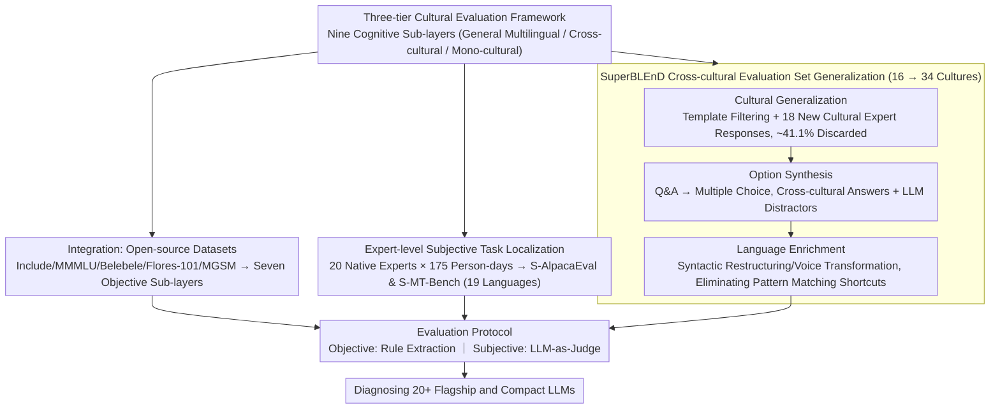

# The GaoYao Benchmark: A Comprehensive Framework for Evaluating Multilingual and Multicultural Abilities of Large Language Models

**Conference**: ACL 2026  
**arXiv**: [2604.20225](https://arxiv.org/abs/2604.20225)  
**Code**: [github.com/lunyiliu/GaoYao](https://github.com/lunyiliu/GaoYao)  
**Area**: Human Understanding / Multilingual Evaluation  
**Keywords**: Multilingual Benchmark, Multicultural Evaluation, LLM Evaluation, Linguistic Fairness, Cultural Understanding

## TL;DR
This paper introduces the GaoYao benchmark, featuring 182.3K samples across 26 languages and 51 countries/regions. Utilizing a three-tier cultural evaluation framework (General Multilingual / Cross-cultural / Mono-cultural) and nine cognitive sub-layers, it combines human-localized subjective test sets with the expert-verified cross-cultural synthetic dataset SuperBLEnD to deeply diagnose the multilingual capabilities of over 20 flagship and compact LLMs, revealing significant geo-digital divides and task capability stratification.

## Background & Motivation

**Background**: LLMs are serving global users, making multilingual capability a critical metric for inclusivity. Numerous existing multilingual evaluation benchmarks cover tasks such as knowledge QA, reading comprehension, and translation, but they often focus only on single aspects.

**Limitations of Prior Work**: Current benchmarks face three critical limitations: (1) Fragmented evaluation dimensions—most benchmarks focus on a single aspect of linguistic ability (e.g., knowledge or reading comprehension), ignoring deep cultural nuances and treating multilingual capability as isolated evaluation points rather than interconnected dimensions rooted in cultural cognition; (2) Insufficient language coverage for subjective tasks—critical tasks like instruction following and multi-turn dialogue are primarily evaluated in English, while multilingual extensions rely on low-quality machine translation (e.g., "list words starting with A" is meaningless when translated into languages without the letter A); (3) Lack of diagnostic depth—existing studies stop at superficial leaderboard rankings without revealing the associations between performance differences and geography, task types, or model architectures.

**Key Challenge**: Superficial linguistic fluency does not equate to deep cultural understanding (e.g., the concept of "dragon" carries vastly different meanings in Eastern vs. Western cultures). Existing benchmarks mainly evaluate the "tip of the iceberg" in general linguistic ability, failing to diagnose a model's true level of cultural sensitivity.

**Goal**: Construct a systematic, high-quality multilingual and multicultural evaluation benchmark with deep diagnostic capabilities.

**Key Insight**: Design a layered evaluation framework based on the cultural iceberg model and Bloom's taxonomy; ensure native quality for subjective test sets through 175 person-days of expert localization; and expand cross-cultural evaluation from 16 to 34 cultures via a three-stage semi-automated process.

**Core Idea**: The multilingual evaluation is categorized into three cultural depth levels (General Multilingual → Cross-cultural → Mono-cultural), combined with nine cognitive sub-layers to form an evaluation matrix. Native quality is ensured for subjective tasks through human localization rather than machine translation.

## Method

### Overall Architecture
GaoYao employs a "Integration + Extension + Generalization" strategy to construct the benchmark: first, a three-tier cultural evaluation framework (paired with nine cognitive sub-layers) defines the dimensions to be tested. Then, three data construction tracks fill this matrix: for seven objective cognitive sub-layers, existing high-quality open-source datasets (e.g., Include, MMMLU, Belebele, Flores-101, MGSM) are integrated; for two key subjective task sub-layers (Instruction Following and Multi-turn Dialogue), expert-level localization is performed for 19 languages; for the cross-cultural evaluation layer, the SuperBLEnD dataset is generalized from 16 to 34 cultures through a three-stage human-in-the-loop process. All tracks converge into a unified evaluation protocol—rule-based extraction for objective tasks and LLM-as-Judge for subjective tasks—to finally diagnose 20+ flagship and compact models.

### Key Designs

**1. Three-tier Cultural Evaluation Framework + Nine Cognitive Sub-layers: Deconstructing "Multilingual Ability" by Cultural Depth into Diagnosable Dimensions**

Previous benchmarks treated multilingual ability as an isolated score, masking the gap between "linguistic fluency" and "cultural understanding." GaoYao borrows from the cultural iceberg model and Bloom's taxonomy to split tasks into three cultural depth layers: General Multilingual ability corresponds to cross-linguistically consistent general concepts (reasoning, knowledge QA); Cross-cultural ability corresponds to shared concepts with varying cultural variants (e.g., "dragon"); and Mono-cultural ability corresponds to concepts unique to a specific culture (e.g., China's "Spring Festival travel rush", India's "Namaste"). Each layer is vertically expanded into nine cognitive sub-layers ranging from memory/understanding (Knowledge QA, Reading Comprehension, Translation) to application/analysis (Reasoning, Math), and finally to evaluation/creation (Instruction Following, Multi-turn Dialogue, Cross-cultural/Mono-cultural evaluation), forming an evaluation matrix.

The value of this stratification is directly validated in experiments: when shifting from General Multilingual rankings to Mono-cultural rankings, the Spearman correlation $\rho$ drops from 0.74 to 0.61, indicating that a single total score can hide models that are "strong in general ability but weak in cultural sensitivity," whereas the three-tier framework explicitly decouples and exposes these capabilities.

**2. Expert-level Subjective Task Localization (S-AlpacaEval & S-MT-Bench): Using Localization Instead of Machine Translation for Native Quality**

Subjective tasks like instruction following and multi-turn dialogue were previously evaluated almost exclusively in English. When extended to other languages, they relied on machine translation, which introduces "translationese" and fails to reflect native expressions—a classic example being "list words starting with the letter A," which loses all meaning when translated directly into languages without that letter. GaoYao recruited 20 native experts from top-tier enterprise linguistic service centers, investing 175 person-days to extend these two sub-layers to 19 languages. The key action is not translation but cognitive-equivalent localization: the aforementioned prompt is manually rewritten according to the phonetic and orthographic features of the target language to achieve equivalent difficulty, supported by an audit-feedback loop where third-party reviewers conduct spot checks and disputed samples enter a discussion phase.

While machine translation has limited impact on objective tasks like boolean questions, it is detrimental to subjective evaluations. Thus, despite the high cost, localization is necessary. Fig. 7 shows that it is precisely these native test sets that more clearly differentiate the capability hierarchies of various LLMs.

**3. SuperBLEnD Cross-cultural Evaluation Set Generalization: Doubling Cross-cultural Coverage via Semi-automated Processes while Closing Pattern-Matching Shortcuts**

The original cross-cultural evaluation dataset, BLEnD, covered only 16 cultures and was vulnerable to simple pattern matching. Direct translation preserves source cultural concepts, while purely manual creation is prohibitively expensive. GaoYao uses a three-stage semi-automated process to balance coverage and quality: first, **Cultural Generalization** filters high-quality templates from BLEnD and recruits native experts for 18 new cultures to provide experience-based answers, discarding approximately 41.1% of raw data after rigorous human verification. Second, **Option Synthesis** converts Q&A pairs into multiple-choice questions, using answers from other cultures combined with LLM-generated distractors. Finally, **Language Enrichment** uses LLMs to perform syntactic restructuring and voice transformation on prompts and options, forcing the model to truly understand rather than rely on templates.

Ultimately, coverage expanded from 16 to 34 cultures. The effect of language enrichment is evident in ablation studies: after enrichment, the accuracy of Qwen3-8B dropped from 78.06% to 57.25% (−20.81%), indicating that a significant portion of the previous high score came from shortcuts that were now blocked.

### Loss & Training
GaoYao is an evaluation benchmark, not a training method. Objective tasks are evaluated using rule-based extraction, while subjective tasks use DeepSeek-v3.1 as the LLM-as-Judge, with Qwen3-235B-A22B as the reference anchor. All scores are normalized to 0-100.

## Key Experimental Results

### Main Results (Model Ranking Changes Across Three Layers)

| Model | General Multilingual Rank | Cross-cultural Rank | Mono-cultural Rank |
|------|---------------|-----------|-----------|
| Gemini-2.5-Pro | #1 | #1 | #8 |
| Doubao-Seed-1.6 | #2 | #14 | #6 |
| Qwen3-235B-A22B | #9 | #11 | #1 |
| DeepSeek-V3.1 | #15 | #16 | #4 |

### SuperBLEnD Ablation Study (Effect of Language Enrichment)

| Model | Original BLEnD | SuperBLEnD | Δ |
|------|-----------|------------|---|
| Qwen3-235B-A22B | 72.57 | 68.06 | -4.51 |
| Qwen3-8B | 78.06 | 57.25 | -20.81 |
| GPT-5-chat | 78.45 | 70.38 | -8.07 |

### Key Findings
- **Ranking Decoupling**: The Spearman correlation from General Multilingual to Cross-cultural is 0.74, but only 0.61 to Mono-cultural. Gemini-2.5-Pro ranks first in General Multilingual but drops to eighth in Mono-cultural, while Qwen3-235B rises from ninth to first—emphasizing the necessity of stratified evaluation.
- **Digital Divide**: Western European languages consistently score highest, while low-resource languages from South Asia and Africa lag significantly. Performance is strongly correlated with resource levels (High > Mid > Low).
- **Benchmark Saturation**: On mature benchmarks like Belebele, compact models approach flagship levels, but significant gaps emerge on GaoYao's newly constructed subjective test sets, exposing the true capability gap.
- **Thinking Patterns**: Flagship models show selective gains (effective only at high cognitive layers), whereas compact models show universal gains (helpful across all levels).

## Highlights & Insights
- **Cultural Stratification Framework**: Decoupling "multilingual ability" into three cultural depth levels reveals capability gaps that a single score cannot reflect. This framework approach can be migrated to other tasks requiring multi-dimensional evaluation (e.g., stratified evaluation of coding or reasoning abilities).
- **Localization over Translation**: While 175 person-days of expert localization is "expensive," experiments prove that machine translation severely distorts subjective tasks. This sets a quality gold standard for benchmark construction.
- **SuperBLEnD Language Enrichment**: Upgrading the benchmark from "knowledge retrieval" to "cultural reasoning" through syntactic restructuring and voice transformation effectively removed shortcuts. Qwen3-8B, which originally "unexpectedly" outperformed Qwen3-235B, reverted to the correct capability hierarchy after enrichment.

## Limitations & Future Work
- Lack of coverage for vertical domains (Legal, Medical, Finance) and Agent capabilities (Tool use, API calls).
- Human-centric processes limit scalability, making it difficult to efficiently extend to hundreds of low-resource languages.
- Imbalances in task and language distribution (e.g., MGSM covers only 10 languages; SAGE/CultureScope covers only 2 languages/cultures).
- Static benchmarks inevitably lag behind the latest models; the authors plan to launch a dynamic leaderboard.

## Related Work & Insights
- **vs Include/MMMLU**: These are objective benchmarks focusing on knowledge and reasoning but lack subjective and cultural dimensions. GaoYao provides comprehensive coverage via integration, extension, and generalization.
- **vs WMT/Flores**: These are translation-oriented; GaoYao incorporates translation as one of nine sub-layers within a larger framework.
- **vs BLEnD**: Covered only 16 cultures and was vulnerable to pattern matching; SuperBLEnD expands to 34 cultures and improves discriminative power via language enrichment.

## Rating
- Novelty: ⭐⭐⭐⭐ Systematic innovation in the three-tier cultural framework and expert-localized subjective test design.
- Experimental Thoroughness: ⭐⭐⭐⭐⭐ 20+ models, 26 languages, comprehensive ablation, and diagnostic analysis provide robust evidence.
- Writing Quality: ⭐⭐⭐⭐ Clear framework and detailed experiments, though slightly lengthy.
- Value: ⭐⭐⭐⭐⭐ Fills a critical gap in multilingual subjective and cultural evaluation, offering sustained value to the community.
- Combined: ⭐⭐⭐⭐⭐ A top-tier benchmark work with excellent framework design, data quality, and depth of analysis.

<!-- RELATED:START -->

## Related Papers

- [\[ACL 2026\] Evaluating Robustness of Large Language Models Against Multilingual Typographical Errors](evaluating_robustness_of_large_language_models_against_multilingual_typographica.md)
- [\[ACL 2026\] LaoBench: A Large-Scale Multidimensional Lao Benchmark for Large Language Models](laobench_a_large-scale_multidimensional_lao_benchmark_for_large_language_models.md)
- [\[ACL 2026\] MORPHOGEN: A Multilingual Benchmark for Evaluating Gender-Aware Morphological Generation](morphogen_a_multilingual_benchmark_for_evaluating_gender-aware_morphological_gen.md)
- [\[ACL 2026\] Language Models Entangle Language and Culture](language_models_entangle_language_and_culture.md)
- [\[ACL 2025\] Disentangling Language and Culture for Evaluating Multilingual Large Language Models](../../ACL2025/multilingual_mt/disentangle_language_culture.md)

<!-- RELATED:END -->
