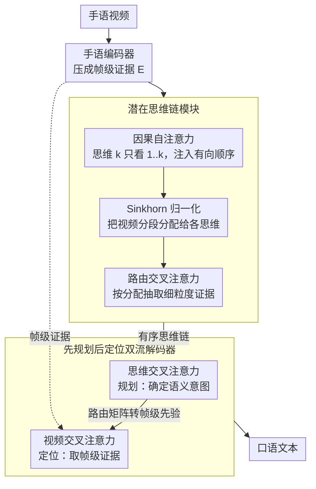

# Think in Latent Thoughts: A New Paradigm for Gloss-Free Sign Language Translation

**Conference**: ACL 2026  
**arXiv**: [2604.15301](https://arxiv.org/abs/2604.15301)  
**Code**: [GitHub](https://github.com/fletcherjiang/SignThought)  
**Area**: LLM Evaluation  
**Keywords**: Sign Language Translation, Gloss-free Translation, Latent Chain-of-Thought, Cross-modal Reasoning, Dual-stream Decoder

## TL;DR

SignThought is proposed as a reasoning-driven gloss-free sign language translation framework. It introduces learnable latent thought slots as an explicit intermediate semantic layer between video and text. Through a "plan-then-locate" dual-stream decoder, it decouples semantic planning from visual evidence retrieval, outperforming existing gloss-free methods on multiple benchmarks.

## Background & Motivation

**Background**: Sign language translation (SLT) has progressively evolved from gloss-based cascade methods to gloss-free end-to-end video-to-text approaches.

**Limitations of Prior Work**: Existing models implicitly assume that sign language video segments can be directly mapped to spoken language vocabulary. However, a significant portion of meaning in sign language is dynamically generated through classifiers, spatial grammar, and movement modulation (productive forms), for which no fixed lexical correspondence exists.

**Key Challenge**: SLT is essentially a cross-modal reasoning problem rather than a simple alignment task—meanings are scattered across continuous video streams, requiring cross-temporal reasoning for correct understanding.

**Goal**: To introduce an explicit intermediate semantic representation (Latent Chain-of-Thought) to establish a traceable reasoning bridge between video encoding and text decoding.

**Key Insight**: Analogy to CoT, but implemented in a continuous latent space rather than a discrete text space—using learnable thought slots to distill semantics from video.

**Core Idea**: $K$ ordered latent thought slots iteratively extract semantics through causal self-attention + Sinkhorn-routed cross-attention, forming a directed chain of thought. A dual-stream decoder first queries the chains of thought to plan semantics, then returns to the video to retrieve evidence.

## Method

### Overall Architecture

The core problem SignThought aims to solve is that a large amount of meaning in sign language is dynamically generated via productive forms without fixed lexical correspondence; thus, the implicit assumption of "mapping video segments directly to words" is untenable. Translation is fundamentally reasoning across time. The approach inserts an explicit intermediate semantic layer between video and text. The entire pipeline consists of three stages: the sign encoder first compresses the video into frame-level evidence $\mathbf{E}$; the latent CoT module then distills an ordered chain of thought $\mathbf{C}$ from $\mathbf{E}$ (causal self-attention for sequence $\rightarrow$ Sinkhorn normalization for allocation $\rightarrow$ routing cross-attention for evidence extraction); finally, the dual-stream decoder queries this chain of thought to plan what to say, before returning to the video to retrieve evidence and ground it into text. Regarding data, the authors constructed and open-sourced a new gloss-free dataset with stronger context dependency to support this reasoning-based modeling.

### Key Designs

**1. Latent CoT Module: Distilling dense video features into a sequence of ordered semantic reasoning states**

If decoding directly from frame-level features, the model must simultaneously perform "understanding" and "generation" within a continuous video stream, which easily scatters meanings. SignThought introduces $K$ learnable thought slots refined through $L$ iterative layers: each layer first performs causal self-attention, restricting thought $k$ to only attend to $1..k$, thereby injecting a directed structure; Sinkhorn normalization is then used to assign video segments to each thought, preventing attention from degenerating into uniform or collapsed states; finally, routing cross-attention extracts fine-grained evidence according to this assignment. Causal constraints provide order, while Sinkhorn maintains the "hardness" of assignment, together enabling the $K$ slots to form a step-by-step semantic chain similar to CoT rather than an unordered set of slots.

**2. "Plan-then-Locate" Dual-stream Decoder: Decoupling semantic decision-making from evidence retrieval**

If cross-attention is applied directly to all frames during decoding, attention tends to diffuse across the entire video, making it difficult to focus. The dual-stream decoder separates this process in each layer: it first performs self-attention, then thought cross-attention (Planning: determining the semantic intent for this step), and finally video cross-attention (Localization: retrieving evidence from frames). The key connection is mapping the weights of the thought attention via a routing matrix into a frame-level prior, which guides the video attention—essentially using the chain of thought to lock onto "which segment to watch" before looking. Planning intent before retrieval is more controllable than searching through all frames initially, which explains the 2.1 BLEU drop observed in the ablation study when the dual-stream design was removed.

**3. Large-Scale Gloss-Free Dataset: Supporting reasoning-driven translation with context-dependent data**

Reasoning-based modeling requires sufficient samples containing productive forms and strong context dependency, whereas existing sign language datasets are relatively weak in this regard. Consequently, the authors constructed and open-sourced a new gloss-free dataset, intentionally including more expressions that require cross-temporal reasoning to decode, providing the foundation for training and evaluating the aforementioned modules.

### Loss & Training

Standard sequence-level cross-entropy + thought continuity loss. End-to-end training requiring only sentence-level annotations.

## Key Experimental Results

### Main Results

| Method | PHOENIX14T B@4 | ROUGE |
|------|---------------|-------|
| SLTUNET | 28.47 | 52.11 |
| SignThought | **31.2** | **54.8** |

### Ablation Study

| Configuration | B@4 Δ | Description |
|------|-------|------|
| w/o Thought Chain | -2.5 | Degenerates to direct decoding |
| w/o Causal Constraint | -1.3 | Unordered thoughts |
| w/o Sinkhorn | -1.8 | Attention degradation |
| w/o Dual-stream | -2.1 | Coupling of planning and localization |

### Key Findings

- Latent CoT provides a 2-3 BLEU improvement over direct decoding.
- The chain of thought serves as traceable anchors to align text with video temporal regions.

## Highlights & Insights

- The perspective that "sign language translation is reasoning rather than alignment" changes the modeling paradigm of the field.
- Latent Chain-of-Thought, as a cross-modal interface, can be transferred to other continuous-to-discrete cross-modal tasks.
- The use of Sinkhorn to prevent attention degradation is a technique applicable to other slot attention scenarios.

## Limitations & Future Work

- The number of thought slots $K$ must be predefined; the optimal $K$ may vary with video length.
- Validation is limited to restricted datasets.
- The encoder uses Inception features; more powerful encoders might yield further improvements.

## Related Work & Insights

- **vs Gloss-based**: These require expensive annotations, whereas Ours is completely gloss-free.
- **vs Direct Video-to-Text**: These lack an intermediate reasoning layer, leading to limited performance.

## Rating

- Novelty: ⭐⭐⭐⭐⭐ First to introduce latent CoT into sign language translation.
- Experimental Thoroughness: ⭐⭐⭐⭐ Multiple benchmarks with comprehensive ablations.
- Writing Quality: ⭐⭐⭐⭐ Strong motivation but dense notation.
- Value: ⭐⭐⭐⭐⭐ Significant contribution to both sign language translation and cross-modal reasoning.

<!-- RELATED:START -->

## Related Papers

- [\[ACL 2026\] Selective Contrastive Learning For Gloss Free Sign Language Translation](selective_contrastive_learning_for_gloss_free_sign_language_translation.md)
- [\[ACL 2026\] Language on Demand, Knowledge at Core: Composing LLMs with Encoder-Decoder Translation Models for Extensible Multilinguality](language_on_demand_knowledge_at_core_composing_llms_with_encoder-decoder_transla.md)
- [\[ACL 2026\] Language Models Entangle Language and Culture](language_models_entangle_language_and_culture.md)
- [\[ACL 2026\] Multilingual Language Models Encode Script Over Linguistic Structure](multilingual_language_models_encode_script_over_linguistic_structure.md)
- [\[ACL 2026\] LQM: Linguistically Motivated Multidimensional Quality Metrics for Machine Translation](lqm_linguistically_motivated_multidimensional_quality_metrics_for_machine_transl.md)

<!-- RELATED:END -->
