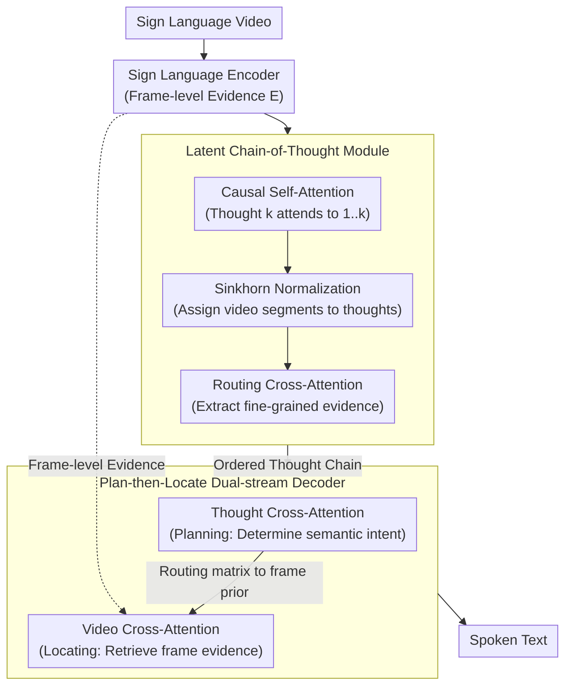

# Think in Latent Thoughts: A New Paradigm for Gloss-Free Sign Language Translation

**Conference**: ACL 2026  
**arXiv**: [2604.15301](https://arxiv.org/abs/2604.15301)  
**Code**: [GitHub](https://github.com/fletcherjiang/SignThought)  
**Area**: LLM Evaluation  
**Keywords**: Sign Language Translation, Gloss-free Translation, Latent Chain-of-Thought, Cross-modal Reasoning, Dual-stream Decoder

## TL;DR

Ours proposes SignThought, a reasoning-driven gloss-free sign language translation framework. It introduces learnable latent thought slots as an explicit intermediate semantic layer between video and text. Using a "plan-then-locate" dual-stream decoder, it decouples semantic planning from visual evidence retrieval, outperforming existing gloss-free methods on multiple benchmarks.

## Background & Motivation

**Background**: Sign language translation (SLT) has progressively evolved from gloss-based cascaded methods to gloss-free end-to-end video-to-text approaches.

**Limitations of Prior Work**: Existing models implicitly assume that sign language video segments can be directly mapped to spoken word vocabularies. However, a significant amount of meaning in sign language is dynamically generated through productive forms (e.g., classifiers, spatial grammar, and movement modulation), which lack fixed lexical correspondences.

**Key Challenge**: SLT is essentially a cross-modal reasoning problem rather than a simple alignment task—meanings are scattered across continuous video streams and require cross-temporal reasoning for correct interpretation.

**Goal**: Introduce an explicit intermediate semantic representation (Latent Chain-of-Thought) to establish a traceable reasoning bridge between video encoding and text decoding.

**Key Insight**: Analogous to CoT but implemented in a continuous latent space rather than a discrete text space—using learnable thought slots to distill semantics from videos.

**Core Idea**: $K$ ordered latent thought slots iteratively extract semantics through causal self-attention + Sinkhorn-routed cross-attention to form a directed chain of thought. A dual-stream decoder first queries the thought chain to plan semantics and then returns to the video to retrieve evidence.

## Method

### Overall Architecture

The core problem SignThought aims to solve is that many meanings in sign language are generated via productive forms, making the implicit assumption of "mapping video segments directly to words" untenable. Translation is fundamentally reasoning across time. The approach inserts an explicit intermediate semantic layer between video and text. The pipeline consists of three stages: the sign language encoder compresses video into frame-level evidence $\mathbf{E}$; the latent CoT module distills an ordered chain of thought $\mathbf{C}$ from $\mathbf{E}$ (Causal Self-Attention for order → Sinkhorn normalization for distribution → Routing Cross-Attention for evidence extraction); finally, the dual-stream decoder queries this thought chain to plan what to say before returning to the video to ground those intentions into text. Additionally, a new gloss-free dataset with higher context dependency was constructed to support this reasoning-based modeling.

### Key Designs

**1. Latent Chain-of-Thought Module: Distilling dense video features into a sequence of ordered semantic reasoning states**

Decoding directly from frame-level features forces the model to perform "understanding" and "generation" simultaneously within a continuous stream, which can dilute meaning. SignThought introduces $K$ learnable thought slots, refined over $L$ iterative layers. Each layer first performs causal self-attention (where thought $k$ only sees thoughts $1..k$) to inject a directed structure. Then, Sinkhorn normalization assigns video segments to thoughts, preventing attention from collapsing or becoming uniform. Finally, routing cross-attention extracts fine-grained evidence. Causal constraints provide order, while Sinkhorn maintains the "hardness" of assignment, together enabling the $K$ slots to form a step-by-step semantic chain like a CoT, rather than an unordered set of slots.

**2. "Plan-then-Locate" Dual-stream Decoder: Decoupling semantic decision-making and evidence retrieval**

Performing cross-attention on all frames during decoding causes attention to diffuse across the entire video. The dual-stream decoder splits this process in each layer: after self-attention, it performs thought cross-attention (Planning, to determine the semantic intent) and then video cross-attention (Locating, to retrieve evidence from frames). The key connection is mapping thought attention weights through the routing matrix into frame-level priors to guide video attention—effectively using the chain of thought to lock onto "which segment to watch" before looking. Planning intent before retrieval is more controllable than searching through all frames immediately; removing this dropped performance by 2.1 BLEU.

**3. Large-scale Gloss-free Dataset: Supporting reasoning-based translation with context-heavy data**

Reasoning-based modeling requires samples rich in productive forms and strong context. Existing sign language datasets are relatively weak in this regard. Consequently, a new gloss-free dataset was constructed and open-sourced, specifically including expressions that require cross-temporal reasoning to provide a foundation for training and evaluation.

### Loss & Training

Standard sequence-level cross-entropy + thought continuity loss. End-to-end training requiring only sentence-level annotations.

## Key Experimental Results

### Main Results

| Method | PHOENIX14T B@4 | ROUGE |
|------|---------------|-------|
| SLTUNET | 28.47 | 52.11 |
| SignThought | **31.2** | **54.8** |

### Ablation Study

| Configuration | B@4 Δ | Description |
|------|-------|------|
| w/o Thought Chain | -2.5 | Degenerates to direct decoding |
| w/o Causal Constraint | -1.3 | Unordered thoughts |
| w/o Sinkhorn | -1.8 | Attention degradation |
| w/o Dual-stream | -2.1 | Coupled planning and locating |

### Key Findings

- Latent Chain-of-Thought provides a 2-3 BLEU improvement over direct decoding.
- The thought chain serves as traceable anchors to align text with video temporal regions.

## Highlights & Insights

- Moving from "SLT as alignment" to "SLT as reasoning" shifts the modeling paradigm.
- Latent Chain-of-Thought as a cross-modal interface is transferable to other continuous-to-discrete cross-modal tasks.
- The use of Sinkhorn normalization to prevent attention degradation is applicable to other slot attention scenarios.

## Limitations & Future Work

- The number of thought slots $K$ must be preset; the optimal $K$ may vary with video length.
- Validation is limited to constrained datasets.
- The encoder uses Inception features; stronger encoders may further improve performance.

## Related Work & Insights

- **vs Gloss-based**: Avoids expensive annotations; ours is completely gloss-free.
- **vs Direct Video-to-Text**: Addresses the performance limitations caused by the lack of an intermediate reasoning layer.

## Rating

- Novelty: ⭐⭐⭐⭐⭐ First to introduce latent CoT to sign language translation.
- Experimental Thoroughness: ⭐⭐⭐⭐ Multiple benchmarks with comprehensive ablations.
- Writing Quality: ⭐⭐⭐⭐ Strong motivation, though notation is dense.
- Value: ⭐⭐⭐⭐⭐ Significant contribution to both SLT and cross-modal reasoning.

<!-- RELATED:START -->

## Related Papers

- [\[ACL 2026\] Selective Contrastive Learning For Gloss Free Sign Language Translation](selective_contrastive_learning_for_gloss_free_sign_language_translation.md)
- [\[ACL 2026\] Language on Demand, Knowledge at Core: Composing LLMs with Encoder-Decoder Translation Models for Extensible Multilinguality](language_on_demand_knowledge_at_core_composing_llms_with_encoder-decoder_transla.md)
- [\[ACL 2026\] Language Models Entangle Language and Culture](language_models_entangle_language_and_culture.md)
- [\[ACL 2026\] LQM: Linguistically Motivated Multidimensional Quality Metrics for Machine Translation](lqm_linguistically_motivated_multidimensional_quality_metrics_for_machine_transl.md)
- [\[ACL 2026\] NiuTrans.LMT: Toward Inclusive and Scalable Multilingual Machine Translation with LLMs](niutranslmt_toward_inclusive_and_scalable_multilingual_machine_translation_with_.md)

<!-- RELATED:END -->
