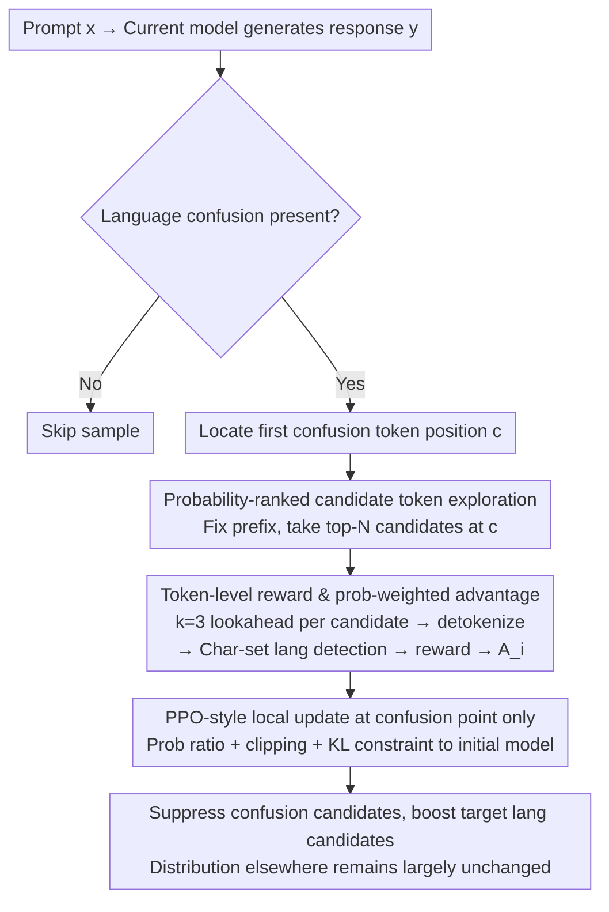

# TLPO: Token-Level Policy Optimization for Mitigating Language Confusion in Large Language Models

**Conference**: ACL2026  
**arXiv**: [2604.26553](https://arxiv.org/abs/2604.26553)  
**Code**: https://github.com/samsungsds-research-papers/TLPO  
**Area**: Multilingual Generation / Machine Translation / LLM Alignment  
**Keywords**: Language confusion, token-level optimization, multilingual alignment, PPO, local error correction

## TL/DR
TLPO treats language confusion in multilingual LLMs as locatable local token errors. By performing policy optimization only on high-probability candidate tokens at the first position of confusion, it significantly improves target language consistency while preserving the model's original reasoning and knowledge capabilities.

## Background & Motivation
**Background**: Multilingual LLMs often experience "language confusion" in cross-lingual instructions, target language responses, and mixed code/math contexts, where non-target languages are interspersed when the target language should be used. Common correction methods include Supervised Fine-Tuning (SFT), preference optimization like DPO/ORPO, or reinforcement learning alignment using sequence-level rewards.

**Limitations of Prior Work**: Language confusion typically occurs at only a few tokens or a specific switching point, yet SFT and sequence-level preference optimization treat the entire response as a training target. A side effect of this is that to satisfy language constraints, the model may destroy previously learned knowledge, reasoning formats, and response length distributions. This is especially problematic when English serves as the carrier for knowledge; over-suppressing English can directly harm accuracy.

**Key Challenge**: Language consistency requires stronger constraints, but global fine-tuning sacrifices model capabilities. The areas truly requiring updates are usually near the "first deviating token" rather than the entire response sequence. Therefore, the core problem is how to precisely drop training signals on tokens causing language confusion without disturbing unrelated positions.

**Goal**: The authors aim to design a token-level policy optimization method that automatically identifies confusion points, explores alternative candidate tokens at those positions, and generates local preference signals using only these candidates to minimize disruption to the global distribution.

**Key Insight**: The paper defines language confusion as a detectable local event: the position $c$ of the first non-target language token in a generated sequence. Instead of rewarding or penalizing the entire response, it is better to check which top-N candidate tokens at $c$ lead to confusion and which maintain the target language, then directly adjust the relative probabilities of these candidates.

**Core Idea**: Use probability ranking to select the top-N tokens most likely to be generated at the confusion point, perform short lookaheads for each candidate to determine confusion, and use a probability-weighted advantage in a PPO-style objective to optimize only these tokens.

## Method
The TLPO workflow is highly localized: it first lets the current model generate a response; if no language confusion occurs, the sample is skipped. If confusion appears, it locates the first confusion token and constructs candidates, rewards, and losses only around that specific position. Its goal is not to have the model relearn the entire multilingual task but to preserve existing capabilities while lowering the probability mass that leads to language switching.

### Overall Architecture
The TLPO process is localized: first, use the current model to generate a response $y$ for prompt $x$. If there is no language confusion, skip the sample. Once confusion occurs, locate the first confusion position $c$ and concentrate all training signals on this single token. Given a fixed prefix $y_{<c}$, take the top-N next tokens from the current policy $\pi_\theta$ as the candidate set. for each candidate, the model generates a very short lookahead sequence and detokenizes it, using character set rules to determine if the candidate triggers output outside the target language. Finally, use the candidate token reward and the old policy probability to construct an advantage, updating the model via a PPO objective with clipping and KL constraints. Its goal is not to relearn the task but to preserve the original model's capabilities while suppressing the specific probability mass causing the language switch.

### Key Designs

**1. Probability-ranked candidate token exploration: Focusing only on the most likely tokens at the confusion point rather than the whole sequence or vocabulary.**

Language confusion is usually triggered by a few high-probability tokens, yet SFT and sequence-level preference optimization treat the entire response as a training object, perturbing unrelated positions. TLPO does the opposite: at confusion position $c$, it selects the top-N tokens with the highest probabilities from $\pi_\theta(\cdot \mid x, y_{<c})$ to form the candidate set $T$ (main results use $N=16$; ablations compare ranked selection vs. multinomial sampling). Optimizing these most likely candidates effectively rewrites the error path most prone to deviation while compressing the training signal's scope to a minimum, avoiding strong constraints on irrelevant tokens.

**2. Token-level reward and probability-weighted advantage: Judging confusion for each candidate individually and converting local judgments into stable policy gradients.**

The difficulty lies in the fact that a candidate token is often just a subword; its language category cannot always be determined by its individual characters. TLPO thus generates $k=3$ lookahead tokens for each candidate, detokenizes the concatenation, and assigns a reward based on the target language character set. The advantage is formulated as:

$$A_i = \frac{p_{\text{old}}(t_i)\,\big(R(t_i)-\mu\big)}{Z},$$

where $\mu$ is the probability-weighted average reward and $Z$ is a normalization constant for the absolute advantage. Multiplying by the old policy probability $p_{\text{old}}(t_i)$ preserves the original relative probability structure among valid tokens, while normalization aligns the scale of signals from different confusion points. Ablations show that this formulation is more accuracy-friendly than GRPO-style standard deviation normalization $(R-\mu)/\sigma$—in local sets with only a dozen candidates, standard deviation scaling tends to amplify noise.

**3. PPO-style local update only at the confusion point: Compressing sequence-level preference optimization into a "microsurgical" correction at a single token position.**

SFT/DPO/ORPO all update the complete response, which easily diffuses "language constraints" into semantic and reasoning capabilities, hurting accuracy. The TLPO objective only averages over the candidate set $T$, utilizing the new/old strategy probability ratio, clipping, and a KL penalty against the reference policy. The reference policy is the initial model before applying TLPO, and the KL constraint strictly bounds the deviation. Consequently, the model only adjusts the boundary near the "first deviating token," acting more like precise error correction than global reshaping, which explains why it improves language consistency with almost no drop in original capabilities.

### A Complete Example

Assume the target language is Korean and the prompt requires a Korean response. The model generates normally initially; the first few sentences are in Korean, but at some step, it produces an English-starting subword at the top-1 position—this is the first confusion position $c$. TLPO locks onto $c$, fixes the prefix, and extracts the $N=16$ candidates with the highest probabilities from $\pi_\theta$: some are Korean continuations, others start with English. For each candidate, it generates $k=3$ lookahead tokens, detokenizes them, and performs character-set detection—the English-starting ones are judged as confused (low reward), and the Korean ones as compliant (high reward). These rewards are substituted into the probability-weighted advantage: compliant candidates get positive advantages, while confused candidates get negative ones, followed by a PPO update with clipping and KL. The result is that the probability of confusion candidates at this single position is suppressed, Korean candidates are boosted, and the distribution of all other tokens in the response remains virtually untouched. Notably, the paper observes that the cumulative probability of similar confusion tokens not in the top-N also decreases, indicating that this local update generalizes through language-related internal representations.

### Loss & Training
Training data is sourced from the multilingual instruction-following split of Bactrian-X. Target languages include Chinese, Arabic, Korean, and Japanese. Base models include Llama-3.1-8B-Instruct, Qwen3-8B, Ministral-8B-Instruct, and Gemma-3-4B-IT. Evaluation categories: language confusion is measured by Response Pass Rate (RPR) and Word Pass Rate (WPR); general capabilities are measured by MIF, MMLU, MMMLU, GPQA, ARC-Challenge, BBH, MATH, GSM8K, etc. Experiments also distinguish two English handling methods: English as a neutral category, and English as language confusion.

## Key Experimental Results

### Main Results
The first set of experiments treats English as a neutral category, which is closer to real-world scenarios where English frequently appears in abbreviations, proper nouns, section headings, and technical terms.

| Method | Avg RPR | Avg WPR | Avg Accuracy | Main Conclusion |
| :--- | :--- | :--- | :--- | :--- |
| Baseline | 96.68 | 99.92 | 58.35 | High accuracy, but still has small amount of language confusion |
| SFT | 99.14 | 99.92 | 50.71 | Improved consistency, but significant drop in knowledge and reasoning |
| DPO | 98.31 | 99.72 | 55.94 | More conservative than SFT, but still loses accuracy |
| ORPO | 97.27 | 99.88 | 55.12 | Limited language correction, accuracy also drops |
| TLPO | 99.19 | 99.98 | 58.08 | Highest RPR, accuracy almost preserves baseline |

The second set of experiments uses a stricter setting where any non-target language English output is considered confusion. The task difficulty increases significantly as many models default to using English symbols and terms in reasoning.

| Method | Avg RPR | Avg WPR | Avg Accuracy | Main Conclusion |
| :--- | :--- | :--- | :--- | :--- |
| Baseline | 63.27 | 82.31 | 58.24 | Large amount of English output judged as confusion under strict rules |
| SFT | 47.20 | 73.01 | 50.71 | Excessive supervision harms both consistency and accuracy |
| DPO | 72.73 | 84.02 | 54.60 | Improvement present but obvious capability loss |
| ORPO | 69.75 | 86.51 | 54.61 | Higher WPR, but RPR and accuracy are lower than TLPO |
| TLPO | 77.59 | 85.64 | 56.17 | Highest RPR with minimal accuracy loss |

### Ablation Study
The paper focuses on analyzing token selection and advantage formulation. While exact numerical tables aren't shown for all plots, the trends are clear.

| Ablation Dimension | Observation | Meaning |
| :--- | :--- | :--- |
| Ranked selection vs multinomial sampling | Both maintain RPR > 99%, but ranked selection has higher accuracy | Optimizing the most likely candidates avoids disturbing irrelevant distributions better than random sampling |
| TLPO advantage vs $R-\mu$ | TLPO's probability-weighted advantage has the highest accuracy | Old policy probability weights help preserve original relative distributions of valid tokens |
| $R-\mu$ vs GRPO-style $(R-\mu)/\sigma$ | Not performing standard deviation normalization is better | In local candidate sets, standard deviation scaling can amplify noise |
| Prob change of tokens outside top-N | Cumulative prob of untrained confusion tokens also drops; non-confusion tokens rise | Local optimization generalizes through language-related representations |

### Key Findings
- In the English-Neutral setting, TLPO increases the average RPR from 96.68 (Baseline) to 99.19, while average accuracy only drops slightly from 58.35 to 58.08. In contrast, while SFT achieves 99.14 RPR, it tanks accuracy to 50.71.
- In the English-Strict setting, TLPO's average RPR reaches 77.59, which is 4.86 higher than DPO and 7.84 higher than ORPO; the average accuracy of 56.17 is also higher than other alignment methods.
- SFT's RPR in the strict setting is actually lower than the baseline, suggesting that direct supervision with target-language answers does not equate to stable suppression of language confusion and may induce shorter, more rigid, or unstable outputs.
- The probability analysis outside the top-N is interesting: even though TLPO only trains top-N candidates, same-language confusion tokens not explicitly in the loss are also suppressed, suggesting the model internalizes language-specific directions or shared components.

## Highlights & Insights
- The biggest highlight is reframing language confusion from a "sequence-level alignment failure" to a "local token boundary error." This problem redefinition makes training signals extremely precise, explaining why TLPO harms knowledge capabilities less than sequence-level preference optimization.
- Lookahead detokenization is a simple but critical implementation detail. In multilingual tokenizers, a single character might be split across multiple tokens; looking only at the current token misjudges the language category, whereas short lookaheads determine if a candidate actually triggers confusion more reliably.
- The two settings (English-Neutral and English-Strict) are valuable. The former is close to actual products, while the latter tests extreme language adherence; together they show TLPO's advantage isn't derived from a lax evaluation definition.
- This token-level optimization logic can be transferred to other "locally detectable errors," such as format leakage, unit errors, specific sensitive words, or incorrect API names in code, provided the error boundary can be automatically located and evaluated.

## Limitations & Future Work
- TLPO relies on clear error boundaries, making it uniquely suited for local errors like language confusion; for sequence-level attributes like helpfulness, factual correctness, or complex reasoning quality, it is difficult to locate a single responsible token.
- Language detection rules are primarily character-set based; handling boundaries for mixed scripts, loanwords, numbers, punctuation, code snippets, and proper nouns may still affect reward accuracy.
- While experiments cover four target languages and four 4B-8B class models, verification is still needed for lower-resource languages, morphologically complex languages, ultra-large models, and real-world multi-turn user scenarios.
- Future work could combine TLPO with finer-grained language ID models, token attribution, or contrastive decoding to make error localization and candidate scoring more robust; one could also explore a unified token-level alignment framework for multiple types of local errors.

## Related Work & Insights
- **vs SFT**: SFT uses entire target language sequences for supervision, which is straightforward but prone to over-rewriting the model's distribution. TLPO updates only the top-N tokens at the confusion point, acting more like microsurgery and thus better preserving capabilities.
- **vs DPO / ORPO**: DPO and ORPO perform sequence-level preference optimization, which struggles to distinguish between "correct language but poor semantics" and "correct semantics but a single confused token." TLPO's finer reward granularity is ideal for local errors.
- **vs GRPO**: The authors attempted a GRPO-style approach using sequence-level confusion rewards but observed that response lengths gradually shortened during training—a type of length speculation—so it was not included in the main results. TLPO avoids this issue by focusing on a specific position.
- **Insight**: Alignment doesn't always have to start with the full response. If an error type can be localized, local policy optimization can be more stable than global preference learning and better at retaining a model's original capabilities.

## Rating
- Novelty: ⭐⭐⭐⭐☆ The problem framing of token-level policy optimization is clear, pinpointing language confusion at the generation boundary. The method is simple yet effective.
- Experimental Thoroughness: ⭐⭐⭐⭐☆ Covers multiple models, languages, two English evaluation settings, and multiple capability benchmarks. Trends are clear, though some charts lack precise numerical values.
- Writing Quality: ⭐⭐⭐⭐☆ Motivation and experimental explanations are smooth; formulas are concentrated but generally easy to follow.
- Value: ⭐⭐⭐⭐☆ Very practical for multilingual LLM products and provides a transferable paradigm for local error alignment.

<!-- RELATED:START -->

## Related Papers

- [\[ACL 2026\] Multilingual Refusal Alignment for Safer Large Language Models](multilingual_refusal_alignment_for_safer_large_language_models.md)
- [\[ACL 2026\] LaoBench: A Large-Scale Multidimensional Lao Benchmark for Large Language Models](laobench_a_large-scale_multidimensional_lao_benchmark_for_large_language_models.md)
- [\[ACL 2026\] LLM-XTM: Enhancing Cross-Lingual Topic Models with Large Language Models](llm-xtm_enhancing_cross-lingual_topic_models_with_large_language_models.md)
- [\[ACL 2026\] Language Models Entangle Language and Culture](language_models_entangle_language_and_culture.md)
- [\[ACL 2026\] Evaluating Robustness of Large Language Models Against Multilingual Typographical Errors](evaluating_robustness_of_large_language_models_against_multilingual_typographica.md)

<!-- RELATED:END -->
