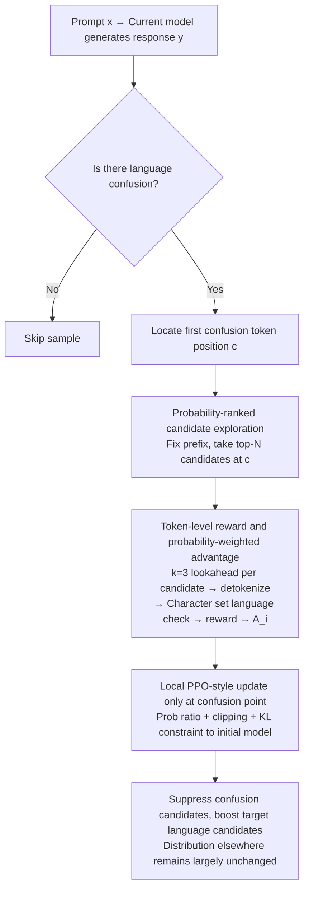

# TLPO: Token-Level Policy Optimization for Mitigating Language Confusion in Large Language Models

**Conference**: ACL2026  
**arXiv**: [2604.26553](https://arxiv.org/abs/2604.26553)  
**Code**: https://github.com/samsungsds-research-papers/TLPO  
**Area**: Multilingual Generation / Machine Translation / LLM Alignment  
**Keywords**: Language Confusion, Token-level Optimization, Multilingual Alignment, PPO, Local Error Correction

## TL;DR
TLPO treats language confusion in multilingual LLMs as locatable local token errors and performs policy optimization only on high-probability candidate tokens at the first confusion position. This significantly improves target language consistency while preserving the model's original reasoning and knowledge capabilities.

## Background & Motivation
**Background**: Multilingual LLMs often experience language confusion in cross-lingual instructions, target language responses, and mixed code/math contexts, where non-target languages are interspersed when the target language should be used. Common correction methods include Supervised Fine-Tuning (SFT), preference optimization like DPO/ORPO, or reinforcement learning alignment using sequence-level rewards on entire responses.

**Limitations of Prior Work**: Language confusion typically occurs only at a few tokens or a specific switching point, but SFT and sequence-level preference optimization treat the entire response as the training target. A side effect is that the model may compromise learned knowledge, reasoning formats, and response length distributions to satisfy language constraints. Particularly when English serves as the carrier of knowledge, excessive suppression of English directly harms accuracy.

**Key Challenge**: Language consistency requires stronger constraints, but global fine-tuning sacrifices model capabilities. The areas actually needing updates are usually near the "first stray token" rather than the complete response sequence. Therefore, the key problem is how to precisely apply training signals to the tokens causing language confusion without disturbing irrelevant positions.

**Goal**: The authors aim to design a token-level policy optimization method that automatically identifies confusion points, explores alternative candidate tokens at those positions, and generates local preference signals using only these candidates to reduce disruption to the global distribution.

**Key Insight**: The paper defines language confusion as a detectable local event: the position $c$ of the first non-target language token in a generated sequence. Instead of rewarding or punishing the entire response, top-N candidate tokens are checked at $c$ to see which cause confusion and which maintain the target language, followed by direct adjustment of the relative probabilities of these candidates.

**Core Idea**: Probability ranking is used to select the most likely top-N tokens at the confusion point. A short lookahead is performed for each candidate to judge confusion, and a PPO-style objective with probability-weighted advantage is used to optimize only these tokens.

## Method
The TLPO workflow is highly localized: the current model generates a response; if no language confusion occurs, the sample is skipped. If confusion appears, the first confusion token is located, and candidates, rewards, and losses are constructed only around this position. The goal is not to relearn the entire multilingual task but to preserve the capabilities already possessed by the original model while lowering the probability mass that leads to language switching.

### Overall Architecture
The TLPO process is highly localized: first, the current model generates a response $y$ for prompt $x$. If there is no language confusion, the sample is skipped. Once confusion appears, the first confusion position $c$ is located, and all training signals are concentrated on this single token. Given a fixed prefix $y_{<c}$, the top-N next tokens from the current policy $\pi_\theta$ are taken as the candidate set. For each candidate, the model generates a very short lookahead sequence and detokenizes it, using character set rules to determine if the candidate triggers output outside the target language. Finally, the reward of candidate tokens and the old policy probability are used to construct the advantage, and the model is updated via a PPO objective with clipping and KL constraints. The goal is to keep the original model's capabilities intact and only suppress the probability mass causing the language switch.

### Key Designs

**1. Probability-ranked candidate exploration: Focusing only on the most likely tokens at the confusion point rather than the entire sequence or vocabulary**

Language confusion is usually triggered by a few high-probability tokens, yet SFT and sequence-level preference optimization treat the entire response as a training target, perturbing irrelevant positions. TLPO does the opposite: at confusion position $c$, the top-N tokens with the highest probability from $\pi_\theta(\cdot \mid x, y_{<c})$ are selected to form candidate set $T$ (Main results use $N=16$; the ablation compares ranked selection with multinomial sampling). Optimizing these most likely candidates directly rewrites the error path most prone to straying while compressing the scope of training signals to a minimum to avoid imposing strong constraints on unrelated tokens.

**2. Token-level reward and probability-weighted advantage: Judging confusion for each candidate individually and converting local judgments into stable policy gradients**

The difficulty lies in the fact that a candidate token is often just a subword, and its language category cannot be determined by its own characters alone. TLPO therefore generates $k=3$ lookahead tokens for each candidate, concatenates them, detokenizes, and provides a reward based on the target language character set. The advantage is written as:

$$A_i = \frac{p_{\text{old}}(t_i)\,\big(R(t_i)-\mu\big)}{Z},$$

where $\mu$ is the probability-weighted average reward and $Z$ is a normalization constant for absolute advantage. Multiplying by the old policy probability $p_{\text{old}}(t_i)$ preserves the existing relative probability structure among valid tokens, while normalization aligns the scale of signals from different confusion points. Ablations show that compared to GRPO-style standard deviation normalization $(R-\mu)/\sigma$, this formulation is friendlier to accuracy—standard deviation scaling can amplify noise in local sets with only a dozen candidates.

**3. Local PPO-style update only at the confusion point: Compressing sequence-level preference optimization into a minimally invasive correction at a single token position**

SFT, DPO, and ORPO all update the complete response, which easily diffuses "language constraints" into semantic and reasoning capabilities, harming accuracy. The TLPO objective only averages over the candidate set $T$, using the new-to-old policy probability ratio, clipping, and a KL penalty against a reference policy. The reference policy is the initial model before applying TLPO, and the KL constraint strictly limits the deviation range. Thus, the model only adjusts the boundary near the "first stray token," acting more like precise error correction than global reshaping. This explains why it can increase language consistency while barely dropping original capabilities.

### Mechanism Example

Suppose the target language is Korean and the prompt requires a Korean response. The model generates normally initially, with the first few sentences in Korean. At some step, it produces an English-starting subword at the top-1 position—this is the first confusion position $c$. TLPO locks $c$, fixes its prefix, and extracts the $N=16$ most probable candidate tokens from $\pi_\theta$ at this position: some are Korean continuations, while others start in English. Each candidate is padded with $k=3$ lookahead tokens, detokenized, and judged by the character set. The English-starting ones are judged as confused (low reward), and the Korean continuations as compliant (high reward). These rewards are substituted into the probability-weighted advantage, where compliant candidates get positive advantage and confused ones get negative advantage, followed by a PPO update with clipping and KL. Consequently, the probability of confused candidates at this single position is suppressed, Korean candidates are boosted, and the distribution of all other tokens in the response remains virtually unchanged. Notably, the paper observes that the cumulative probability of similar confused tokens not in the top-N also decreases, indicating that this local update generalizes through language-related internal representations.

### Loss & Training
Training data comes from the multilingual instruction-following split of Bactrian-X. Target languages include Chinese, Arabic, Korean, and Japanese. Base models include Llama-3.1-8B-Instruct, Qwen3-8B, Ministral-8B-Instruct, and Gemma-3-4B-IT. Evaluation involves two categories: language confusion via Response Pass Rate (RPR) and Word Pass Rate (WPR), and general capabilities via MIF, MMLU, MMMLU, GPQA, ARC-Challenge, BBH, MATH, GSM8K accuracies. Experiments also distinguish two English handling methods: English as a neutral category, and English as language confusion.

## Key Experimental Results

### Main Results
The first set of experiments treats English as a neutral category, which is closer to real-world scenarios where English frequently appears in abbreviations, proper nouns, section headings, and technical terms.

| Method | Avg RPR | Avg WPR | Avg Accuracy | Key Conclusion |
| :--- | :--- | :--- | :--- | :--- |
| Baseline | 96.68 | 99.92 | 58.35 | High accuracy, but still has some language confusion |
| SFT | 99.14 | 99.92 | 50.71 | Consistency improved, but knowledge/reasoning declined significantly |
| DPO | 98.31 | 99.72 | 55.94 | More conservative than SFT, but still loses accuracy |
| ORPO | 97.27 | 99.88 | 55.12 | Limited language correction, accuracy also decreased |
| **Ours (TLPO)** | **99.19** | **99.98** | **58.08** | Highest RPR, accuracy almost maintained at baseline level |

The second set of experiments adopts a stricter setting where any non-target English output is considered confusion. The task difficulty increases significantly as many models default to using English symbols and terms during reasoning.

| Method | Avg RPR | Avg WPR | Avg Accuracy | Key Conclusion |
| :--- | :--- | :--- | :--- | :--- |
| Baseline | 63.27 | 82.31 | 58.24 | Large amounts of English output judged as confused under strict rules |
| SFT | 47.20 | 73.01 | 50.71 | Over-supervision worsens both consistency and accuracy |
| DPO | 72.73 | 84.02 | 54.60 | Improved but with significant capability loss |
| ORPO | 69.75 | 86.51 | 54.61 | High WPR but RPR and accuracy are inferior to TLPO |
| **Ours (TLPO)** | **77.59** | **85.64** | **56.17** | Highest RPR with minimal accuracy loss |

### Ablation Study
The paper focuses on analyzing token selection and advantage formulation.

| Ablation Dimension | Observation | Implication |
| :--- | :--- | :--- |
| Ranked selection vs multinomial sampling | RPR stays above 99% for both, but ranked selection has higher accuracy | Optimizing the most likely candidates avoids perturbing irrelevant distributions better than random sampling |
| TLPO advantage vs $R-\mu$ | TLPO probability-weighted advantage yields highest accuracy | Old policy probability weights help preserve the relative distribution of valid tokens |
| $R-\mu$ vs GRPO-style $(R-\mu)/\sigma$ | Not using standard deviation normalization is better | In local candidate sets, standard deviation scaling can amplify noise |
| Prob changes for tokens outside top-N | Cumulative probability of untrained confusion tokens also drops; non-confusion tokens rise | Local optimization produces generalization through language-related representations |

### Key Findings
- In the English-neutral setting, TLPO increases avg RPR from 96.68 (baseline) to 99.19, while avg accuracy only slightly drops from 58.35 to 58.08; conversely, SFT reaches 99.14 RPR but drops accuracy to 50.71.
- In the strict English-is-confusion setting, TLPO's avg RPR reaches 77.59, which is 4.86 higher than DPO and 7.84 higher than ORPO; avg accuracy of 56.17 is also higher than other alignment methods.
- SFT's RPR in the strict setting is actually lower than the baseline, indicating that supervision with target language answers does not equate to stable suppression of language confusion and might induce shorter, stiffer, or more unstable outputs.
- Probability analysis outside top-N is interesting: even if TLPO only trains top-N candidates, cumulative probabilities of same-language confusion tokens not explicitly in the loss are suppressed, suggesting the model may have language-specific directions or shared components.

## Highlights & Insights
- The biggest highlight is the reformulation of language confusion from "sequence-level alignment failure" to "local token boundary errors." This redefinition makes the training signal extremely precise and explains why TLPO harms knowledge capabilities less than sequence-level preference optimization.
- Lookahead detokenization is a simple but critical implementation detail. In multilingual tokenizers, a character might be split into multiple tokens; looking only at the current token could misjudge the language category. Short lookahead more reliably judges if a candidate actually triggers confusion.
- The two settings (English neutral and English strict) are very valuable. The former is close to actual products, while the latter tests extreme language adherence; together they show TLPO's advantage is not gained by loosening evaluation definitions.
- This token-level optimization logic can be transferred to other "locally detectable errors," such as format leakage, unit errors, specific sensitive words, or incorrect API names in code, provided the error boundary can be automatically located and candidate tokens can be scored.

## Limitations & Future Work
- TLPO relies on clear error boundaries, making it particularly suitable for local errors like language confusion; for sequence-level attributes like helpfulness, factual correctness, or complex reasoning quality, it is difficult to locate a single token.
- Language detection rules are primarily character-set based; handling boundaries for mixed scripts, loanwords, numbers, punctuation, code snippets, and proper nouns may still affect reward accuracy.
- Experiments cover four target languages and four 4B-8B models, but verification is still needed for lower-resource languages, morphologically complex languages, ultra-large models, and real-world multi-turn scenarios.
- Future work could combine TLPO with finer-grained language ID models, token attribution, or contrastive decoding to make error localization and candidate scoring more robust, or explore a unified token-level alignment framework for multiple types of local errors.

## Related Work & Insights
- **vs SFT**: SFT uses complete target language answers to supervise the model, which is direct but easily overwrites model distributions excessively. TLPO only updates the top-N tokens at confusion points, acting like microsurgery, thus better preserving capabilities.
- **vs DPO / ORPO**: DPO and ORPO perform sequence-level preference optimization, making it hard to distinguish "language correct but poor semantics" from "semantics correct but one token confused." TLPO's reward granularity is finer, suiting local errors.
- **vs GRPO**: The authors tried giving GRPO rewards based on whether the whole sequence was confused, but observed that answer lengths gradually shortened during training, so it was excluded from main results. TLPO avoids this length gaming caused by sequence-level rewards.
- **Insight**: Alignment does not always have to start from the complete response. If error types can be localized, local policy optimization may be more stable than global preference learning and easier for preserving the model's original capabilities.

## Rating
- **Novelty**: ⭐⭐⭐⭐☆ The problem framing of token-level policy optimization is clear, precisely locating language confusion at generation boundaries with a simple and effective method.
- **Experimental Thoroughness**: ⭐⭐⭐⭐☆ Covers multiple models, languages, two English evaluation settings, and diverse capability benchmarks; ablation trends are clear, though some charts lacks precise numerical values.
- **Writing Quality**: ⭐⭐⭐⭐☆ Motivation and experimental explanations are smooth; methods are formula-heavy but generally easy to follow.
- **Value**: ⭐⭐⭐⭐☆ Highly practical for multilingual LLM products and provides a transferable paradigm for local error alignment.

<!-- RELATED:START -->

## Related Papers

- [\[ACL 2025\] Cross-Lingual Optimization for Language Transfer in Large Language Models](../../ACL2025/multilingual_mt/cross-lingual_optimization_for_language_transfer_in_large_language_models.md)
- [\[ACL 2026\] Hierarchical Policy Optimization for Simultaneous Translation of Unbounded Speech](hierarchical_policy_optimization_for_simultaneous_translation_of_unbounded_speec.md)
- [\[ACL 2026\] LaoBench: A Large-Scale Multidimensional Lao Benchmark for Large Language Models](laobench_a_large-scale_multidimensional_lao_benchmark_for_large_language_models.md)
- [\[ACL 2026\] LLM-XTM: Enhancing Cross-Lingual Topic Models with Large Language Models](llm-xtm_enhancing_cross-lingual_topic_models_with_large_language_models.md)
- [\[ACL 2026\] Language Models Entangle Language and Culture](language_models_entangle_language_and_culture.md)

<!-- RELATED:END -->
