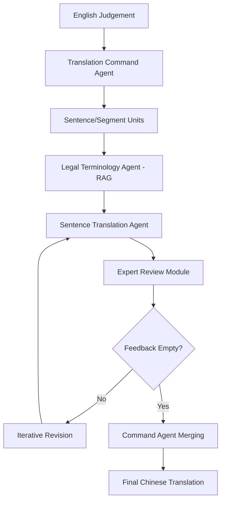

# TransLaw: A Large-Scale Dataset and Multi-Agent Benchmark Simulating Professional Translation of Hong Kong Case Law

**Conference**: ACL2026  
**arXiv**: [2507.00875](https://arxiv.org/abs/2507.00875)  
**Code**: No public link (the paper claims to release the HKCFA Judgement 97-22 dataset)  
**Area**: Information Retrieval / Legal Machine Translation / Multi-Agent Systems  
**Keywords**: Legal Translation, Hong Kong Case Law, Multi-Agent, RAG Terminology Retrieval, Human Evaluation

## TL;DR
This paper constructs the first sentence-level parallel dataset for Hong Kong Court of Final Appeal (HKCFA) judgements (HKCFA Judgement 97-22) and proposes TransLaw, a multi-agent system simulating professional legal translation workflows. It significantly outperforms single-agent translators in automated metrics, human expert evaluations, and cost efficiency.

## Background & Motivation
**Background**: Legal machine translation has evolved from general MT to LLM-assisted translation, yet most evaluations remain limited to general legal texts or cross-lingual corpora. Hong Kong case law involves a unique bilingual system, common law terminology, specific judgement structures, and citation formats, requiring translation to adhere to local judicial norms beyond mere semantic alignment.

**Limitations of Prior Work**: Regarding public data, there is a lack of high-quality sentence-level English-Chinese parallel corpora covering HKCFA judgements. Regarding systems, single LLM translators often bundle terminology understanding, translation, citation checking, and style polishing into a single generation, leading to mistranslations, factual omissions, non-compliant citations, and cross-paragraph inconsistencies.

**Key Challenge**: Legal translation is a professional pipeline rather than a single generation task. A translator must consult official glossaries, refer to context, verify legal meanings, and check citation formats. Even strong single agents struggle to stabilize these conflicting quality dimensions simultaneously.

**Goal**: To provide two infrastructures: a verifiable bilingual dataset for Hong Kong case law and a multi-agent benchmark that replicates professional division of labor, allowing systematic comparison of LLMs across different translation roles.

**Key Insight**: Instead of simple prompt engineering, the professional translation process is decomposed into three layers: command, execution, and review. This separates terminology retrieval from translation and creates an iterative review loop to minimize error propagation.

**Core Idea**: Utilize a role-based multi-agent collaboration—comprising a Project Manager, Terminology Expert, Court Translator, and Multi-dimensional Reviewers—to replace a single LLM translating entire judgement segments.

## Method
TransLaw contributes both a dataset and a system. The HKCFA Judgement 97-22 dataset provides high-quality alignment; the TransLaw system segments English judgements into manageable units, performs terminology-aware translation, and subjects them to four types of expert review (semantic, terminology, citation, style) before final synthesis by a command agent.

### Overall Architecture
The input is an English HKCFA judgement. The system segments it into a sentence sequence $J=\{s_i\}$. The **Translation Command Agent** maintains the global workflow and translation memory. In the **Translation Execution Module**, a **Legal Terminology Agent** retrieves candidates from official glossaries via RAG, and a **Sentence Translation Agent** generates a draft using these terms and context. The **Expert Review Module** uses specialized agents to inspect dimensions. Feedback is mapped to revision suggestions for the next iteration until feedback is null or the iteration limit is reached.

### Key Designs
1.  **HKCFA Judgement 97-22 Dataset**:
    *   **Function**: Provides a reproducible benchmark for HK case law translation.
    *   **Mechanism**: Extracts 344 high-quality official bilingual judgements from 1997-2022, utilizing the original HTML structure for alignment rather than automated alignment tools.
    *   **Design Motivation**: Reliable reference targets are crucial for legal MT evaluation. Official translations ensure trustworthy terminology and style.

2.  **3-Layer 7-Role Multi-Agent Pipeline**:
    *   **Function**: Decomposes professional translation into coordination, execution, and review phases.
    *   **Mechanism**: Command agents handle task dispatch and memory; Execution includes terminology RAG (using DOA Glossaries) and translation agents; Review involves semantic alignment, terminology verification, citation checking, and judicial style polishing agents.
    *   **Design Motivation**: Legal errors are often multidimensional. Role specialization allows agents to focus on verifiable dimensions and generate structured feedback.

3.  **Iterative Revision Mechanism**:
    *   **Function**: Refines drafts through expert feedback loops.
    *   **Mechanism**: Given feedback set $\mathcal{F}_i^{(k)}$ from iteration $k$, the Command agent updates the translation from $\hat{s}_i^{(k)}$ to $\hat{s}_i^{(k+1)}=\hat{s}_i^{(k)}\oplus\Psi(\mathcal{F}_i^{(k)})$.
    *   **Design Motivation**: Iteration controls errors at a local level, mimicking real-world professional review processes.

### Loss & Training
No new models are trained. Optimization is achieved via process control: RAG from official databases, context-constrained translation, and iterative feedback loops. Automated evaluation uses **xCOMET-XL** and **wmt22-unite-da** with 1,000 bootstrap runs. Human evaluation uses a Legal ACS metric: $I=0.6A+0.3C+0.1S$ (A: Accuracy, C: Coherence, S: Style).

## Key Experimental Results

### Main Results
The comparison between the same LLM in the TransLaw multi-agent system versus a Single Translator Agent shows significant gains across all models.

| Model | TransLaw xCOMET-XL | TransLaw Avg. | Single Agent Avg. | Gain (Avg.) |
| :--- | ---: | ---: | ---: | ---: |
| GPT-4o | 85.12 | 88.45 | 72.65 | +15.80 |
| GPT-4 | 84.24 | 87.15 | 71.17 | +15.98 |
| ChatGPT | 82.29 | 85.41 | 69.12 | +16.29 |
| DeepSeek-V3 | 83.53 | 86.55 | 70.45 | +16.10 |
| Qwen-14B-Chat | 81.86 | 84.49 | 68.67 | +15.82 |
| ChatLaw-13B | 76.26 | 79.43 | 61.65 | +17.78 |

### Ablation Study
Experimental analysis covers dataset scale, role allocation, human evaluation, and cost.

| Analysis Item | Key Data/Observation | Note |
| :--- | :--- | :--- |
| **Dataset Scale** | 344 judgements, 11,099 segments, 811k EN tokens, 1.31M CN tokens | High-precision alignment using official HTML structures. |
| **Role Allocation** | xCOMET-XL 85.12 (GPT-4o execution/review) | Strong command agents ensure stability; replacing roles with weaker models leads to gradual degradation. |
| **Human Eval** | 200 paragraphs, 10 certified legal translators | TransLaw leads in accuracy; official human translation still wins in coherence and style. |
| **Cost Analysis** | Manual: \$1,390.20; TransLaw API: \$0.35 | TransLaw API cost is nearly 4,000x lower than pure manual translation. |

### Key Findings
*   **Workflow over Model**: Gains are consistent (15-18 points) across varying model strengths, proving the effectiveness of the division of labor.
*   **Legal LLMs vs. General LLMs**: Specialized legal LLMs like ChatLaw underperform compared to general strong models (GPT, DeepSeek) on this benchmark, suggesting "legal pre-training" does not equate to translation proficiency.
*   **Human-in-the-Loop**: While TransLaw excels in accuracy and cost, humans remain superior in stylistic nuance. TransLaw is best suited as a high-quality "first draft" for human editing.

## Highlights & Insights
*   The paper shifts legal MT evaluation from "can it translate" to "can it execute a professional workflow," addressing terminology and citations which are more critical than BLEU scores.
*   The dataset construction is pragmatic, leveraging official HTML structures to avoid noises inherent in automated sentence aligners for complex legal texts.
*   The role-based agent boundaries are well-defined, turning unstructured LLM generation into a supervised, multi-stage professional pipeline.

## Limitations & Future Work
*   **Jurisdiction Specificity**: High localization to Hong Kong law means knowledge bases and review rules would need reconstruction for other regions.
*   **Metric Gaps**: Automated metrics might miss fine-grained legal risks (e.g., a citation error leading to legal misinterpretation).
*   **Future Direction**: Utilizing expert feedback as signals for preference optimization (RLHF) to teach models which reviews are most critical.

## Related Work & Insights
*   Compared to **General MT**, TransLaw integrates legal-specific constraints (terminology/citation).
*   Compared to **Single Agent Translation**, TransLaw externalizes error checking, making failures easier to locate and fix.
*   Compared to **Legal LLMs**, TransLaw utilizes RAG and process control to externalize knowledge, offering better controllability than parameter-bound knowledge.

## Rating
*   **Novelty**: ⭐⭐⭐⭐☆ Tight integration of dataset and workflow.
*   **Experimental Thoroughness**: ⭐⭐⭐⭐☆ Broad model coverage and human evaluation.
*   **Writing Quality**: ⭐⭐⭐⭐☆ Clear methodology, though role descriptions are somewhat formalized.
*   **Value**: ⭐⭐⭐⭐⭐ High reference value for legal NLP and high-stakes agent design.

<!-- RELATED:START -->

## Related Papers

- [\[ACL 2026\] LaoBench: A Large-Scale Multidimensional Lao Benchmark for Large Language Models](laobench_a_large-scale_multidimensional_lao_benchmark_for_large_language_models.md)
- [\[ACL 2026\] FairQE: Multi-Agent Framework for Mitigating Gender Bias in Translation Quality Estimation](fairqe_multi-agent_framework_for_mitigating_gender_bias_in_translation_quality_e.md)
- [\[ACL 2026\] Alexandria: A Multi-Domain Dialectal Arabic Machine Translation Dataset for Culturally Inclusive and Linguistically Diverse LLMs](alexandria_a_multi-domain_dialectal_arabic_machine_translation_dataset_for_cultu.md)
- [\[ACL 2026\] XQ-MEval: A Dataset with Cross-lingual Parallel Quality for Benchmarking Translation Metrics](xq-meval_a_dataset_with_cross-lingual_parallel_quality_for_benchmarking_translat.md)
- [\[ACL 2026\] The GaoYao Benchmark: A Comprehensive Framework for Evaluating Multilingual and Multicultural Abilities of Large Language Models](the_gaoyao_benchmark_a_comprehensive_framework_for_evaluating_multilingual_and_m.md)

<!-- RELATED:END -->
## Related Papers

- [\[ACL 2026\] FairQE: Multi-Agent Framework for Mitigating Gender Bias in Translation Quality Estimation](fairqe_multi-agent_framework_for_mitigating_gender_bias_in_translation_quality_e.md)
- [\[ACL 2026\] LaoBench: A Large-Scale Multidimensional Lao Benchmark for Large Language Models](laobench_a_large-scale_multidimensional_lao_benchmark_for_large_language_models.md)
- [\[ACL 2026\] Alexandria: A Multi-Domain Dialectal Arabic Machine Translation Dataset for Culturally Inclusive and Linguistically Diverse LLMs](alexandria_a_multi-domain_dialectal_arabic_machine_translation_dataset_for_cultu.md)
- [\[ACL 2025\] Towards Global AI Inclusivity: A Large-Scale Multilingual Terminology Dataset (GIST)](../../ACL2025/multilingual_mt/towards_global_ai_inclusivity_a_large-scale_multilingual_terminology_dataset_gis.md)
- [\[ACL 2025\] M-MAD: Multidimensional Multi-Agent Debate for Advanced Machine Translation Evaluation](../../ACL2025/multilingual_mt/m-mad_multidimensional_multi-agent_debate_for_advanced_machine_translation_evalu.md)

<!-- RELATED:END -->
