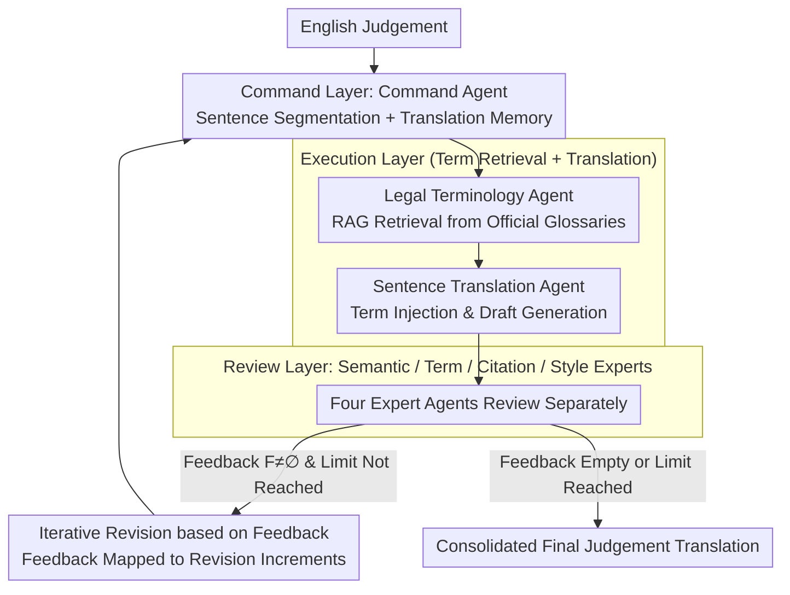

# TransLaw: A Large-Scale Dataset and Multi-Agent Benchmark Simulating Professional Translation of Hong Kong Case Law

**Conference**: ACL2026  
**arXiv**: [2507.00875](https://arxiv.org/abs/2507.00875)  
**Code**: No public code link (the paper claims to release the HKCFA Judgement 97-22 dataset)  
**Area**: Information Retrieval / Legal Machine Translation / Multi-agent Systems  
**Keywords**: Legal Translation, Hong Kong Case Law, Multi-agent, RAG Terminology Retrieval, Human Evaluation

## TL;DR
This paper constructs the first sentence-level parallel dataset, HKCFA Judgement 97-22, specifically for English-Chinese translation of Hong Kong Court of Final Appeal judgements. It proposes the TransLaw multi-agent system, which simulates professional legal translation workflows. TransLaw significantly outperforms single-agent benchmarks in automatic metrics, professional legal translator evaluations, and cost-efficiency.

## Background & Motivation
**Background**: Legal machine translation has transitioned from general MT to LLM-assisted translation. However, most evaluations remain focused on general legal texts or cross-lingual general corpora. Hong Kong case law involves a unique bilingual system, common law terminology, specific judgement structures, and citation formats. Translation quality requires not only semantic alignment but also adherence to local norms regarding terminology, case citations, and judicial style.

**Limitations of Prior Work**: At the data level, there is a lack of high-quality, English-Chinese sentence-level parallel corpora specifically covering Hong Kong Court of Final Appeal judgements. At the system level, single LLM translators typically consolidate terminology understanding, sentence translation, citation checking, and style polishing into a single generation pass, leading to terminology errors, factual omissions, non-compliant citation formats, and cross-paragraph inconsistencies.

**Key Challenge**: Legal translation is essentially a professional pipeline rather than a single-shot text generation task. A translator must consult official glossaries, refer to context, verify legal meanings, and check citation formats before refining the judicial style. Even with powerful models, a single agent struggles to stably cover these constrained quality dimensions simultaneously.

**Goal**: The authors aim to bridge two infrastructure gaps: first, constructing an evaluable bilingual dataset for Hong Kong case law; second, establishing a multi-agent benchmark that replicates professional legal translation labor division, allowing for systematic comparison of different LLMs across various translation roles.

**Key Insight**: Instead of relying solely on prompt engineering, the paper decomposes the professional translation process into three layers: command, execution, and review. This separates terminology retrieval from sentence translation and creates an iterative closed-loop for review feedback, reducing the amplification of single-point errors.

**Core Idea**: Utilizing a role-based multi-agent collaboration—comprising a Project Manager, Terminology Expert, Court Translator, and Multi-dimensional Review Experts—to replace a single LLM in translating entire judgements.

## Method
The contributions of TransLaw are divided into two tracks: the dataset and the system. The HKCFA Judgement 97-22 dataset provides authentic, high-quality aligned English-Chinese judgement materials. The TransLaw system segments English judgements into manageable units, processed via terminology parsing and translation, followed by semantic, terminology, citation, and style reviews, finally consolidated by a command agent.

### Overall Architecture
The input is an English HKCFA judgement. The system first segments it into a sequence of sentences $J=\{s_i\}$ based on semantic structure. The Translation Command Agent maintains the global workflow and translation memory. In the Translation Execution Module, the Legal Terminology Agent retrieves candidate terms from official Department of Justice (DOJ) glossaries, and the Sentence Translation Agent generates a draft using these terms and context. The Expert Review Module utilizes specialized agents to inspect semantics, terminology, citations, and style. If errors are found, feedback is mapped to revision suggestions for the next iteration until the feedback is empty or the iteration limit is reached.

### Key Designs

**1. HKCFA Judgement 97-22 Sentence-Level Parallel Dataset: Solving Evaluation Challenges with Official Judgements**

Legal translation evaluation suffers when the "gold reference" itself is unreliable. If the reference contains terminology or citation errors, metrics become noise. The authors bypassed automatic alignment tools, extracting 344 high-quality official translations from 1997-2022 HKCFA judgements and performing alignment using the original paragraph and sentence structures of government webpages. Despite the smaller scale compared to general corpora, the official nature of the terminology and style makes it a high-precision benchmark.

**2. Three-Layer Seven-Role Multi-Agent Pipeline: Decomposing Monolithic Generation into Verifiable Steps**

Single LLM translators often mix terminology, translation, citation, and style, making it difficult to locate errors. TransLaw segments the workflow into Coordination, Execution, and Review layers. The command agent handles segmentation and task dispatch. The Legal Terminology Agent uses RAG to retrieve candidates from the *Combined DOJ Glossaries of Legal Terms*, which are then injected by the Sentence Translation Agent. The review module employs four expert agents focusing on semantic alignment, terminology verification, citation checking, and judicial style polishing. This isolation allows for structured, actionable feedback.

**3. Iterative Revision Mechanism based on Review Feedback: Converging Drafts to Publishable Quality**

Since single-pass generation rarely meets all legal requirements, the system closes the loop for each sentence. After the $k$-th review round summarizes feedback $\mathcal{F}_i^{(k)}$, the command agent maps it to specific text revision increments, updating the translation from $\hat{s}_i^{(k)}$ to:

$$\hat{s}_i^{(k+1)}=\hat{s}_i^{(k)}\oplus\Psi(\mathcal{F}_i^{(k)})$$

where $\Psi$ converts review opinions into modification operations, and $\oplus$ denotes applying modifications to the current translation. This continues until feedback is empty or the limit is reached, mimicking a real translation agency's "translate-review-revise" rhythm.

### Mechanism: A Complete Example
Using a judgement containing common law terms, the command agent segments the text into $J=\{s_i\}$. For $s_i$, the Legal Terminology Agent retrieves official Chinese equivalents for specific terms. The Sentence Translation Agent produces draft $\hat{s}_i^{(0)}$. The review module provides feedback: the semantic agent finds a weakened legal meaning, the term agent notes a non-official term, the citation agent flags a format error, and the style agent suggests more formal phrasing, forming $\mathcal{F}_i^{(0)}$. The command agent maps these to updates, producing $\hat{s}_i^{(1)}$. Once all agents approve ($\mathcal{F}_i^{(1)}=\varnothing$), the final version is written to translation memory for consistency.

### Loss & Training
The study does not train a new model but constructs evaluation data and agent workflows. "Optimization" is reflected in process control: terminology candidates are retrieved from official databases, drafts are constrained by global context memory, and review feedback iteratively refines the text. Evaluation uses xCOMET-XL and wmt22-unite-da with 1,000 bootstrap iterations (95.45% CI). Human evaluation uses the Legal ACS metric $I=0.6A+0.3C+0.1S$, where A is Accuracy, C is Coherence, and S is Style.

## Key Experimental Results

### Main Results
The paper compares the same LLMs as TransLaw multi-agent systems versus Single Translator Agents. All models see significant improvements under the multi-agent framework, suggesting benefits stem from task division rather than specific closed-source models.

| Model | TransLaw xCOMET-XL | TransLaw Avg. | Single Agent Avg. | Avg. Gain |
|------|-------------------:|--------------:|--------------:|----------:|
| GPT-4o | 85.12 | 88.45 | 72.65 | +15.80 |
| GPT-4 | 84.24 | 87.15 | 71.17 | +15.98 |
| ChatGPT | 82.29 | 85.41 | 69.12 | +16.29 |
| DeepSeek-V3 | 83.53 | 86.55 | 70.45 | +16.10 |
| Qwen-14B-Chat | 81.86 | 84.49 | 68.67 | +15.82 |
| ChatLaw-13B | 76.26 | 79.43 | 61.65 | +17.78 |

### Ablation Study
The study analyzes data scale, agent role allocation, human evaluation, and costs. A key observation: stronger models provide more stable gains as command/review agents, but multi-agent workflows outperform single agents even with weaker open-source models.

| Analysis Item | Key Data | Description |
|--------|----------|------|
| Dataset Scale | 344 judgements, 11,099 sentence samples | 811k English tokens / 1.3M Chinese tokens; 1997-2022 HKCFA coverage. |
| Agent Allocation | GPT-4o execution/review: 85.12 xCOMET-XL | High-quality command agents stabilize the process. |
| Human Evaluation | 200 paragraph samples, 10 certified translators | TransLaw leads in accuracy; official translations remain superior in coherence and style. |
| Cost Analysis | Human: ~$1,390.20; TransLaw API: ~$0.35 | TransLaw API cost is nearly 4,000x lower than human translation. |

### Key Findings
- **Multi-agent benefits are generalized**: Improvements across various models (GPT, DeepSeek, Qwen) range between 15-18 points, indicating the effectiveness of workflow division.
- **Legal-specific LLMs are not inherently superior**: ChatLaw lags behind general strong models (GPT, DeepSeek), suggesting that specialized pre-training does not automatically grant refined translation capabilities.
- **Human translation still holds an edge in style and coherence**: TransLaw's primary advantages are accuracy and cost; production-level scenarios still require human review.

## Highlights & Insights
- The paper advances legal MT evaluation from "can it translate" to "can it complete a professional workflow," prioritizing details like terminology and citation.
- The dataset construction is pragmatic, leveraging official HTML structures to avoid the noise common in automatic alignment for long legal sentences.
- The role-based agent division is well-defined, partitioning responsibilities based on professional workflows so that each output is verifiable by the subsequent step.
- The cost analysis includes human editing costs, providing a more honest perspective than just reporting API call prices.

## Limitations & Future Work
- The focus on Hong Kong case law means terminology and styles are highly localized; migration to other jurisdictions or legal types may requires rebuilding knowledge bases.
- Automatic metrics may not capture fine-grained legal risks, such as whether a citation error leads to interpretive bias.
- Human evaluation scale is limited to a subset of FACC 1/2021; broader diversity in case types is needed.
- Future work could transform expert feedback into training or preference optimization signals for the model.

## Related Work & Insights
- **vs. General MT Evaluation**: General MT focuses on semantic fluency; TransLaw integrates terminology, citation, and style.
- **vs. Single Agent Legal Translation**: Single agents rely on one prompt; TransLaw externalizes error checking into verifiable steps.
- **vs. Legal LLMs**: While dedicated models internalize knowledge, TransLaw externalizes it through RAG and workflows, offering better control.
- **Transferable Insight**: High-risk domains (medical, patent, audit) could adopt this "RAG + Draft + Multi-review + Iteration" workflow.

## Rating
- Novelty: ⭐⭐⭐⭐☆ (Strong integration of datasets and agent workflows, though multi-agent concepts exist elsewhere.)
- Experimental Thoroughness: ⭐⭐⭐⭐☆ (Covers 13 models and human evaluation, though the scope of cases for humans is narrow.)
- Writing Quality: ⭐⭐⭐⭐☆ (Clear division of methods and rich data presentation.)
- Value: ⭐⭐⭐⭐⭐ (Directly applicable to legal NLP and high-risk document agent design.)

<!-- RELATED:START -->

## Related Papers

- [\[ACL 2026\] LaoBench: A Large-Scale Multidimensional Lao Benchmark for Large Language Models](laobench_a_large-scale_multidimensional_lao_benchmark_for_large_language_models.md)
- [\[ACL 2026\] FairQE: Multi-Agent Framework for Mitigating Gender Bias in Translation Quality Estimation](fairqe_multi-agent_framework_for_mitigating_gender_bias_in_translation_quality_e.md)
- [\[ACL 2026\] Alexandria: A Multi-Domain Dialectal Arabic Machine Translation Dataset for Culturally Inclusive and Linguistically Diverse LLMs](alexandria_a_multi-domain_dialectal_arabic_machine_translation_dataset_for_cultu.md)
- [\[ACL 2025\] Towards Global AI Inclusivity: A Large-Scale Multilingual Terminology Dataset (GIST)](../../ACL2025/multilingual_mt/towards_global_ai_inclusivity_a_large-scale_multilingual_terminology_dataset_gis.md)
- [\[ACL 2025\] M-MAD: Multidimensional Multi-Agent Debate for Advanced Machine Translation Evaluation](../../ACL2025/multilingual_mt/m-mad_multidimensional_multi-agent_debate_for_advanced_machine_translation_evalu.md)

<!-- RELATED:END -->
