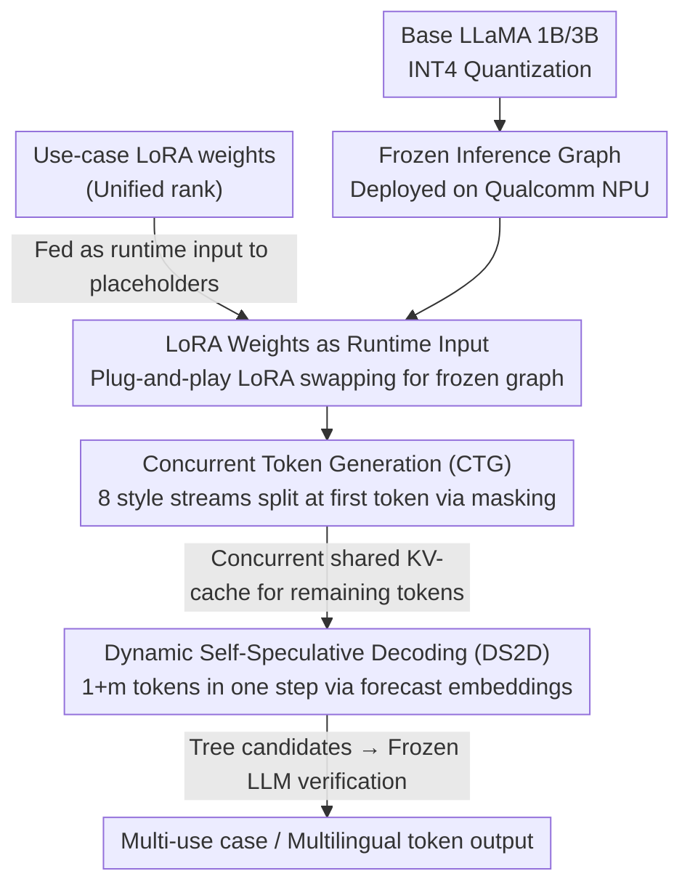

# Unlocking the Edge: Multi-LoRA On-Device Deployment and Acceleration

**Conference**: ACL 2026  
**arXiv**: [2604.18655](https://arxiv.org/abs/2604.18655)  
**Code**: None (Samsung internal system)  
**Area**: Multilingual Translation  
**Keywords**: On-device LLM deployment, Multi-LoRA, Speculative decoding, Concurrent token generation, INT4 quantization

## TL;DR

This paper proposes an on-device LLM deployment framework for the Samsung Galaxy S24/S25. It achieves dynamic task switching by using LoRA weights as runtime inputs, reduces style variant latency by up to 6x through multi-stream concurrent token generation, and accelerates decoding by up to 2.3x via Dynamic Self-Speculative Decoding without any draft models. Overall optimization of 4-6x is realized across 8 tasks in 9 languages.

## Background & Motivation

**Background**: Deploying LLMs on mobile devices provides privacy, low latency, and offline capabilities but faces strict constraints regarding memory, latency, and runtime flexibility. LoRA is the mainstream method for efficient fine-tuning; however, traditional practices involve statically merging weights, which prevents dynamic task switching on-device.

**Limitations of Prior Work**: (1) Servers can flexibly load or switch LoRA weights, but on-device deployment must use frozen inference graphs that cannot be recompiled or dynamically loaded; (2) Generating style variants (e.g., providing formal, polite, and humorous replies simultaneously) requires 8 sequential runs, leading to 8x latency; (3) Auto-regressive decoding, generating tokens one by one, is the primary bottleneck for on-device latency, and existing speculative decoding requires additional draft models that consume scarce memory.

**Key Challenge**: The contradiction between flexible model development (multi-LoRA/multi-use case) and the immutability of on-device inference graphs necessitates a fundamental redesign of the engineering architecture for adaptable on-device LLMs.

**Goal**: To implement real-time, multilingual, and multi-use case LLM inference on the Qualcomm NPU of commercial smartphones (Galaxy S24/S25).

**Key Insight**: Innovations across three levels: (1) LoRA weights treated as runtime inputs for the frozen graph; (2) Multi-stream token generation utilizing a shared KV-cache; (3) Draft-less speculative decoding based on prefix tuning.

**Core Idea**: All use-case-specific knowledge is encapsulated in lightweight LoRA weights as external inputs to the inference graph. Combined with concurrent generation and self-speculative strategies, multi-use case on-device LLM functionality is achieved on a single frozen model.

## Method

### Overall Architecture

Based on LLaMA models with 1B/3B parameters, the system is deployed on Qualcomm SM8650/SM8750 NPUs after INT4 quantization. The design centers on a **compiled, immutable frozen inference graph**. First, "LoRA weights as runtime inputs" allow the frozen graph to switch use cases in a plug-and-play manner. Next, CTG (Concurrent Token Generation) is applied during the decoding phase to compress style variant latency. Finally, DS2D (Dynamic Self-Speculative Decoding) is integrated to compress single-token decoding latency. All three components operate without modifying the model binary.

### Key Designs

**1. LoRA weights as runtime input: Shifting adaptability from "compile-time" to "runtime"**

The most difficult constraint on-device is that the inference graph is immutable once compiled, unlike servers that can recompile or dynamically load LoRA. Traditional methods statically merge a specific LoRA into the weights, resulting in one graph per use case. This work constructs a base LLM graph with placeholders for LoRA weights. During inference, LoRA weights are fed as inputs alongside tokens. As long as all LoRA ranks are consistent, they can be swapped at runtime. Compared to multi-graph schemes or masking multiple LoRAs within a single graph, this "weight-as-input" approach provides the best scalability, keeping peak memory for a 3B model at 2.5GB.

**2. Concurrent Token Generation (CTG): Compressing 8 style variants into a single forward pass**

Applications like Smart-Reply often require providing 8 different replies simultaneously (e.g., formal, polite, humorous). Sequential generation results in 8x latency. CTG leverages the observation that style differences are primarily driven by the first token. After the first token sampling splits into 8 streams via a masking scheme, the remaining generation shares the same frozen graph and KV-cache. This reduces latency and memory usage by approximately 6x without modifying the model binary. On a 1B model, the latency for 8 streams drops from 174ms ($23 \times 8 + 40$) to 63ms ($23 + 40$).

**3. Dynamic Self-Speculative Decoding (DS2D): Self-speculation using prefix tuning without draft models**

Auto-regressive decoding is the main cause of latency, yet standard speculative decoding requires an additional draft model, which is costly given scarce on-device memory. DS2D utilizes prefix tuning to add $m$ forecast embeddings, enabling the model to predict $1+m$ tokens in a single step. The first token corresponds to the original LLM distribution to maintain fidelity, while the subsequent $m$ tokens serve as low-fidelity drafts for verification. Candidates are expanded using a tree structure, specifically configured to align with hardware-friendly 32-word boundaries. This achieves 1.86–2.25x acceleration with negligible parameter overhead.

### Loss & Training

The training details for the base model and LoRAs are proprietary. DS2D forecast embeddings are trained via prefix tuning. INT4 quantization employs QAT (Quantization Aware Training) with a mixed-precision strategy.

## Key Experimental Results

### Main Results

**3B LLM Performance on Galaxy S25 Ultra**

| Use Case | Decoding Time w/o DS2D (ms) | Decoding Time w/ DS2D (ms) | Gain |
| :--- | :--- | :--- | :--- |
| Correction | 50.17 | 22.30 | 2.25x |
| Composer | 53.23 | 28.57 | 1.86x |
| Style | 50.42 | 25.21 | 2.00x |

### Ablation Study

**CTG Latency Analysis (1B Model)**

| Streams | Prefill (ms) | AR (ms) | Total Time (ms) | Formula |
| :--- | :--- | :--- | :--- | :--- |
| 1 stream × 8 | 40 | 23 | 174 | $(23 \times 8) + 40$ |
| 8 streams concurrent | 40 | 23 | 63 | $23 + 40$ |

### Key Findings

- The LoRA-as-input scheme outperforms alternatives in both memory and latency, with 3B model peak memory usage at only 2.5GB.
- CTG compresses 8-stream generation from 174ms to 63ms (2.76x acceleration) without requiring model modifications.
- DS2D achieves 1.86–2.25x decoding acceleration across various use cases.
- Task accuracy across 6 languages remains above 90% after INT4 quantization.

## Highlights & Insights

- The LoRA-as-input design is elegant and efficient. Moving adaptability from "compile-time" to "runtime" provides a useful reference for any frozen graph deployment scenario.
- The insight that style differences are typically driven by the first token is highly practical; in real-world products, different response styles indeed diverge at the beginning.
- This paper provides a rare, comprehensive description of on-device LLM deployment from an engineering perspective, offering direct value to the industry.

## Limitations & Future Work

- Validated only on Samsung proprietary hardware and models.
- Training details for the base model and LoRA are not disclosed, limiting reproducibility.
- The tree-based branch search in DS2D increases engineering complexity.
- Lack of direct comparison with other on-device LLM frameworks such as MLC-LLM or llama.cpp.

## Related Work & Insights

- **vs QLoRA**: Focuses on training-time quantization, whereas this work focuses on dynamic LoRA switching during deployment.
- **vs Medusa/Eagle**: These require extra speculative heads or draft models, whereas DS2D requires only lightweight prefix tuning.
- **vs MobiLlama**: Focuses on model efficiency, while this work focuses on the full-stack engineering optimization of on-device deployment.

## Rating

- Novelty: ⭐⭐⭐⭐ LoRA-as-input and CTG designs are innovative; DS2D improves upon existing methods.
- Experimental Thoroughness: ⭐⭐⭐ Real-world performance data on commercial devices is valuable, though comparisons with external methods are missing.
- Writing Quality: ⭐⭐⭐ Rich in engineering details, though academic writing style could be improved.
- Value: ⭐⭐⭐⭐ High practical utility for on-device LLM deployment.

<!-- RELATED:START -->

## Related Papers

- [\[ACL 2026\] RouteLMT: Learned Sample Routing for Hybrid LLM Translation Deployment](routelmt_learned_sample_routing_for_hybrid_llm_translation_deployment.md)
- [\[ACL 2026\] FairQE: Multi-Agent Framework for Mitigating Gender Bias in Translation Quality Estimation](fairqe_multi-agent_framework_for_mitigating_gender_bias_in_translation_quality_e.md)
- [\[ACL 2026\] Efficient Low-Resource Language Adaptation via Multi-Source Dynamic Logit Fusion](efficient_low-resource_language_adaptation_via_multi-source_dynamic_logit_fusion.md)
- [\[ACL 2026\] Alexandria: A Multi-Domain Dialectal Arabic Machine Translation Dataset for Culturally Inclusive and Linguistically Diverse LLMs](alexandria_a_multi-domain_dialectal_arabic_machine_translation_dataset_for_cultu.md)
- [\[ACL 2025\] M3FinMeeting: A Multilingual, Multi-Sector, and Multi-Task Financial Meeting Understanding Evaluation Dataset](../../ACL2025/multilingual_mt/m3finmeeting_a_multilingual_multi-sector_and_multi-task_financial_meeting_unders.md)

<!-- RELATED:END -->
