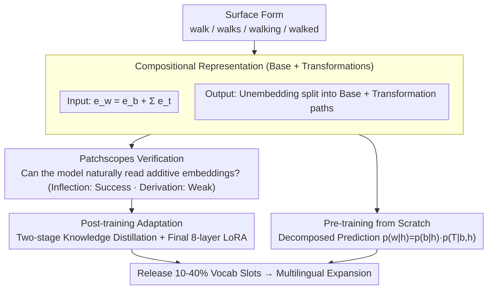

# Vocab Diet: Reshaping the Vocabulary of LLMs via Vector Arithmetic

**Conference**: ACL 2026 Findings  
**arXiv**: [2510.17001](https://arxiv.org/abs/2510.17001)  
**Code**: [GitHub](https://vocabdiet.github.io)  
**Area**: Multilingual Translation  
**Keywords**: Compositional Vocabulary, Vector Arithmetic, Morphological Transformation, Vocabulary Compression, Multilingual Coverage

## TL;DR

This paper discovers that LLMs encode morphological variations (e.g., walk→walked) as linear directions in the embedding space. Based on this, a compositional vocabulary design is proposed: replacing independent tokens for each surface form with an additive combination of a base word and transformation vectors. By training a small adaptation module while freezing the pre-trained backbone, this method releases 10-40% of vocabulary slots for multilingual expansion with negligible impact on downstream performance.

## Background & Motivation

**Background**: Modern LLMs commonly utilize the BPE tokenization algorithm, with vocabulary sizes exceeding 100K tokens. Vocabulary design is essentially a resource allocation problem: every slot assigned to a specific language or domain comes at the cost of other coverage. Recent studies show a severe imbalance in vocabulary allocation across languages, negatively affecting model cost and performance.

**Limitations of Prior Work**: (1) **Redundant Allocation**: Standard tokenization treats morphologically related forms (walk, walks, walking, walked) as independent tokens, each occupying a slot. For instance, in the GPT-4 vocabulary, 24.6K English full-word tokens yield only 14.3K base forms after removing case and inflectional/derivational variants—representing 42% redundancy. (2) **Insufficient Multilingual Coverage**: Large numbers of slots are occupied by surface variants of high-resource languages, leaving low-resource languages severely under-covered. (3) **OOV Issues**: While 14.3K base forms and transformations can theoretically compose 98K words currently outside the vocabulary, standard vocabularies cannot leverage this structure.

**Key Challenge**: Vocabulary size is constrained by memory and computation, yet standard tokenization ignores the linear morphological structures already present in LLM embedding spaces. Models internally encode morphological changes as simple vector offsets, yet continue to learn separate embeddings for every variant at the vocabulary level.

**Goal**: (1) To verify whether LLMs can understand "base word + transformation vector" compositional embeddings; (2) To construct a compositional vocabulary that releases redundant slots; (3) To validate feasibility in both post-training adaptation and pre-training from scratch scenarios.

**Key Insight**: Starting from word2vec-era vector arithmetic (king - man + woman = queen), this work systematically verifies the linear structure of morphological transformations in LLM embedding spaces and elevates it from an analytical tool to a practical vocabulary design solution.

**Core Idea**: Replace flat vocabularies with a compositional vocabulary where each surface form $w$ consists of a base word $b_w$ and a set of transformations $T(w)$: $e_w = e_{b_w} + \sum_{t_i \in T(w)} e_{t_i}$. This is applied to both input and output stages to release vocabulary space for multilingual expansion.

## Method

### Overall Architecture

The framework consists of three stages: (1) Analysis and Verification—using Patchscopes probes to verify if LLMs can correctly interpret compositional embeddings; (2) Post-training Adaptation—fine-tuning transformation vectors on pre-trained models via knowledge distillation with LoRA adapters; (3) Pre-training from Scratch—verifying the feasibility of compositional vocabularies as a design choice for new models. The input replaces surface forms with the sum of base and transformation vectors, while the output decomposes the large unembedding matrix into independent projections for base words and transformations.

### Key Designs

**1. Compositional Vocab Representation: Decomposing surface forms into "Base Word + Transformation Vectors"**

Standard tokenization is inefficient as walk / walks / walking / walked each occupy a slot, despite differing only by fixed directions in the embedding space. This method defines a base vocabulary $V_b \subset V_{orig}$ and a transformation vocabulary $V_t$ (morphological operations like tense or number). Any word $w$ is composed of its base $b_w$ and transformations $T(w)$. At the input layer, embeddings are additive: $e_w = e_{b_w} + \sum_{t_i \in T(w)} e_{t_i}$. At the output layer, the large unembedding matrix is decomposed into independent projections, with scores summed: $\text{logit}(w) = h \cdot u_{b_w} + \sum_{t_i \in T(w)} h \cdot u_{t_i}$.

Transformation vectors are estimated from existing model offsets: for a transformation $t$, the vector $o_t$ is the average difference between applicable words and their base forms: $o_t = \frac{1}{|R(t)|}\sum_{w \in R(t)} (o_w - o_{b(w)})$. These shared vectors compress redundant embeddings and allow out-of-vocabulary words (e.g., "walkable") to be composed on-the-fly.

**2. Patchscopes Verification: Confirming the model's "innate" understanding of additive embeddings**

Before training, the authors used Patchscopes to verify if LLMs naturally encode morphological changes linearly. For each composite word $w$, the original token embedding is replaced with $e_w$, and Patchscopes prompts the model to generate a description. If the output restores the target word, verification succeeds. This was tested at the embedding layer and after early layers (detok) across five languages and multiple backbones (Llama-3, Qwen2.5, etc.), showing that inflectional transformations are highly successful while derivational ones are weaker.

**3. Two-stage Distillation: Low-cost adaptation on frozen backbones**

To adapt a pre-trained model without performance degredation, a two-stage distillation process is used. Stage one freezes the output unembedding and trains input transformation vectors using the original model's predictions as soft targets. Stage two freezes the input and trains the output transformation vectors. LoRA is applied only to the final $k=8$ layers ($r=256$) to minimize internal representation changes. This adaptation introduces <0.001% additional parameters and uses only ~5M tokens of FineWeb-Edu to release ~10K slots.

### Loss & Training

Knowledge distillation loss (KL divergence) is employed with the original model's predictions as soft targets. For pre-training from scratch, a decomposed prediction strategy is used: $p(w|h) = p(b_w|h) \cdot p(T(w)|b_w; h)$, predicting the base word first followed by conditional transformations.

## Key Experimental Results

### Main Results — English Post-training Adaptation (Llama-3.1-8B)

| Category | Task | Original Model | Compositional Vocab | Diff |
|---------|------|---------|-----------|------|
| Knowledge | MMLU | 65.2 | 64.9 | -0.3 |
| Knowledge | ARC | 53.6 | 52.5 | -1.1 |
| Reading Comp. | BoolQ | 83.2 | 83.3 | +0.1 |
| Reading Comp. | TriviaQA | 66.5 | 63.3 | -3.3 |
| Common Sense | HellaSwag | 60.6 | 59.5 | -1.1 |
| Common Sense | Winogrande | 78.1 | 78.6 | +0.5 |
| **Average** | | **66.9** | **65.9** | **-1.0** |

### Pre-training from Scratch (nanoGPT-124M)

| Language | Vocab Compression | BPB (Baseline) | BPB (Ours) | bytes/tok Change |
|------|---------|-----------|-------------|---------------|
| English | 41.6% | 1.08 | 1.09 | — |
| Spanish | 41.8% | 1.00 | 1.11 | 4.77→4.92 |

### Key Findings

- English inflectional transformations (plural, tense) are correctly interpreted at the embedding layer: plural nouns 92%, past tense 71%, present participles 83%.
- Accuracy improves significantly after early-layer de-tokenization: plural 96%, past tense 81%, present participles 93%.
- **Inflection vs. Derivation**: Inflection performs well, while derivation (-able, un-) is weaker as these rarely appear as single tokens in standard vocabularies.
- Multilingual results are robust: Russian case/gender reaches 97-100% accuracy, suggesting stronger linear structures in non-English languages.
- Post-training adaptation releases ~10K slots with an average downstream loss of only 1.0 point.
- Reallocating released slots improves multilingual tokenization efficiency by an average of 9.3% bytes-per-token across four languages.

## Highlights & Insights

- The study reveals that the linear morphological structure in LLM embedding spaces applies to out-of-vocabulary words; models can interpret "walk + -able" correctly even if "walkable" was never a single token.
- A reciprocal relationship exists between vocabulary size and linear structure: smaller vocabularies force the model to rely more on linear combinations, strengthening these structures.
- Practical utility: Releasing 10K slots allows for the allocation of ~2.5K dedicated BPE tokens per target language, significantly improving multilingual efficiency.

## Limitations & Future Work

- Current performance is low for derivational transformations compared to inflection and casing.
- Dependency on the UniMorph database for decomposition mapping limits applicability to unannotated languages.
- Performance drops in Reading Comprehension tasks (e.g., TriviaQA -3.3) suggest these tasks are more sensitive to precise surface form matching.
- Pre-training results were only validated on 124M parameter models; scalability to larger models requires further exploration.
- Decomposed output prediction adds a minor computational step, though the measured slowdown is only 0.8%.

## Related Work & Insights

- **vs. Vocab Extension (e.g., Nakash et al., 2025)**: While extension adds tokens to improve coverage, Vocab Diet compresses existing redundancy to "make room," offering a complementary approach.
- **vs. Linear Probing (e.g., Park et al., 2024)**: Previous work analyzed linear structures as research tools; Vocab Diet is the first to implement such structures as a practical system for end-to-end modeling.
- **vs. BPE Improvements (e.g., Tao et al., 2024)**: Unlike methods advocating for larger vocabularies at high computational costs, Vocab Diet improves efficiency within a fixed vocabulary budget.

## Rating

- **Novelty**: ⭐⭐⭐⭐⭐ Unique perspective on redesigning vocabulary via internal linear structures.
- **Experimental Thoroughness**: ⭐⭐⭐⭐ Comprehensive validation across five languages, though pre-training scale is limited.
- **Writing Quality**: ⭐⭐⭐⭐⭐ Clear logical progression from verification to adaptation and pre-training.
- **Value**: ⭐⭐⭐⭐⭐ Significant implications for multilingual LLM vocabulary design and efficiency.

<!-- RELATED:START -->

## Related Papers

- [\[ACL 2026\] Vocabulary Shapes Cross-Lingual Variation of Word-Order Learnability in Language Models](vocabulary_shapes_cross-lingual_variation_of_word-order_learnability_in_language.md)
- [\[ACL 2026\] What Factors Affect LLMs and RLLMs in Financial Question Answering?](what_factors_affect_llms_and_rllms_in_financial_question_answering.md)
- [\[ACL 2025\] Dictionaries to the Rescue: Cross-Lingual Vocabulary Transfer for Low-Resource Languages Using Bilingual Dictionaries](../../ACL2025/multilingual_mt/dictionaries_to_the_rescue_cross-lingual_vocabulary_transfer_for_low-resource_la.md)
- [\[ACL 2026\] No One Fits All: From Fixed Prompting to Learned Routing in Multilingual LLMs](no_one_fits_all_from_fixed_prompting_to_learned_routing_in_multilingual_llms.md)
- [\[ACL 2026\] NiuTrans.LMT: Toward Inclusive and Scalable Multilingual Machine Translation with LLMs](niutranslmt_toward_inclusive_and_scalable_multilingual_machine_translation_with_.md)

<!-- RELATED:END -->
