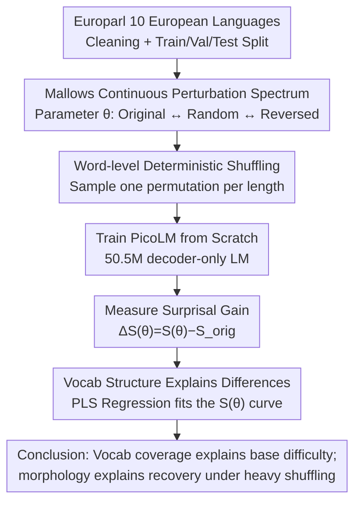

# Vocabulary Shapes Cross-Lingual Variation of Word-Order Learnability in Language Models

**Conference**: ACL2026  
**arXiv**: [2603.19427](https://arxiv.org/abs/2603.19427)  
**Code**: https://gitlab.gwdg.de/huds/projects/shuffle/-/tree/v1.0.2  
**Area**: Multilingual Translation  
**Keywords**: Word-order learnability, multilingual modeling, vocabulary structure, Mallows permutation, linguistic typology

## TL;DR
This paper uses the Mallows model to generate continuous word-order perturbation spectra for 10 European languages. After training small autoregressive LMs, it finds that more irregular word orders are harder to learn, but cross-lingual differences are primarily explained by vocabulary coverage, sentence length, and morphological complexity, rather than simple free vs. fixed word-order labels.

## Background & Motivation
**Background**: Linguistic typology has long focused on why different languages have different word orders—such as English's strong dependence on SVO positions versus Czech or Finnish, which allow freer word order through case marking and morphological changes. In NLP, synthetic language or word-order perturbation experiments use shuffling to study whether language models possess natural language inductive biases.

**Limitations of Prior Work**: Existing experiments often conflate word order, morphology, and tokenization. Many works shuffle at the subword level, which breaks apart subwords of a single word, simultaneously destroying both word order and morphological structure. Others use discrete perturbation intensities, making it difficult to compare continuous changes from "slight local shuffling" to "completely random shuffling." Furthermore, the choice of languages is often biased toward English, making cross-lingual differences hard to explain.

**Key Challenge**: Free word-order languages typically have richer morphology, while fixed word-order languages rely more on position. These are naturally correlated. Comparing "free vs. fixed" directly makes it impossible to determine whether a model's poor learning is due to word order itself, morphological complexity, vocabulary statistics, or the tokenizer's encoding efficiency for different languages.

**Goal**: The authors aim to construct a cleaner experiment: only change word-order regularity while preserving the original vocabulary, morphology, and global entropy as much as possible. They then observe how model surprisal changes with perturbation intensity and further explain why different languages exhibit varying robustness to word-order perturbation.

**Key Insight**: The paper uses the Mallows permutation model to sample a deterministic permutation for each sentence length. The control parameter $\theta$ continuously covers the original word order, local shuffling, complete randomness, local reversal, and complete inversion. This provides a complete spectrum of word-order regularity for each language rather than a few discrete shuffled versions.

**Core Idea**: Isolate word-order factors using word-level deterministic shuffling, then explain cross-lingual variations in model surprisal using vocabulary statistics and PLS regression.

## Method

### Overall Architecture
The workflow begins with the Europarl multilingual parallel corpus. The authors select 10 European languages—5 typically classified as fixed word-order and 5 as free word-order—covering analytic, fusional, and agglutinative morphological types. Each language is cleaned uniformly: lowercased, punctuation removed, sentences over 80 words excluded, then split into 650,000 training, 5,000 validation, and 5,000 test sentences.

Subsequently, the authors construct a series of synthetic word-order variants for each language. The mechanism is: for each sentence length $n$, sample only one permutation $\pi^{(n)}$ and apply this permutation to all sentences of that length $n$ in that language. This transformation is deterministic, keeping the added description length small and avoiding the significant increase in model-independent entropy typical of stochastic sentence-by-sentence shuffling.

Finally, the authors train identical small autoregressive Transformers (PicoLM-style 50.5M parameter decoder-only LMs) from scratch for each language variant. ByteLevel-BPE is used by default with a vocabulary size $|V|=16,000$; vocabulary experiments scan $|V|=258, 1000, 8000, 16000, 32000, 64000$. Learnability is measured by mean test set surprisal—lower surprisal indicates the model can better capture the probabilistic structure of the language variant.

### Key Designs
**1. Mallows Continuous Word-Order Perturbation Spectrum: Using one parameter to shift word order from original to random to reversed**

Previous experiments mostly compared discrete points like "original vs. random," failing to capture what happens between "minor local shuffling" and "complete disorder." The authors adopt the Mallows permutation model, assigning probability $P(\pi) \propto \exp(-\theta d(\pi, \pi_0))$ based on the distance between permutation $\pi$ and original order $\pi_0$. The distance $d$ is Kendall's $\tau$, representing the number of adjacent swaps needed to restore the original order.

The control parameter $\theta$ becomes a continuous knob: $\theta \to \infty$ approaches original order, $\theta=0$ makes all permutations equally likely (maximum randomness), and $\theta \to -\infty$ approaches complete reversal. This allows each language to have a full $S(\theta)$ learnability curve. The symmetry of positive and negative $\theta$ allows direct comparison between "sentence reversal" and "local shuffling of equal intensity," specifically testing if models are sensitive to reverse orders that violate typology.

**2. Word-level Deterministic Shuffling: Shuffling word order without touching internal morphological structure**

If tokenization occurs before shuffling at the subword level, a Czech word might be split into two subwords scattered at opposite ends of a sentence. In that case, it is unclear whether poor learning is due to word-order chaos or the destruction of morphological units. The authors restrict perturbations strictly to the word level: defining a word as a whitespace-separated orthographic unit, permuting at the word level, and then passing the shuffled text to the tokenizer.

The "deterministic" aspect means that for a given language and sentence length $n$, only one permutation $\pi^{(n)}$ is sampled and applied to all sentences of that length, rather than resampling for each sentence. This transformation has a minimal description length and does not inflate model-independent entropy. Vocabulary and morphological distributions remain largely identical, allowing surprisal variations to be cleanly attributed to word order itself.

**3. Explaining Cross-lingual Differences via Vocabulary Structure: Finding finer independent variables than "free/fixed"**

Coarse labels like "free word-order languages are more robust to shuffling" have weak explanatory power because free word order is usually accompanied by richer morphology. The authors extract a finer set of statistics for each language: word coverage, subword coverage, coverage integral, word-subword coverage similarity, average word and subword counts, fertility, average word length, and unique word types.

Since these metrics are highly collinear and the language sample size is small (10), ordinary linear regression would be unstable. The authors use multivariate PLS regression to compress correlated features into a few latent variables to predict the entire surprisal curve across 28 $\theta$ values for each language. PLS stabilizes fitting for small samples and allows the "vocabulary coverage component" to be decoupled from the "morphological complexity component."

### Loss & Training
This work does not propose a new training loss but uses standard autoregressive language modeling as a measurement tool. The model's objective is to predict the next subword, and the evaluation metric is $S(\theta)=1/N \sum_i -\log p(w_i|w_{<i})$. The authors are interested in relative surprisal gains $\Delta S(\theta)=S(\theta)-S_{orig}$ rather than absolute performance, as deterministic shuffling largely maintains model-independent entropy, allowing $\Delta S$ to be interpreted as the model's sensitivity to word-order perturbation.

## Key Experimental Results

### Main Results
The first set of results focuses on word-order perturbation itself. Models across all languages are sensitive to completely irregular word orders, but additional sensitivity to sentence reversal is weak; the free/fixed word-order dichotomy fails to explain robustness under irregular conditions.

| Research Question | Key Metric / Phenomenon | Result | Explanation |
|----------|----------------|------|------|
| Does word order irregularity increase difficulty | $\Delta S$ vs. $\theta$ | Surprisal gain peaks near $\theta=0$ | Autoregressive LMs have a strong locality bias; random order is hardest to compress |
| Is reversal harder than forward shuffling | median asymmetry $\Delta S^{+/-}$ | 0.096, approx 6% of irregular order impact | Reversal violates typological correlations, but the model mostly perceives locality rather than linguistic legality |
| Is the reversal difference significant | Wilcoxon signed-rank | $p=0.0098$, significant but small effect | Statistically different, but practical magnitude is limited |
| Can free/fixed order explain $\Delta S_{irreg}$ | Wilcoxon-Mann-Whitney | $p=0.55$ | Coarse typological labels cannot distinguish robustness to irregular perturbations |
| Subword vs. word shuffling | Surprisal under irregular order | Subword shuffling is higher overall; Balto-Slavic and Uralic see larger increases | Breaking morphological units distorts cross-lingual comparisons |

### Ablation Study
The second set of results replaces explanatory variables with vocab structure and morphological proxies, showing that vocabulary is more explanatory than binary word-order labels.

| Analysis Config | Metric | Value / Phenomenon | Description |
|----------|------|-------------|------|
| PLS with two latent variables predicting $S(\theta)$ | overall explained variance | $R^2=0.97$ | Vocab and morphological metrics can almost reconstruct the cross-lingual surprisal curve |
| leave-one-language-out | per-language $R^2$ | Hungarian 0.93, Portuguese / Latvian 0.99 | High predictive power even for unseen languages |
| Slices at each $\theta$, two components | mean $\bar{R}^2$ | 0.79, range 0.66-0.86 | Explanatory power is stable across different perturbation intensities |
| Only vocabulary component | mean $\bar{R}^2$ | 0.65, range 0.26-0.76 | Vocab coverage mainly explains performance at original and reversed orders |
| Second component | Primary loadings | Unique word types, word length, fertility | Morphological complexity is needed to explain the strong irregular zone |
| Scanning vocab size | Separation threshold | Original surprisal begins to distinguish free/fixed order after $|V|>8000$ | Tokenizer scale regulates cross-lingual learnability differences |

### Key Findings
- Completely irregular word orders systematically increase surprisal, but models do not exhibit a strong additional penalty for "reversal." This suggests autoregressive LMs care more about whether local predictive structures are destroyed than whether a sentence conforms to human typological preferences.
- Free word-order languages are not naturally more robust to shuffling. The free and fixed word-order groups overlap significantly in $\Delta S_{irreg}$; only extreme clusters like Romance and Finnic are separated in both original surprisal and perturbation gain.
- Vocabulary coverage clusters free/fixed order languages into a more continuous structure. Free word-order languages often have slower-growing word and subword coverage curves, indicating more low-frequency forms are involved in modeling.
- Morphological complexity proxies primarily explain the strong irregular region near $\theta=0$. In other words, vocabulary statistics explain "how hard it is to learn normally," while morphological structure explains "how many recoverable clues remain after heavy shuffling."
- Vocabulary size itself changes the conclusions. Original surprisal only clearly distinguishes groups when $|V| > 8K$; however, regarding the gain in irregular order, languages show convergence or divergence trends as $|V|$ continues to expand.

## Highlights & Insights
- The most ingenious design is deterministic word-level shuffling. It allows continuous control of word-order regularity while avoiding the global entropy increase of random shuffling, making it a cleaner linguistic experimental tool than standard shuffle baselines.
- The paper moves the question "is a language hard to learn" from coarse labels to quantifiable vocabulary structures. For multilingual LMs, this reminds us not to look only at language families or morphological types; the coverage and fertility formed by the tokenizer may more directly influence learning difficulty.
- The reversal experiment is insightful: models are not particularly sensitive to violations of natural language typology, suggesting that the inductive bias of small autoregressive LMs favors local predictability rather than global human linguistic legality.
- The use of PLS is appropriate. For a small sample of 10 languages and highly correlated variables, PLS is more stable than multiple univariate correlations and succeeds in decoupling the vocabulary component from the morphological complexity component.
- Insights for MT and multilingual NLP: The difficulty of low-resource or morphologically complex languages may stem partly from vocabulary coverage and subword sparsity, rather than just corpus size or task data scarcity.

## Limitations & Future Work
- The corpus is limited to Europarl and European languages. While highly comparable, the typological space covered is still narrow. Broader non-European families, non-SVO languages, and spoken/web text may present different patterns.
- The model used is a 50.5M parameter small autoregressive LM; conclusions may not directly extrapolate to large-scale multilingual LLMs. Model capacity and tokenizer scale might alter the relationship between vocabulary coverage and learnability.
- The paper studies computational learnability via LM surprisal, which is not equivalent to human learning difficulty. Future work needs to correlate these findings with eye-tracking, reading time, or L2 acquisition data.
- Free vs. fixed word order is still used for initial grouping, though the authors acknowledge typology is continuous. Future work could use continuous metrics like subject-object entropy or dependency locality.
- Evaluation looks at global surprisal without subdividing which tokens or constructions contribute most. Further analysis of language-specific structures like determiner-adjective-noun or case markers would make the explanations more actionable.

## Related Work & Insights
- **vs. Kallini et al. on artificial language/shuffled LMs**: They proved shuffling hurts learning; this work extends perturbations to a cross-lingual continuous spectrum and avoids subword-level morphological destruction.
- **vs. Cotterell et al. / Mielke et al. on LM difficulty**: Early work debated whether morphology or simple statistics best explain LM difficulty. This paper provides a balanced view: coverage and length explain most of the curve, while morphology is crucial under irregular perturbations.
- **vs. Arnett and Bergen on tokenizer efficiency**: This paper supports that tokenizer/vocab structure is a key mediator of cross-lingual variation, but places it in a shuffling experiment to show vocab affects both base difficulty and robustness to shuffling.
- **vs. Traditional Typology Labels**: Coarse labels are insufficient for explaining $\Delta S_{irreg}$. This work advocates for using continuous vocabulary statistics and morphological proxies to represent linguistic structure.

## Rating
- Novelty: ⭐⭐⭐⭐☆ The method is not a new model, but the experimental control is excellent, disentangling word order, vocabulary, and morphology.
- Experimental Thoroughness: ⭐⭐⭐⭐☆ Trains many small models with various perturbations, vocab sizes, and regressions, though language scope and model size remain limited.
- Writing Quality: ⭐⭐⭐⭐⭐ Logic is clear, with natural transitions between linguistic motives, experimental control, and statistical interpretation.
- Value: ⭐⭐⭐⭐☆ Highly relevant for multilingual LMs, tokenizer design, and linguistic typology experiments; direct engineering benefits are more indirect.

<!-- RELATED:START -->

## Related Papers

- [\[ACL 2026\] Efficient Training for Cross-lingual Speech Language Models](efficient_training_for_cross-lingual_speech_language_models.md)
- [\[ACL 2026\] LLM-XTM: Enhancing Cross-Lingual Topic Models with Large Language Models](llm-xtm_enhancing_cross-lingual_topic_models_with_large_language_models.md)
- [\[ACL 2025\] Cross-Lingual Optimization for Language Transfer in Large Language Models](../../ACL2025/multilingual_mt/cross-lingual_optimization_for_language_transfer_in_large_language_models.md)
- [\[ACL 2025\] Cross-Lingual Pitfalls: Automatic Probing Cross-Lingual Weakness of Multilingual Large Language Models](../../ACL2025/multilingual_mt/crosslingual_pitfalls.md)
- [\[ACL 2025\] Dictionaries to the Rescue: Cross-Lingual Vocabulary Transfer for Low-Resource Languages Using Bilingual Dictionaries](../../ACL2025/multilingual_mt/dictionaries_to_the_rescue_cross-lingual_vocabulary_transfer_for_low-resource_la.md)

<!-- RELATED:END -->
