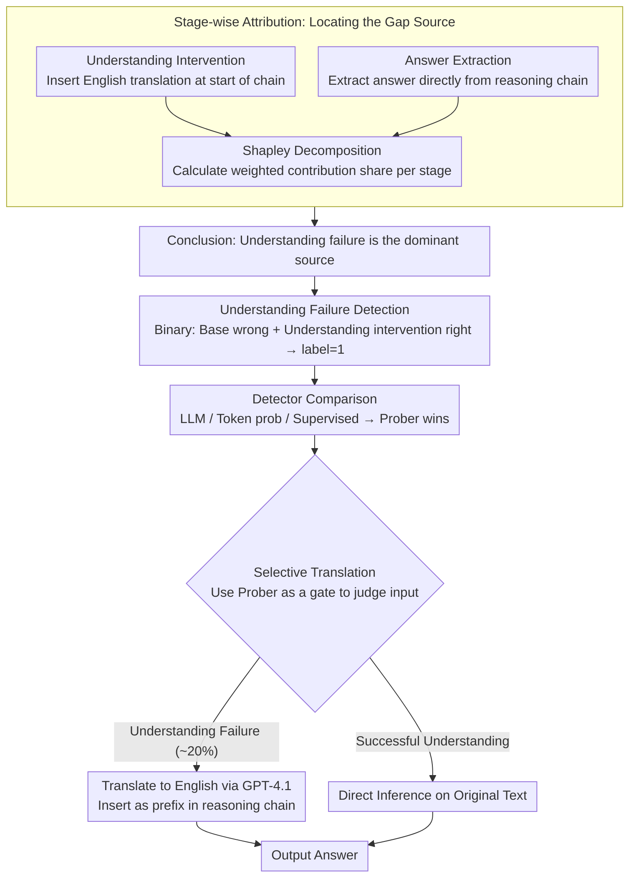

# Why Do Multilingual Reasoning Gaps Emerge in Reasoning Language Models?

**Conference**: ACL 2026 Findings  
**arXiv**: [2510.27269](https://arxiv.org/abs/2510.27269)  
**Code**: [GitHub](https://github.com/deokhk/multilingual-reasoning-gap)  
**Area**: Multilingual / Reasoning  
**Keywords**: Multilingual Reasoning Gap, Understanding Failure Detection, Selective Translation, Reasoning Language Models, Stage-wise Attribution Analysis

## TL;DR

This study provides the first systematic analysis of the sources of multilingual reasoning gaps in Reasoning Language Models (RLMs). It identifies **language understanding failure** as the primary cause and proposes Selective Translation, which detects understanding failures to efficiently bridge the gap.

## Background & Motivation

**Background**: Reasoning Language Models (RLMs) such as DeepSeek-R1 and Qwen3 have achieved significant progress in complex reasoning tasks by generating long reasoning traces. However, these models exhibit substantial performance variance across different input languages, where high-resource languages (e.g., English) significantly outperform low-resource languages (e.g., Swahili).

**Limitations of Prior Work**: Existing efforts have attempted to narrow the multilingual gap through representation editing, prompt engineering, and prefix tuning. However, these methods do not investigate the **root causes** of the gap. The lack of systematic understanding regarding the origins of these issues results in solutions that are either limited in effectiveness or computationally expensive (e.g., translating all inputs).

**Key Challenge**: RLMs predominantly use English as the thinking language in their reasoning chains. When the input is a low-resource language, the model must first "translate" the input into English to perform reasoning. This implicit understanding process may fail, but this failure has not been systematically quantified in terms of its impact on final performance.

**Goal**: To systematically answer the question "Where does the multilingual reasoning gap come from?" and propose efficient mitigation strategies based on the analysis.

**Key Insight**: The multilingual reasoning process is decomposed into three stages: Understanding, Reasoning, and Generation. Through stage-wise attribution analysis, the contribution of each stage to the gap is quantified, allowing the primary bottleneck to be addressed specifically.

**Core Idea**: Understanding failure is detectable. Translation only needs to be performed for inputs where an understanding failure is detected, achieving an optimal balance between efficiency and effectiveness without requiring full translation.

## Method

### Overall Architecture

The work is structured into three progressive parts: (1) locating the source of the multilingual reasoning gap through stage-wise attribution analysis; (2) systematically evaluating various understanding failure detection methods; (3) proposing a Selective Translation strategy that intervenes only when understanding failure is detected. This process is a plug-and-play inference-time solution that does not require modifying model parameters.

### Key Designs

**1. Stage-wise Attribution: Quantifying the bottleneck**

Previous mitigation efforts bypassed the fundamental question of whether the multilingual gap stems from understanding, reasoning, or generation. This study treats these stages as switches where "failure can be turned off" to perform attribution. For the understanding stage, an **understanding intervention** is designed by inserting the English translation $\pi(x_{\mathrm{dom}})$ at the beginning of the reasoning chain to eliminate understanding failure. For the generation stage, **answer extraction** is used to retrieve the answer directly from the reasoning chain, bypassing potential errors when writing the answer in the target language. The reasoning stage contribution is calculated as the remainder after deducting understanding and generation effects.

To ensure attribution does not depend on intervention order, Shapley decomposition is utilized to calculate weighted contribution shares. For instance, the understanding stage share is:

$$\phi_U(l) = \max\Big\{0,\ \tfrac{1}{2}\big[(S_U(l)-S_0(l))+(S_{UT}(l)-S_T(l))\big]\Big\}$$

where $S_0, S_U, S_T, S_{UT}$ represent accuracy under no intervention, understanding intervention only, answer extraction only, and both interventions, respectively. Averaging the two possible sequences ensures the "order-independent" property guaranteed by Shapley values.

**2. Understanding Failure Detection: Training a binary signal for comprehension**

A selective intervention requires predicting whether the model understands an input under the Base setting before applying interventions. This is modeled as a binary classification: a sample is labeled as an understanding failure (label=1) if the model fails in the Base setting but succeeds with the understanding intervention (w/ U). Three types of detectors are evaluated: LLM-based (GPT-4.1-mini with self-reflection), token probability-based (average/minimum confidence, input NLL), and supervised (mmBERT fine-tuned on query+trace, and a Prober using a two-layer MLP on the hidden state of the final reasoning chain token).

The detection is based on the reasoning trace because comprehension failures often manifest as specific patterns in the thought process (e.g., "This is confusing..."). Experimental results confirm that supervised methods (Prober, mmBERT) significantly outperform LLM judgments and probability signals. Furthermore, early detection using only the first 4096 tokens achieves reliability comparable to full-chain detection.

**3. Selective Translation: Optimizing translation budget**

While full translation is effective, invoking an external translation system for 100% of inputs is costly and wasteful for samples the model already understands. Selective Translation uses the trained Prober as a gate. If an understanding failure is predicted, the input is translated into English via GPT-4.1 and inserted as a prefix in the reasoning chain. Otherwise, the model proceeds with the original text.

This approach manages costs effectively, triggering translation for only approximately 20% of inputs while achieving accuracy close to full translation. As detection accuracy improves, the budget is spent more precisely: low-resource languages (e.g., Swahili) have high trigger rates and large gains, while high-resource languages are rarely triggered.

### Loss & Training

Supervised detectors are trained using standard binary cross-entropy loss. The mmBERT detector is fine-tuned using the query and reasoning trace as input. The Prober uses the final layer hidden state of the last reasoning chain token to train a two-layer MLP. Calibration data is sourced from the MGSM (for Polymath-Low) and MMLU-ProX-Lite validation sets.

## Key Experimental Results

### Main Results

| Dataset | Metric | Base | Selective Trans. | Full Trans. | Translation Usage |
|--------|------|------|------------------|-------------|------------|
| Polymath-Low | Avg Acc | 81.1 | 88.0 | 89.4 | 19.3% |
| MMLU-ProX-Lite | Avg Acc | 72.7 | 74.3 | 76.5 | 20.8% |

**Performance on low-resource languages**: Swahili (sw) improved from 29.3 to 81.3 on Polymath-Low (86.4% translation rate), and Telugu (te) improved from 69.9 to 77.1 (37.9% translation rate).

### Ablation Study

| Configuration | Key Metric | Description |
|------|---------|------|
| Stage Attribution | U-share Dominates | Understanding failure accounts for most of the multilingual gap; generation contribution is minimal. |
| Post-Intervention Perf | ≈0.95-0.99 | After resolving understanding failure, performance across languages approaches the best language. |
| Trans Quality vs Perf | r=0.951 | Translation capability is strongly positively correlated with multilingual reasoning capability. |
| Early Detection (4096) | Equivalent to full chain | Reliable detection can be made without waiting for the complete reasoning chain. |
| Non-English Target | Performance drops | Using low-resource languages as translation targets introduces additional understanding failures. |

### Key Findings
- Understanding failure is the **dominant source** of the multilingual reasoning gap. This conclusion remains consistent across model scales (1.7B-14B) and reasoning difficulty levels (Low/Medium/High).
- Supervised methods (Prober, mmBERT) are significantly superior to LLM-based and token probability methods for understanding failure detection.
- Detectors generalize robustly to unseen languages (French, Marathi, Wolof).
- Selective Translation achieves performance close to full translation with only approximately 20% of the translation overhead.

## Highlights & Insights
- **Systematic Analysis Framework**: Decomposing multilingual reasoning into three stages and using Shapley decomposition for attribution provides a rigorous and generalizable methodology.
- **"Understanding is the Bottleneck"**: This insight challenges the intuition that the reasoning capability itself is the primary cause of cross-lingual gaps, revealing that the true root lies in input comprehension.
- **Correlation (r=0.951)** between translation and reasoning capabilities provides clear optimization directions for improving multilingual RLMs.
- **Practicality of Selective Translation**: This inference-time intervention significantly improves low-resource language performance without requiring model modification.
- **Early Detection**: The finding that interventions can be decided early in the generation process further enhances efficiency.

## Limitations & Future Work
- Experiments primarily focus on math and STEM reasoning; applicability to domains like commonsense reasoning remains to be verified.
- Language coverage includes 10 languages; verification across more extremely low-resource languages is needed.
- Analysis focuses on English-led reasoning; models that perform reasoning in other languages (e.g., Russian) have not been explored.
- Selective Translation relies on external systems (GPT-4.1), introducing additional latency and cost.
- Future direction: Integrating understanding failure detection and mitigation mechanisms directly into model training.

## Related Work & Insights
- **vs. Full Translation**: Selective Translation achieves approximately 98% of the performance of full translation with 20% of the cost.
- **vs. Language-forcing**: Forcing target language reasoning often decreases accuracy or requires expensive training data; the proposed solution is more economical.
- **vs. Representation Editing**: Unlike Zhao et al. (2025), this method requires no internal modification of model representations.
- **vs. Cross-lingual Collapse (Park et al., 2025)**: While the latter uses consistency rewards during training, the proposed method is a pure inference-time approach.

## Rating
- Novelty: ⭐⭐⭐⭐ First systematic attribution of the multilingual reasoning gap source; Shapley framework and selective translation are innovative.
- Experimental Thoroughness: ⭐⭐⭐⭐⭐ Comprehensive experiments across multiple models, languages, and difficulties, including generalization and early detection.
- Writing Quality: ⭐⭐⭐⭐⭐ Clear structure; logical progression from analysis to detection to mitigation; informative visualizations.
- Value: ⭐⭐⭐⭐ Provides clear guidance for multilingual reasoning research; Selective Translation has high practical utility.

<!-- RELATED:START -->

## Related Papers

- [\[AAAI 2026\] Mitigating Content Effects on Reasoning in Language Models through Fine-Grained Activation Steering](../../AAAI2026/multilingual_mt/mitigating_content_effects_on_reasoning_in_language_models_through_fine-grained_.md)
- [\[ACL 2026\] EMCEE: Improving Multilingual Capability of LLMs via Bridging Knowledge and Reasoning with Extracted Synthetic Multilingual Context](emcee_improving_multilingual_capability_of_llms_via_bridging_knowledge_and_reaso.md)
- [\[ACL 2025\] CruxEval-X: A Benchmark for Multilingual Code Reasoning, Understanding and Execution](../../ACL2025/multilingual_mt/cruxeval-x_a_benchmark_for_multilingual_code_reasoning_understanding_and_executi.md)
- [\[ACL 2025\] Are Rules Meant to be Broken? Understanding Multilingual Moral Reasoning as a Computational Pipeline with UniMoral](../../ACL2025/multilingual_mt/are_rules_meant_to_be_broken_understanding_multilingual_moral_reasoning_as_a_com.md)
- [\[ACL 2026\] Exploring Two-Phase Continual Instruction Fine-tuning for Multilingual Adaptation in Large Language Models](exploring_continual_fine-tuning_for_enhancing_language_ability_in_large_language.md)

<!-- RELATED:END -->
