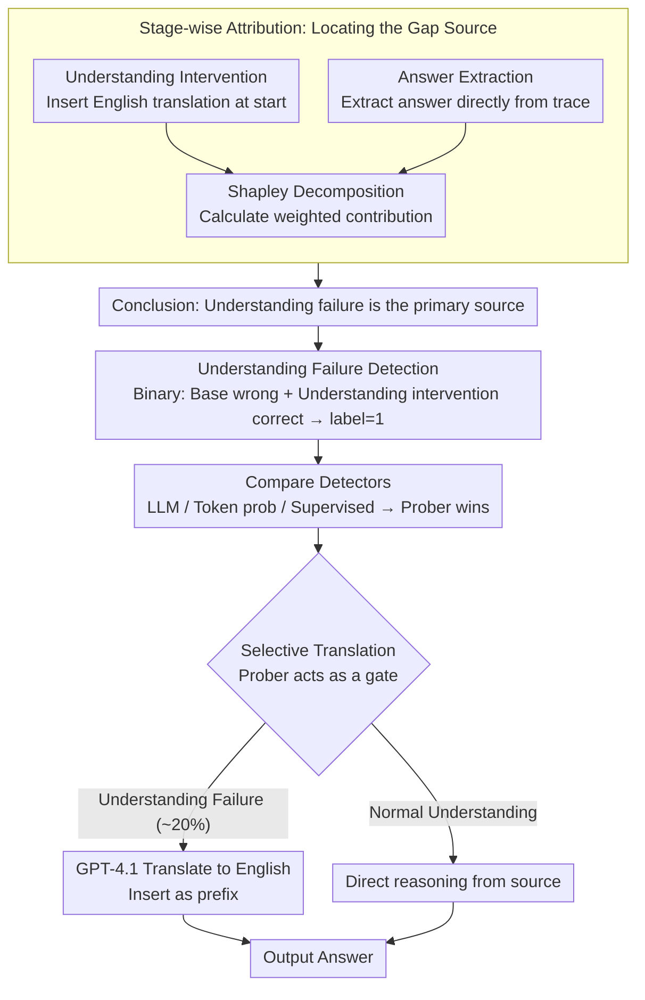

# Why Do Multilingual Reasoning Gaps Emerge in Reasoning Language Models?

**Conference**: ACL 2026 Findings  
**arXiv**: [2510.27269](https://arxiv.org/abs/2510.27269)  
**Code**: [GitHub](https://github.com/deokhk/multilingual-reasoning-gap)  
**Area**: Multilingual / Reasoning  
**Keywords**: Multilingual Reasoning Gap, Understanding Failure Detection, Selective Translation, Reasoning Language Models, Stage-wise Attribution Analysis

## TL;DR

This paper provides the first systematic analysis of the sources of multilingual reasoning gaps in Reasoning Language Models (RLMs). It discovers that **language understanding failure** is the primary cause and proposes bridging this gap efficiently through Selective Translation triggered by understanding failure detection.

## Background & Motivation

**Background**: Reasoning Language Models (RLMs) such as DeepSeek-R1 and Qwen3 have achieved significant progress in complex reasoning tasks by generating long reasoning traces. However, these models exhibit massive performance variance when handling inputs in different languages—performance on high-resource languages (e.g., English) far matches that of low-resource languages (e.g., Swahili).

**Limitations of Prior Work**: Existing efforts have attempted to narrow the multilingual gap through representation editing, prompt engineering, or prefix tuning, but none have deeply investigated the **root cause** of the gap. The lack of a systematic understanding of the problem's origins results in solutions that are either limited in effectiveness or computationally expensive (e.g., full translation of all inputs).

**Key Challenge**: RLMs primarily rely on English as the dominant language for the reasoning chain. When input is in a low-resource language, the model must first "translate" the input into English to reason. This implicit understanding process might fail, but this failure's impact on final performance has not been systematically quantified before.

**Goal**: To systematically answer the critical question: "Where do multilingual reasoning gaps come from?" and propose efficient mitigation strategies based on the analysis.

**Key Insight**: The multilingual reasoning process is decomposed into three stages—Understanding, Reasoning, and Generation. Through stage-wise attribution analysis, the contribution of each stage to the gap is quantified, allowing the primary bottleneck to be addressed specifically.

**Core Idea**: Understanding failures are detectable. Translation is only applied to inputs where an understanding failure is detected, avoiding full translation while achieving an optimal balance between efficiency and performance.

## Method

### Overall Architecture

The work is structured into three progressive components: (1) locating the source of multilingual reasoning gaps through stage-wise attribution analysis; (2) systematically evaluating various understanding failure detection methods; (3) proposing a Selective Translation strategy that intervenes only when a failure is detected. The entire workflow is a plug-and-play inference-time solution that requires no model parameter updates.

### Key Designs

**1. Stage-wise Attribution Analysis: Quantifying the bottleneck**

Prior mitigation efforts avoided a fundamental question—does the multilingual gap stem from understanding, reasoning, or generation? This paper treats these three stages as switches that can "turn off failure" individually for attribution. For the understanding stage, an **Understanding Intervention** is designed: inserting the English translation $\pi(x_{\mathrm{dom}})$ at the beginning of the reasoning trace to eliminate understanding failure. For the generation stage, **Answer Extraction** is used to extract the answer directly from the trace, bypassing errors introduced when writing the final answer in the target language. The reasoning stage cannot be intervened with directly and is treated as the "residual portion after deducting understanding and generation."

To ensure attribution does not depend on the order of interventions, the Shapley decomposition is used to calculate weighted contribution shares. For instance, the understanding stage is:

$$\phi_U(l) = \max\Big\{0,\ \tfrac{1}{2}\big[(S_U(l)-S_0(l))+(S_{UT}(l)-S_T(l))\big]\Big\}$$

where $S_0, S_U, S_T, S_{UT}$ represent accuracy under no intervention, understanding intervention only, answer extraction only, and both, respectively. Averaging these two orders ensures the "order-independent" property guaranteed by Shapley values, providing a robust conclusion on the contribution of understanding to the gap.

**2. Understanding Failure Detection: Modeling "comprehension" as a binary signal**

A prerequisite for selective intervention is the ability to predict whether the model failed to understand the input under the Base setting. This is modeled as binary classification: if a sample is wrong under Base but correct with understanding intervention (w/ U), it is labeled as an understanding failure (label=1)—isolating the "repairable" part of the gap. Three types of detectors are compared: LLM-based (GPT-4.1-mini judgment followed by self-reflection), token probability-based (average/min confidence, input NLL), and supervised (mmBERT fine-tuned on query+trace, and a Prober using the hidden states of the final token in the trace fed into a 2-layer MLP).

Using the reasoning trace for detection is effective because models often leave "clues" in the thinking process when they fail to understand (e.g., "This is confusing..."). Experimental results confirm that supervised methods (Prober, mmBERT) significantly outperform LLM and probability signals, and that a reliable detection can be made using only the first 4096 tokens.

**3. Selective Translation: Optimizing the translation budget**

While full translation is effective, calling an external translator for 100% of inputs is costly and wasteful for samples already understood. Selective Translation uses the trained Prober as a gate: it judges whether the input suffers from an understanding failure. Only if judged as a failure is GPT-4.1 used to translate the input to English as a prefix; otherwise, the original input is used for reasoning.

The cost-benefit ratio is highly efficient—the translation is triggered for only approximately 20% of inputs while achieving accuracy close to full translation. As detection accuracy increases, the budget is spent exactly where needed: low-resource languages (e.g., Swahili) have high trigger rates and gains, while high-resource languages are rarely triggered.

### Loss & Training

Supervised detectors are trained using standard binary cross-entropy loss. The mmBERT detector is fine-tuned on queries and reasoning traces. The Prober takes the final hidden state of the last token in the reasoning chain as input to train a two-layer MLP. Calibration data is sourced from the MGSM (for Polymath-Low) and MMLU-ProX-Lite validation sets.

## Key Experimental Results

### Main Results

| Dataset | Metric | Base | Selective Trans. | Full Trans. | Trans. Usage |
| :--- | :--- | :--- | :--- | :--- | :--- |
| Polymath-Low | Avg Acc | 81.1 | 88.0 | 89.4 | 19.3% |
| MMLU-ProX-Lite | Avg Acc | 72.7 | 74.3 | 76.5 | 20.8% |

**Performance on low-resource languages is prominent**: Swahili (sw) on Polymath-Low increased from 29.3 → 81.3 (86.4% translation usage), and Telugu (te) from 69.9 → 77.1 (37.9% translation usage).

### Ablation Study

| Configuration | Key Metric | Description |
| :--- | :--- | :--- |
| Stage Attribution | U-share dominant | Understanding failure contributes the majority of the multilingual gap; generation contribution is minimal. |
| Post-intervention Ratio | ≈0.95-0.99 | After resolving understanding failures, performance across languages approaches the top-tier language. |
| Trans. Quality vs. Reasoning | r=0.951 | Translation capability is strongly positively correlated with multilingual reasoning capability. |
| Early Detection (4096 tokens) | Similar to full-trace | Reliable detection can be made without waiting for the full reasoning trace. |
| Non-English Target | Performance drop | Using low-resource languages as translation targets introduces additional understanding failures. |

### Key Findings
- Understanding failure is the **dominant source** of the multilingual reasoning gap, a conclusion held consistently across model scales (1.7B-14B) and reasoning difficulty levels (Low/Medium/High).
- Supervised methods (Prober, mmBERT) significantly outperform LLM-based and token probability methods in detecting understanding failures.
- Detectors generalize robustly to unseen languages (French, Marathi, Wolof).
- Selective translation achieves near-full-translation performance with only ~20% of the overhead.

## Highlights & Insights
- **Systematic Analysis Framework**: Decomposing multilingual reasoning into three stages and using Shapley decomposition for attribution is methodologically rigorous and generalizable.
- **Insight of "Understanding as Bottleneck"**: Challenges the intuition that reasoning capability itself is the main cross-lingual gap, revealing that the true root lies in input comprehension.
- **Strong correlation (r=0.951)** between translation and reasoning provides a clear optimization path for improving multilingual RLMs.
- **Practicality of Selective Translation**: Does not require model modification; inference-time intervention significantly boosts performance for low-resource languages with low engineering barriers.
- **Early Detection Discovery**: The ability to make intervention decisions early in generation further enhances efficiency.

## Limitations & Future Work
- Experiments primarily focus on math and STEM reasoning; applicability to other domains like commonsense reasoning is yet to be verified.
- Language coverage is 10 languages; it does not cover all language families, and extremely low-resource languages require further verification.
- Analysis focuses on English-dominant reasoning scenarios; models reasoning in other languages (e.g., Russian) have not been explored.
- Selective Translation relies on an external system (GPT-4.1), introducing additional latency and cost.
- Future direction: Integrating understanding failure detection and mitigation mechanisms directly into model training.

## Related Work & Insights
- **vs. Full Translation**: Selective Translation achieves ~98% of full translation performance with 20% of the cost, significantly improving efficiency.
- **vs. Language-forcing**: Forcing the model to reason in the target language often reduces accuracy or requires expensive training data; Ours is more economical.
- **vs. Representation Editing**: Methods like Zhao et al. (2025) require modifying internal model representations, while Ours needs no model modification.
- **vs. Cross-lingual Collapse (Park et al., 2025)**: That work mitigates the issue through language-consistency rewards during training; Ours is a pure inference-time method.

## Rating
- Novelty: ⭐⭐⭐⭐ First systematic attribution of the multilingual gap; Shapley framework and Selective Translation are novel.
- Experimental Thoroughness: ⭐⭐⭐⭐⭐ Comprehensive experiments across multiple models, languages, and difficulty levels, including generalization and early detection analysis.
- Writing Quality: ⭐⭐⭐⭐⭐ Clear structure; logical progression from analysis to detection to mitigation; rich visualizations.
- Value: ⭐⭐⭐⭐ Provides clear direction for multilingual reasoning research; Selective Translation holds practical utility.

<!-- RELATED:START -->

## Related Papers

- [\[AAAI 2026\] Mitigating Content Effects on Reasoning in Language Models through Fine-Grained Activation Steering](../../AAAI2026/multilingual_mt/mitigating_content_effects_on_reasoning_in_language_models_through_fine-grained_.md)
- [\[ACL 2026\] EMCEE: Improving Multilingual Capability of LLMs via Bridging Knowledge and Reasoning with Extracted Synthetic Multilingual Context](emcee_improving_multilingual_capability_of_llms_via_bridging_knowledge_and_reaso.md)
- [\[ACL 2025\] CruxEval-X: A Benchmark for Multilingual Code Reasoning, Understanding and Execution](../../ACL2025/multilingual_mt/cruxeval-x_a_benchmark_for_multilingual_code_reasoning_understanding_and_executi.md)
- [\[ACL 2026\] Lost in Translation: Do LVLM Judges Generalize Across Languages?](lost_in_translation_do_lvlm_judges_generalize_across_languages.md)
- [\[CVPR 2026\] MMTIT-Bench: A Multilingual and Multi-Scenario Benchmark with Cognition-Perception-Reasoning Guided Text-Image Machine Translation](../../CVPR2026/multilingual_mt/mmtit-bench_a_multilingual_and_multi-scenario_benchmark_with_cognition-perceptio.md)

<!-- RELATED:END -->
