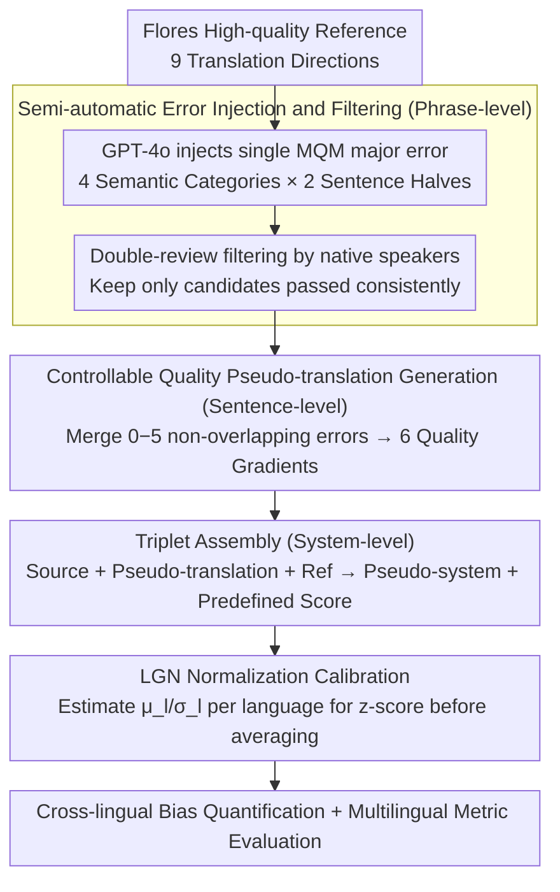

# XQ-MEval: A Dataset with Cross-lingual Parallel Quality for Benchmarking Translation Metrics

**Conference**: ACL 2026 Findings  
**arXiv**: [2604.14934](https://arxiv.org/abs/2604.14934)  
**Code**: [GitHub](https://github.com/zhiqu22/XQ-MEval)  
**Area**: AI Safety  
**Keywords**: Translation evaluation metrics, cross-lingual score bias, MQM error injection, multilingual benchmark, metric calibration

## TL;DR
The authors construct XQ-MEval, the first translation evaluation benchmark with cross-lingual parallel quality. By generating controllable-quality pseudo-translations through semi-automatic MQM error injection, they empirically reveal cross-lingual scoring bias in automatic metrics for the first time and propose the LGN normalization strategy to effectively calibrate multilingual metric evaluations.

## Background & Motivation

**Background**: Evaluation of multilingual translation systems typically relies on automatic metrics (COMET, MetricX, etc.). The standard practice is to average the metric scores across different language directions to obtain a system-level score. MQM human evaluation achieves cross-lingual comparability through standardized error categories and hierarchical penalty points.

**Limitations of Prior Work**: The averaging strategy implicitly assumes that metric scores for similar errors across different language pairs are on the same scale. In reality, metrics may exhibit cross-lingual score bias—translations of the same quality receive different scores in different languages. For example, for translations containing the same "major" error, COMET provides significantly different scores across different languages.

**Key Challenge**: There is no benchmark dataset providing instances with cross-lingual parallel quality, making it impossible to systematically quantify and verify scoring bias. Expert annotation costs are extremely high, restricting language coverage.

**Goal**: (1) Construct a cross-lingual parallel quality benchmark; (2) Quantify cross-lingual score bias; (3) Propose calibration strategies to improve the fairness of multilingual evaluation.

**Key Insight**: Automatically inject errors defined by MQM into high-quality reference translations. By controlling the number of errors, controllable-quality pseudo-translations are generated, with native speaker filtering ensuring reliability.

**Core Idea**: By injecting a controllable number of MQM errors into high-quality Flores translations, the authors construct cross-lingual parallel quality triplets (source, pseudo-translation, reference), ensuring that cross-lingual comparisons are built upon the same error foundation.

## Method

### Overall Architecture
The construction pipeline consists of three stages: (1) Phrase-level—GPT-4o injects a single MQM major error into the reference translation, followed by native speaker filtering; (2) Sentence-level—Merge $0-5$ errors to generate pseudo-translations with six quality levels; (3) System-level—Assemble triplets (source + pseudo-translation + reference) to construct pseudo-systems evaluated with predefined scores. In the evaluation phase, LGN (Language-specific Global Normalization) is further used to bring scores from different languages to the same scale before averaging, calibrating cross-lingual bias. The entire process covers 9 translation directions.

### Key Designs

**1. Semi-automatic error injection and filtering: Creating comparable single-error candidates across languages using the "same error"**

To quantify cross-lingual bias in metrics, one must possess translations with "strictly aligned quality." However, expert annotation per language is too costly to cover many languages. This paper uses GPT-4o to inject a single MQM major error into high-quality Flores references: error types are restricted to four purely semantic ones (Addition, Omission, Mistranslation, Untranslated), injected once into the first half and once into the second half of the sentence, producing up to 8 candidates per instance. These are then independently reviewed by two native speakers, keeping only those passed by both.

By selecting only purely semantic errors and avoiding language-specific fluency errors, a "major error" becomes semantically equivalent and truly comparable across languages. The combination of LLM injection and human filtering achieves a much more economical compromise than pure expert annotation, enabling the benchmark to cover 9 translation directions.

**2. Controllable quality pseudo-translation generation: Creating cross-lingual aligned quality gradients using error "counts"**

Single-error candidates are insufficient; testing a metric's response to quality changes requires a continuous quality ladder from perfect to worst, with consistent scales across languages. The authors select non-overlapping error segments from the error pool and merge $0$ to $5$ of them to generate pseudo-translations: $0$ errors correspond to a perfect score (deduct $0$), and $5$ errors correspond to the worst ($-5$ per major, total $-25$), forming six quality levels in between.

Crucially, every language and every quality level has parallel instances, and quality levels are strictly aligned across languages. Thus, "same-quality" translations across languages are built on the same error foundation, making cross-lingual comparison meaningful. If a metric assigns different scores to them, the difference can only be attributed to the metric's own cross-lingual bias.

**3. LGN normalization calibration strategy: Bringing scores of each language to the same scale before averaging**

Directly averaging metric scores across language directions implicitly assumes that scores are on the same scale. Cross-lingual bias breaks this assumption—high scores from high-resource languages can mask low scores from low-resource languages, resulting in unfair system-level averages. LGN (Language-specific Global Normalization) estimates the metric score distribution (mean $\mu_l$ and standard deviation $\sigma_l$) for each language using the known-quality pseudo-translations in XQ-MEval. It then applies z-score normalization $z = (s-\mu_l)/\sigma_l$ to actual evaluation scores, mapping all languages to the same scale before averaging.

Since distribution parameters are estimated from "quality-aligned" pseudo-translations, normalization essentially re-measures each language with the same ruler, making previously incomparable scores comparable and significantly reducing score range variance between languages.

### Loss & Training
XQ-MEval is an evaluation benchmark rather than a training method, so it does not involve model training. LGN is a test-time calibration strategy that only requires using XQ-MEval data to estimate score distribution parameters for each language.

## Key Experimental Results

### Main Results

| Metric | Averaging Strategy Consistency | LGN Consistency | Description |
|------|---------------|-----------|------|
| COMET-22 | Lower | Significant Improvement | One of the regression metrics with the most severe bias |
| MetricX-23 | Lower | Improvement | Similar bias issues |
| BLEU | Medium | Improvement | Sequence metrics show less bias |
| chrF | Medium | Improvement | Character-level metrics are relatively robust |

### Ablation Study

| Analysis Dimension | Finding |
|----------|------|
| Bias Manifestation 1: Same quality, different scores | For 1 major error, the score difference of COMET on en-zh and en-ja exceeds 0.1 |
| Bias Manifestation 2: Inconsistent quality decay rates | When error count increases from 0 to 5, the slope of score decline differs significantly across languages |
| LGN vs. Direct Averaging | LGN significantly reduces the variance in score ranges across languages |

### Key Findings
- Empirically proves for the first time that automatic translation metrics exhibit systematic cross-lingual scoring bias, most severe in regression-based metrics (COMET, MetricX).
- Bias manifests in two ways: (1) different scores for same quality; (2) inconsistent quality decay rates across languages.
- A clear inconsistency exists between direct averaging strategies and MQM human evaluation.
- LGN normalization effectively mitigates bias, improving the fairness and reliability of multilingual evaluation.
- Bias is typically more severe in low-resource languages (lo, si).

## Highlights & Insights
- Addresses a previously overlooked yet critical issue—cross-lingual score bias directly impacts the fairness of multilingual system selection, with practical consequences for NMT competition rankings and product decisions.
- The semi-automatic construction method (LLM injection + human filtering) is a clever compromise that enables coverage of 9 languages. This pipeline can be generalized to construct other cross-lingual quality-aligned benchmarks.
- The LGN strategy, while simple, is effective and low-cost, allowing for direct application to existing evaluation workflows.

## Limitations & Future Work
- Pseudo-translations are synthetic and exhibit distributional shifts from real translation system outputs.
- Only covers 4 MQM error types (46.3% of total errors); fluency and other types are not included.
- Some low-resource languages have only 1 reviewer, slightly weakening reliability.
- Limited scale with only 102 instances per direction in Flores.
- Future work could extend to more languages and error types, and explore more complex calibration methods.

## Related Work & Insights
- **vs. WMT MQM**: WMT MQM involves expert annotation for single language directions and cannot provide cross-lingual parallel quality; this paper achieves parallelism through synthesis.
- **vs. COMET/MetricX**: This paper reveals systematic biases in these SOTA metrics, pointing out that directly averaging scores may lead to misleading system selection.
- **vs. Von Däniken et al. 2025**: While they found metrics might be inconsistent in a single direction, this paper extends the analysis to the cross-lingual dimension.

## Rating
- Novelty: ⭐⭐⭐⭐ First systematic study and quantification of cross-lingual bias in translation metrics.
- Experimental Thoroughness: ⭐⭐⭐⭐ Wide coverage with 9 languages × 9 metrics.
- Writing Quality: ⭐⭐⭐⭐⭐ Clear motivation and rigorous pipeline design.
- Value: ⭐⭐⭐⭐ Direct practical significance for the fairness of NMT evaluation.

<!-- RELATED:START -->

## Related Papers

- [\[ACL 2026\] LQM: Linguistically Motivated Multidimensional Quality Metrics for Machine Translation](lqm_linguistically_motivated_multidimensional_quality_metrics_for_machine_transl.md)
- [\[ACL 2026\] Efficient Training for Cross-lingual Speech Language Models](efficient_training_for_cross-lingual_speech_language_models.md)
- [\[ACL 2026\] Beyond Literal Mapping: Benchmarking and Improving Non-Literal Translation Evaluation](beyond_literal_mapping_benchmarking_and_improving_non-literal_translation_evalua.md)
- [\[ACL 2026\] IndoTabVQA: A Benchmark for Cross-Lingual Table Understanding in Bahasa Indonesia Documents](indotabvqa_a_benchmark_for_cross-lingual_table_understanding_in_bahasa_indonesia.md)
- [\[ACL 2026\] FairQE: Multi-Agent Framework for Mitigating Gender Bias in Translation Quality Estimation](fairqe_multi-agent_framework_for_mitigating_gender_bias_in_translation_quality_e.md)

<!-- RELATED:END -->
