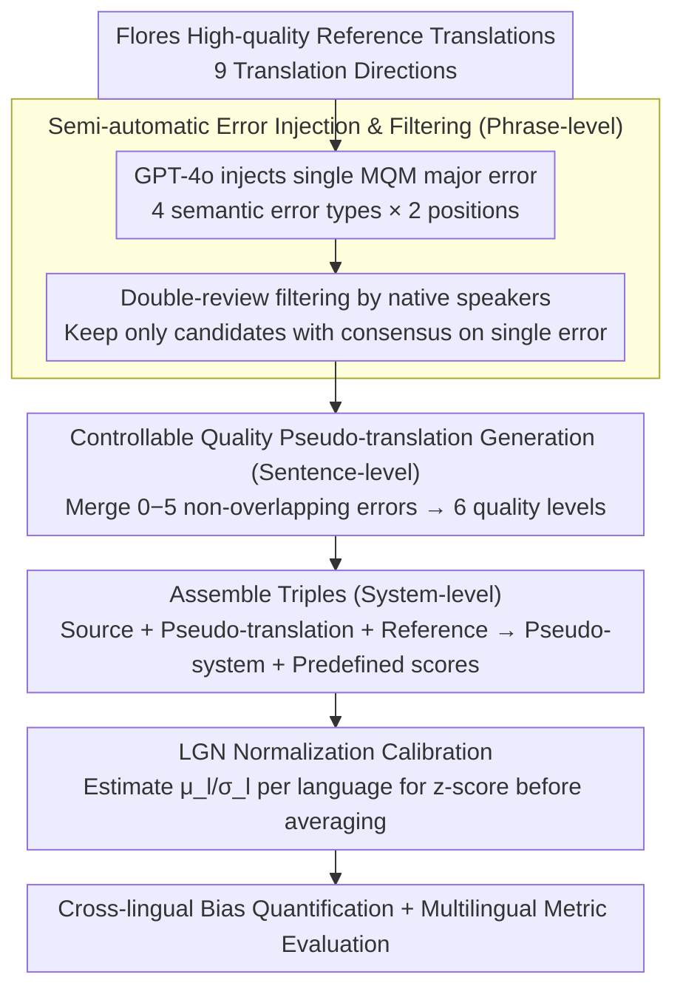

# XQ-MEval: A Dataset with Cross-lingual Parallel Quality for Benchmarking Translation Metrics

**Conference**: ACL 2026 Findings  
**arXiv**: [2604.14934](https://arxiv.org/abs/2604.14934)  
**Code**: [GitHub](https://github.com/zhiqu22/XQ-MEval)  
**Area**: AI Safety  
**Keywords**: Translation evaluation metrics, cross-lingual score bias, MQM error injection, multilingual benchmark, metric calibration

## TL;DR
Ours constructs XQ-MEval, the first translation evaluation benchmark with cross-lingual parallel quality. By generating controllable-quality pseudo-translations through semi-automatic MQM error injection, it empirically reveals cross-lingual scoring biases in automatic metrics for the first time and proposes the LGN normalization strategy to effectively calibrate multilingual metric evaluations.

## Background & Motivation

**Background**: Evaluation of multilingual translation systems typically relies on automatic metrics (COMET, MetricX, etc.). The standard practice is to average the metric scores across various language directions to obtain a system-level score. MQM human evaluation achieves cross-lingual comparability through standardized error categories and hierarchical deduplication.

**Limitations of Prior Work**: The averaging strategy implicitly assumes that scores for similar errors across different language pairs are on the same scale. However, metrics may exhibit cross-lingual scoring bias—translations of the same quality receive different scores in different languages. For instance, translations containing identical "major" errors may receive significantly different scores from COMET in different target languages.

**Key Challenge**: There is a lack of benchmark datasets providing cross-lingual parallel quality instances, making it impossible to systematically quantify and verify scoring bias. The cost of expert annotation is extremely high, limiting language coverage.

**Goal**: (1) Construct a cross-lingual parallel quality benchmark; (2) Quantify cross-lingual scoring bias; (3) Propose a calibration strategy to improve the fairness of multilingual evaluation.

**Key Insight**: Define MQM-based errors and automatically inject them into high-quality reference translations. By controlling the number of errors, controllable-quality pseudo-translations are generated, with native speaker filtering ensuring reliability.

**Core Idea**: By injecting a controllable number of MQM errors into high-quality Flores translations, ours constructs cross-lingual quality-parallel triples (source, pseudo-translation, reference), allowing cross-lingual comparisons to be established on the same error foundation.

## Method

### Overall Architecture
A three-stage construction pipeline: (1) Phrase-level—GPT-4o injects a single MQM major error into the reference translation, followed by native speaker filtering; (2) Sentence-level—merging 0-5 errors to generate pseudo-translations with six quality levels; (3) System-level—assembling triples (source + pseudo-translation + reference) to construct pseudo-systems evaluated with predefined scores. During the evaluation phase, LGN (Language-specific Global Normalization) is applied to map scores of different languages to the same scale before averaging, calibrating cross-lingual bias. The process covers 9 translation directions.

### Key Designs

**1. Semi-automatic Error Injection & Filtering: Creating Comparable Single-error Candidates with the "Same Error"**

Quantifying cross-lingual bias requires translations with "strictly aligned quality," yet language-specific expert annotation is too costly for broad coverage. Ours utilizes GPT-4o to inject a single MQM major error into high-quality Flores references. Error types are restricted to four purely semantic categories (Addition, Omission, Mistranslation, Untranslated), with injections occurring in both the first and second halves of sentences. This yields up to 8 candidates per instance, which are then independently reviewed by two native speakers. Only candidates receiving unanimous approval are retained.

By focusing on semantic errors rather than language-specific fluency issues, a "major error" remains semantically equivalent and comparable across languages. The combination of LLM injection and human filtering balances cost and reliability, enabling coverage across 9 translation directions.

**2. Controllable Quality Pseudo-translation Generation: Creating Aligned Quality Gradients via Error Counts**

To test metric responses to quality changes, a continuous quality ladder from perfect to poor is required, with consistent scales across languages. Non-overlapping error segments are selected from the error pool and merged to generate pseudo-translations with $0$ to $5$ errors: $0$ errors represent a perfect score (deduction of $0$), while $5$ errors represent the lowest quality (each major error deducts $5$ points, totaling $-25$). 

Crucially, every language and quality level possesses parallel instances, ensuring strict alignment. Since translations of "identical quality" are built on the same error foundation, any score variations assigned by metrics can be attributed solely to the metric's cross-lingual bias rather than actual quality differences.

**3. LGN Normalization Calibration: Aligning Scores to the Same Scale before Averaging**

Directly averaging metric scores across languages assumes they share a uniform scale. However, cross-lingual bias breaks this assumption—high scores in high-resource languages can mask low scores in low-resource ones. LGN (Language-specific Global Normalization) addresses this by estimating the scoring distribution (mean $\mu_l$ and standard deviation $\sigma_l$) for each language using XQ-MEval's known-quality pseudo-translations. Actual evaluation scores are then normalized using a z-score: $z = (s-\mu_l)/\sigma_l$, mapping all languages to a common scale before averaging.

### Loss & Training
XQ-MEval is an evaluation benchmark rather than a training method. LGN is a test-time calibration strategy requiring only the estimation of score distribution parameters using XQ-MEval data.

## Key Experimental Results

### Main Results

| Metric | Averaging Strategy Consistency | LGN Consistency | Note |
|------|---------------|-----------|------|
| COMET-22 | Lower | Significant Improvement | One of the regression metrics with severe bias |
| MetricX-23 | Lower | Improvement | Similar bias issues |
| BLEU | Moderate | Improvement | Sequence metrics show less bias |
| chrF | Moderate | Improvement | Character-level metrics are relatively robust |

### Ablation Study

| Analysis Dimension | Findings |
|----------|------|
| Bias Manifestation 1: Same Quality, Different Scores | For 1 major error, the COMET score difference between en-zh and en-ja exceeds 0.1 |
| Bias Manifestation 2: Inconsistent Quality Decay | Significant differences in the slope of score decline across languages as errors increase from 0 to 5 |
| LGN vs. Direct Averaging | LGN significantly reduces the range difference in scores across languages |

### Key Findings
- Systemic cross-lingual scoring bias in automatic metrics is empirically proven, with regression-based metrics (COMET, MetricX) being the most affected.
- Bias manifests in two ways: (1) different scores for identical quality; (2) inconsistent quality decay rates across languages.
- Direct averaging strategies show clear inconsistencies with MQM human evaluation.
- LGN normalization effectively mitigates bias, enhancing fairness and reliability in multilingual evaluation.
- Bias is generally more severe in low-resource languages (e.g., lo, si).

## Highlights & Insights
- Addresses a previously overlooked but critical issue—cross-lingual scoring bias directly impacts the fairness of system selection in NMT, affecting competition rankings and product decisions.
- The semi-automatic construction method (LLM injection + human filtering) is a clever compromise that enables coverage of 9 languages. This pipeline can be extended to other cross-lingual quality-parallel benchmarks.
- LGN is a simple yet effective strategy with low implementation costs that can be directly integrated into existing evaluation workflows.

## Limitations & Future Work
- Pseudo-translations are synthetic and exhibit distributional differences compared to real NMT outputs.
- Only 4 MQM error types are covered (46.3% of total error types); fluency errors are not included.
- Some low-resource languages have only one reviewer, slightly weakening reliability.
- Scale is limited with only 102 instances per direction from Flores.
- Future work could expand to more languages and error types while exploring more complex calibration methods.

## Related Work & Insights
- **vs. WMT MQM**: WMT MQM provides expert annotations for single language directions but lacks cross-lingual parallel quality; ours achieves parallelism through synthesis.
- **vs. COMET/MetricX**: Ours reveals systemic biases in these SOTA metrics, indicating that direct averaging may mislead system selection.
- **vs. Von Däniken et al. 2025**: While they found inconsistencies within single directions, ours extends the analysis to the cross-lingual dimension.

## Rating
- Novelty: ⭐⭐⭐⭐ First systematic study and quantification of cross-lingual bias in translation metrics.
- Experimental Thoroughness: ⭐⭐⭐⭐ Extensive coverage of 9 languages and 9 metrics.
- Writing Quality: ⭐⭐⭐⭐⭐ Clear motivation and rigorous pipeline design.
- Value: ⭐⭐⭐⭐ Provides direct practical guidance for fairness in NMT evaluation.

<!-- RELATED:START -->

## Related Papers

- [\[ACL 2026\] LQM: Linguistically Motivated Multidimensional Quality Metrics for Machine Translation](lqm_linguistically_motivated_multidimensional_quality_metrics_for_machine_transl.md)
- [\[ACL 2026\] Efficient Training for Cross-lingual Speech Language Models](efficient_training_for_cross-lingual_speech_language_models.md)
- [\[ACL 2026\] IndoTabVQA: A Benchmark for Cross-Lingual Table Understanding in Bahasa Indonesia Documents](indotabvqa_a_benchmark_for_cross-lingual_table_understanding_in_bahasa_indonesia.md)
- [\[ACL 2026\] FairQE: Multi-Agent Framework for Mitigating Gender Bias in Translation Quality Estimation](fairqe_multi-agent_framework_for_mitigating_gender_bias_in_translation_quality_e.md)
- [\[ICLR 2026\] DiscoX: Benchmarking Discourse-Level Translation in Expert Domains](../../ICLR2026/multilingual_mt/discox_benchmarking_discourse-level_translation_in_expert_domains.md)

<!-- RELATED:END -->
