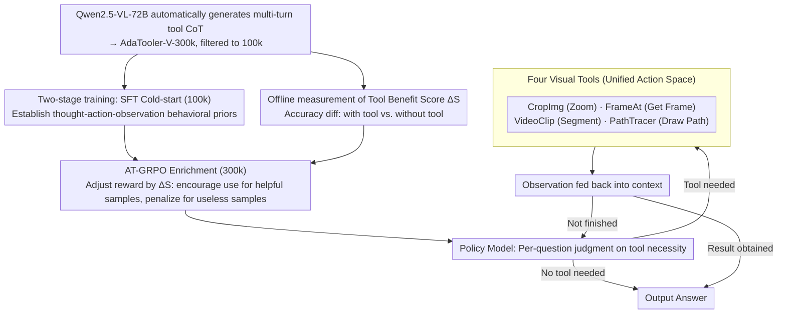

# AdaTooler-V: Adaptive Tool-Use for Images and Videos

**Conference**: ACL 2026 Findings  
**arXiv**: [2512.16918](https://arxiv.org/abs/2512.16918)  
**Code**: https://github.com/CYWang735/AdaTooler-V  
**Area**: Multimodal VLM / Tool-use / Reinforcement Learning  
**Keywords**: Multimodal Reasoning, Adaptive Tool-use, AT-GRPO, Tool Benefit Score, V* bench

## TL;DR
This paper identifies the issue of **blind tool-use** in existing "thinking with images" MLLMs—where visual tools (zoom-in/frame extraction) are forced for all questions, leading to overthinking, reduced accuracy, and increased inference costs. It proposes AdaTooler-V, which introduces the AT-GRPO reinforcement learning algorithm using a sample-level Tool Benefit Score to dynamically adjust reward scales (rewarding helpful tool use and penalizing unnecessary use). This allows a 7B model to achieve 89.8% on the high-resolution V* benchmark, surpassing GPT-4o and Gemini 1.5 Pro.

## Background & Motivation

**Background**: Recent trends in multimodal LLM reasoning favor the "thinking with images" paradigm—inserting visual tool calls (cropping, frame extraction, path tracing) into the Chain-of-Thought (CoT) to allow the model to ground into detailed pixels. This significantly improves performance on complex visual tasks like high-resolution images and long videos (e.g., OpenThinkIMG, PixelReasoner, VITAL). Open-source examples like Vision-R1, Video-R1, and OneThinker have extended R1-style RL to VLMs.

**Limitations of Prior Work**: The authors observe a neglected core issue—**blind tool-use**. This manifests as: (a) existing training rewards implicitly encourage tool usage, leading models to zoom-in or extract frames for all questions; (b) many visual questions can be solved with pure text CoT (e.g., "which of the two clocks shows what time"), and forced tool calls trigger overthinking, deviating the model from the correct reasoning path; (c) repetitive, meaningless tool calls weaken the model's reliance on original visual inputs, making it harder to focus on key cues; (d) redundant calls increase inference costs. Figure 1 shows that in their 300k dataset, roughly half the samples are tool-helpful ($\Delta S > 0$), while the other half are tool-unhelpful or even tool-harmful.

**Key Challenge**: Models lack an explicit mechanism to judge whether a question requires tools. Existing RL rewards are "one-size-fits-all" and cannot distinguish between necessary and unnecessary tool usage at the sample level.

**Goal**: (1) Enable VLMs to **adaptively** decide whether to call visual tools for each question; (2) Introduce a sample-level tool benefit signal in RL training to make rewards aware of whether tool usage actually improves performance.

**Key Insight**: The authors define the Tool Benefit Score as $\Delta S = \text{Mean Acc}(\text{with tool}) - \text{Mean Acc}(\text{without tool})$. Samples are categorized into tool-helpful ($\Delta S > 0$) and tool-unhelpful ($\Delta S \leq 0$). The GRPO reward scale is then modified to be aware of the sample type.

**Core Idea**: Use AT-GRPO (Adaptive Tool-use GRPO)—scaling up rewards for tool usage in tool-helpful samples and penalizing unnecessary calls in tool-unhelpful samples. Combined with a two-stage (SFT cold-start + RL) training process, the model learns when to invoke tools autonomously.

## Method

### Overall Architecture
AdaTooler-V models multimodal reasoning as a thought-action-observation loop. Given a query plus an image/video, the policy model first decides whether a tool is needed: if not, it directly produces a thought $T$ and an answer; if needed, it iteratively generates $(T_i, C_i)$. Each action $C_i$ calls one of four visual tools (CropImg, FrameAt, VideoClip, PathTracer), returning an observation $E_i$, which is fed back into the context for continued reasoning until an answer is reached or the context/turn limit is hit. Training involves two stages: (1) **SFT Cold-start**—fine-tuning on AdaTooler-V-CoT-100k (multi-turn tool-interaction trajectories) to establish basic reasoning patterns and tool-calling priors; (2) **RL with verifiable rewards**—training with AT-GRPO on AdaTooler-V-300k to allow autonomous exploration of "when to use tools."

### Key Designs

**1. AT-GRPO: Using Sample-level Tool Benefit Score $\Delta S$ for Adaptive Rewards**

Standard GRPO rewards only check the final correctness, remaining indifferent to redundant tool calls. This leads models to adopt "lazy" strategies of calling tools regardless of necessity. AdaTooler-V solves this by pre-calculating a Tool Benefit Score $\Delta S = \text{Acc}(\text{with tool}) - \text{Acc}(\text{without tool})$ for each training sample. Qwen2.5-VL-72B runs multiple trials with and without tools to derive this. During RL, the reward scale is rewritten based on $\Delta S$: for tool-helpful samples ($\Delta S > 0$), tool-using trajectories receive higher rewards; for tool-unhelpful samples ($\Delta S \leq 0$), tool calls are penalized to encourage pure text CoT. This meta-signal is more precise than a global step penalty because it is sample-specific.

**2. Unified Action Space with Four Visual Tools**

"Thinking with images" requires iterative grounding. AdaTooler-V converges this into four semantic tools: **CropImg** (crop/zoom based on bbox), **FrameAt** (extract single frame via timestamp), **VideoClip** (clip video via start/end times), and **PathTracer** (draw trajectories/connections between points to aid spatial reasoning). The input and output for all tools are standardized as image patches. After being fed back into the context, they can be operated on by subsequent tools—for instance, a video question might use `FrameAt` to extract a key frame and then `CropImg` to zoom into a specific region. Limiting the space to visual observations prevents training signal dispersion.

**3. Two-stage Training + Multimodal Joint Data**

The exploration space for multimodal long-trajectories is massive, making cold-starting pure RL difficult. AdaTooler-V follows an "SFT cold-start + RL refine" route. Data is first generated using Qwen2.5-VL-72B across tasks like math, counting, logic, spatial, and temporal video reasoning to create AdaTooler-V-300k, filtered into 100k high-quality SFT samples. After SFT establishes the behavior of "how to use tools," RL refined via AT-GRPO shifts the focus to "when to use them" using verifiable rewards (exact match for MCQ/numbers, WER for OCR, ROUGE for free-form). Joint training across single-image, multi-image, and video allows the model to transfer detail-focusing skills across modalities.

### Mechanism Example: Differentiating Samples via $\Delta S$

- A high-resolution V* task—"What is written on the sign in the bottom right?": Pure text CoT likely fails due to small text. `CropImg` significantly boosts accuracy, resulting in $\Delta S > 0$. The model is rewarded for a trajectory that zooms in and then reads.
- A simple task—"Which of the two clocks shows a later time?": The model can answer via direct visual text CoT. Forced zooming leads to overthinking, resulting in $\Delta S \leq 0$. The model is penalized for calling `CropImg`, forcing it to stick to text reasoning.
- These two categories are roughly balanced in the 300k dataset, and this per-sample reward differentiation is what allows the 7B model to reach 89.8% on V*, surpassing GPT-4o's 65.2%.

### Loss & Training
SFT Stage: Standard next-token prediction loss on AdaTooler-V-CoT-100k multi-turn trajectories (thoughts, actions, and observations are all included in the loss). RL Stage: AT-GRPO based on group-relative advantage estimation, with rewards scaled by $\Delta S$ factors. The model is based on Qwen2.5-VL-7B-Instruct.

## Key Experimental Results

### Main Results
Evaluated on 12 benchmarks across single-image (V*, MME, InfoVQA, MMBench, MathVista), multi-image (MMSI-Bench, SPAR-Bench), and video.

| Model | Params | V* | MME | MathVista | MMSI-Bench |
|------|--------|------|------|-----------|------------|
| GPT-4o (Closed) | – | 65.2 | 2328 | 63.8 | 30.3 |
| Gemini 1.5 Pro (Closed) | – | 71.7 | – | 63.9 | 36.9 |
| InternVL3-8B | 8B | – | 2415 | 71.6 | 25.7 |
| Qwen2.5-VL-7B (base) | 7B | – | – | – | – |
| **AdaTooler-V-7B** | 7B | **89.8** | – | – | – |

(The V* score of 89.8% significantly outperforms GPT-4o's 65.2% and Gemini 1.5 Pro's 71.7%.)

### Ablation Study

| Configuration | V* | Notes |
|------|------|------|
| Qwen2.5-VL-7B base | ~– | Baseline without tools |
| + Multimodal interleaved CoT (No AT-GRPO)| ~– | Tool use present but blind; overthinking occurs |
| + AT-GRPO (No $\Delta S$ distinction, normal GRPO) | ~– | Adaptive reward disabled |
| + Full AT-GRPO with $\Delta S$ | **89.8** | Complete model |

### Key Findings
- **V* Gain of +24.6 over GPT-4o**: High-resolution visual tasks show the largest variance in tool helpfulness, where AT-GRPO yields the highest gains.
- **Avoiding blind calls reduces inference costs**: AT-GRPO directs the model to use pure text CoT for simple questions.
- **Multimodal joint training is beneficial**: Skills learned in single-image detail-focusing transfer to video frame selection.
- **Symmetric $\Delta S$ distribution**: Roughly half of the samples benefit from tools while the other half do not, validating that blind tool-use is a pervasive data-level phenomenon.

## Highlights & Insights
- **$\Delta S$ as a sample-level meta-signal**: Using accuracy differences to define tool benefit bypasses the meta-problem of manually defining when to use tools—it is measured empirically and fed back into RL.
- **First to explicitly identify "blind tool-use" as a bottleneck**: While prior works assumed "more tools are better," this paper uses data to prove tools can be harmful for half the samples.
- **Unified Action Space**: The four tools (CropImg, FrameAt, VideoClip, PathTracer) are semantic, combinable, and avoid over-specialization.
- **7B exceeding GPT-4o on V***: This demonstrates that with sophisticated thinking-with-image designs and adaptive decision-making, medium-sized open-source models can achieve SOTA on specific visual tasks.

## Limitations & Future Work
- Offline measurement of $\Delta S$ relies on a powerful "judge model" (Qwen2.5-VL-72B), which is computationally expensive and hard to transfer to new domains zero-shot.
- The precise reward scaling function for $\Delta S$ in AT-GRPO is not fully detailed in the current text; implementation stability likely depends on these functions.
- The toolset is limited to 4 visual tools and lacks text-based tools (OCR, search, calculator) or 3D operations.
- Lacks scaling law analysis; as LLMs become stronger visually, the $\Delta S$ distribution might shift towards "unhelpful," and the efficacy of AT-GRPO for larger models remains an open question.

## Related Work & Insights
- **vs PixelReasoner / OpenThinkIMG / VITAL**: These initiated the thinking-with-images paradigm but implicitly encouraged tool use; AdaTooler-V is the first to optimize the "decision to call."
- **vs Video-R1 / OneThinker**: These extended R1 to VLMs with single reward signals; AT-GRPO incorporates sample-level priors.
- **vs Vision-R1**: While Vision-R1 focused on pure text CoT, AdaTooler-V introduces interleaved CoT and addresses the over-tooling issue.

## Rating
- Novelty: ⭐⭐⭐⭐ $\Delta S$-driven adaptive reward is a clean, effective design addressing blind tool-use.
- Experimental Thoroughness: ⭐⭐⭐⭐ Strong results on 12 benchmarks and V* superiority. 
- Writing Quality: ⭐⭐⭐⭐ Clear motivation, good use of data distributions, and intuitive case studies.
- Value: ⭐⭐⭐⭐ High practical value for training deployable agentic VLMs.

<!-- RELATED:START -->

## Related Papers

- [\[ICLR 2026\] VTool-R1: VLMs Learn to Think with Images via Reinforcement Learning on Multimodal Tool Use](../../ICLR2026/multimodal_vlm/vtool-r1_vlms_learn_to_think_with_images_via_reinforcement_learning_on_multimoda.md)
- [\[AAAI 2026\] VipAct: Visual-Perception Enhancement via Specialized VLM Agent Collaboration and Tool-use](../../AAAI2026/multimodal_vlm/vipact_visual-perception_enhancement_via_specialized_vlm_age.md)
- [\[CVPR 2026\] Thinking With Videos: Multimodal Tool-Augmented Reinforcement Learning for Long Video Reasoning](../../CVPR2026/multimodal_vlm/thinking_with_videos_multimodal_tool-augmented_reinforcement_learning_for_long_v.md)
- [\[CVPR 2026\] ARM-Thinker: Reinforcing Multimodal Generative Reward Models with Agentic Tool Use and Visual Reasoning](../../CVPR2026/multimodal_vlm/arm-thinker_reinforcing_multimodal_generative_reward_models_with_agentic_tool_us.md)
- [\[CVPR 2026\] CodeV: Code with Images for Faithful Visual Reasoning via Tool-Aware Policy Optimization](../../CVPR2026/multimodal_vlm/codev_code_with_images_for_faithful_visual_reasoning_via_tool-aware_policy_optim.md)

<!-- RELATED:END -->
