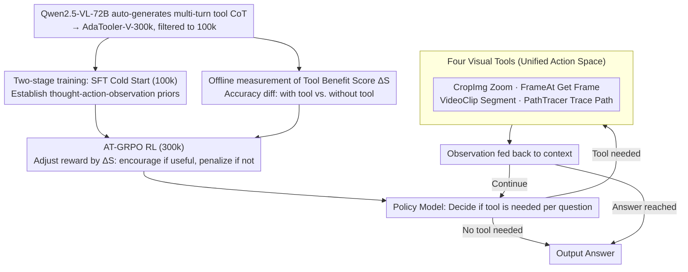

# AdaTooler-V: Adaptive Tool-Use for Images and Videos

**Conference**: ACL 2026 Findings  
**arXiv**: [2512.16918](https://arxiv.org/abs/2512.16918)  
**Code**: https://github.com/CYWang735/AdaTooler-V  
**Area**: Multimodal VLM / Tool-use / Reinforcement Learning  
**Keywords**: Multimodal Reasoning, Adaptive Tool-use, AT-GRPO, Tool Benefit Score, V* bench  

## TL;DR
This paper identifies a widespread **blind tool-use** problem in existing "thinking with images" MLLMs—models tend to force zoom-in or frame extraction for all visual questions, resulting in overthinking that degrades accuracy and increases inference costs. To address this, the authors propose AdaTooler-V, which introduces the AT-GRPO reinforcement learning algorithm. By using a sample-level Tool Benefit Score to dynamically adjust reward scales (encouraging tool use when effective and penalizing it when unnecessary), a 7B model achieves 89.8% on the V* high-resolution benchmark, surpassing GPT-4o and Gemini 1.5 Pro.

## Background & Motivation

**Background**: The field of multimodal LLM reasoning has recently embraced the "thinking with images" paradigm. This involves inserting visual tool calls (cropping, frame extraction, path tracing) into the chain-of-thought, allowing models to repeatedly ground into detailed pixels. This has significantly improved performance on complex visual tasks such as high-resolution images and long videos (e.g., OpenThinkIMG, PixelReasoner, VITAL). Open-source representatives like Vision-R1, Video-R1, and OneThinker have extended R1-style RL to VLMs.

**Limitations of Prior Work**: The authors observe a neglected core problem—**blind tool-use**. Specific manifestations include: (a) existing training rewards often implicitly encourage tool usage, leading models to zoom-in or extract frames for all questions; (b) many visual questions can be solved with pure text CoT (e.g., "Which of the two clocks shows what time?"), where mandatory tool calls trigger overthinking and divert the model from the correct reasoning path; (c) redundant tool calls weaken the model's dependence on original visual inputs, making it harder to focus on key cues; (d) unnecessary calls increase inference costs. Figure 1 of the paper shows a distribution in their 300k dataset where approximately half of the samples are tool-helpful ($\Delta S > 0$), while the other half are tool-unhelpful or even tool-harmful.

**Key Challenge**: Models lack an explicit mechanism to judge whether a question requires a tool. Existing RL frameworks use one-size-fits-all reward signals that cannot distinguish between "should use tools" and "should not use tools" at the sample level.

**Goal**: (1) Enable VLMs to **adaptively** decide whether to call visual tools for each question; (2) Introduce a sample-level tool benefit signal in RL training to make the rewards aware of whether tool usage actually improved performance.

**Key Insight**: The authors define the Tool Benefit Score $\Delta S$ as the difference in average accuracy between using a tool versus not using a tool for the same sample. Samples are explicitly categorized into tool-helpful ($\Delta S > 0$) and tool-unhelpful ($\Delta S \leq 0$), followed by a modification of the GRPO reward scale to perceive these sample types.

**Core Idea**: Use AT-GRPO (Adaptive Tool-use GRPO), which amplifies rewards for tool usage in tool-helpful samples and penalizes unnecessary calls in tool-unhelpful samples. Combined with a two-stage (SFT cold start + RL) training process, the model autonomously learns when to invoke tools.

## Method

### Overall Architecture
AdaTooler-V models multimodal reasoning as a thought-action-observation loop. Given a query plus an image/video, the policy model first decides whether a tool is needed: if not, it produces a thought $T$ to give the answer; if needed, it iteratively generates $(T_i, C_i)$. Each action $C_i$ calls one of four visual tools (CropImg / FrameAt / VideoClip / PathTracer), returning an observation $E_i$ that is fed back into the context to continue reasoning until an answer is reached or context/turn limits are met. Training consists of two stages: (1) **SFT Cold Start**—fine-tuning on AdaTooler-V-CoT-100k (multi-turn tool-interaction trajectories) to establish basic reasoning patterns and tool-calling priors; (2) **RL with verifiable rewards**—training with AT-GRPO on AdaTooler-V-300k to allow the model to autonomously explore "when to use tools."

### Key Designs

**1. AT-GRPO: Using Sample-level Tool Benefit Score $\Delta S$ to Learn Tool Necessity**

Standard GRPO rewards only look at whether the final answer is correct, remaining indifferent to redundant tool calls. Since tool calls introduce overthinking and inference overhead, models easily learn "lazy" strategies of mindless calling. AdaTooler-V solves this by pre-calculating a Tool Benefit Score $\Delta S = \text{Acc}(\text{with tool}) - \text{Acc}(\text{without tool})$ for each training sample. Qwen2.5-VL-72B runs $N$ versions "with tool" and "without tool" for each sample to get the mean accuracy difference. During RL, the reward scale is rewritten: for tool-helpful samples ($\Delta S > 0$), tool-using trajectories get higher rewards; for tool-unhelpful samples ($\Delta S \leq 0$), tool usage is penalized to encourage pure text CoT. This allows the policy gradient to perceive the meta-signal of whether a sample actually needs a tool. It is more precise than a global step penalty because $\Delta S$ is measured per sample.

**2. Unified Action Space for Four Visual Tools: Composable Interaction for Image and Video**

"Thinking with images" requires the model to repeatedly ground details. AdaTooler-V converges this into four semantic tools: **CropImg** (crop/zoom based on bbox for detail "zoom in"), **FrameAt** (extract a single frame from video by timestamp), **VideoClip** (segment video by start/end times), and **PathTracer** (trace trajectories/connections between two points for spatial reasoning). All tool inputs and outputs are unified as image patches. They can be operated on sequentially—for example, a video task can use FrameAt to get a keyframe, then CropImg to zoom into a specific region. The tool space is limited to visual observations to prevent signal dispersion.

**3. Two-Stage Training + Multimodal Joint Data: Learning How, Then Learning When**

The exploration space for multimodal long-trajectories is massive, making pure RL cold starts nearly impossible. AdaTooler-V uses an "SFT Cold Start + RL Refine" path. Data is generated via Qwen2.5-VL-72B across math, visual counting, logic, spatial, and video tasks to form 300k samples, filtered to 100k high-quality SFT trajectories. The SFT stage fine-tunes the model to produce coherent (thought, action, observation) loops. The RL stage then uses AT-GRPO on tasks with verifiable rewards (Exact Match for multi-choice/numerical, WER for OCR, ROUGE for free-form) to pull the model from SFT pattern matching toward adaptive strategies. Joint training across single-image, multi-image, and video allows the transfer of detail-focusing skills to temporal scenarios.

### Case Study: $\Delta S$ Differentiation

- For a high-resolution V* question ("What text is on the bottom-right sign?"): Pure text CoT fails due to low resolution. Using CropImg to zoom in significantly increases accuracy, so $\Delta S > 0$. The model receives higher rewards for trajectories involving "CropImg → Read Text," reinforcing tool use for such tasks.
- For a simple question ("Which clock shows a later time?"): The model answers correctly via text CoT. Forced zoom-in leads to overthinking and errors, so $\Delta S \le 0$. If the model calls CropImg, the trajectory is penalized, forcing it to learn direct textual reasoning.

### Loss & Training
SFT stage: Standard next-token prediction loss on AdaTooler-V-CoT-100k multi-turn trajectories (thought + action + observation). RL stage: AT-GRPO uses group-relative advantage estimation, but modifies reward calculation by introducing the $\Delta S$ scaling factor. The base model is Qwen2.5-VL-7B-Instruct.

## Key Experimental Results

### Main Results
Covering 12 benchmarks across single-image (V*, MME, InfoVQA, MathVista), multi-image (MMSI-Bench), and video.

| Model | Params | V* | MME | MathVista | MMSI-Bench |
|------|--------|------|------|-----------|------------|
| GPT-4o (Closed) | – | 65.2 | 2328 | 63.8 | 30.3 |
| Gemini 1.5 Pro (Closed) | – | 71.7 | – | 63.9 | 36.9 |
| InternVL3-8B | 8B | – | 2415 | 71.6 | 25.7 |
| **AdaTooler-V-7B** | 7B | **89.8** | – | – | – |

(The V* score of 89.8% significantly outperforms GPT-4o's 65.2% and Gemini 1.5 Pro's 71.7%.)

### Ablation Study

| Configuration | V* | Note |
|------|------|------|
| Qwen2.5-VL-7B base | ~– | Baseline without tools |
| + Multimodal interleaved CoT (no AT-GRPO) | ~– | Blind tool use leads to overthinking |
| + AT-GRPO (No $\Delta S$ diff, standard GRPO) | ~– | Adaptive reward disabled |
| + Full AT-GRPO with $\Delta S$ | **89.8** | Complete model |

### Key Findings
- **Significant Gain on V***: High-resolution detail tasks show the largest variance in tool helpfulness, where AT-GRPO yields the highest gains (+24.6 over GPT-4o).
- **Reduced Inference Cost**: By avoiding blind tool-use, the model defaults to text CoT for simple questions, saving compute.
- **Multimodal Joint Training**: Cross-modal transfer allows tool-decision skills learned on images to apply to video frame selection.
- **Symmetric $\Delta S$ Distribution**: About half of the samples benefit from tools while half do not, confirming that "blind calling" is a data-level phenomenon that requires sample-specific rewards.

## Highlights & Insights
- **$\Delta S$ as a Meta-Signal**: Defining tool benefit via the accuracy gap between tool/no-tool versions bypasses the complex "judgment" problem. This "offline measurement to tune reward" approach is transferable to other agentic scenarios.
- **Critique of "Blind Tool-use"**: While previous works assumed "more tools are better," this paper provides empirical evidence that tools are harmful for nearly half of the samples.
- **Unified Tool Space**: Limiting the space to CropImg, FrameAt, VideoClip, and PathTracer ensures focused training signals while covering core "thinking-with-image" patterns.
- **7B Beat GPT-4o on V***: Proves that with adaptive tool-use and thinking-with-image design, mid-sized open-source models can achieve SOTA on specific visual tasks.

## Limitations & Future Work
- Offline measurement of $\Delta S$ relies on a teacher model (Qwen2.5-VL-72B), which is costly and domain-dependent.
- Precise mathematical formulations for $\Delta S$ reward scaling were not fully detailed in the introductory sections.
- The toolset is limited to visual actions, excluding text-based tools like OCR, search, or calculators.
- Lacks scaling law analysis; it is unclear if larger models (which might need tools less often) exhibit different $\Delta S$ distributions.

## Related Work & Insights
- **vs. PixelReasoner / VITAL**: These propose the thinking-with-images paradigm but use rewards that implicitly encourage tool usage. AdaTooler-V is the first to optimize the "whether to call" decision.
- **vs. Video-R1 / OneThinker**: These extend R1 to multimodal data but rely on a single reward signal. AT-GRPO integrates sample-level priors.
- **vs. Vision-R1**: While Vision-R1 focuses on pure text CoT, AdaTooler-V introduces multimodal interleaved CoT and solves the over-tool problem.

## Rating
- Novelty: ⭐⭐⭐⭐ The $\Delta S$-driven adaptive reward is a simple yet effective design addressing blind tool-use.
- Experimental Thoroughness: ⭐⭐⭐⭐ Tested across 12 benchmarks and multimodal scenarios; V* results are particularly impressive.
- Writing Quality: ⭐⭐⭐⭐ Clear motivation, well-diagnosed pain points, and intuitive case studies.
- Value: ⭐⭐⭐⭐ Provides a practical roadmap for training deployable agentic VLMs.

<!-- RELATED:START -->

## Related Papers

- [\[AAAI 2026\] VipAct: Visual-Perception Enhancement via Specialized VLM Agent Collaboration and Tool-use](../../AAAI2026/multimodal_vlm/vipact_visual-perception_enhancement_via_specialized_vlm_age.md)
- [\[ECCV 2024\] m&m's: A Benchmark to Evaluate Tool-Use for Multi-step Multi-modal Tasks](../../ECCV2024/multimodal_vlm/m_ampmaposs_a_benchmark_to_evaluate_tool-use_for_multi-step_multi-modal_tasks.md)
- [\[ACL 2026\] Leave My Images Alone: Preventing Multi-Modal Large Language Models from Analyzing Unauthorized Images](leave_my_images_alone_preventing_multi-modal_large_language_models_from_analyzin.md)
- [\[CVPR 2026\] EgoSound: Benchmarking Sound Understanding in Egocentric Videos](../../CVPR2026/multimodal_vlm/egosound_benchmarking_sound_understanding_in_egocentric_videos.md)
- [\[ICML 2026\] AgentHijack: Benchmarking Computer Use Agent Robustness to Common Environment Corruptions](../../ICML2026/multimodal_vlm/agenthijack_benchmarking_computer_use_agent_robustness_to_common_environment_cor.md)

<!-- RELATED:END -->
