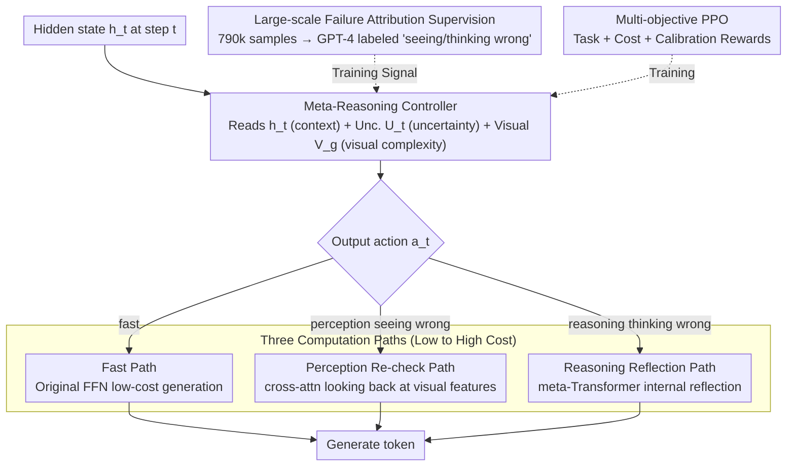

# Addressing Overthinking in Large Vision-Language Models via Gated Perception-Reasoning Optimization

**Conference**: ACL 2026  
**arXiv**: [2601.04442](https://arxiv.org/abs/2601.04442)  
**Code**: None  
**Area**: Multimodal VLM / Adaptive Computation  
**Keywords**: Overthinking, Perception-Reasoning Separation, Meta-Reasoning Controller, Adaptive Computation, Multi-Objective Reinforcement Learning

## TL;DR

The GPRO framework is proposed to address overthinking in LVLMs by using a meta-reasoning controller to dynamically route computation into three paths (Fast/Perception Re-check/Reasoning Reflection) at each token generation step, simultaneously improving accuracy and efficiency.

## Background & Motivation

**Background**: Large Vision-Language Models (LVLMs) demonstrate strong reasoning capabilities through chain-of-thought mechanisms, but this "slow thinking" approach often leads to overthinking—generating lengthy reasoning chains even for simple questions.

**Limitations of Prior Work**: (1) Overthinking wastes computational resources and sometimes introduces errors; (2) existing adaptive reasoning methods ignore a key bottleneck: visual perception failure. Large-scale analysis indicates that the frequency of perception failures in LVLM errors is more than twice that of reasoning errors.

**Key Challenge**: When errors stem from "seeing wrong" rather than "thinking wrong," increasing reasoning depth is not only useless but may introduce more errors. Existing methods focus solely on reasoning adaptation and completely ignore perception adaptation.

**Goal**: Design an adaptive computation framework that considers both perception uncertainty and reasoning uncertainty.

**Key Insight**: Drawing from the dual process theory in cognitive science (Kahneman), humans flexibly switch between fast intuition, visual re-checking, and deep reasoning when solving problems.

**Core Idea**: Distinguish between perception errors and reasoning errors through large-scale failure attribution supervision (790k samples) to train a meta-reasoning controller for three-way dynamic computation allocation.

## Method

### Overall Architecture

GPRO replaces standard "token-by-token slow thinking" with "token-by-token as-needed thinking." It replaces the original FFN in alternating layers of the Transformer decoder with a GPR module; each GPR module contains a meta-reasoning controller and three computation paths. When generating each token, the controller first reads the current internal state and decides which path to take: direct fast generation, looking back at the image, or performing internal reflection. The computational cost of the three paths increases progressively, allowing simple tokens to be processed quickly while allocating extra resources only for error-prone tokens, achieving both computational savings and error reduction. The controller's ability to judge "which path to take" is derived from failure attribution data constructed on approximately 790,000 samples, which labels each error as either "seeing wrong" or "thinking wrong," providing supervised training signals for routing decisions.

### Key Designs

**1. Meta-Reasoning Controller: Enabling per-token judgment on "whether to think more and in which direction"**

The essence of overthinking is "failing to stop when appropriate." To achieve adaptation, a mechanism must make decisions for the model at each step. The controller is a 2-layer lightweight Transformer that simultaneously receives three complementary signals: the current hidden state $h_t$ reflecting internal semantics, the predictive entropy $U_t$ reflecting uncertainty, and global image features $V_g$ reflecting visual complexity. It outputs a discrete action $a_t \in \{\text{fast}, \text{perception}, \text{reasoning}\}$. All three signals are essential: relying only on entropy might mistake linguistic hesitation for a need to re-scan the image; incorporating image complexity allows the controller to distinguish between "unclear vision" and "unclear logic."

**2. Three Computation Paths: Separating remediation for perception and reasoning errors**

Existing adaptive reasoning methods only adjust reasoning depth, but the authors' failure attribution shows that perception failures in LVLMs occur twice as often as reasoning errors. When the model "sees wrong," adding more reasoning only exacerbates the issue. GPRO therefore splits remediation into three specialized paths: the Fast Path uses the original FFN for low-cost generation; the Slow Perception Path uses cross-attention to re-examine visual features, $\text{Perc}(h_t, V) = \text{CrossAttn}(h_t, V, V)$, corresponding to "re-looking at the image"; the Slow Reasoning Path uses a meta-Transformer for internal self-reflection, $\text{Reas}(h_t, H_{<t}) = \text{MetaTrans}(h_t, H_{<t})$, corresponding to "re-thinking." This divide-and-conquer approach ensures each path targets a specific problem type, unlike uniform reasoning depth increases which are ineffective against perception errors.

**3. Large-scale Failure Attribution Supervision: Providing training signals for "vision vs. reasoning" routing**

Standard benchmarks only indicate whether the final answer is correct, without specifying if the error was due to "seeing" or "thinking," preventing the controller from learning proper routing. The authors collected error cases by running Qwen2.5-VL on approximately 790,000 samples and used GPT-4 to attribute each error to "visual perception failure" or "reasoning error," building a training set with cognitive stage labels. This large-scale attribution data transforms the distinction between "perception vs. reasoning" from a conceptual idea into a supervised signal, while quantifying the core argument that perception is a major bottleneck.

### Loss & Training

Multi-objective PPO training is utilized with a reward function $R(\tau) = R_{task} + \alpha_c R_{cost} + \alpha_l R_{cal}$. The Task Reward awards +1 for correct answers; the Cost Reward penalizes the activation of slow paths to prevent the controller from overusing expensive computation; the Calibration Reward ensures that uncertainty scores align with actual errors (higher before an error, lower before a correct step), making the controller's uncertainty signal reliable.

## Key Experimental Results

### Main Results (Base: Qwen2.5-VL-7B)

| Method | MathVision Acc | MathVerse Acc | MathVista Acc | Avg. Response Length |
|------|---------------|---------------|---------------|------------|
| Base Qwen2.5-VL-7B | 24.1 | 38.5 | 65.1 | ~350 |
| Mulberry | Gain over base | Gain over base | Gain over base | Longer |
| GPRO-7B | Significant Gain | Significant Gain | Significant Gain | **Significant Reduction** |

### Ablation Study

| Configuration | Key Metric | Description |
|------|---------|------|
| Remove Perception Path | Significant Acc drop | Perception re-check is vital for error correction |
| Remove Reasoning Path | Slight Acc drop | Reasoning self-reflection provides auxiliary support |
| Remove Calibration Reward | Route selection degradation | Uncertainty calibration is a key signal for the controller |
| Error Attribution Analysis | Perception > Reasoning 2:1 | Validates the core argument that perception is the primary bottleneck |

### Key Findings
- GPRO simultaneously improves accuracy and efficiency (shorter responses) across five benchmarks, breaking the "more accurate = longer" assumption.
- Visual perception failures are indeed the primary source of LVLM errors (exceeding 2/3 of cases), rather than insufficient reasoning.
- The three-path controller learns meaningful routing strategies: simple questions take the Fast Path, and visual ambiguities take the Perception Path.

## Highlights & Insights
- "The root of overthinking may not be insufficient thinking, but unclear seeing"—this insight shifts the direction of LVLM reasoning optimization.
- The construction method for large-scale failure attribution data is reusable—using a strong model to label error types of a weaker model is a generic strategy for supervised generation.
- The three-path computational architecture elegantly engineers the dual process theory from cognitive science.

## Limitations & Future Work
- GPT-4's failure attribution may contain inherent biases, requiring more reliable attribution methods.
- The meta-reasoning controller increases model complexity, requiring additional engineering for deployment.
- Validated on 3B and 7B models, but applicability to larger-scale models has not been tested.
- Future work could explore fine-grained perception paths (e.g., region-level vs. full-image re-checking).

## Related Work & Insights
- **vs. Adaptive Reasoning Methods (e.g., FAST)**: Incorporates perception adaptation for the first time, adjusting both reasoning and perception depth.
- **vs. Mixture-of-Experts**: MoE selects in the parameter dimension; GPRO selects in the computation type dimension.
- **vs. Vision-R1/LMM-R1**: These methods enhance reasoning via RL but do not distinguish between perception and reasoning errors.

## Rating
- Novelty: ⭐⭐⭐⭐⭐ Adaptive computation with perception-reasoning separation is a new paradigm.
- Experimental Thoroughness: ⭐⭐⭐⭐ 5 benchmarks, ablation, and attribution analysis.
- Writing Quality: ⭐⭐⭐⭐ Strong motivation and clear architectural description.
- Value: ⭐⭐⭐⭐⭐ Paradigmatic impact on LVLM reasoning optimization.

<!-- RELATED:START -->

## Related Papers

- [\[ACL 2026\] GeoArena: Evaluating Open-World Geographic Reasoning in Large Vision-Language Models](geoarena_evaluating_open-world_geographic_reasoning_in_large_vision-language_mod.md)
- [\[ACL 2026\] ChemVLR: Prioritizing Reasoning in Perception for Chemical Vision-Language Understanding](chemvlr_prioritizing_reasoning_in_perception_for_chemical_vision-language_unders.md)
- [\[ACL 2026\] A Survey of Multimodal Mathematical Reasoning: From Perception, Alignment to Reasoning](a_survey_of_multimodal_mathematical_reasoning_from_perception_alignment_to_reaso.md)
- [\[ACL 2026\] OMIBench: Benchmarking Olympiad-Level Multi-Image Reasoning in Large Vision-Language Models](omibench_benchmarking_olympiad-level_multi-image_reasoning_in_large_vision-langu.md)
- [\[CVPR 2026\] Breaking the Regional Perception Bottleneck of Multimodal Large Language Models via External Reasoning Framework](../../CVPR2026/multimodal_vlm/breaking_the_regional_perception_bottleneck_of_multimodal_large_language_models_.md)

<!-- RELATED:END -->
