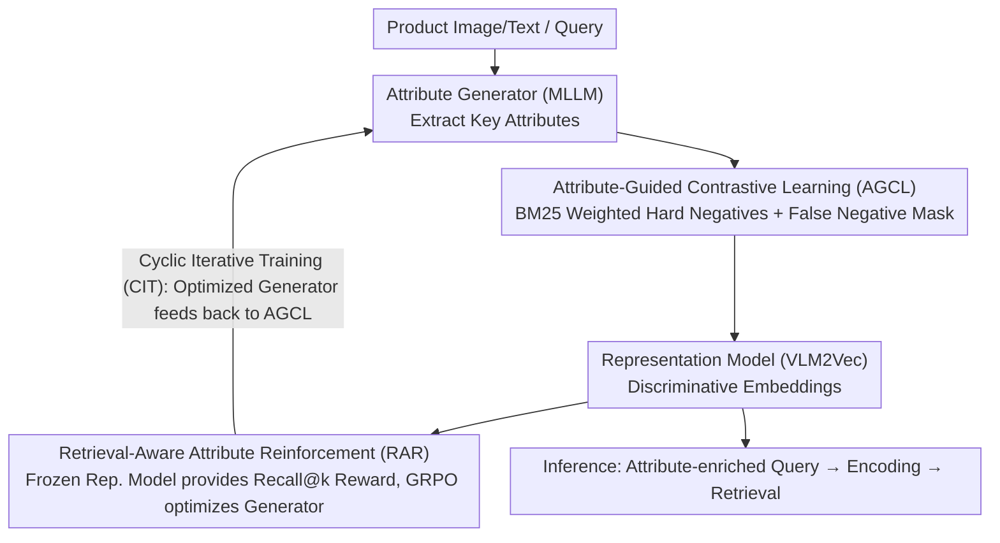

# AFMRL: Attribute-Enhanced Fine-Grained Multi-Modal Representation Learning in E-commerce

**Conference**: ACL 2026  
**arXiv**: [2604.20135](https://arxiv.org/abs/2604.20135)  
**Code**: None  
**Area**: Image Generation  
**Keywords**: E-commerce Retrieval, Fine-grained Representation Learning, Attribute Generation, Reinforcement Learning Alignment, Contrastive Learning

## TL;DR
The AFMRL framework is proposed, framing fine-grained understanding of e-commerce products as an attribute generation task. It enhances contrastive learning via key attributes generated by MLLM (AGCL) and back-optimizes the attribute generator using retrieval performance as a reward signal (RAR), achieving SOTA retrieval performance on large-scale e-commerce datasets.

## Background & Motivation

**Background**: Multimodal representation learning is evolving from discriminative matching frameworks like CLIP toward generative LLM-based approaches. E-commerce scenarios require distinguishing highly similar products (e.g., "V-neck red dress" vs. "round-neck red dress"), necessitating extremely high fine-grained understanding.

**Limitations of Prior Work**: Models like CLIP are essentially "bag-of-words" systems that struggle to distinguish compositional semantic differences (e.g., "white t-shirt with blue logo" vs. "blue t-shirt with white logo"). While LLM-based representation methods like VLM2Vec possess strong reasoning capabilities, they are constrained by causal attention mechanisms, obtaining embeddings only through global average pooling or the final token, which is incompatible with fine-grained alignment techniques like RoI.

**Key Challenge**: The generative capacity of MLLMs can extract fine-grained attributes, but existing architectures limit their direct application in fine-grained representation learning. How can the understanding power of MLLMs be converted into improvements for discriminative representation?

**Goal**: Utilize the generative capabilities of MLLM to extract key product attributes and integrate these attributes into the representation learning process while ensuring that attribute generation aligns with the final retrieval objective.

**Key Insight**: "Outsource" fine-grained understanding to an attribute generator, using the generated attributes as an intermediate bridge to indirectly enhance the fine-grained discriminative ability of the representation model.

**Core Idea**: A two-stage training approach—first using attributes to guide contrastive learning and mine hard negatives, then using retrieval results as reward signals to optimize the attribute generator via RL, forming a self-improving closed loop.

## Method

### Overall Architecture
AFMRL employs two independent models: a representation model (VLM2Vec, responsible for generating discriminative embeddings) and an attribute generator (MLLM, responsible for extracting key attributes). Training consists of two stages: Stage 1 utilizes attribute-guided contrastive learning to train the representation model; Stage 2 employs the frozen representation model to provide retrieval rewards for the attribute generator, optimizing the generation policy via GRPO. During inference, the generator extracts attributes to enrich the query input, which is then encoded by the representation model for retrieval.

### Key Designs

**1. Attribute-Guided Contrastive Learning (AGCL): Feeding MLLM-generated key attributes back into InfoNCE to solve "indistinguishable highly similar products"**

Standard InfoNCE has two inherent issues: it only considers embedding similarity, failing to use complementary matching signals outside the embeddings; and it blindly punishes false negatives (semantically correct negative samples). AGCL addresses both using attribute information. On one hand, it calculates lexical similarity $B_{ij}$ between queries and candidate sample attributes via BM25, converting it into importance weights through $w_{ij} = e^{1+\tanh(B_{ij})}$. This ensures that hard negatives with high lexical similarity, such as "V-neck red dress vs. round-neck red dress," receive greater training focus. On the other hand, it implements a false negative mask—if the similarity between a negative sample and the positive sample exceeds a threshold $\delta$, it is removed from the negative sample pool to avoid punishing semantically correct matches. Here, attributes serve as supplemental text-side discriminative evidence for contrastive learning.

**2. Retrieval-Aware Attribute Reinforcement (RAR): Using retrieval performance as a reward to force the attribute generator to produce only "retrieval-useful" attributes**

If attribute generation relies solely on SFT distillation, its training objective is decoupled from the final retrieval task—even if the generation looks "accurate," it may not improve retrieval precision. RAR connects this causal link: the representation model trained in Stage 1 is frozen and used as the reward environment. After the generator produces attributes for a query, the representation model executes retrieval using the enhanced query, feeding Recall@k back directly as a reward signal. Optimization is performed using GRPO, including KL divergence regularization to prevent the policy from deviating too far from the SFT base, and a penalty of $\eta=-0.1$ for invalid outputs. Because the reward is the retrieval metric itself, the generator no longer learns "reasonable-looking attributes" but rather "attributes that actually retrieve the correct items."

**3. Cyclic Iterative Training (CIT): Allowing the RL-optimized generator to feed back into the representation model, breaking initialization local optima**

The quality of the attribute generator and the representation model are interdependent: a stronger generator provides better attributes for AGCL, while a stronger representation model provides a more accurate reward environment for RAR. CIT turns this dependency into a closed loop—after RL training is complete, the optimized attribute generator is used to resupply attributes for AGCL training, iteratively improving both. Benefiting from this loop, performance improves significantly using only 30% of the training samples, effectively trading iteration for data cost.

### Loss & Training
The AGCL loss in Stage 1 is a weighted InfoNCE: $\mathcal{L}_{\text{AGCL}} = -\log \frac{w_{ii} \cdot e^{s_{ii}/\tau}}{w_{ii} \cdot e^{s_{ii}/\tau} + \sum_{j \in \mathcal{N}_i} w_{ij} \cdot e^{s_{ij}/\tau}}$. Stage 2 uses the GRPO objective function, including clipping ratios and KL regularization terms. The representation model is initialized with Qwen2-VL-2B and fine-tuned via LoRA; the attribute generator is initialized with Qwen2.5-VL-3B and undergoes full-parameter fine-tuning.

## Key Experimental Results

### Main Results

| Model | Fine-grained Recall@1 | Recall@5 | Recall@10 |
|------|----------------|----------|-----------|
| CLIP | 14.98 | 23.07 | 27.59 |
| FG-CLIP | 31.44 | 49.78 | 68.38 |
| VLM2Vec | 48.05 | 64.26 | 69.65 |
| + AGCL | 51.06 | 68.08 | 73.52 |
| + AGCL + Distill Gen. | 52.42 | 71.00 | 76.26 |
| **AFMRL (Full)** | **54.28** | **72.19** | **77.27** |

### Ablation Study

| Configuration | Accuracy | NMI | ARI | Purity |
|------|----------|-----|-----|--------|
| Baseline VLM2Vec | 87.67 | 87.04 | 44.39 | 73.16 |
| + AGCL | 87.80 | 87.11 | 44.44 | 73.24 |
| + AGCL + Distilled Gen. | 87.98 | 87.63 | 46.24 | 74.21 |
| + AGCL + RL Policy | 88.00 | 87.68 | 46.61 | 74.52 |
| + CIT (Cyclic Iteration) | 89.13 | 88.97 | 47.40 | 75.98 |

### Key Findings
- Each component provides clear incremental gains: AGCL → +3.01 R@1, Distilled Attributes → +1.36 R@1, RL Alignment → +1.86 R@1.
- "Generative conciseness" emergence was observed during RL training: the length of generated attributes continuously decreased as the model learned to complete retrieval with the most concise attributes.
- Recall@50 proved to be the optimal $k$ value, balancing reward sparsity and saturation.
- AGCL prevents the model from falling into local optima prematurely, providing a more robust representation space.

## Highlights & Insights
- The "attribute as a bridge" design concept is clever—it bypasses the constraints of MLLM causal attention on fine-grained alignment through text attributes, converting generative power into discriminative power.
- Using retrieval performance as an RL reward signal creates a closed-loop optimization that is more direct than traditional proxy losses. This approach is transferable to any "generation-assisted discrimination" scenario.
- The automatic shortening of attribute length during RL training is an interesting emergent phenomenon, indicating that RL is indeed learning "what information is useful for retrieval."

## Limitations & Future Work
- The RL policy exhibits an "alignment tax"—over-optimization of Recall@k may damage general representation quality.
- Currently only validated on e-commerce datasets; generalization to other fine-grained retrieval scenarios remains to be explored.
- The attribute generator increases inference overhead, requiring a trade-off between precision and efficiency.
- Convergence and the optimal number of iterations for Cyclic Iterative Training have not yet been deeply analyzed.

## Related Work & Insights
- **vs VLM2Vec**: VLM2Vec directly uses MLLM for representation but lacks fine-grained signals; AFMRL supplements fine-grained information via attribute generation.
- **vs FG-CLIP**: FG-CLIP relies on region-level annotations for fine-grained alignment, which is incompatible with MLLM architectures; AFMRL replaces region features with attribute text.
- **vs General GRPO**: This work extends GRPO from reasoning tasks to retrieval alignment, with a more compact reward design.

## Rating
- Novelty: ⭐⭐⭐⭐ The combined design of attribute-guided contrastive learning and retrieval-reward RL is novel.
- Experimental Thoroughness: ⭐⭐⭐⭐ Validated on large-scale e-commerce datasets with thorough ablation.
- Writing Quality: ⭐⭐⭐⭐ Clear framework description and intuitive diagrams.
- Value: ⭐⭐⭐⭐ Direct application value for fine-grained e-commerce retrieval.

<!-- RELATED:START -->

## Related Papers

- [\[CVPR 2026\] Multi-Metric Representation Learning Strategy Based on Clustering for Fine-Grained Multimodal Sentiment Analysis](../../CVPR2026/multimodal_vlm/multi-metric_representation_learning_strategy_based_on_clustering_for_fine-grain.md)
- [\[CVPR 2026\] MOON2.0: Dynamic Modality-balanced Multimodal Representation Learning for E-commerce Product Understanding](../../CVPR2026/multimodal_vlm/moon20_dynamic_modality-balanced_multimodal_representation_learning_for_e-commer.md)
- [\[AAAI 2026\] DEIG: Detail-Enhanced Instance Generation with Fine-Grained Semantic Control](../../AAAI2026/multimodal_vlm/deig_detail-enhanced_instance_generation_with_fine-grained_semantic_control.md)
- [\[CVPR 2026\] Beyond Global Similarity: Multi-Conditional Retrieval for Fine-Grained Cross-Modal Understanding](../../CVPR2026/multimodal_vlm/beyond_global_similarity_multi-conditional_retrieval_for_fine-grained_cross-moda.md)
- [\[CVPR 2026\] Multi-Modal Representation Learning via Semi-Supervised Rate Reduction for Generalized Category Discovery](../../CVPR2026/multimodal_vlm/multi-modal_representation_learning_via_semi-supervised_rate_reduction_for_gener.md)

<!-- RELATED:END -->
