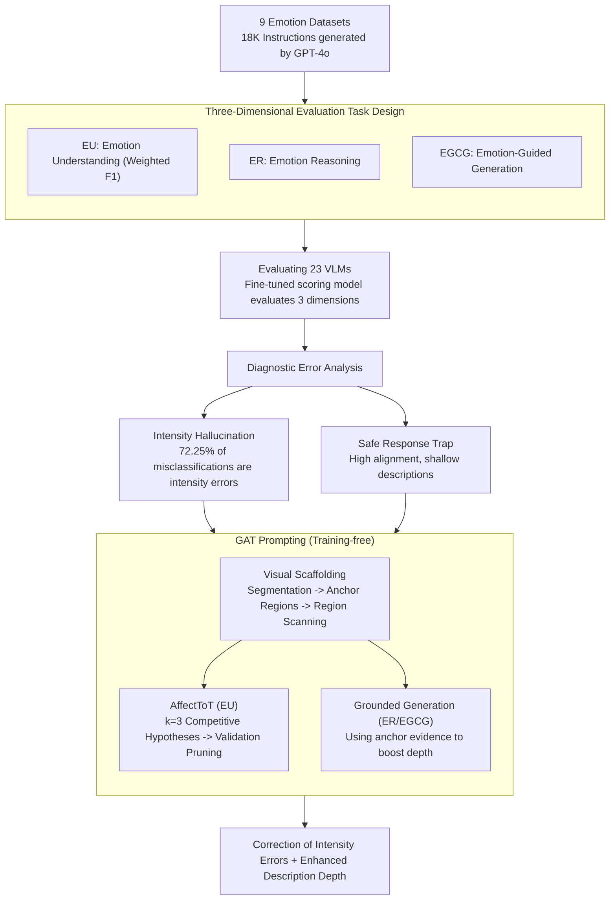

# AICA-Bench: Holistically Examining the Capabilities of VLMs in Affective Image Content Analysis

**Conference**: ACL 2026 Findings  
**arXiv**: [2604.05900](https://arxiv.org/abs/2604.05900)  
**Code**: None  
**Area**: Multimodal VLM / Affective Computing  
**Keywords**: Affective Analysis, Vision-Language Models, Benchmarking, Affective Reasoning, Prompt Engineering

## TL;DR
This paper proposes AICA-Bench, a comprehensive benchmark covering three dimensions: Emotion Understanding (EU), Emotion Reasoning (ER), and Emotion-Guided Content Generation (EGCG). Evaluating 23 VLMs reveals two systematic flaws: intensity calibration failure and shallow descriptions. A training-free framework, GAT Prompting, is introduced to mitigate these issues.

## Background & Motivation

**Background**: VLMs have achieved significant progress in perceptual capabilities, with existing benchmarks primarily evaluating factual correctness, semantic localization, and visual reasoning. Recently, benchmarks assessing the affective capabilities of VLMs (e.g., EVE, AffectGPT, EEmo-Bench) have emerged, but they mostly focus on basic emotion classification tasks.

**Limitations of Prior Work**: Existing affective benchmarks suffer from three critical shortcomings: (1) limited coverage with only a small number of image emotion datasets; (2) a primary focus on multiple-choice emotion classification, lacking evaluation of affective reasoning and emotion-guided generation; (3) the absence of a holistic evaluation framework for the "understanding-reasoning-generation" pipeline. Affective intelligence requires not only identifying emotional cues but also reasoning about emotional causes and producing appropriate emotional expressions.

**Key Challenge**: The lack of a comprehensive AICA benchmark is a bottleneck for advancing affective intelligence—the inability to systematically evaluate means the inability to effectively improve.

**Goal**: To build a holistic affective image content analysis benchmark covering understanding, reasoning, and generation, and to identify systematic deficiencies in VLMs regarding affective tasks.

**Key Insight**: Drawing from affective psychology, affective intelligence consists of three levels: perception, attribution, and expression, which correspond to the three evaluation tasks designed in this study.

**Core Idea**: AICA-Bench, containing 18,124 instructions across 9 datasets, is used to comprehensively evaluate VLM affective capabilities. It reveals systematic "intensity hallucinations" and "shallow descriptions," which are addressed via GAT Prompting using visual anchors and hierarchical reasoning.

## Method

### Overall Architecture
The study follows a closed-loop process: "Benchmark Construction → Model Evaluation → Defect Identification → Solution Proposal." **Step 1: Benchmark Construction**: 9 image emotion datasets are collected, and 18,124 instructions are automatically generated using GPT-4o, covering three tasks—EU (identifying expressed and evoked emotions), ER (explaining why an image evokes an emotion), and EGCG (generating descriptions consistent with the image and target emotion). **Step 2: Model Evaluation**: 23 VLMs are evaluated; open-ended ER/EGCG tasks are scored by a fine-tuned evaluation model. **Step 3: Defect Identification**: Diagnostic analysis locates systematic defects: "Intensity Hallucination" and the "Safe Response Trap." **Step 4: Solution Proposal**: GAT Prompting, a training-free framework, is proposed to address these defects using visual scaffolding and hierarchical hypothesis reasoning.

### Key Designs

**1. Three-Dimensional Evaluation Task Design: Decomposing Affective Intelligence into Recognition, Attribution, and Expression**

Most existing benchmarks focus on multiple-choice classification, failing to assess whether models can explain emotional causes or generate appropriate expressions. AICA-Bench addresses this by designing three tasks: EU (identifying expressed and evoked emotions), ER (explaining emotional causes), and EGCG (generating emotion-consistent content). Evaluation methods are tailored: EU uses Weighted F1 (covering base and CoT prompts), while ER and EGCG use a scoring model fine-tuned on QwenVL2.5-7B. This model evaluates affective alignment, richness, and causal rationality, achieving a Pearson correlation of 0.88/0.90 with human annotations.

**2. Diagnostic Error Analysis: Identifying Cognitive Failures Beyond Accuracy**

To understand model failures, the authors perform structural error decomposition. Two systematic defects are identified. First, "Intensity Hallucination": Intensity errors account for 72.25% of misclassifications, indicating that models can distinguish valence but struggle with fine-grained intensity (e.g., confusing Amusement with Contentment). Second, "Safe Response Trap": In open-ended tasks, models achieve high alignment scores (~4.1 median) but significantly lower descriptive scores (~3.0 median), tending to provide generic, safe responses rather than deep analysis.

**3. GAT Prompting (Grounded Affective Tree): Mitigating Flaws via Visual Anchors and Hypothesis Competition**

GAT addresses "linguistic prior guessing" and "intensity miscalibration" without parameter updates. It utilizes a **Visual Scaffolding** that segments images into regions as visual anchors, forcing the model to scan specific areas and extract objective evidence. For **EU tasks**, **AffectToT (Affective Tree-of-Thoughts)** is employed with search depth $d=3$ and breadth $k=3$. It generates three competing "Emotion-Intensity" hypotheses based on region scans, then uses a verification stage to prune hypotheses contradicting visual facts. For **ER/EGCG tasks**, **Grounded Generation** is used, where objective evidence from the scaffolding is used to anchor the generation in specific visual details, increasing descriptive richness.

### Loss & Training
The assessment model was fine-tuned on QwenVL2.5-7B using 10,000 Q&A pairs (generated by GPT-4o and scored by 5 annotators, Krippendorff's $\alpha=0.78$).

## Key Experimental Results

### Main Results

| Model | EU Avg. | ER Avg. | EGCG Avg. | Overall |
|------|---------|---------|-----------|---------|
| Gemini-2.5-Pro | 67.27 | 79.08 | 74.13 | 73.49 |
| GPT-4o | 64.93 | 77.81 | 75.73 | 72.82 |
| Qwen2.5VL-7B | 56.84 | 74.50 | 66.00 | 65.78 |
| LLaVA-1.6-13B | 41.80 | 73.57 | 64.51 | 59.96 |

### Ablation Study (GAT Prompting Gains)

| Model | EU Gain | ER Gain | EGCG Gain |
|------|--------|--------|----------|
| Gemini-2.5-Pro | +4.18 | +3.37 | +4.12 |
| GPT-4o | +2.98 | +3.69 | +3.27 |
| Average (All Models) | +6.15 | +3.54 | +3.96 |

### Key Findings
- Models exhibit a "top-heavy" pattern: Reasoning and generation scores are 15-30% higher than understanding, suggesting models infer emotions based on linguistic priors rather than true visual perception.
- Scaling models from 8B to 16B yields marginal gains, implying the bottleneck lies in visual encoding quality rather than parameters.
- Masking faces leads to an 11.1% drop in F1, revealing a heavy reliance on facial expressions as a visual shortcut.

## Highlights & Insights
- The **separation of intensity vs. polarity errors** is highly insightful, showing that affective granularity (72.25% of errors) is the primary challenge.
- The **discovery of the "Safe Response Trap"** highlights a general issue in open-ended VLM evaluations where models favor template-based safety over depth.
- **GAT Prompting** provides a design philosophy applicable to any VLM task requiring fine-grained visual grounding.

## Limitations & Future Work
- The scoring model is based on QwenVL2.5-7B, which may introduce bias toward certain model architectures.
- The benchmark focuses on static images, leaving dynamic affective shifts in videos for future work.
- GAT Prompting increases inference complexity, which may affect deployment costs.

## Related Work & Insights
- **vs. EVE**: While EVE evaluates classification and explanation for 7 models, AICA-Bench evaluates the full "understanding-reasoning-generation" pipeline across 23 models.
- **vs. EEmo-Bench**: EEmo-Bench focuses solely on evoked emotions; AICA-Bench distinguishes between expressed and evoked emotions.

## Rating
- Novelty: ⭐⭐⭐⭐ First benchmark covering understanding-reasoning-generation for affective VLM.
- Experimental Thoroughness: ⭐⭐⭐⭐⭐ 23 models, 9 datasets, 18K+ instructions.
- Writing Quality: ⭐⭐⭐⭐ Deep diagnostic analysis.
- Value: ⭐⭐⭐⭐ Provides a robust foundation for affective multimodal research.

<!-- RELATED:START -->

## Related Papers

- [\[CVPR 2026\] VS-Bench: Evaluating VLMs for Strategic Abilities in Multi-Agent Environments](../../CVPR2026/multimodal_vlm/vs_bench_evaluating_vlms_for_strategic_abilities_in_multi_agent_environments.md)
- [\[ACL 2026\] CNSL-bench: Benchmarking the Sign Language Understanding Capabilities of MLLMs on Chinese National Sign Language](cnsl-bench_benchmarking_the_sign_language_understanding_capabilities_of_mllms_on.md)
- [\[AAAI 2026\] Multi-Agent VLMs Guided Self-Training with PNU Loss for Low-Resource Offensive Content Detection](../../AAAI2026/multimodal_vlm/multi-agent_vlms_guided_self-training_with_pnu_loss_for_low-resource_offensive_c.md)
- [\[ACL 2025\] VLM2-Bench: A Closer Look at How Well VLMs Implicitly Link Explicit Matching Visual Cues](../../ACL2025/multimodal_vlm/vlm2-bench_a_closer_look_at_how_well_vlms_implicitly_link_explicit_matching_visu.md)
- [\[ACL 2026\] VULCA-Bench: A Multicultural Vision-Language Benchmark for Evaluating Cultural Understanding](vulca-bench_a_multicultural_vision-language_benchmark_for_evaluating_cultural_un.md)

<!-- RELATED:END -->
