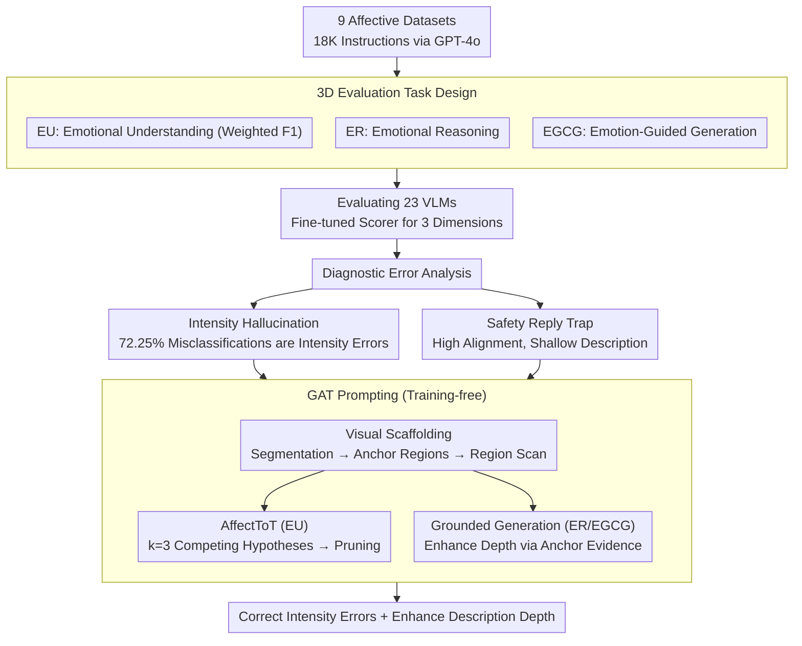

# AICA-Bench: Holistically Examining the Capabilities of VLMs in Affective Image Content Analysis

**Conference**: ACL 2026 Findings  
**arXiv**: [2604.05900](https://arxiv.org/abs/2604.05900)  
**Code**: None  
**Area**: Multimodal VLM / Affective Computing  
**Keywords**: Emotion Analysis, Visual Language Model, Benchmark, Affective Reasoning, Prompt Engineering

## TL;DR
The authors propose AICA-Bench, a comprehensive benchmark covering Emotional Understanding (EU), Emotional Reasoning (ER), and Emotional Guided Content Generation (EGCG). Evaluating 23 VLMs reveals two systematic defects: intensity calibration failure and shallow descriptions. They introduce GAT Prompting, a training-free framework, to alleviate these issues.

## Background & Motivation

**Background**: VLMs have achieved significant progress in perceptual capabilities, with existing benchmarks primarily evaluating factual correctness, semantic localization, and visual reasoning. Recently, benchmarks for evaluating the affective capabilities of VLMs (e.g., EVE, AffectGPT, EEmo-Bench) have surfaced, but they focus mainly on basic emotion classification tasks.

**Limitations of Prior Work**: Existing affective benchmarks suffer from three key deficiencies: (1) limited coverage with only a few image emotion datasets; (2) focus on multi-choice emotion classification while lacking evaluation of affective reasoning and emotion-guided generation; (3) lack of a holistic evaluation framework for the full "understanding-reasoning-generation" chain. Affective intelligence requires not just identifying emotional cues, but also reasoning about emotional causes and producing appropriate emotional expressions.

**Key Challenge**: The lack of a comprehensive AICA benchmark is a critical bottleneck for advancing affective intelligence—the inability to evaluate systematically means the inability to improve effectively.

**Goal**: Construct a holistic affective image content analysis benchmark covering understanding, reasoning, and generation dimensions, and identify systematic deficiencies of VLMs in affective tasks.

**Key Insight**: Drawing from affective psychology, affective intelligence comprises three levels: perception, attribution, and expression, which correspond to the design of the three evaluation tasks.

**Core Idea**: Utilize AICA-Bench, containing 9 datasets and 18,124 instructions, to comprehensively evaluate the affective capabilities of VLMs. This reveals two systematic issues: "intensity hallucination" and "shallow description," which are mitigated by GAT Prompting through visual anchors and hierarchical reasoning.

## Method

### Overall Architecture
The paper presents a four-step closed loop: "Construct Benchmark → Evaluate Models → Identify Defects → Propose Solution." **Step 1: Benchmark Construction**: 9 image emotion datasets were collected, and 18,124 instructions were automatically generated using GPT-4o, covering three task categories: EU (Emotional Understanding, identifying expressed and induced emotions), ER (Emotional Reasoning, explaining why an image induces a certain emotion), and EGCG (Emotionally Guided Content Generation, generating consistent descriptions based on an image and target emotion). **Step 2: Model Evaluation**: 23 VLMs were evaluated using this benchmark, where open-ended ER/EGCG tasks were scored by a fine-tuned scoring model. **Step 3: Defect Identification**: Diagnostic analysis of errors localized two systematic flaws: "intensity hallucination" and the "safety reply trap." **Step 4: Proposed Solution**: GAT Prompting, a training-free framework, was designed to address these flaws using visual anchors and hierarchical hypothesis reasoning.

### Key Designs

**1. Three-dimensional Evaluation Task Design: Decomposing Affective Intelligence into "Identification-Attribution-Expression"**

Most existing benchmarks only test multi-choice classification, failing to answer whether a model can explain causes or generate expressions. AICA-Bench designs three tasks: EU (identifying expressed/induced emotions), ER (explaining emotional induction), and EGCG (generating descriptions based on target emotions). Evaluation is tailored: EU uses Weighted F1 (with Base and CoT modes); ER and EGCG use a scoring model fine-tuned on QwenVL2.5-7B, evaluating emotional alignment, richness, and causal rationality. Its Pearson correlation with human labels reaches 0.88/0.90.

**2. Diagnostic Error Analysis: Identifying the Cognitive Failures of VLMs**

The authors decompose errors to find two systematic defects. First, "Intensity Hallucination": intensity errors account for 72.25% of misclassifications. Models can distinguish valence (positive/negative) but fail to calibrate intensity (e.g., misjudging Amusement as Contentment). Second, "Safety Reply Trap": in open-ended tasks, emotional alignment scores are high (median ~4.1), but descriptive scores are low (median ~3.0), as models provide safe, templated responses.

**3. GAT Prompting (Grounded Affective Tree): Addressing Bottlenecks via Visual Anchors and Hypothesis Competition**

GAT does not modify parameters but reconstructs prompts using a **Visual Scaffolding** base. This tool uses graph-based segmentation to extract visual anchors, forcing the model to scan regions and extract objective elements, countering linguistic priors. For **EU tasks**, it employs **AffectToT (Affective Tree-of-Thoughts)**: with search depth $d=3$ and breadth $k=3$, it generates 3 competing "emotion-intensity" hypotheses with region-specific evidence. A critic stage prunes hypotheses contradicting visual facts. For **ER/EGCG tasks**, it uses **Grounded Generation**, basing descriptions on objective evidence from the visual scaffold to increase richness.

### Loss & Training
The scoring model was fine-tuned on 10,000 Q&A pairs (GPT-4o generated + labeled by 5 annotators, Krippendorff's $\alpha=0.78$) using QwenVL2.5-7B.

## Key Experimental Results

### Main Results

| Model | EU Avg. | ER Avg. | EGCG Avg. | Overall |
|------|---------|---------|-----------|---------|
| Gemini-2.5-Pro | 67.27 | 79.08 | 74.13 | 73.49 |
| GPT-4o | 64.93 | 77.81 | 75.73 | 72.82 |
| Qwen2.5VL-7B | 56.84 | 74.50 | 66.00 | 65.78 |
| LLaVA-1.6-13B | 41.80 | 73.57 | 64.51 | 59.96 |

### Ablation Study: GAT Prompting Improvement

| Model | EU Gain | ER Gain | EGCG Gain |
|------|--------|--------|----------|
| Gemini-2.5-Pro | +4.18 | +3.37 | +4.12 |
| GPT-4o | +2.98 | +3.69 | +3.27 |
| Average (All Models) | +6.15 | +3.54 | +3.96 |

### Key Findings
- Models exhibit a "top-heavy" pattern: reasoning and generation scores are 15-30% higher than understanding, suggesting a reliance on linguistic priors rather than visual perception.
- Small gains were observed when scaling from 8B to 16B, indicating the bottleneck is visual encoding quality, not model size.
- Occluding faces leads to an 11.1% drop in F1, revealing a heavy reliance on facial expressions as a visual shortcut.

## Highlights & Insights
- The **separate analysis of Intensity vs. Polarity** is insightful—72.25% of errors stem from intensity, identifying emotional granularity as the primary challenge.
- **Identification of the "Safety Reply Trap"**: Models tend to generate safe, templated responses in open-ended tasks instead of deep analysis, a common phenomenon in open-ended evaluations.
- The **GAT Prompting** design is transferable to any VLM task requiring fine-grained visual grounding.

## Limitations & Future Work
- The scoring model is based on QwenVL2.5-7B, which might introduce bias toward specific evaluated models.
- Evaluation is restricted to static images; dynamic emotional changes in video are not covered.
- GAT Prompting increases inference complexity, which might affect deployment costs.

## Related Work & Insights
- **vs. EVE**: While EVE evaluates 7 models on classification and explanation, AICA-Bench evaluates 23 models across the complete understanding-reasoning-generation pipeline.
- **vs. EEmo-Bench**: EEmo-Bench focuses on induced emotions, whereas AICA-Bench distinguishes between expressed and induced emotions.

## Rating
- Novelty: ⭐⭐⭐⭐ First benchmark covering the three dimensions of understanding-reasoning-generation.
- Experimental Thoroughness: ⭐⭐⭐⭐⭐ Evaluated 23 models on 18K+ instructions across 9 datasets.
- Writing Quality: ⭐⭐⭐⭐ Strong in-depth diagnostic analysis.
- Value: ⭐⭐⭐⭐ Provides a solid foundation for research in affective multimodality.

<!-- RELATED:START -->

## Related Papers

- [\[CVPR 2026\] VisRes Bench: On Evaluating the Visual Reasoning Capabilities of VLMs](../../CVPR2026/multimodal_vlm/visres_bench_on_evaluating_the_visual_reasoning_capabilities_of_vlms.md)
- [\[CVPR 2026\] VS-Bench: Evaluating VLMs for Strategic Abilities in Multi-Agent Environments](../../CVPR2026/multimodal_vlm/vs_bench_evaluating_vlms_for_strategic_abilities_in_multi_agent_environments.md)
- [\[ACL 2026\] CNSL-bench: Benchmarking the Sign Language Understanding Capabilities of MLLMs on Chinese National Sign Language](cnsl-bench_benchmarking_the_sign_language_understanding_capabilities_of_mllms_on.md)
- [\[CVPR 2026\] Rethinking VLMs for Image Forgery Detection and Localization](../../CVPR2026/multimodal_vlm/rethinking_vlms_for_image_forgery_detection_and_localization.md)
- [\[ACL 2026\] What Do Vision-Language Models Encode for Personalized Image Aesthetics Assessment?](what_do_vision-language_models_encode_for_personalized_image_aesthetics_assessme.md)

<!-- RELATED:END -->
