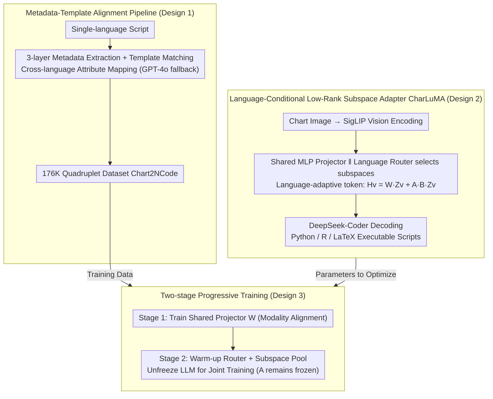

# Aligned Multi-View Scripts for Universal Chart-to-Code Generation

**Conference**: ACL 2026  
**arXiv**: [2604.24559](https://arxiv.org/abs/2604.24559)  
**Code**: [GitHub](https://github.com/Zhihan72/CharLuMA)  
**Area**: Code Intelligence / Multimodal  
**Keywords**: Chart-to-Code, Multilingual Alignment, LLaVA, Low-rank Subspace Adapter, MoE Projector

## TL;DR
Utilizing "semantically equivalent scripts for the same chart in Python, R, and LaTeX" as a new supervision signal, this work constructs the 176K quadruplet dataset Chart2NCode. It proposes CharLuMA, a lightweight adapter that integrates a "language-conditional low-rank subspace router" into the LLaVA projector, enabling a single model to achieve high execution rates and visual fidelity across three plotting languages.

## Background & Motivation

**Background**: Chart-to-code (restoring chart images into executable plotting scripts) allows static charts to return to an editable and reproducible state. Existing works almost exclusively target Python/matplotlib; over the past year, models like ChartMimic, Plot2Code, and ChartCoder have been limited to a single language.

**Limitations of Prior Work**: (1) In real-world academia, R (ggplot2) and LaTeX (TikZ) are publication standards for many disciplines, making single Python outputs insufficient. (2) More deeply, equivalent scripts in different languages for the same chart naturally serve as a **multi-view supervision signal**, which single-language datasets fail to exploit. (3) Simply feeding multilingual data into a single model leads to either doubled parameters (independent experts) or inter-language interference and specialization imbalance.

**Key Challenge**: The model must "share a single semantic understanding of the chart" while "passing through specialized syntactic channels for the target language." Handling both tasks simultaneously in a single LLaVA MLP projector causes conflict.

**Goal**: (a) Provide the first chart-code quadruplet dataset aligned across Python, R, and LaTeX; (b) Design a parameter-efficient multilingual adaptation mechanism that specializes syntax output while sharing visual understanding.

**Key Insight**: Treat scripts in different languages as "complementary views" of the same chart semantics and align them using multi-view representation learning principles. Architecturally, borrow from Mixture-of-Subspaces LoRA by replacing independent experts with a low-rank subspace pool and language-conditional routing.

**Core Idea**: Synthesize cross-language aligned scripts using a "metadata-template" pipeline; inject language specialization capabilities into the LLaVA projector via a "low-rank subspace adapter + language routing."

## Method

### Overall Architecture

The goal is to restore chart images into executable scripts in Python, R, or LaTeX using a single model. The challenge lies in the dual requirement of shared semantic understanding and language-specific syntax. The method follows two main lines: on the data side, a "metadata-template" pipeline synthesizes aligned scripts to create the 176K Chart2NCode dataset; on the model side, CharLuMA attaches a language-conditional low-rank subspace adapter to a LLaVA-style backbone (SigLIP visual encoder + two-layer MLP projector + DeepSeek-Coder). Visual tokens are dynamically routed through subspace combinations based on the target language.

### Key Designs

**1. Metadata-Template Alignment Pipeline: Mass-translating single-language scripts into visually equivalent multilingual versions**

To leverage "multi-view" signals, large-scale aligned data is required. Pure LLM translation is expensive and prone to semantic drift, while pure rule-templates have limited coverage. This work combines both: native APIs extract three layers of metadata (figure-level global attributes, axis-level coordinate systems, and object-level geometry/style). Object patterns match a curated pool of 202 templates. Built-in mapping dictionaries (e.g., Python "upper right" ↔ R "right" ↔ LaTeX "north east") ensure semantic consistency. GPT-4o provides LLM-assisted debugging for template misses or rendering failures. The final 176K dataset achieved a 95%+ pass rate in human evaluations across four dimensions.

**2. Language-Conditional Low-Rank Subspace Adapter: Injecting language specialization beyond the shared MLP**

Instead of independent experts that double parameter counts, a low-rank subspace adapter achieves "shared core + language specialization." Visual features $\mathbf{Z}_v$ pass through a shared projector $\mathbf{H}_{\text{base}} = \mathbf{W}\mathbf{Z}_v$. In parallel, a low-rank matrix $\mathbf{A}$ compresses it to rank-$r$, and a language-specific router selects $r=16$ from $N=32$ subspaces based on $y^l = \mathrm{top}_r(\mathrm{softmax}(\mathbf{W}^l \overline{\mathbf{Z}}_v))$ to form $\mathbf{B}$. The language-adaptive token is:

$$\mathbf{H}_v = \mathbf{W}\mathbf{Z}_v + \mathbf{A}\mathbf{B}\mathbf{Z}_v$$

The shared MLP handles chart commonalities, while subspace combinations handle syntax differences. Analysis shows only about 5/27 subspaces are shared across all three languages in the 1.3B model, validating the design.

**3. Two-Stage Progressive Training Strategy**

To prevent interference between modality alignment, router convergence, and LLM adaptation, training is split. Stage 1 trains only the shared projector $\mathbf{W}$ on 900K Chart-JSON pairs. Stage 2 introduces the subspace adapter, starting with a 274-step warm-up of the router $\mathbf{W}^l$ and subspace pool $\{b_i\}$ while keeping the MLP, Vision encoder, and LLM frozen. Finally, the LLM is unfrozen for joint training. Matrix $\mathbf{A}$ remains frozen throughout to force adaptive capacity toward "language differences" rather than redundant visual features.

### Loss & Training

The objective is standard next-token cross-entropy. Learning rates: 2e-4 for pre-training, 2e-4 for router warm-up, and 2e-5 for joint fine-tuning. Training costs: CharLuMA-1.3B took 82 GPU hours (8×L40S), while 6.7B took approximately 321 GPU hours.

## Key Experimental Results

### Main Results

Average metrics across three languages on the Chart2NCode test set: ER (Execution Rate), DS (DreamSim Visual Similarity), and MJ (MLLM-as-Judge).

| Model | Python ER | Python DS | R ER | R DS | LaTeX ER | LaTeX DS |
|------|----------|-----------|------|------|----------|----------|
| GPT-4o | 98.5 | 85.0 | 94.5 | 78.8 | 88.4 | 72.4 |
| Claude-Sonnet-4 | 98.3 | 86.8 | 93.9 | 82.0 | 92.7 | 76.0 |
| Qwen3-VL-8B | 91.1 | 83.7 | 73.6 | 72.7 | 77.3 | 66.8 |
| ChartCoder-7B (Python Expert) | 96.2 | 48.1 | - | - | 17.9 | 39.1 |
| InternVL3.5-8B | 82.5 | 79.6 | 67.0 | 67.6 | 81.1 | 57.1 |
| **CharLuMA-1.3B** | 94.4 | 86.5 | 94.5 | 78.9 | 84.5 | 71.3 |
| **CharLuMA-6.7B** | 98.0 | 88.7 | 96.5 | 81.8 | 89.0 | 72.5 |

CharLuMA-6.7B approaches Claude-Sonnet-4 performance; Python specialists like ChartCoder collapse on R/LaTeX.

### Ablation Study

**Architecture Comparison** (Chart2NCode 3-language average):

| Projector Architecture | 1.3B ER | 1.3B DS | 1.3B MJ | 6.7B ER | 6.7B DS | 6.7B MJ |
|----------|---------|---------|---------|---------|---------|---------|
| Linear MLP | 88.1 | 76.9 | 69.5 | 91.0 | 78.2 | 76.3 |
| Mixture-of-MLP | 87.9 | 75.1 | 68.2 | 91.9 | 77.4 | 76.8 |
| **Subspace Adapter (Ours)** | **91.1** | **78.9** | **72.3** | **94.5** | **81.0** | **81.1** |

### Key Findings
- Trilingual alignment training outperforms single-language training even when total training samples are equal—multi-view supervision enhances individual performance.
- The 32-16 configuration with 3 language-specific routers is the optimal point; replacing them with a shared router drops DS by ~4 points.
- Subspace analysis reveals only 19% of activated subspaces are shared across languages in the 1.3B model (5/27), indicating capacity is automatically allocated to "language specialization."
- LaTeX failure modes are unique: 55.5% are syntax constraints (missing braces), whereas Python/R failures mainly stem from dimension mismatches and undefined variables.

## Highlights & Insights
- Viewing "multilingual plotting scripts" as "multi-views of the same chart" is a novel perspective, porting cross-lingual alignment from NLP/Code to the chart-to-code domain.
- The subspace adapter + routing design is more parameter-efficient than MoE-MLP; freezing $\mathbf{A}$ prevents adaptation capacity from being wasted on redundant visual features.
- The metadata-template pipeline provides a reproducible path for high-quality multilingual data; 176K is currently the largest and most diverse dataset in this category.

## Limitations & Future Work
- Model scale capped at 6.7B; the potential of larger backbones (30B+) remains unexplored.
- SigLIP input resolution (384×384) is a bottleneck for information-dense charts; higher resolution adapters are needed.
- Templates (202) are still finite; novel chart types or interactive charts may not be covered.
- Extension to D3.js, Vega-Lite, or Mermaid is planned for future work.

## Related Work & Insights
- **vs ChartCoder-7B**: ChartCoder is a Python expert with 0 execution rate on R; Ours uses alignment and routing for a true multilingual generalist.
- **vs ChartMoE**: ChartMoE uses sparsely-gated MoE projectors with significant parameter inflation; CharLuMA is more compact and effective.
- **vs DaTikZ / AutomaTikZ**: These focus on TikZ only; Ours treats TikZ as one of three views, allowing other languages to boost its performance.

## Rating
- Novelty: ⭐⭐⭐⭐
- Experimental Thoroughness: ⭐⭐⭐⭐⭐
- Writing Quality: ⭐⭐⭐⭐
- Value: ⭐⭐⭐⭐

<!-- RELATED:START -->

- **ChartMimic**: [2406.09961](https://arxiv.org/abs/2406.09961)  
- **Plot2Code**: [2405.07990](https://arxiv.org/abs/2405.07990)  
- **ChartCoder**: [2501.03214](https://arxiv.org/abs/2501.03214)

<!-- RELATED:END -->

## Related Papers

- [\[ICLR 2026\] Breaking the SFT Plateau: Multimodal Structured Reinforcement Learning for Chart-to-Code Generation](../../ICLR2026/multimodal_vlm/breaking_the_sft_plateau_multimodal_structured_reinforcement_learning_for_chart-.md)
- [\[ACL 2026\] CharTide: Data-Centric Chart-to-Code Generation via Tri-Perspective Tuning and Inquiry-Driven Evolution](chartide_data-centric_chart-to-code_generation_via_tri-perspective_tuning_and_in.md)
- [\[ACL 2025\] ChartCoder: Advancing Multimodal Large Language Model for Chart-to-Code Generation](../../ACL2025/multimodal_vlm/chartcoder_chart_to_code.md)
- [\[CVPR 2026\] MM-ReCoder: Advancing Chart-to-Code Generation with Reinforcement Learning and Self-Correction](../../CVPR2026/multimodal_vlm/mm-recoder_advancing_chart-to-code_generation_with_reinforcement_learning_and_se.md)
- [\[ACL 2026\] From Charts to Code: A Hierarchical Benchmark for Multimodal Models](from_charts_to_code_a_hierarchical_benchmark_for_multimodal_models.md)

<!-- RELATED:END -->
