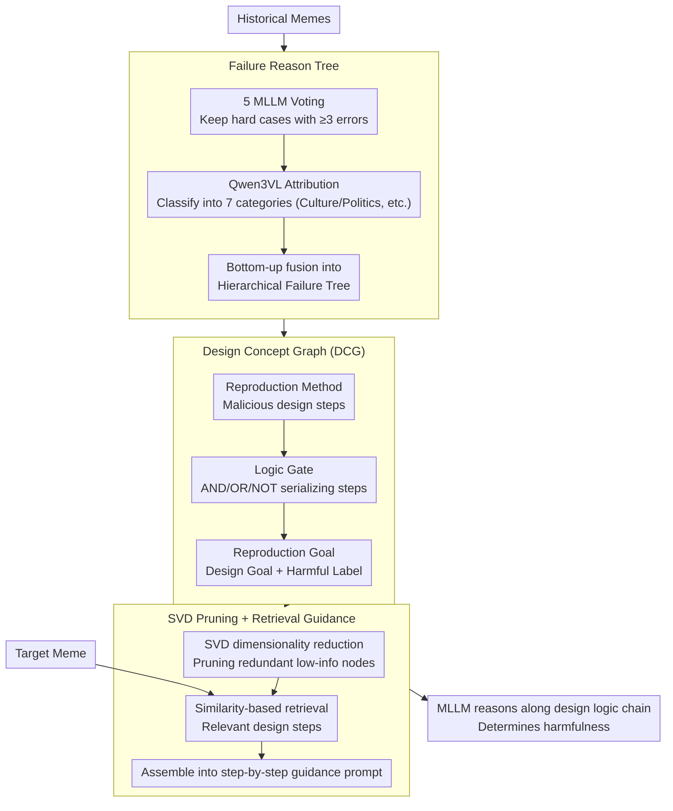

# All Changes May Have Invariant Principles: Improving Ever-Shifting Harmful Meme Detection via Design Concept Reproduction

**Conference**: ACL 2026  
**arXiv**: [2601.04567](https://arxiv.org/abs/2601.04567)  
**Code**: [GitHub](https://github.com/jzySaber1996/RepMD)  
**Area**: Multimodal Safety / Meme Detection  
**Keywords**: Harmful Meme Detection, Design Concept Graph, Attack Tree, MLLM Reasoning Guidance, Type Drift

## TL;DR

The RepMD method is proposed, which constructs a Design Concept Graph (DCG)—inspired by attack tree principles to describe the steps and logic malicious users employ to design harmful memes—to guide MLLMs in detecting evolving harmful memes. It achieves 81.1% accuracy on GOAT-Bench.

## Background & Motivation

**Background**: Harmful memes on the internet continuously evolve, exhibiting two major characteristics: type drift (new forms, new targets) and temporal evolution (closely tied to current events), making detection extremely difficult.

**Limitations of Prior Work**: (1) Existing detection methods only learn combinations of harmful elements, lacking understanding of implicit expressions—such as implying racial discrimination through emphasizing a person's accessories; (2) Emerging internet slang (e.g., GOAT, Stan) increases detection difficulty; (3) Although MLLMs possess multimodal understanding capabilities, they are similarly helpless against this implicit harmful information.

**Key Challenge**: While the visual elements and expressions of harmful memes change constantly, the underlying design logic of malicious users may contain "invariant principles." How can these invariant principles be extracted from historical memes to guide the detection of new memes?

**Goal**: Define an interpretable structure to describe the design concepts of harmful memes and utilize it to guide MLLMs in detection.

**Key Insight**: Borrowing the attack tree concept from the security field, the design intent of memes is modeled as a structured graph containing methods, targets, and logic gates.

**Core Idea**: Although different types of harmful memes appear different on the surface, they may share the same design concepts (e.g., "specializing facts to a specific group to achieve an attack"), which can be transferred across types.

## Method

### Overall Architecture

The starting point of RepMD is that while the visual shell of harmful memes keeps changing, the logic of "how a malicious user designs a harmful meme" remains relatively stable and can be refined from historical failures to guide detection. The entire pipeline requires no training and is completed at inference time in three steps: first, reviewing which memes the MLLM previously failed on and why, organizing these into a failure reason tree; second, abstracting these failure reasons into a Design Concept Graph (DCG) to describe "how a malicious user transforms harmless materials into a harmful meme step-by-step" using an attack tree format; finally, for a new meme, retrieving the most relevant design steps from the DCG and assembling them into step-by-step guidance for the MLLM to follow the designer's logic for judgment.

### Key Designs

**1. Failure Reason Tree: Focusing on hard cases MLLMs truly cannot handle to structure "why detection failed"**

If design concepts are extracted from a random set of memes, most samples are too simple for MLLMs, resulting in extraction of knowledge the model already possesses, which does not help with true blind spots. RepMD thus filters for hard cases first: historical memes are detected by a vote of 5 MLLMs, keeping only samples where $\ge 3$ models fail as hard cases. Qwen3VL-235B is then used to analyze failure reasons case-by-case, classifying them into 7 major categories like Culture and Politics to form a hierarchical failure reason tree bottom-up. During this, prompt iteration optimization is used to stabilize attribution. Thus, each node on the tree corresponds to an implicit harmful expression that MLLMs fail to capture, focusing the design concept extraction on the most challenging cases from the start.

**2. Design Concept Graph (DCG): Using attack trees to write malicious design logic into a reason-able structure**

Failure reasons only explain "where the MLLM went wrong," not "how this meme was designed to cause harm." RepMD borrows the attack tree concept from cybersecurity to derive each failure reason node into a three-level Design Concept Graph: the bottom level is the Reproduction Method (specific design steps of the malicious user), the middle level uses Logic Gates (AND/OR/NOT) to link steps according to combination logic, and the top level is the Reproduction Goal (e.g., "specializing a fact to a specific group to achieve an attack"), with each node labeled as harmful or not. Attack trees are inherently skilled at making explicit the logic chain of an attacker's "what to do first, what to do next, under what conditions the attack succeeds." Applying this to the meme designer's mindset allows the abstract assumption of "invariant principles" to become a searchable graph that MLLMs can follow.

**3. SVD Pruning + Retrieval Guidance: Denoising and streamlining the DCG, then feeding relevant design steps to the MLLM**

As the DCG accumulates many nodes, placing the entire graph directly into a prompt would introduce noise from irrelevant design patterns, interfering with MLLM judgment. RepMD first uses SVD dimensionality reduction to prune redundant, low-information nodes from the DCG, leaving only core design patterns (this SVD-based graph pruning is proven effective in GNNs). When facing a target meme, similarity retrieval picks several most relevant design steps from the refined DCG to form a step-by-step guidance prompt like "First check if group specialization is performed, then check if symbolic hints are overlaid..." This allows the MLLM to reason along the designer's logic chain rather than looking at visual elements in isolation.

### Loss & Training

RepMD is a training-free method, relying entirely on the in-context learning capabilities of MLLMs. The construction of the failure reason tree, DCG derivation, and retrieval guidance are all performed during the inference stage without any parameter updates.

## Key Experimental Results

### Main Results

| Method | GOAT-Bench Accuracy | Out-of-Domain Gen. | Temporal Gen. |
|------|-----------------|---------|---------|
| Baseline MLLM | Low | Significant Drop | Drop |
| Ours (RepMD) | **81.1%** | 2.1% Drop Only | **0.3% Gain** |

### Ablation Study

| Configuration | Key Metric | Description |
|------|---------|------|
| Without DCG | Significant Accuracy Drop | Design concepts are the core contribution |
| Without SVD Pruning | Performance Drop | Pruning removes noise to improve precision |
| Human Evaluation | 15-30s / meme | DCG effectively assists human identification |

### Key Findings
- RepMD loses only 2.1% accuracy in out-of-domain generalization (new meme types) and even gains 0.3% in temporal generalization (memes from future quarters).
- Human evaluation confirms the high interpretability of the DCG—evaluators can use the DCG to judge meme harmfulness within 15-30 seconds.
- Different types of harmful memes indeed share design concepts, validating the "invariant principles" hypothesis.

## Highlights & Insights
- Borrowing attack tree ideology from the security domain to model meme design intent is a creative cross-domain migration.
- The "invariant principles" hypothesis is experimentally verified—generalization across types and time is excellent.
- The method requires no training, fully utilizing MLLM reasoning capabilities and DCG guidance.

## Limitations & Future Work
- The current DCG needs to be constructed from failure cases, which might lack richness during cold starts.
- Only tested on English memes; memes from different cultures/languages may have different design patterns.
- Parameter selection for SVD pruning may need adjustment for different domains.
- Future work could extend to video memes and multilingual memes.

## Related Work & Insights
- **vs. Traditional harmful content detection**: Not only detects "whether it is harmful" but also explains "why it is harmful" and "how it was designed."
- **vs. Attack Tree**: Creatively migrates security analysis methods to social media content analysis.
- **vs. LLM-based detection**: Provides structured design concept guidance, which is more stable than pure prompting.

## Rating
- Novelty: ⭐⭐⭐⭐⭐ The cross-domain innovation from attack trees to Design Concept Graphs is very unique.
- Experimental Thoroughness: ⭐⭐⭐⭐ Includes both type and temporal generalization experiments plus human evaluation.
- Writing Quality: ⭐⭐⭐⭐ Clear formal definitions and well-supported motivation.
- Value: ⭐⭐⭐⭐ Provides a new paradigm for harmful content detection.

<!-- RELATED:START -->

## Related Papers

- [\[ACL 2025\] Redundancy Principles for MLLMs Benchmarks](../../ACL2025/multimodal_vlm/redundancy_principles_for_mllms_benchmarks.md)
- [\[AAAI 2026\] Yes FLoReNce, I Will Do Better Next Time! Agentic Feedback Reasoning for Humorous Meme Detection](../../AAAI2026/multimodal_vlm/yes_florence_i_will_do_better_next_time_agentic_feedback_reasoning_for_humorous_.md)
- [\[AAAI 2026\] CAMU: Context Augmentation for Meme Understanding](../../AAAI2026/multimodal_vlm/trace_textual_relevance_augmentation_and_contextual_encoding_for_multimodal_hate.md)
- [\[CVPR 2026\] Concept-wise Attention for Fine-grained Concept Bottleneck Models](../../CVPR2026/multimodal_vlm/coat_cbm_concept_wise_attention.md)
- [\[ACL 2026\] Dynamic Emotion and Personality Profiling for Multimodal Deception Detection](dynamic_emotion_and_personality_profiling_for_multimodal_deception_detection.md)

<!-- RELATED:END -->
