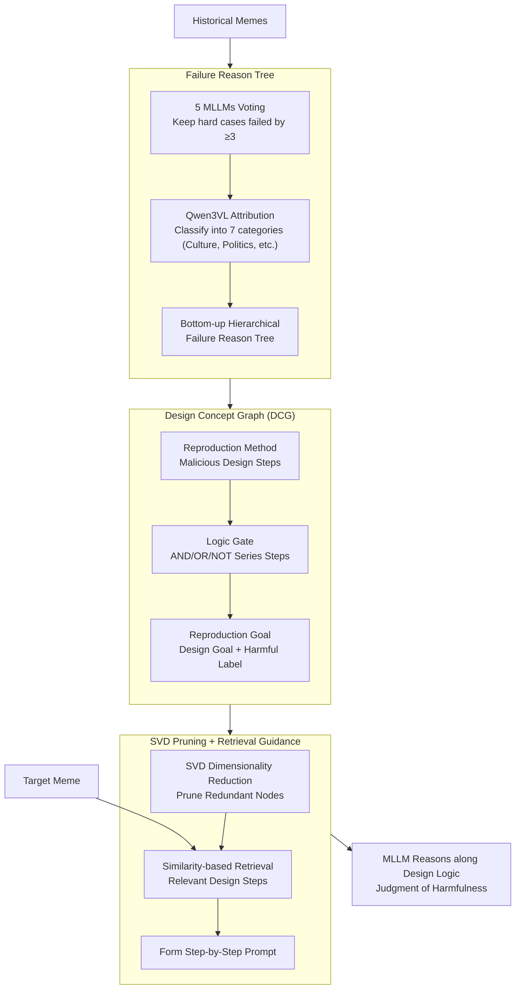

# All Changes May Have Invariant Principles: Improving Ever-Shifting Harmful Meme Detection via Design Concept Reproduction

**Conference**: ACL 2026  
**arXiv**: [2601.04567](https://arxiv.org/abs/2601.04567)  
**Code**: [GitHub](https://github.com/jzySaber1996/RepMD)  
**Area**: Multimodal Safety / Meme Detection  
**Keywords**: Harmful Meme Detection, Design Concept Graph, Attack Tree, MLLM Reasoning Guidance, Type Drift

## TL;DR

Ours proposes RepMD, a method that constructs Design Concept Graphs (DCG)—inspired by the concept of attack trees to describe the steps and logic used by malicious users to design harmful memes—to guide MLLMs in detecting evolving harmful memes, achieving 81.1% accuracy on GOAT-Bench.

## Background & Motivation

**Background**: Harmful memes on the internet undergo continuous evolution, characterized by type drift (new forms, new targets) and temporal evolution (closely linked to current events), making detection extremely difficult.

**Limitations of Prior Work**: (1) Existing detection methods only learn combinations of harmful elements while lacking an understanding of implicit expressions—such as using a person's accessories to imply racial discrimination; (2) Newly emerging internet slang (e.g., GOAT, Stan) increases detection difficulty; (3) Although MLLMs possess multimodal understanding capabilities, they remain ineffective against these implicit harmful messages.

**Key Challenge**: While the visual elements and expressions of harmful memes change constantly, the underlying design logic of malicious users may contain "invariant principles." How can these invariant principles be extracted from historical memes to guide the detection of new ones?

**Goal**: Define an interpretable structure to describe the design concepts of harmful memes and utilize it to guide MLLM detection.

**Key Insight**: Borrowing the concept of an attack tree from the security domain, the design intent of a meme is modeled as a structured graph containing methods, goals, and logic gates.

**Core Idea**: Although different types of harmful memes appear different on the surface, they may share the same design concepts (e.g., "specializing facts to a specific group to achieve an attack"), which can be transferred across types.

## Method

### Overall Architecture

The starting point of RepMD is that while the visual shell of harmful memes is ever-changing, the underlying logic of "how a malicious user designs a harmful meme" is relatively stable and can be distilled from historical failures to guide detection. The entire pipeline is training-free, completed during inference in three steps: first, reviewing which memes MLLMs failed on previously and why, organizing these into a failure reason tree; second, abstracting these failure reasons into a Design Concept Graph (DCG) that uses an attack tree format to describe how a malicious user step-by-step transforms harmless materials into harmful memes; finally, for a new meme, retrieving the most relevant design steps from the DCG to assemble a step-by-step guide for the MLLM.

### Key Designs

**1. Failure Reason Tree: Focus on hard cases the MLLM cannot handle, structuralizing why detection failed**

If design concepts are distilled from a random selection of memes, most samples might be too simple for the MLLM, leading to the extraction of knowledge the model already possesses, which does not help with true blind spots. RepMD thus implements hard case filtering: historical memes are detected via a vote from 5 MLLMs, keeping only samples where $\ge 3$ models fail. Qwen3VL-235B is then used to analyze failure reasons, classifying them into 7 major categories (e.g., culture, politics) to form a hierarchical failure reason tree. A round of prompt optimization is included to ensure stable attribution. Thus, every node corresponds to an implicit harmful expression that the MLLM indeed missed, focusing the extraction on the most challenging cases.

**2. Design Concept Graph (DCG): Using attack trees to frame malicious design logic as a reason-able structure**

Failure reasons only indicate where the MLLM erred, not how the meme was designed to be harmful. RepMD borrows the attack tree concept from cybersecurity, deriving a three-level DCG for each failure reason node: the base level is the Reproduction Method (specific design steps); the middle level uses Logic Gates (AND/OR/NOT) to link steps; the top level is the Reproduction Goal (e.g., "specializing a fact to a specific group"). Each node is labeled with its harmfulness status. Attack trees are proficient at making explicit the logic of "what to do first, then next, to succeed." Applying this to meme design makes the abstract "invariant principles" a searchable graph that the MLLM can follow.

**3. SVD Pruning + Retrieval Guidance: Denoising the DCG and feeding relevant steps to the MLLM**

As the DCG accumulates many nodes, placing the entire graph into a prompt introduces noise. RepMD uses SVD dimensionality reduction to prune redundant and low-information nodes, retaining only core patterns. When facing a target meme, similarity-based retrieval selects the most relevant design steps from the pruned DCG. These are assembled into a step-by-step guide (e.g., "first check for group specialization, then check for symbolic hints...") allowing the MLLM to reason along the designer's logic chain rather than viewing visual elements in isolation.

### Loss & Training

RepMD is a training-free method that relies entirely on the in-context learning capabilities of MLLMs. The construction of the failure reason tree, DCG derivation, and retrieval guidance are all performed during the inference stage without any parameter updates.

## Key Experimental Results

### Main Results

| Method | GOAT-Bench Accuracy | Out-of-Domain Generalization | Temporal Generalization |
|------|-----------------|---------|---------|
| Baseline MLLM | Low | Significant Drop | Drop |
| RepMD | **81.1%** | 2.1% Drop Only | 0.3% Gain |

### Ablation Study

| Configuration | Key Metrics | Description |
|------|---------|------|
| w/o DCG | Accuracy significantly drops | Design concepts are the core contribution |
| w/o SVD Pruning | Performance drops | Pruning removes noise to improve precision |
| Human Evaluation | 15-30s/meme | DCG effectively assists human identification |

### Key Findings
- RepMD loses only 2.1% accuracy in out-of-domain generalization (new meme types) and achieves a 0.3% gain in temporal generalization (future quarters).
- Human evaluation confirms the high interpretability of the DCG—evaluators can judge harmfulness within 15-30 seconds using the DCG.
- Different types of harmful memes indeed share design concepts, validating the "invariant principle" hypothesis.

## Highlights & Insights
- Borrowing the attack tree concept from safety domains to model meme design intent is a creative cross-domain transfer.
- The "invariant principle" hypothesis is validated by strong generalization across types and time.
- The method requires no training and fully utilizes MLLM reasoning capabilities and DCG guidance.

## Limitations & Future Work
- The current DCG must be constructed from failure cases, which may be insufficient during a cold start.
- Testing was limited to English memes; different cultures/languages may have different design patterns.
- SVD pruning parameters might require adjustment for different domains.
- Future work could extend this to video memes and multilingual content.

## Related Work & Insights
- **vs. Traditional Harmful Content Detection**: Ours not only detects "if it is harmful" but explains "why it is harmful" and "how it was designed."
- **vs. Attack Tree**: Creatively transfers security analysis methods to social media content analysis.
- **vs. LLM-based Detection**: Provides structured design concept guidance, which is more stable than pure prompting.

## Rating
- Novelty: ⭐⭐⭐⭐⭐ The cross-domain innovation from attack trees to DCGs is highly unique.
- Experimental Thoroughness: ⭐⭐⭐⭐ Includes both type and temporal generalization experiments plus human evaluation.
- Writing Quality: ⭐⭐⭐⭐ Clear formal definitions and well-supported motivation.
- Value: ⭐⭐⭐⭐ Provides a new paradigm for harmful content detection.

<!-- RELATED:START -->

## Related Papers

- [\[ACL 2025\] Redundancy Principles for MLLMs Benchmarks](../../ACL2025/multimodal_vlm/redundancy_principles_for_mllms_benchmarks.md)
- [\[AAAI 2026\] CAMU: Context Augmentation for Meme Understanding](../../AAAI2026/multimodal_vlm/trace_textual_relevance_augmentation_and_contextual_encoding_for_multimodal_hate.md)
- [\[ACL 2026\] Dynamic Emotion and Personality Profiling for Multimodal Deception Detection](dynamic_emotion_and_personality_profiling_for_multimodal_deception_detection.md)
- [\[CVPR 2026\] HAVE-Bench: Hierarchical Audio-Visual Evaluation from Perception to Interaction](../../CVPR2026/multimodal_vlm/have-bench_hierarchical_audio-visual_evaluation_from_perception_to_interaction.md)
- [\[ICML 2025\] Learning Invariant Causal Mechanism from Vision-Language Models](../../ICML2025/multimodal_vlm/learning_invariant_causal_mechanism_from_vision-language_models.md)

<!-- RELATED:END -->
