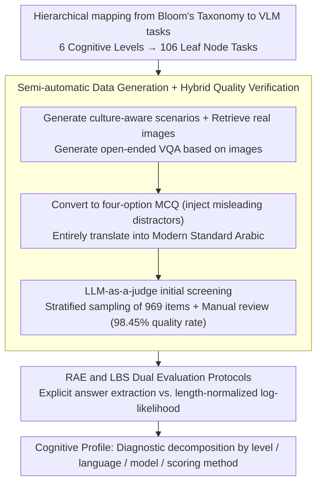

# Almieyar-Oryx-BloomBench: A Bilingual Multimodal Benchmark for Cognitively Informed Evaluation of Vision-Language Models

**Conference**: ACL2026 Findings  
**arXiv**: [2606.05531](https://arxiv.org/abs/2606.05531)  
**Code**: https://github.com/qcri/Almieyar-Oryx-BloomBench  
**Area**: Multimodal VLM / Evaluation Benchmark  
**Keywords**: Bloom's Taxonomy, Multimodal Evaluation, Bilingual (English-Arabic), Cognitive Diagnosis, Likelihood-based Scoring  

## TL;DR
BloomBench reconstructs VLM evaluation using Bloom’s cognitive taxonomy by organizing 7,747 bilingual image-text QA samples into 6 cognitive levels and 106 task types. It finds that high scores in current VLMs often mask significant shortcomings in factual recall, creative synthesis, and cross-lingual reasoning.

## Background & Motivation
**Background**: VLM evaluation has evolved from early VQA, image captioning, and hallucination detection to comprehensive benchmarks like MMMU, MMT-Bench, and VLM2-Bench. The mainstream approach typically aggregates a large number of tasks into an overall score to compare model performance across multimodal knowledge, perception, reasoning, or grounding.

**Limitations of Prior Work**: Although these benchmarks have expanded in coverage, diagnostic granularity remains insufficient. A model achieving high scores in reading charts or answering multiple-choice questions does not necessarily possess human-like hierarchical cognitive abilities; instead, it may have learned specific task formats, statistical shortcuts, or common patterns in English-centric corpora. Furthermore, the paper notes that existing VLM benchmarks are heavily biased toward English, with inadequate coverage for non-English vision-language scenarios such as Arabic.

**Key Challenge**: VLM evaluation must simultaneously satisfy scalability, automatic scoring, and interpretable diagnosis. However, the pursuit of unified large-scale scores often conflates different cognitive abilities. The authors argue that the problem is not just "how much the model gets right," but "at which level of the cognitive process the model succeeds or fails."

**Goal**: Ours aims to construct a cognitive-driven bilingual multimodal benchmark: on one hand, it utilizes Bloom's Taxonomy to cover six levels—Remember, Understand, Apply, Analyze, Evaluate, and Create; on the other hand, it exposes cross-lingual generalization capabilities through English-Arabic questions and distinguish explicit output correctness from internal confidence distributions using two scoring methods.

**Key Insight**: Bloom's Taxonomy, derived from educational psychology, naturally decomposes cognitive processes into levels ranging from shallow to deep. The authors map this framework to image-question-answer tasks, ensuring each sample belongs not only to a task type but also to a cognitive level, thereby allowing evaluation results to be interpreted as a "cognitive profile" of the model.

**Core Idea**: Utilize Bloom's Taxonomy instead of a loose collection of tasks to organize VLM evaluation, and employ English-Arabic bilingualism alongside RAE/LBS dual scoring protocols to simultaneously diagnose differences across cognitive levels, languages, and confidence calibration.

## Method
BloomBench is essentially a framework for benchmark construction and analysis rather than a new model proposal. Its key lies in mapping the abstract cognitive taxonomy to executable multimodal multiple-choice questions (MCQs), forming a closed loop through automated generation, translation, quality verification, and dual scoring evaluation.

### Overall Architecture
The overall process is divided into four steps. First, the authors define the BloomBench taxonomy: six Bloom levels are further decomposed into finer leaf nodes, totaling 106 specific task types. Second, the system generates culture-aware scenarios for each leaf node, retrieves real images, and generates open-ended VQA based on the images. Third, the open-ended VQA is converted into four-option MCQs and translated into Modern Standard Arabic. Fourth, LLM-as-a-judge and manual verification of samples are used to control quality, and Regex-based Answer Extraction (RAE) and Likelihood-based Scoring (LBS) are run across various open-source and closed-source VLMs.

The input consists of an image, a question, and four candidate answers; the output includes not only the model's accuracy but also diagnostic results decomposed by language, cognitive level, model family, model size, and scoring method. This design makes BloomBench resemble a "cognitive medical report" rather than a simple leaderboard.

### Key Designs
**1. Hierarchical mapping from Bloom's Taxonomy to VLM tasks: Mapping every question to a clearly defined cognitive operation**

Traditional benchmarks often mix questions of different difficulties and cognitive processes into a single score; if a model fails, it is unclear whether it cannot perceive the image, apply rules, or perform creative synthesis. BloomBench fully migrates Bloom’s six cognitive levels to multimodal tasks: lower levels (Remember/Understand) cover object, attribute, activity, symbol, and text recognition as well as compositional semantic understanding; middle levels (Apply/Analyze) cover knowledge application, basic logic, contextual reasoning, and table/chart analysis; higher levels (Evaluate/Create) cover consistency, safety, quality assessment, and constrained creative selection. These six levels are further refined into 106 leaf node tasks, so every sample explicitly belongs to a cognitive operation. Weaknesses at specific cognitive levels can be directly read from the scores, making errors interpretable.

**2. Semi-automatic data generation + Hybrid quality verification: Maintaining quality across 7,747 bilingual samples**

Full manual construction cannot cover such a large bilingual multimodal scale, while pure automatic generation risks producing questions that are unanswerable, image-irrelevant, or suffer from translation drift. BloomBench employs a specialized pipeline: Gemini 2.5 Pro first generates culture-aware scenarios and image keywords for each taxonomy leaf node and creates open-ended VQA based on real web images; another instruction model converts the open QA into four-option MCQs and intentionally inserts a misleading distractor; subsequently, the entire set is translated into Modern Standard Arabic. On the quality side, a three-stage process of "machine screening + stratified sampling + manual review" is implemented: LLM-as-a-judge first filters the content, then 969 samples are stratified from the 106 leaf nodes for verification. Gemini 3 Pro identified 15 suspicious samples, which were confirmed as errors through manual review, resulting in a final quality rate of 98.45%. Stratified sampling paired with manual review serves as a trade-off between coverage cost and credibility.

**3. RAE and LBS dual evaluation protocols: Distinguishing "stating the correct option" from "probabilistically believing the correct answer"**

Many models can output the correct letter by following a prompt, but their internal probability distribution may not actually rank the correct answer first—looking only at explicit output may overstate model capability. BloomBench therefore runs two scoring protocols in parallel: RAE (Regex-based Answer Extraction) extracts A/B/C/D from the model's free-form output, which is close to what a real user sees; LBS (Likelihood-based Scoring) calculates the length-normalized log-likelihood for each candidate answer conditioned on the image and question:

$$\text{NormalizedScore}(C_i)=\frac{1}{k}\sum_{j=1}^{k}\log P(w_j\mid I,Q,w_{<j})$$

Then the candidate with the highest score is selected. A larger discrepancy between the two metrics indicates that the model has only learned formatted output, while its confidence calibration and reasoning consistency are fragile—LBS is designed to expose this "surface-level correctness."

### Loss & Training
BloomBench does not involve training new models, so there is no model optimization loss. The "training strategy" during the construction phase refers to the evaluation protocol design: data generation uses prompt engineering and an agentic pipeline, quality control uses LLM judges + stratified manual verification, and model evaluation uses a zero-shot setting with decoding temperature set to 0. The primary metric is accuracy, reported via both micro and macro averaging to prevent class imbalances from masking weaknesses.

## Key Experimental Results

### Main Results
BloomBench contains 7,747 bilingual image-question-answer samples covering 106 task types. The sample distribution across the six cognitive levels is shown below, demonstrating that it does not focus solely on a single reasoning category.

| Cognitive Level | Sample Count | Evaluation Significance |
|----------|--------|----------|
| Remember | 2,948 | Basic recognition and recall of objects, attributes, symbols, text, etc. |
| Understand | 1,592 | Understanding relationships, compositional semantics, emotions, and visual paraphrasing |
| Apply | 499 | Applying mathematical, scientific, or logical knowledge to visual scenarios |
| Analyze | 1,431 | Contextual reasoning, structured data analysis, identifying anomalous attributes |
| Evaluate | 592 | Judgment of consistency, safety, and image quality |
| Create | 685 | Identifying the most reasonable creative synthesis under constraints |
| Total | 7,747 | 106 taxonomy leaf nodes, bilingual (English-Arabic) |

Overall model results show that under RAE, if only looking at explicit answers, Gemma4-31B ranks highest; however, model rankings change significantly under LBS, indicating that "ability to output an answer" and "probabilistically believing the answer" are not the same thing.

| Model | English RAE Micro | English LBS Micro | Arabic RAE Micro | Arabic LBS Micro | Key Observations |
|------|---------------|---------------|---------------|---------------|----------|
| Qwen2-VL-7B | 0.854 | 0.421 | 0.773 | 0.326 | Decent RAE, but weak LBS confidence |
| Qwen2.5-VL-7B | 0.869 | 0.654 | 0.792 | 0.503 | One of the most stable models in LBS |
| Gemma3-27B | 0.883 | 0.336 | 0.859 | 0.440 | High RAE, but significant English LBS drop |
| Gemma4-31B | 0.898 | 0.430 | 0.876 | 0.397 | Best overall RAE; LBS remains suboptimal |
| GPT-4o mini | 0.824 | N/A | 0.769 | N/A | Closed-source models do not support LBS |

### Ablation Study
The paper does not provide structural ablations of models but offers two valuable diagnostic comparisons: the difference between RAE and LBS for the same model, and the coverage gap between the BloomBench taxonomy and MMMU.

| Analysis Item | Result | Explanation |
|--------|------|------|
| Quality Verification | 969 samples checked, 15 errors, 98.45% quality rate | Stratified coverage of 106 leaf nodes proves overall reliability |
| MMMU Coverage Mapping | Analyze accounts for 66.4%; Create + Evaluate < 1.1% | Existing strong benchmarks favor expert knowledge/analysis over full cognitive coverage |
| Zero-coverage Leaf Nodes | 45 taxonomy leaf nodes have no samples in MMMU | Capabilities like Ambiguity Resolution, Toxicity Detection, and Dialogue Generation are missing |
| Qwen2.5-VL-7B Metric Gap | English 0.869 RAE → 0.654 LBS | Relatively stable, indicating consistency between output and confidence |
| Gemma3-27B Metric Gap | English 0.883 RAE → 0.336 LBS | Reveals a pattern of strong surface output but weak probability calibration |

### Key Findings
- Performance in English is overall superior to Arabic, but the gap is not just a translation issue; LBS is also affected by Arabic tokenization fertility and non-English probability priors.
- Recognize and Evaluate levels reach or exceed 0.88 under RAE, indicating that current VLMs are already strong in discriminative visual semantic understanding.
- Apply, Create, and Remember levels expose deeper flaws under LBS, suggesting models may lean toward semantic association rather than stable factual recall, procedural application, and creative synthesis.
- The Gemma3 series shows good cross-lingual RAE consistency, but larger models exhibit inverse scaling in LBS, suggesting that stronger instruction tuning does not necessarily lead to better probability calibration.

## Highlights & Insights
- The most valuable contribution is transforming "multimodal evaluation" into "cognitive level diagnosis." This allows model failures to be localized to specific capability layers such as basic memory, procedural application, structural analysis, or creative synthesis, rather than just being a low score.
- The dual RAE/LBS metrics are highly instructive: RAE reflects how real users perceive model output, while LBS acts like an internal check of whether the model truly ranks the correct answer first. A larger divergence indicates the model might have learned to format output well without reliable confidence distribution.
- The bilingual design is not just about "adding another language"; it directly challenges the extrapolation assumptions of English-centric evaluation. The degradation of Create and Apply in Arabic shows that cross-lingual transfer of higher-order cognitive abilities is far more fragile than basic semantic understanding.

## Limitations & Future Work
- The number of evaluated models is constrained by GPU and closed-source API costs; many latest VLMs are not included. Future work needs a larger pool of models, especially those with different training corpora and visual encoding architectures.
- All questions are multiple-choice for easy automatic scoring, which does not fully cover open-ended generation, multi-step reasoning, or real-world interaction tasks. Short-answer, fill-in-the-blank, long-chain generation, or adaptive difficulty could be added.
- While sample verification showed high quality, not all 7,747 samples were manually verified; automated benchmarks may still have localized issues like invalid images, ambiguous options, or translation nuances.
- LBS is not entirely fair across different languages due to tokenization differences; especially in morphologically rich languages like Arabic, length normalization may still retain systematic biases.

## Related Work & Insights
- **vs MMMU**: MMMU is strong in expert domain knowledge and analysis, but when mapped to the BloomBench taxonomy, Analyze accounts for 66.4% while Create/Evaluate total less than 1.1%. BloomBench's advantage is a more balanced distribution of cognitive levels, though its disadvantage is the current reliance on MCQs rather than open-ended complex tasks.
- **vs MMT-Bench / VLM2-Bench**: These benchmarks expand task coverage and fine-grained visual capabilities but remain organized primarily as task collections. BloomBench differs by defining the cognitive framework first and then generating tasks, making the results better suited for capability profiling.
- **vs Arabic VLM benchmarks like CAMEL-Bench**: Arabic benchmarks emphasize linguistic and cultural coverage, whereas BloomBench situates English and Arabic within the same cognitive taxonomy to compare cross-lingual cognitive transfer through isomorphic tasks.
- **Insights**: When conducting VLM/MLLM evaluation in the future, one should look beyond a single leaderboard and report results decomposed by cognitive levels, languages, and scoring mechanisms. For training data construction, data can be proactively augmented for weak levels like Apply and Create.

## Rating
- Novelty: ⭐⭐⭐⭐⭐ Systematically organizing bilingual multimodal evaluation using Bloom's Taxonomy provides a very clear diagnostic perspective.
- Experimental Thoroughness: ⭐⭐⭐⭐ Covers multiple open/closed VLMs, two languages, and two scoring methods, though the model pool is limited by compute and API constraints.
- Writing Quality: ⭐⭐⭐⭐ Complete structure with clear methodology and discussion; some tables are large, requiring readers to cross-reference overall results with cognitive level results.
- Value: ⭐⭐⭐⭐⭐ Highly valuable for building more interpretable and inclusive VLM evaluations, particularly for future cross-lingual multimodal capability diagnosis.

<!-- RELATED:START -->

## Related Papers

- [\[ACL 2026\] VIGNETTE: Socially Grounded Bias Evaluation for Vision-Language Models](vignette_socially_grounded_bias_evaluation_for_vision-language_models.md)
- [\[CVPR 2026\] CrossHOI-Bench: A Unified Benchmark for HOI Evaluation across Vision-Language Models and HOI-Specific Methods](../../CVPR2026/multimodal_vlm/crosshoi-bench_a_unified_benchmark_for_hoi_evaluation_across_vision-language_mod.md)
- [\[ACL 2026\] Cross-Cultural Expert-Level Art Critique Evaluation with Vision-Language Models](cross-cultural_expert-level_art_critique_evaluation_with_vision-language_models.md)
- [\[ACL 2026\] VAUQ: Vision-Aware Uncertainty Quantification for LVLM Self-Evaluation](vauq_vision-aware_uncertainty_quantification_for_lvlm_self-evaluation.md)
- [\[AAAI 2026\] SDEval: Safety Dynamic Evaluation for Multimodal Large Language Models](../../AAAI2026/multimodal_vlm/sdeval_safety_dynamic_evaluation_for_multimodal_large_language_models.md)

<!-- RELATED:END -->
